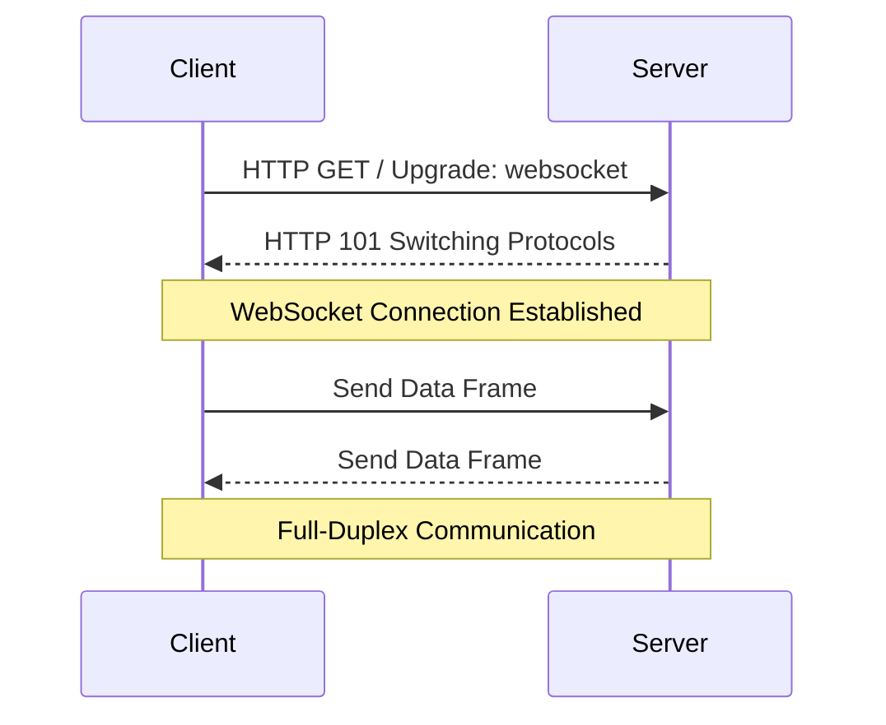
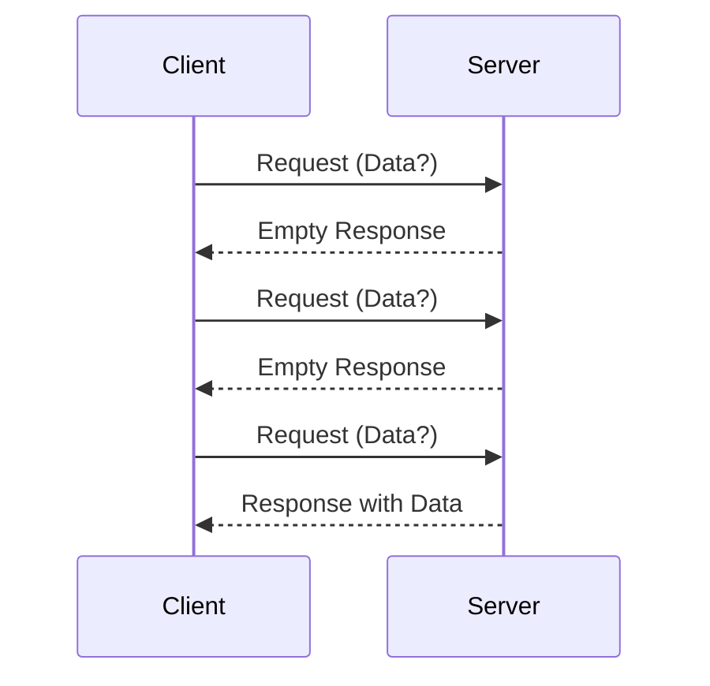
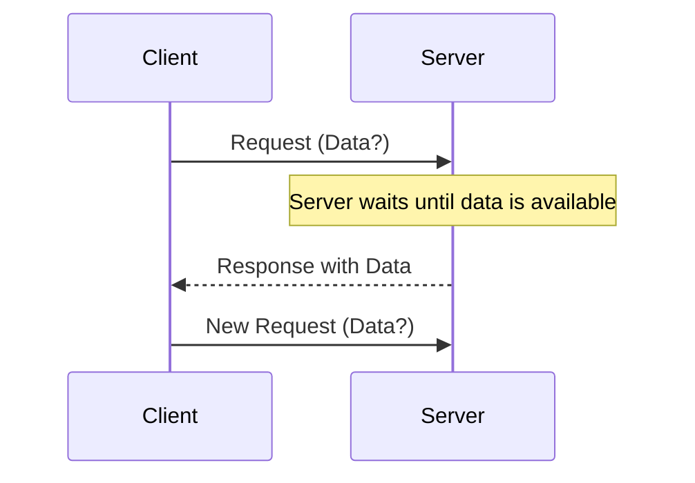
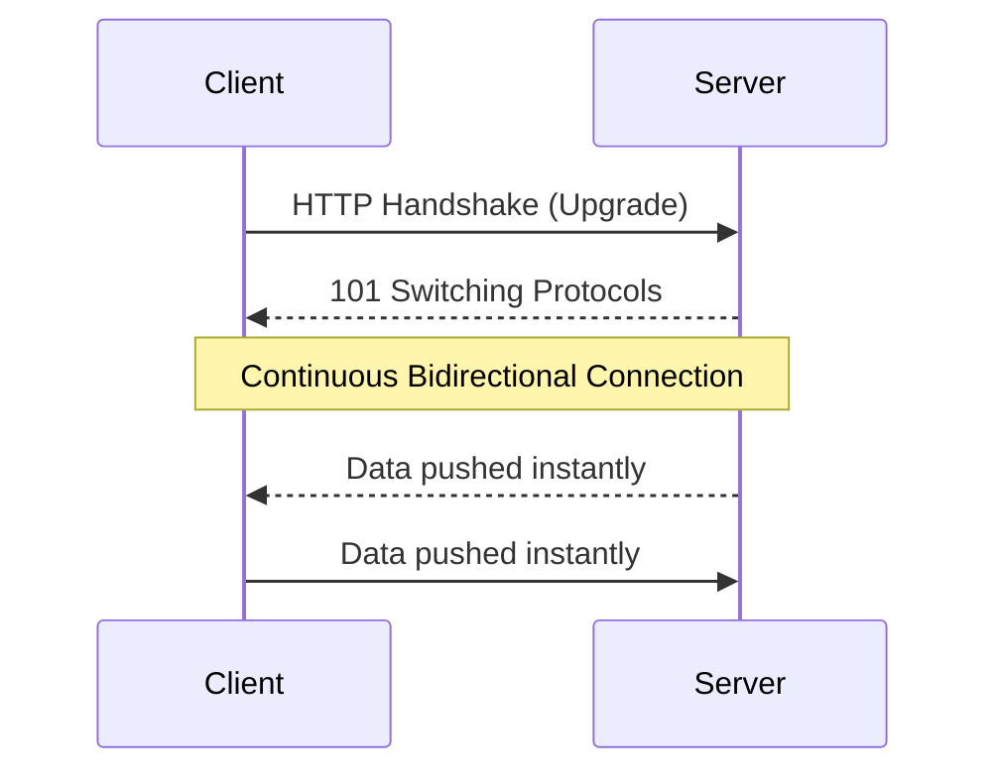

# What are WebSockets and Why are they Used?

Websockets are a communication protocol used to build real-time features by establishing a two-way connection between a client and a server.

Imagine an online multiplayer game where the leaderboard updates instantly as players score points, showing real-time rankings of all players.

This instantaneous update feels seamless and keeps you engaged, but how does it actually work?

The magic behind this real-time experience is often powered by WebSockets.

WebSockets enable full-duplex, bidirectional communication between a client (typically a web browser) and a server over a single TCP connection.

Unlike the traditional HTTP protocol, where the client sends a request to the server and waits for a response, WebSockets allow both the client and server to send messages to each other independently and continuously after the connection is established.

In this article, we will explore how websockets work, why/where are they used, how it compares with other communication methods, challenges and considerations and how to implement them in code.

If you’re enjoying this newsletter and want to get even more value, consider becoming a paid subscriber.

As a paid subscriber, you'll unlock all premium articles and gain full access to all premium courses on algomaster.io.

Unlock Full Access

---

## 1. How do WebSockets work?
The WebSocket connection starts with a standard HTTP request from the client to the server.

However, instead of completing the request and closing the connection, the server responds with an HTTP 101 status code, indicating that the protocol is switching to WebSockets.

After this handshake, a WebSocket connection is established, and both the client and server can send messages to each other over the open connection.

### Step-by-Step Process:

**1. Handshake**
The client initiates a connection request using a standard HTTP GET request with an "Upgrade" header set to "websocket".
If the server supports WebSockets and accepts the request, it responds with a special 101 status code, indicating that the protocol will be changed to WebSocket.

**2. Connection**
Once the handshake is complete, the WebSocket connection is established. This connection remains open until explicitly closed by either the client or the server.

**3. Data Transfer**
Both the client and server can now send and receive messages in real-time.
These messages are sent in small packets called frames, and carry minimal overhead compared to traditional HTTP requests.

**4. Closure**
The connection can be closed at any time by either the client or server, typically with a "close" frame indicating the reason for closure.

---

## 2. Why are WebSockets used?
WebSockets offer several advantages that make them ideal for certain types of applications:

- **Real-time Updates:** WebSockets enable instant data transmission, making them perfect for applications that require real-time updates, like live chat, gaming, or financial trading platforms.
- **Reduced Latency:** Since the connection is persistent, there's no need to establish a new connection for each message, significantly reducing latency.
- **Efficient Resource Usage:** WebSockets are more efficient than traditional polling techniques, as they don't require the client to continuously ask the server for updates.
- **Bidirectional Communication:** Both the client and server can initiate communication, allowing for more dynamic and interactive applications.
- **Lower Overhead:** After the initial handshake, WebSocket frames have a small header (as little as 2 bytes), reducing the amount of data transferred.

Share

---

## 3. WebSockets vs. HTTP, Polling, and Long-Polling
To understand the advantages of WebSockets, it's helpful to compare them with other communication methods:

### HTTP:
- **Request-Response Model:** In HTTP, the client sends a request, and the server responds, closing the connection afterward. This model is stateless and not suitable for real-time communication.
- **Latency:** Since each interaction requires a new request, HTTP has higher latency compared to WebSockets.

### Polling:

- **Repeated Requests:** The client repeatedly sends requests to the server at fixed intervals to check for updates. While this can simulate real-time updates, it is inefficient, as many requests will return no new data.
- **Latency:** Polling introduces delays because updates are only checked periodically.

### Long-Polling:

- **Persistent Connection:** In long-polling, the client sends a request, and the server holds the connection open until it has data to send. Once data is sent or a timeout occurs, the connection closes, and the client immediately sends a new request.
- **Latency:** This approach reduces the frequency of requests but still suffers from higher latency compared to WebSockets since it requires the client to repeatedly send new HTTP requests after each previous request is completed.
- **Resource Usage:** Long-polling can lead to resource exhaustion on the server as it must manage many open connections and handle frequent reconnections.

### WebSockets:

- **Bi-Directional:** Unlike HTTP, polling, and long-polling, WebSockets allow for two-way communication.
- **Low Latency:** Because the connection remains open, data can be sent and received with minimal delay.
- **Efficiency:** WebSockets are more efficient in terms of resource usage and bandwidth.

---

## 4. Challenges and Considerations
While WebSockets offer numerous benefits, there are some challenges to consider:

- **Proxy Servers:** Some proxy servers don't support WebSocket connections and certain firewalls may block them.
- **Scalability Concerns:** Managing a large number of WebSocket connections can be challenging. Consider using load balancers and distributed WebSocket servers to handle large-scale deployments.
- **Fallback Mechanism:** Not all clients or networks support WebSockets, which can lead to connectivity issues. Implement fallback mechanisms like long-polling for clients that cannot establish WebSocket connections.
- **Network Reliability:** WebSockets rely on a persistent connection, which can be disrupted by network issues. Implementing reconnection strategies and heartbeat mechanisms (regular ping/pong messages) can help maintain the connection's stability and detect when a connection has been lost.
- **Security:** WebSockets are vulnerable to attacks such as Cross-Site WebSocket Hijacking and Distributed Denial of Service (DDoS) attacks. Implement secure WebSocket connections (wss://), authenticate users, and validate input to protect against common vulnerabilities.

---

## 5. Where are WebSockets Used?
1. **Real-Time Collaboration Tools:** Applications like Google Docs may use WebSockets to enable multiple users to edit a document simultaneously. Changes made by one user are instantly reflected for all others, creating a seamless collaborative experience.
2. **Real-Time Chat Applications:** One of the most popular uses of WebSockets is in real-time chat applications. Messaging platforms like Slack use WebSockets to deliver messages instantly.
3. **Live Notifications:** Social media platforms use WebSockets to push real-time notifications to users when they receive a new message, like, or comment.
4. **Multiplayer Online Games:** In online multiplayer games, low latency is crucial for a seamless gaming experience.
5. **Financial Market Data Feeds:** WebSockets are widely used in financial applications to stream real-time market data, such as stock prices, forex rates, and cryptocurrency values.
6. **IoT (Internet of Things) Applications:** In IoT applications, devices often need to communicate with a server in real time.
7. **Live Streaming and Broadcasting:** While the actual video streaming typically uses other protocols, WebSockets can be used for real-time chat, viewer counts, and other interactive features during live broadcasts.

---

## 6. Implementing WebSockets
To demonstrate how WebSockets work, let’s look at a simple implementation using Node.js on the server side and JavaScript on the client side.

**Server-Side (Node.js):**
*(Code reference omitted as per instructions)*

**Client-Side (JavaScript):**
*(Code reference omitted as per instructions)*

---

## 7. Conclusion
WebSockets have revolutionized how we build real-time web applications, providing an efficient, low-latency communication channel that supports full-duplex data exchange.

From chat applications and live notifications to online gaming and IoT devices, WebSockets enable the creation of responsive and engaging user experiences.

However, with great power comes great responsibility. Implementing WebSockets requires careful consideration of scalability, security, and resource management to ensure your application performs well under all conditions.
