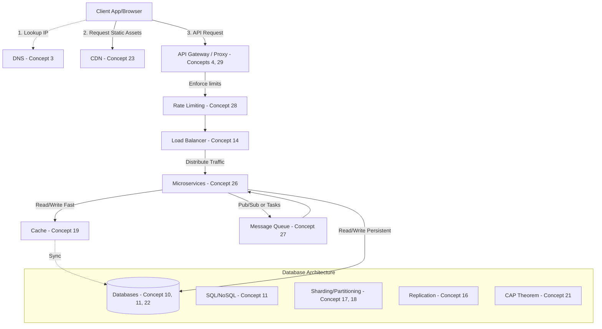

# 30 System Design Concepts: First Principles Deep Dive

This guide deconstructs 30 core System Design concepts using **First Principles Thinking**. Rather than simply memorizing definitions, we break down each concept to understand *why* it exists (the fundamental problem it solves), *what* it is (the core concept), and *how* it actually works (the mechanism). 

All the critical depth, trade-offs, and original language are preserved ("the muscle"), while eliminating repetitive transitions and external links ("the fat").

---

## System Design Concepts Mind Map

Here is a high-level summary of how these 30 concepts connect to form the architecture of a modern, scalable distributed system. A **Client** uses **DNS** to find the server's **IP Address** and fetches static assets from a **CDN**. Dynamic requests pass through an **API Gateway/Proxy**, which handles **Rate Limiting** and security before a **Load Balancer** distributes the traffic across horizontally scaled backend **Microservices**. These microservices communicate asynchronously via **Message Queues**, fetch fast data from a **Cache**, and read/write persistent data to **Databases** (which are scaled using **Replication** and **Sharding**).

---

## 1. Client-Server Architecture
**The Problem:** How do independent digital entities interact and exchange data over a network?
**The Core Concept:** A system divided into two distinct roles: a **client** (a web browser, mobile app, or frontend) and a **server** (a machine running continuously, waiting to handle incoming requests).
**The Mechanism:** The client sends a request to store, retrieve, or modify data. The server receives the request, processes it, performs necessary operations, and sends back a response.

## 2. IP Address
**The Problem:** A client doesn’t magically know where a server is; it needs an exact locator.
**The Core Concept:** Unique numerical identifiers that work like phone numbers for servers on the internet.
**The Mechanism:** Every publicly deployed server has a unique IP address. Clients must send requests to the correct IP address to communicate.
**The Limitation:** IP addresses are strings of random numbers that are hard for humans to memorize. Furthermore, if a service is migrated to another server, its IP address may change, breaking direct connections.

## 3. DNS (Domain Name System)
**The Problem:** Humans cannot intuitively remember or constantly update IP addresses.
**The Core Concept:** A system that maps human-friendly domain names (like `algomaster.io`) to their corresponding IP addresses.
**The Mechanism:** When you type a domain into your browser, your computer asks a DNS server for the corresponding IP address. Once the DNS server responds with the IP, your browser uses it to establish a connection with the target server.

## 4. Proxy / Reverse Proxy
**The Problem:** Direct, unregulated communication between clients and servers exposes private IP addresses and introduces security vulnerabilities.
**The Core Concept:** A middleman server that intercepts traffic.
- **Proxy:** Sits between the client and the internet. It forwards your request to the target server, retrieves the response, and sends it back. *Purpose: Hides the client's IP address, keeping location and identity private.*
- **Reverse Proxy:** Sits in front of the backend servers. It intercepts client requests and forwards them based on predefined rules. *Purpose: Hides server IPs, mitigates security risks (hackers, DDoS), and can act as a load balancer.*

### Deep Dive: Proxy vs Reverse Proxy
**The Problem (Forward Proxy):** Clients on a private network need to access the public internet privately, securely, and with optimized performance, bypassing geographic restrictions.
**The Core Concept (Forward Proxy):** A middleman server that acts *on behalf of clients*. It intercepts outgoing requests, forwards them to the destination, and relays the response back.
**The Mechanism & Trade-offs (Forward Proxy):** 
- **Privacy:** Hides the client's IP from the destination server.
- **Access Control & Security:** Filters malicious content and enforces organizational restrictions.
- **Caching:** Stores frequently accessed content to reduce latency. 
*Note: Unlike a VPN which encrypts all traffic, a proxy just forwards specific requests.*

**The Problem (Reverse Proxy):** Exposing backend servers directly to the public internet poses severe security risks (hackers, DDoS) and makes traffic management impossible.
**The Core Concept (Reverse Proxy):** A gatekeeper server that acts *on behalf of servers*. It hides the backend infrastructure from clients.
**The Mechanism & Trade-offs (Reverse Proxy):**
- Sits in front of backend servers. Clients only ever communicate with the reverse proxy.
- **Load Balancing:** Distributes incoming requests across multiple servers using algorithms like round-robin or IP hash.
- **Security & WAF:** Acts as a Web Application Firewall (WAF) to block malicious traffic and handles SSL termination.
- **Caching:** Caches static assets (images, CSS) to reduce backend load. Example: Cloudflare, Nginx.

## 5. Latency
**The Problem:** Data takes physical time to travel across geographical distances.
**The Core Concept:** The total round-trip time it takes for data to travel between the client and the server. High latency makes applications feel slow and unresponsive.
**The Solution:** Deploy the service across multiple data centers worldwide so users can connect to the nearest server, minimizing travel distance.

## 6. HTTP/HTTPS
**The Problem:** Clients and servers need a standardized set of rules to understand each other's messages.
**The Core Concept:** **HTTP** (Hypertext Transfer Protocol) is the fundamental protocol for transferring data over the web. 
**The Mechanism:** A client sends a request including a header (request type, browser type, cookies) and optionally a body (form inputs, data). The server processes it and returns an HTTP response (requested data or an error message).
**The Security Flaw & Fix:** HTTP sends data in plain text, making it vulnerable to interception. **HTTPS** (Secure) solves this by encrypting all data using SSL/TLS, ensuring intercepted requests cannot be read or altered.

## 7. APIs (Application Programming Interfaces)
**The Problem:** HTTP is just a transfer protocol; it doesn't define how requests should be structured, what format responses should take, or how clients should interact with specific server logic.
**The Core Concept:** A middleman layer of abstraction that allows clients to communicate with servers without worrying about low-level processing details.
**The Mechanism:** A client sends a request to the API. The API interacts with databases or other services, processes the request, and sends back a structured response (usually JSON or XML) that the client understands.

### Deep Dive: What is an API?
**The Problem:** How do completely independent software applications (e.g., a frontend app and a backend database, or your app and Google Maps) interact without needing direct access to each other's source code?
**The Core Concept:** Application Programming Interface (API). A structured middleman consisting of code that takes predefined inputs and guarantees predictable outputs.
**The Mechanism:**
- APIs follow a strict request-response model. A client makes a request, the API processes it (interacts with databases), and returns a structured response (like JSON).
- **Types of APIs:**
  - **Open (Public) APIs:** Accessible to external developers (e.g., YouTube Data API).
  - **Internal (Private) APIs:** Used exclusively within an organization to link microservices (e.g., Amazon's checkout process).
  - **Code Interfaces:** Built-in programming functions (e.g., Python's `sorted()` or TensorFlow).
- **Using an API:** Find the endpoint -> Authenticate (API Key, OAuth, JWT) -> Send HTTP Request (via Postman, cURL, or code) -> Handle Response & Errors.

## 8. REST API
**The Problem:** We need a structured, standardized architectural style for building APIs over HTTP.
**The Core Concept:** REST (Representational State Transfer) treats everything as a **resource** (e.g., `/users`, `/orders`) and is **stateless** (every request is independent; the server doesn’t store client state).
**The Mechanism:** It uses standard HTTP methods:
- **GET:** Retrieves data.
- **POST:** Creates new data.
- **PUT/PATCH:** Updates existing data.
- **DELETE:** Removes data.
**The Limitation:** REST often returns more data than needed (over-fetching) or requires multiple requests to different endpoints to gather related data (under-fetching), leading to inefficient network usage.

## 9. GraphQL
**The Problem:** REST's rigid endpoints force inefficient data fetching.
**The Core Concept:** A query language (introduced by Facebook) that allows clients to ask for exactly what they need—nothing more, nothing less.
**The Mechanism:** Instead of hitting multiple REST endpoints (`/users/123`, `/users/123/profile`, `/users/123/posts`), a client sends a single GraphQL query specifying the exact fields required. The server responds with only that structured data.
**Trade-offs:** Highly efficient for the network, but requires more processing on the server side and is harder to cache than REST.

### Deep Dive: REST vs GraphQL
**The Problem:** APIs need a standardized way to communicate, but different applications have vastly different data retrieval needs.

**REST (Representational State Transfer)**
**The Core Concept:** An architectural style built around *resources* (e.g., `/users`) and *HTTP methods*.
**The Mechanism & Trade-offs:**
- Uses GET (read), POST (create), PUT/PATCH (update), DELETE (remove).
- **Pros:** Intuitive, stateless, highly cacheable (leverages HTTP caching), mature ecosystem.
- **Cons:** Rigid response structure. Leads to **Over-fetching** (getting more data than needed) and **Under-fetching** (requiring multiple trips, like `/users/123` then `/users/123/posts`). Hard to evolve without versioning (`/v1/`, `/v2/`).

**GraphQL**
**The Core Concept:** A query language developed by Facebook that allows clients to request *exactly* the data they need in a single request.
**The Mechanism & Trade-offs:**
- Exposes a single endpoint (`/graphql`). Clients send a structured query dictating the exact fields they want.
- **Pros:** Solves over/under-fetching. Strongly typed schema. Supports real-time updates via **Subscriptions**. API evolution without versioning.
- **Cons:** Complex setup. Difficult to cache (since everything uses POST). High performance risk (a poorly designed nested query from a client can cause a database table scan and crash the server).

## 10. Databases
**The Problem:** Modern applications handle massive volumes of data that memory (RAM) cannot efficiently or durably handle.
**The Core Concept:** A dedicated server specifically designed for storing, managing, and retrieving data efficiently, securely, and consistently.

### Deep Dive: 15 Types of Databases
**The Problem:** Data comes in fundamentally different shapes, sizes, and access patterns. A one-size-fits-all database does not exist.
**The Core Concepts & Mechanisms:**
1. **Relational (RDBMS):** Tables of rows/columns with foreign keys. Enforces ACID properties. Best for strict structured data (Banking). *Examples: MySQL, PostgreSQL.*
2. **Key-Value Store:** Stores pairs. Best for fast retrieval, sessions, and caching. *Examples: Redis, DynamoDB.*
3. **Document:** Stores semi-structured JSON/BSON. Best for flexible schemas (CMS, E-commerce catalogs). *Examples: MongoDB.*
4. **Graph:** Stores nodes (entities) and edges (relationships). Best for highly interconnected data (Social networks, Recommendations). *Examples: Neo4j.*
5. **Wide-Column:** Flexible column structure optimized for massive distributed data. Best for high write throughput and analytics. *Examples: Cassandra.*
6. **In-Memory:** Stores data in RAM (not disk) for ultra-low latency. Best for gaming, caching, high-frequency trading. *Examples: Redis, Memcached.*
7. **Time-Series:** Optimized for time-stamped data points. Best for monitoring, IoT, stock prices. *Examples: InfluxDB.*
8. **Object-Oriented:** Stores data directly as objects (mirroring OOP languages). Best for seamless code integration. *Examples: ObjectDB.*
9. **Text Search:** Optimized for indexing and querying massive unstructured text. Best for search engines, log analysis. *Examples: Elasticsearch.*
10. **Spatial:** Handles geometric/geographical shapes. Best for GIS, mapping, location-based services. *Examples: PostGIS.*
11. **Blob Datastore:** Stores massive unstructured binary files (images, videos). Best for CDNs, backups. *Examples: Amazon S3.*
12. **Ledger:** Immutable, append-only blockchain database. Best for unalterable histories (Supply chain, voting). *Examples: QLDB.*
13. **Hierarchical:** Tree-like structure (one parent, multiple children). Best for organizational charts, file systems. *Examples: Windows Registry.*
14. **Vector:** Stores arrays of numbers (vectors) in high-dimensional space. Optimized for similarity search. Best for AI, ML, Image Search. *Examples: Pinecone, Milvus.*
15. **Embedded:** Runs entirely within the application process. Best for mobile apps, local desktop storage. *Examples: SQLite.*

## 11. SQL vs NoSQL
**The Problem:** Different systems have competing requirements: some need absolute strictness and consistency, while others require massive scale and flexibility.
**SQL Databases (MySQL, PostgreSQL):**
- Store data in tables with a strict predefined schema.
- Follow **ACID properties**:
  - **Atomicity:** Transactions are all-or-nothing.
  - **Consistency:** Data always remains valid to defined rules.
  - **Isolation:** Transactions don’t interfere with each other.
  - **Durability:** Saved data is never lost (survives crashes).
- *Best for:* Applications requiring structured data and strong consistency (e.g., banking).
**NoSQL Databases (Redis, MongoDB, Cassandra):**
- Designed for high scalability and performance without fixed schemas.
- Data models include Key-Value Stores, Document Stores, Graph Databases, and Wide-Column Stores.
- *Best for:* High scalability, flexible schemas, or fast read/writes at immense scale. (Many systems use both SQL and NoSQL for different features).

### Deep Dive: SQL vs NoSQL (7 Key Differences)
**The Problem:** How should data be structured and stored? The answer depends entirely on whether the data follows strict, predictable rules or requires massive, unstructured scale.
**The Core Concept:**
- **SQL (Relational):** Data lives in tables of rows and columns. Designed for absolute structural integrity and complex relationships.
- **NoSQL (Non-Relational):** Data lives in flexible formats (Key-Value, Documents, Graphs, Columns). Designed for horizontal scalability and high performance.
**The Mechanism & Trade-offs:**
1. **Data Model:** SQL uses linked tables (Foreign Keys). NoSQL uses flexible documents (JSON), key-value pairs, or graphs.
2. **Schema:** SQL demands a rigid schema defined upfront (modifying it later requires complex migrations). NoSQL is schema-less (fields can vary per document).
3. **Scalability:** SQL scales vertically (Scaling Up—buying a bigger, more expensive server). NoSQL scales horizontally (Scaling Out—adding cheap, distributed servers).
4. **Query Language:** SQL uses standardized, powerful declarative SQL. NoSQL uses proprietary APIs/queries specific to the database engine.
5. **Transactions:** SQL guarantees strict ACID properties (Atomicity, Consistency, Isolation, Durability) for absolute data integrity. NoSQL relies on BASE (Basically Available, Soft state, Eventual consistency), sacrificing immediate consistency to stay available during failures.
6. **Performance:** SQL excels at complex `JOIN` queries on medium datasets. NoSQL excels at massive read/write throughput on giant datasets.
7. **Best For:** SQL for Finance, Healthcare, ERPs. NoSQL for Social Media, IoT, Big Data Analytics.

## 12. Vertical Scaling (Scaling Up)
**The Problem:** A single server becomes a bottleneck as user traffic increases.
**The Core Concept:** Upgrading the existing server by adding more CPU, RAM, or storage.
**The Limitation:** 
- **Hardware limits:** You cannot infinitely upgrade a single machine.
- **Cost:** Exponentially more expensive for high-end parts.
- **Single Point of Failure (SPOF):** If the single server crashes, the whole system goes down.

## 13. Horizontal Scaling (Scaling Out)
**The Problem:** Vertical scaling eventually hits physical and financial ceilings.
**The Core Concept:** Adding more separate servers to distribute and share the workload.
**The Mechanism/Benefits:** 
- More capacity for increasing traffic.
- Eliminates SPOF (if one server dies, others take over).
- Highly cost-effective using multiple affordable machines rather than one supercomputer.

## 14. Load Balancers
**The Problem:** In horizontal scaling, how do clients know which specific server out of the pool to connect to?
**The Core Concept:** A traffic manager sitting between clients and backend servers.
**The Mechanism:** It automatically distributes incoming requests across multiple healthy servers. If one crashes, it redirects traffic to others.
**Algorithms Used:**
- **Round Robin:** Sequential, one after another.
- **Least Connections:** Sent to the server with the fewest active tasks.
- **IP Hashing:** Requests from the same IP always route to the same server (maintains session consistency).

### Deep Dive: Load Balancing Algorithms
**The Problem:** A single server can't handle millions of users. If we use multiple backend servers, how do we intelligently decide which server handles which user?
**The Core Concept:** A traffic manager that distributes incoming requests across a cluster of servers, ensuring no single server is overwhelmed.
**The Mechanism (Algorithms):**
1. **Round Robin:** Hands requests out sequentially (1, 2, 3, 1, 2, 3). Simple, but ignores actual server load or capacity. Best for identical servers.
2. **Weighted Round Robin:** Assigns weights. A server with double the RAM gets a weight of 2, receiving double the traffic.
3. **Least Connections:** Routes the request to the server that currently has the fewest active connections. Excellent for dynamic workloads.
4. **Least Response Time:** Routes to the server answering the fastest. Actively minimizes latency.
5. **IP Hash:** Calculates a hash from the client's IP address. Guarantees the same client always connects to the exact same server (crucial for "sticky sessions").

## 15. Database Indexing
**The Problem:** As database tables grow massive, scanning every row for a read query becomes unacceptably slow.
**The Core Concept:** A super-efficient lookup table, exactly like the index at the back of a book.
**The Mechanism:** It stores specific column values alongside pointers to the actual data rows. The database jumps directly to the pointer instead of scanning the whole table. 
**Trade-offs:** Indexes speed up reads significantly, but they slow down writes (`INSERT`, `UPDATE`, `DELETE`) because the index must be updated every time data changes. Use them only on frequently queried columns (Primary keys, Foreign keys, `WHERE` conditions).

## 16. Replication
**The Problem:** Read requests overwhelm a single database, and a single database represents a Single Point of Failure.
**The Core Concept:** Creating exact copies of the database across multiple servers.
**The Mechanism:** 
- **Primary Replica:** Handles all write operations (`INSERT`, `UPDATE`, `DELETE`).
- **Read Replicas:** Handle only read queries (`SELECT`).
- When data is written to the Primary, it asynchronously copies to Read Replicas to stay in sync.
- *Benefits:* Spreads read load, speeds up reads, and if the Primary fails, a Read replica can be promoted to take over.

## 17. Sharding (Horizontal Partitioning)
**The Problem:** A database grows to terabytes of data, and even with replication, a single server struggles to hold or process all the data.
**The Core Concept:** Splitting the database into smaller, manageable pieces (shards) by rows.
**The Mechanism:** Data is distributed across multiple servers based on a **sharding key** (e.g., `user ID`). Each shard contains a subset of total data. This divides the database load, massively speeding up both read and write performance.

### Deep Dive: Database Sharding
**The Problem:** A single database server physically runs out of disk space and memory when attempting to store petabytes of data (e.g., billions of user profiles).
**The Core Concept:** A horizontal scaling architecture that splits a monolithic database into smaller, independent pieces called "shards," spread across multiple servers.
**The Mechanism:**
- A **Query Router** intercepts requests.
- It examines a **Sharding Key** (e.g., `user_id`) to determine which shard holds the data.
- **Partitioning Strategies:**
  - **Hash-Based:** `hash(user_id) % N` evenly distributes data, preventing hotspots.
  - **Range-Based:** IDs 1-10,000 go to Shard A, 10,001-20,000 to Shard B.
  - **Geo-Based:** US users routed to US shards, EU users to EU shards (reduces physical latency).
**Trade-offs:** Solves the ultimate scaling problem, but introduces immense complexity. Cross-shard `JOIN` operations become computationally expensive or impossible.

## 18. Vertical Partitioning
**The Problem:** A table has too many columns, causing the database to scan excessive, irrelevant data even when a query only needs a few specific fields.
**The Core Concept:** Splitting a massive table by columns based on usage patterns.
**The Mechanism:** E.g., splitting a massive `Users` table into `User_Profile`, `User_Login`, and `User_Billing`. Queries now only scan the narrow, relevant columns, reducing unnecessary disk I/O and increasing speed.

## 19. Caching
**The Problem:** Retrieving data from a hard disk (database) is fundamentally slower than retrieving data from memory (RAM).
**The Core Concept:** Storing frequently accessed data in memory for lightning-fast access.
**The Mechanism (Cache Aside Pattern):** 
1. Application checks the cache.
2. If data is present, return it instantly.
3. If not, retrieve it from the database, store a copy in the cache, and return it. Next time, it serves directly from memory.
**Data Freshness:** We use Time-to-Live (TTL)—an expiration timer so cached data automatically drops and refreshes. (Tools: Redis, Memcached).

### Deep Dive: Top 5 Caching Strategies
**The Problem:** Fetching data from a database (disk) repeatedly is slow and computationally expensive.
**The Core Concept:** A temporary, ultra-fast memory layer (RAM) placed in front of the database.
**The Mechanisms:**
1. **Read Through:** The application asks the cache for data. If missing, the *cache itself* fetches it from the DB, stores it, and returns it. Best for read-heavy systems (CDNs).
2. **Cache Aside (Lazy Loading):** The application asks the cache. If missing, the *application* fetches it from the DB, and the *application* writes it to the cache. The cache is treated as a separate sidecar.
3. **Write Through:** Every write hits the cache *and* the DB simultaneously. Pros: Zero stale data. Cons: Slower write times due to double-writing. Best for financial apps.
4. **Write Around:** Writes go directly to the DB, bypassing the cache. The cache only loads data when it is eventually read. Prevents the cache from being polluted by data that is rarely read (like system logs).
5. **Write Back:** Writes hit the cache and instantly return success. The cache asynchronously syncs to the DB in the background. Pros: Incredibly fast writes. Cons: Risk of data loss if the cache server crashes before syncing.

## 20. Denormalization
**The Problem:** Retrieving related data spread across multiple normalized tables requires heavy `JOIN` operations, slowing down queries as datasets grow.
**The Core Concept:** Combining related data into a single table intentionally, accepting data duplication in exchange for query speed.
**The Mechanism:** Instead of joining `Users` and `Orders` tables dynamically, create a `UserOrders` table. The data is pre-joined, eliminating the calculation at read-time.
**Trade-offs:** Vastly faster read queries, but requires more storage space and makes data updates more complex to maintain consistency.

## 21. CAP Theorem & Eventual Consistency
**The Problem:** Managing data correctly across geographically distributed systems under network failure scenarios.
**The Core Concept:** The CAP Theorem states that no distributed system can achieve Consistency (C), Availability (A), and Partition Tolerance (P) simultaneously.
- **Partition Tolerance** is mandatory (networks will fail). Thus, systems must choose between:
  - **CP (Consistency + Partition Tolerance):** Always returns the latest data, but may reject requests/downtime during failures. (SQL)
  - **AP (Availability + Partition Tolerance):** System always responds, but data might be slightly stale. (NoSQL)
**Eventual Consistency:** Used in AP systems. Replicas acknowledge writes instantly (highly available) and sync asynchronously. Given enough time, all nodes eventually agree on the data.

### Deep Dive: The CAP Theorem
**The Problem:** Distributed databases face a fundamental physics problem when network connections between servers inevitably fail. You cannot simultaneously guarantee perfect data accuracy, absolute uptime, and perfect network resilience.
**The Core Concept:** A theorem stating it's impossible for a distributed data store to provide more than two out of three guarantees: Consistency (C), Availability (A), and Partition Tolerance (P).
**The Mechanism & Trade-offs:**
- **Consistency (C):** Every read receives the most recent write (absolute accuracy).
- **Availability (A):** Every request receives a non-error response (absolute uptime), even if it means returning older, stale data.
- **Partition Tolerance (P):** The system continues to operate despite network cables being cut or messages dropping between servers.
- **The Forced Choice:** Because network partitions (P) *will* happen, you must choose between:
  - **CP Systems (Consistency over Availability):** E.g., Banking ATMs. If servers can't talk to each other to verify your balance, the system will reject your request to prevent overdrafts.
  - **AP Systems (Availability over Consistency):** E.g., Amazon Shopping Cart, NoSQL databases (Cassandra). Prioritizes uptime. It will always accept your items, even if nodes are disconnected, resolving the conflicts later (Eventual Consistency).

## 22. Blob Storage
**The Problem:** Traditional relational databases are incredibly inefficient at storing large, unstructured files like images, videos, and PDFs.
**The Core Concept:** Highly scalable, cost-effective cloud storage optimized for massive unstructured data.
**The Mechanism:** Individual files ("blobs") are stored in logical cloud containers/buckets. Each file is assigned a unique URL for easy direct web retrieval. (e.g., Amazon S3). Offers petabyte scalability, pay-as-you-go pricing, and automatic cloud replication.

## 23. CDN (Content Delivery Network)
**The Problem:** Streaming heavy static assets (images, videos, JS, HTML) from a distant server causes high latency and buffering.
**The Core Concept:** A global network of distributed edge servers.
**The Mechanism:** A CDN caches static content across servers worldwide. When a user requests a file, it is delivered from the physically nearest CDN node rather than the origin server, resulting in lightning-fast load times.

### Deep Dive: Content Delivery Networks (CDN)
**The Problem:** A single centralized server means extreme physical latency for users located on the other side of the planet, resulting in slow page loads and video buffering.
**The Core Concept:** A globally distributed network of "Edge Servers" that cache and deliver static content physically closer to the end-user.
**The Mechanism & Trade-offs:**
- **How it works:** A user requests an image. DNS routes them to the nearest Edge Server (e.g., a server in their own city). 
- If the image is cached, it serves it instantly (Cache Hit). 
- If missing (Cache Miss), the Edge Server fetches it from the central "Origin Server," caches it, and serves it.
- **Pros:** Dramatically reduces latency, severely decreases load on the Origin Server, and acts as a massive shield against DDoS attacks.
- **Cons:** Cache invalidation is famously difficult (users might see old versions of files if TTL rules aren't perfect). High traffic CDNs can be expensive.

## 24. WebSockets
**The Problem:** HTTP follows a strict request-response model. For real-time apps (chat, live stocks), clients must constantly "poll" (spam requests) the server to check for new data, wasting bandwidth and server resources.
**The Core Concept:** A continuous, persistent, two-way communication channel over a single connection.
**The Mechanism:** The client initiates a WebSocket connection. Once open, it stays open. The server can push data to the client *at any time* without waiting for a request, and the client can instantly send data back.

### Deep Dive: WebSockets
**The Problem:** Standard HTTP is a one-way street: the client asks, the server answers, and the connection closes immediately. For real-time apps (chat, live gaming), the client constantly asking "are there any new messages?" (Polling) wastes immense server resources.
**The Core Concept:** A communication protocol providing full-duplex (two-way), bidirectional, persistent communication over a single TCP connection.
**The Mechanism & Trade-offs:**
- Starts as a standard HTTP request with an `Upgrade: websocket` header.
- The server replies with a `101 Switching Protocols` status code.
- The connection remains permanently open. Both client and server can instantly push messages (frames) to each other with incredibly low data overhead (just a 2-byte header).
- **Pros:** Zero polling overhead. Perfect for real-time collaboration (Google Docs), chat (Slack), trading platforms, and multiplayer games.
- **Cons:** Managing millions of persistent, stateful connections requires complex load balancing and high memory usage compared to stateless HTTP servers.

## 25. Webhooks
**The Problem:** One server needs to know instantly when an event happens on a completely different server (e.g., Stripe payment success), but polling the other server constantly is wasteful.
**The Core Concept:** A user-defined HTTP callback. It's a way for a system to push data to your app immediately as an event occurs.
**The Mechanism:** Your app registers a specific URL with the provider. When the event happens, the provider automatically fires an HTTP `POST` request to your URL containing the event data.

## 26. Microservices
**The Problem:** In Monolithic architectures (all code in one giant codebase), a single bug can crash the entire system, and deploying or scaling requires spinning up the entire massive application.
**The Core Concept:** Breaking an application down into smaller, strictly independent services.
**The Mechanism:** Each microservice handles one single responsibility (e.g., just Payments), has its own database, and scales independently. They communicate via APIs or message queues. A crash in the Inventory service no longer takes down the Payment service.

## 27. Message Queues
**The Problem:** In microservices, if services call each other synchronously (direct API calls), they have to wait for responses. If there is a traffic spike, services can bottleneck or fail together.
**The Core Concept:** An asynchronous communication buffer.
**The Mechanism:** A producer service places a task message in a queue (e.g., "Process Payment"). The queue safely holds it until the consumer service is ready. This fully decouples the services, ensuring no process is blocked waiting for another, drastically improving fault tolerance. (Tools: Kafka, RabbitMQ).

### Deep Dive: Message Queues
**The Problem:** In complex systems (like microservices), components sending messages directly to each other (synchronously) leads to tight coupling. If the receiving component crashes, the sending component fails, causing a catastrophic domino effect of system failure.
**The Core Concept:** An asynchronous middleman buffer that temporarily holds messages from "Producers" until "Consumers" are ready to process them.
**The Mechanism & Trade-offs:**
- **Decoupling:** Producers push messages into the queue and instantly move on. They don't care if the consumer is alive, dead, or slow.
- **Asynchronous Processing:** Consumers pull from the queue at their own pace. This acts as a shock-absorber for massive traffic spikes (Load Leveling).
- **Common Patterns:**
  - **Point-to-Point:** One producer sends a specific task to one consumer (e.g., background email sending).
  - **Publish/Subscribe (Pub/Sub):** One producer broadcasts an event to a topic, and multiple independent consumers react to it simultaneously.
- **Tools:** RabbitMQ, Apache Kafka, AWS SQS.
- **Pros:** Ultimate fault tolerance and scalability. 
- **Cons:** Adds infrastructure complexity and makes debugging a system nightmare since actions are no longer linear or instantaneous.

## 28. Rate Limiting
**The Problem:** Bots or abusive users can spam thousands of requests, crashing servers, incurring massive cloud bills, and locking out legitimate users.
**The Core Concept:** A restriction mechanism tracking and limiting the number of API requests a single entity can make.
**The Mechanism:** Users/IPs are assigned quotas. If they exceed it, the server blocks them with an `HTTP 429 - Too Many Requests` error. Uses algorithms like Fixed Window, Sliding Window, or Token Bucket.

### Deep Dive: Rate Limiting Algorithms
**The Problem:** APIs and backend servers have limited resources. If a single user (or a malicious DDoS attack) sends thousands of requests per second, the server will crash, denying service to everyone else.
**The Core Concept:** A defensive bottleneck that restricts the exact number of requests a client can make within a given timeframe, dropping any excess requests.
**The Mechanism (Algorithms) & Trade-offs:**
1. **Token Bucket:** A conceptual bucket holds 'tokens'. Each request costs one token. Tokens refill at a fixed rate. Pros: Allows short, harmless bursts of traffic. Cons: Can be memory-intensive to track tokens for millions of users.
2. **Leaky Bucket:** Requests fall into a bucket. The bucket 'leaks' (processes) them at a strictly constant rate. Pros: Creates a perfectly smooth, predictable flow of traffic. Cons: Instantly drops sudden bursts, even if the server has spare capacity.
3. **Fixed Window Counter:** Tracks requests in strict time windows (e.g., 1:00 to 1:01). Pros: Incredibly simple. Cons: The "Boundary Problem" (a user can send max requests at 1:00:59 and max requests again at 1:01:01, doubling the allowed traffic in a 2-second span).
4. **Sliding Window Log:** Logs the exact timestamp of every single request. Pros: 100% accurate, no boundary issues. Cons: Disastrous memory consumption for high-volume APIs.
5. **Sliding Window Counter:** A mathematical hybrid. Uses fixed windows, but calculates a weighted percentage based on how far you are into the current window. Pros: The industry standard. Highly accurate and highly memory-efficient.

## 29. API Gateways
**The Problem:** Exposing dozens of internal microservices directly to public clients introduces chaos—how do you handle authentication, routing, and rate-limiting for all of them?
**The Core Concept:** A centralized, single entry point for all client requests.
**The Mechanism:** The gateway intercepts all traffic. It handles universal tasks (authentication, rate limiting, logging), determines which specific microservice needs to handle the request, routes it there, and ferries the response back to the client.

### Deep Dive: API Gateways
**The Problem:** In a microservices architecture, forcing a mobile app to individually memorize the IP addresses of 50 different microservices, manage 50 authentications, and make 50 separate network round-trips is a nightmare.
**The Core Concept:** A single, centralized entry point (a highly intelligent Reverse Proxy) that sits between the outside world (clients) and the internal backend microservices.
**The Mechanism & Features:**
- **Request Routing:** The client makes one request to the Gateway. The Gateway reads the URL and dynamically routes it to the correct internal microservice.
- **Centralizing Cross-Cutting Concerns:** Instead of programming rate limiting, authentication, and security into 50 different microservices, you program it once at the API Gateway.
  - **Authentication:** The Gateway verifies the JWT token. If it's invalid, it rejects the request before it ever touches a microservice.
  - **Rate Limiting:** Enforces quotas centrally.
  - **Circuit Breaking:** If a backend microservice goes down, the Gateway stops sending it traffic to let it recover, returning a quick error to the client instead of hanging.
  - **Request Transformation:** Can translate a REST request from the client into a gRPC request for the backend.

## 30. Idempotency
**The Problem:** Network failures cause retries. If a user clicks "Pay" twice due to lag, the system might process two separate charges.
**The Core Concept:** A property ensuring that no matter how many times a specific request is repeated, the result remains exactly the same as if it was executed only once.
**The Mechanism:** Every transaction is assigned a unique ID. Before processing, the system checks the database to see if that ID has already been executed. If yes, it safely ignores it; if no, it processes the request. Ensure data consistency in distributed chaos.

### Deep Dive: Idempotency
**The Problem:** In distributed systems, network connections constantly fail. If a user clicks "Pay", the server charges their card, but the network drops the "Success" response, the user's app will automatically retry the request. If the server just blindly processes the retry, the user gets double-charged.
**The Core Concept:** A mathematical property applied to APIs where performing an operation *multiple times* yields the exact same result (and side effects) as performing it *exactly once*.
**The Mechanism & Trade-offs:**
- **Idempotency Keys:** The client generates a unique ID (e.g., a UUID) and attaches it to the request. The server saves this ID. If the client retries the request with the same ID, the server recognizes it as a duplicate, skips the processing, and simply returns the cached original success response.
- **Database Upserts:** Designing database operations to use `INSERT ... ON CONFLICT` (Upsert) ensures that accidentally running an insertion query twice doesn't create duplicate rows.
- **HTTP Methods:**
  - **Naturally Idempotent:** `GET` (reading data twice doesn't change it), `PUT` (completely replacing a record twice results in the same final record), `DELETE` (deleting something twice leaves it deleted).
  - **Non-Idempotent:** `POST` (creating a new record). Sending a POST twice creates two records. This is why POST requests must be protected with Idempotency Keys.