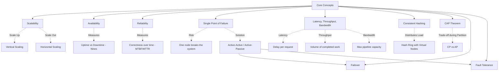

# Core Concepts - Theory Super

## Global Mind Map: Core Concepts

---

# 1. Scalability

## The Problem - The Growth Wall
A design that worked for 1,000 users will often collapse at 100,000 users. A single database might easily serve 100 queries per second, but catch fire at 10,000. Before scalability was understood systematically, companies had to completely rewrite their architectures from scratch every time they grew.

## The Core Idea
**Scalability** is a system's ability to handle increased load simply by adding resources, without requiring a complete architectural overhaul.

## How It Works
There are two primary ways to scale a system.

### Vertical Scaling (Scale Up)
Adding more power to an existing machine (more CPU, more RAM, faster SSDs).
- **Pros**: Simple, no code changes, no distributed network complexity.
- **Cons**: Hardware ceiling (you can only buy a server so big), single point of failure (if it crashes, everything goes down), and exponential cost curves.
- **When to use**: Early-stage startups, databases where data locality matters, monolithic workloads.

### Horizontal Scaling (Scale Out)
Adding more commodity machines and distributing the load across them.
- **Pros**: Virtually no hard limit (infinite scale in the cloud), fault-tolerant (no single point of failure), cost-effective.
- **Cons**: High complexity, requires stateless services, network overhead.
- **Requirement**: **Statelessness**. To scale horizontally, servers cannot store session data locally. Session data must live in a shared store (like Redis) so any server can handle any request.

### Scaling Different Tiers
- **Application Tier**: Easy. Make it stateless and throw a Load Balancer in front of 100 App Servers.
- **Database Tier**: Hard. State is tricky.
  - *Read Replicas*: Primary handles writes, replicas handle reads (good for 10:1 read/write ratios).
  - *Sharding*: Split the data (e.g., Users A-M on DB1, Users N-Z on DB2). Complex but scales writes.
- **Caching Tier**: Redis clusters can handle 100x the throughput of a database.
- **Message Queues**: Kafka/RabbitMQ decouple producers and consumers, acting as a shock-absorber for traffic spikes.

---

# 2. Availability

## The Problem - Outages Cost Trust
A system can be perfectly scaled to handle 10 million requests per second, but if a single power supply fails and the entire system goes offline for 6 hours, it is useless.

## The Core Idea
**Availability** measures how often your system is operational and accessible. It is the percentage of uptime over a given period.

## Measuring Availability (The Nines)
Availability = Uptime / (Uptime + Downtime).

| Availability | Downtime per Year |
| :--- | :--- |
| **99% (two nines)** | 3.65 days |
| **99.9% (three nines)** | 8.76 hours |
| **99.99% (four nines)** | 52.6 minutes |
| **99.999% (five nines)** | 5.26 minutes |

### Series vs Parallel
- **Series**: Multiplies failure. Three components with 99.9% availability in series = 99.9% × 99.9% × 99.9% = **99.7%** (availability drops).
- **Parallel**: Eliminates failure. Two servers at 99.9% in parallel means *both* must fail simultaneously. Probability of failure = 0.1% × 0.1% = 0.0001%. Availability = **99.9999%**.

## How It Works: Redundancy
Redundancy is the foundation of availability. You must have backup components.
- **Active-Passive (Standby)**: One component does the work, the other waits. If the active fails, the passive takes over. (Good for databases).
- **Active-Active**: All components handle traffic. If one dies, the load balancer stops sending it traffic. (Good for stateless web servers).
- **Geographic Redundancy**: Deploying across multiple Availability Zones (AZs) or Regions to survive a data center fire or natural disaster.

---

# 3. Reliability

## The Problem - The Silent Liar
A payment system might be 100% "Available" (it always responds with HTTP 200), but if it accidentally charges a customer's credit card twice, the system is fundamentally broken. 

## The Core Idea
**Reliability** asks: "Is the system doing what it should correctly?" Availability asks if it is up; Reliability asks if it is right.

## How It Works: Metrics
- **MTBF (Mean Time Between Failures)**: Total Operating Time / Number of Failures. How often things break.
- **MTTR (Mean Time To Recovery)**: Total Downtime / Number of Failures. How fast you fix it. (Reducing MTTR often matters more than maximizing MTBF).
- **Error Rate**: Failed Requests / Total Requests.
- **Data Correctness**: The most vital metric. Successful HTTP 200s that contain wrong data are reliability failures.

## Defenses
- **Graceful Degradation**: If the Recommendation Engine fails, don't crash the homepage. Show "Trending Items" instead.
- **Circuit Breakers**: If a downstream service is struggling, stop sending it traffic (open the circuit). Fail fast instead of tying up threads.
- **Idempotency**: Essential for payments. If a network drops a response, the client will retry. The server must recognize the `idempotency_key` and return the cached result instead of charging the card again.

---

# 4. Single Point of Failure (SPOF)

## The Problem - The Achilles Heel
If your architecture features 100 perfectly load-balanced, highly-available web servers... all sitting behind a single database, that single database is a SPOF. If it dies, the whole system dies.

## The Core Idea
A **SPOF** is any component, dependency, or process whose failure takes down a critical user flow, with no working alternative.

## How It Works
SPOFs hide in plain sight. They aren't just servers:
- **Network**: One NAT gateway, one DNS provider.
- **Data**: One database primary without failover.
- **Operations**: One deployment pipeline, or one human expert who knows the admin password.

### Mitigation Strategy
1. **Identify Critical Flows**: (e.g., Checkout).
2. **Trace Dependencies**: What must work for Checkout to work?
3. **Redundancy**: Apply Active-Active or Active-Passive backups to those exact nodes.
4. **Chaos Testing**: Physically pull the plug on a test node and verify the system survives.

---

# 5. Latency vs Throughput vs Bandwidth

## The Problem - Confused Terminology
People often say "We need more bandwidth to make the site faster" when they actually have a latency problem. Mixing these up leads to optimizing the wrong bottlenecks.

## The Core Idea (The Highway Analogy)
- **Bandwidth**: The number of lanes on the highway (Theoretical maximum capacity).
- **Throughput**: How many cars actually cross the finish line per minute (Actual achieved volume).
- **Latency**: How long it takes one specific car to travel from start to finish (Delay).

## How It Works
- **Latency (Delay)**: Measured in ms (e.g., p50, p99 percentiles). It is the sum of propagation (distance), transmission, processing, and queuing delays. 
  - *Fix by*: Caching, CDNs, moving servers closer to users.
- **Throughput (Volume)**: Measured in Requests Per Second (RPS). It is capped by the slowest bottleneck in your system (e.g., a slow DB query).
  - *Fix by*: Horizontal scaling, async processing, batching.
- **Bandwidth (Capacity)**: Measured in Gbps. You can never have throughput higher than bandwidth.

---

# 6. Consistent Hashing

## The Problem - The Cache Miss Storm
If you have 5 cache servers, a naive way to route users is `hash(user_id) % 5`. 
If Server 4 crashes, the formula becomes `hash(user_id) % 4`. Suddenly, the math changes for almost *every single user*. 80% of your users will be routed to a new, empty cache server. This triggers a massive cache miss storm that crushes your database.

## The Core Idea
**Consistent Hashing** places servers and keys on a circular "Hash Ring" (0 to $2^{64}-1$). When a server is added or removed, only the keys immediately adjacent to it on the ring are moved.

## How It Works
1. **The Ring**: Imagine a clock face from 0 to MAX_INT.
2. **Place Servers**: Hash the server IDs and place them on the ring (e.g., Server A at 12:00, Server B at 4:00).
3. **Place Keys**: Hash the key (e.g., `user_123`) and place it on the ring.
4. **Routing**: Walk clockwise from the key. The first server you hit owns the key.

### Virtual Nodes (vnodes)
Physical servers rarely distribute perfectly on a ring. To fix uneven load, we create **Virtual Nodes**. Instead of placing Server A on the ring once, we hash it 100 times (`ServerA_1`, `ServerA_2`...) and place it 100 times around the ring. This guarantees a perfectly smooth distribution of keys.

---

# 7. CAP Theorem

## The Problem - Network Partitions are Inevitable
If a network cable is cut between your US-East and US-West data centers, they can no longer communicate. If a user in US-East updates their password, US-West cannot know about it. What happens when a user in US-West tries to log in?

## The Core Idea
When a distributed system experiences a network partition (P), it must choose between **Consistency (C)** and **Availability (A)**.

## How It Works
- **Consistency**: Every read sees the latest write, or returns an error. (Strong Read-after-Write).
- **Availability**: Every request receives a non-error response (but it might be stale).
- **Partition Tolerance**: The system continues to function when the network breaks. (This is non-negotiable in distributed systems).

### The Choice During a Partition:
- **CP Systems**: (Choose Consistency). If the US-West DB cannot reach the US-East leader, it **rejects** the login attempt. (Use for: Bank balances, inventory reservations, payment ledgers).
- **AP Systems**: (Choose Availability). US-West **accepts** the login using the old, stale password, or accepts a new cart item and reconciles it later. (Use for: Social media feeds, shopping carts, likes/views).

---

# 8. Failover

## The Problem - Manual Intervention is Too Slow
If a primary database dies at 3:00 AM, waiting for an engineer to wake up, diagnose the issue, and manually route traffic to a backup database results in hours of downtime.

## The Core Idea
**Failover** is the automated process of seamlessly switching traffic from a failed primary system to a reliable standby backup.

## How It Works
- **Heartbeats**: The secondary server constantly monitors the primary server via a "heartbeat" ping.
- **Detection**: If the primary stops sending heartbeats, the secondary realizes it has died.
- **Promotion**: The secondary automatically promotes itself to primary, takes over the IP address, and begins serving traffic.

### Types of Clusters
- **Active-Passive**: The secondary does nothing but wait. (Zero risk of conflict, but wastes hardware).
- **Active-Active**: Both nodes handle traffic simultaneously. (High resource utilization, instant failover, but highly complex to keep state synchronized).

---

# 9. Fault Tolerance

## The Problem - Hardware Fails
Amazon's US-East-1 region goes down, taking half the internet with it. If your application crashes because one AWS data center lost power, your system is not fault-tolerant.

## The Core Idea
**Fault Tolerance** is a system's ability to continue operating without any loss of functionality when one or more of its components fail.

## How It Works
Fault tolerance is achieved through deep, multi-layered redundancy:
- **Node-level survival**: Kubernetes spins up a new pod if one crashes.
- **AZ-level survival (Availability Zone)**: Deploying across multiple isolated data centers so a localized power outage doesn't drop your app.
- **Region-level survival**: Replicating databases across entirely different geographic regions (e.g., US-East and EU-West).
- **Cloud-level survival**: Multi-cloud architectures (AWS + GCP) to survive a total cloud provider blackout.

*Trade-off*: 100% Fault Tolerance is impossible. The goal is to define your "Survival Goals" (e.g., "We must survive an AZ failure, but we accept downtime if the whole US region fails") based on the dollar-cost of downtime vs the engineering cost of multi-region architectures.
