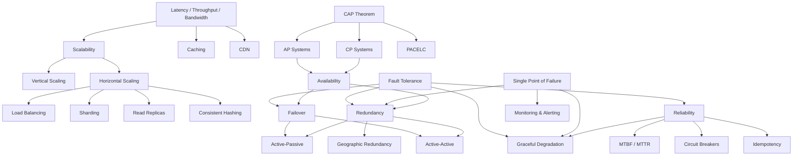
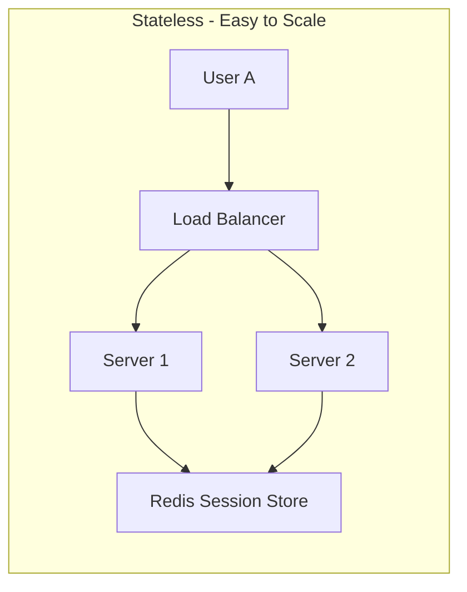
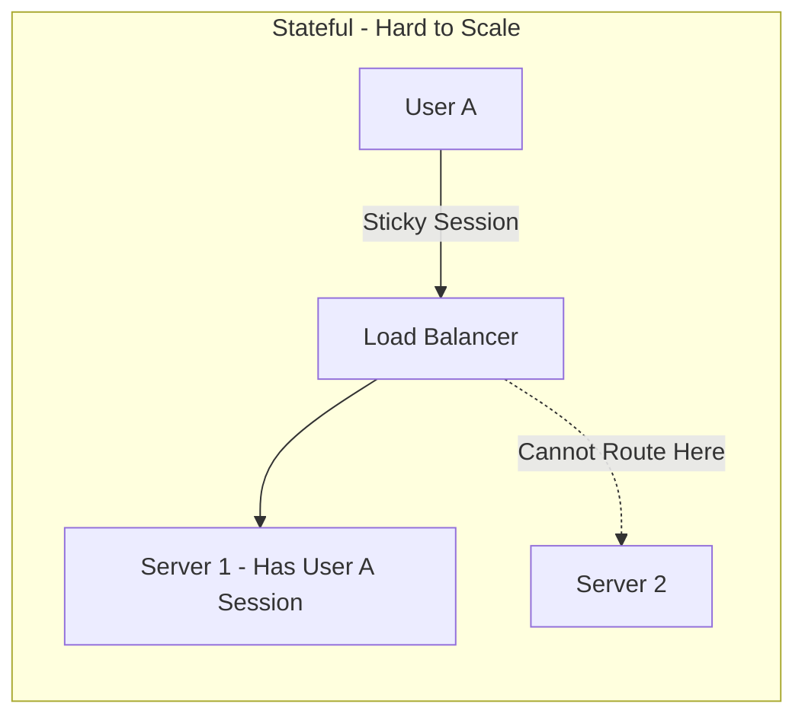
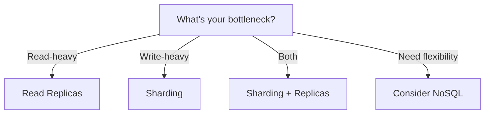

# Core Concepts — Theory Super

## Global Mind Map: How Core Concepts Connect



---

# 1. Scalability

## The Problem

As an application grows, the load on it grows too: more users, more data, more requests per second. A design that worked for a thousand users may not work for a million, and a database that served a hundred queries per second may not serve ten thousand.

## What is Scalability?

**Scalability is the ability of a system to handle increased load by adding resources.** The key word here is "ability" — a scalable system can grow to meet demand without requiring a complete architectural overhaul.

Scalability is one of the foundational concerns of system design. Many other properties of a production system depend on the choices made at the scaling layer.

## Measuring Scalability

Before scaling, you need to understand how to measure it. You cannot improve what you do not measure, and vague statements like "we need to scale" are useless without concrete numbers.

### Load Metrics

| Metric | Description | Example |
|--------|-------------|---------|
| Requests per second (RPS) | Number of API calls the system handles | 10,000 RPS |
| Concurrent users | Users active at the same time | 50,000 concurrent |
| Data volume | Amount of data stored or processed | 10 TB storage |
| Throughput | Data transferred per unit time | 1 GB/s |
| Query rate | Database queries per second | 50,000 QPS |
| Message rate | Messages processed through queues | 100,000 msg/s |

### Performance Under Load

A system scales well if it maintains acceptable performance as load increases:

| Load Increase | Response Time | Behavior | What It Means |
|---------------|---------------|----------|---------------|
| 1x (baseline) | 50ms | Baseline | Normal operation |
| 2x | 55ms | Excellent | Sublinear growth, caching working well |
| 5x | 70ms | Good | System handling load efficiently |
| 10x | 150ms | Acceptable | Linear degradation, predictable |
| 10x | 500ms | Concerning | Superlinear degradation, bottleneck forming |
| 10x | Timeout | Critical | System at breaking point |

The goal is to keep performance relatively stable as load increases. Ideally, you want linear or sublinear degradation, where doubling load does not double response time. When response times spike or the system starts timing out, you have hit a scalability wall.

---

## Vertical Scaling (Scale Up)

Vertical scaling means adding more power to your existing machines. Instead of adding more servers, you upgrade to bigger ones.

This is often the first response to performance problems because it requires no architectural changes.

**Common Vertical Scaling Actions:**
- Add more CPU cores for compute-intensive workloads
- Increase RAM to cache more data in memory
- Use faster SSDs to reduce I/O bottlenecks
- Upgrade network cards for higher bandwidth

### Pros and Cons

**Pros:**
- **Simple:** No code changes required. Just move to a bigger machine.
- **Lower latency:** All data is local, no network hops.
- **No distributed complexity:** A single server means no network partitions, no data synchronization issues.

**Cons:**
- **Hardware limits:** You cannot scale beyond the largest available machine. Even cloud providers have limits.
- **Single point of failure:** One server means one failure point. If it goes down, everything goes down.
- **Cost curve:** Larger machines cost disproportionately more. Doubling capacity often more than doubles cost.
- **Downtime during upgrades:** Migrating to a bigger machine typically requires downtime.

### When to Use Vertical Scaling

- Databases where data locality matters (before sharding becomes necessary)
- Applications with strong consistency requirements
- Early-stage startups that need simplicity over scale
- Workloads with predictable, moderate growth

> **Note:** Never dismiss vertical scaling as "not scalable." Many real-world systems run on vertically scaled databases for years. The key is knowing when horizontal scaling becomes necessary.

---

## Horizontal Scaling (Scale Out)

Vertical scaling eventually hits a ceiling. When the biggest available machine is not big enough, or when you need fault tolerance that a single machine cannot provide, you need a different approach.

Horizontal scaling means adding more machines rather than upgrading existing ones. Instead of one powerful server, you distribute the load across many commodity servers.

This is how companies like Google, Netflix, and Amazon handle billions of requests.

### Pros and Cons

**Pros:**
- **No hard limit:** You can keep adding servers as needed. Cloud providers make this nearly unlimited.
- **Fault tolerance:** If one server fails, others continue serving traffic. No single point of failure.
- **Cost-effective:** Many smaller machines often cost less than one giant machine.
- **Geographic distribution:** You can place servers closer to users for lower latency.

**Cons:**
- **Complexity:** Distributed systems are harder to build, debug, and maintain.
- **Data consistency:** Keeping data synchronized across servers is challenging.
- **Network overhead:** Communication between servers adds latency.
- **Stateless requirement:** Application servers typically need to be stateless, which may require architectural changes.

### Stateless vs Stateful Services

For horizontal scaling to work effectively, services should be **stateless**. A stateless service does not store any session data locally. Each request can be handled by any server.





In the stateful model, once a user's session is stored on Server 1, all their requests must go to that same server. This creates hotspots and makes it risky to remove servers. In the stateless model, session data lives in a shared store like Redis, so any server can handle any request. The load balancer has complete freedom to distribute traffic.

**To make services stateless:**
- Store session data in a shared cache (Redis, Memcached)
- Use tokens (JWT) instead of server-side sessions
- Store uploaded files in object storage (S3) instead of local disk

---

## Scaling Different Components

A typical system is not monolithic. It has multiple components, each with different scaling characteristics and challenges.

### Application Tier

Application servers are usually the easiest to scale horizontally, provided they are stateless.

**Key strategies:**
- Make services stateless
- Use a load balancer to distribute traffic
- Auto-scale based on CPU, memory, or request count
- Deploy across multiple availability zones

### Database Tier

Databases are typically the hardest to scale because they manage state. Unlike application servers, you cannot simply spin up more database instances and put a load balancer in front of them. Data consistency, durability, and transaction isolation all complicate matters.



#### 1. Read Replicas

For read-heavy workloads (which most applications are), create copies of your database that handle read queries. Primary handles all writes, replicas receive changes and serve reads.

**When to use:** Read-to-write ratio is 10:1 or higher, and writes are not the bottleneck.

| | Pros | Cons |
|--|------|------|
| | Simple to set up (managed services handle it) | Does not help with write-heavy workloads |
| | Offloads read traffic from primary | Introduces replication lag (stale reads) |
| | Provides read availability if primary fails | Replicas consume storage (full data copy) |
| | No application changes for basic setup | Failover can cause brief inconsistency |

#### 2. Sharding (Partitioning)

When read replicas are not enough, or when write volume exceeds what a single primary can handle, you need to split your data across multiple databases based on a partition key.

| | Pros | Cons |
|--|------|------|
| | Distributes both reads AND writes | Complex to implement correctly |
| | Scales horizontally (add more shards) | Cross-shard queries are expensive or impossible |
| | Each shard is smaller, faster | Rebalancing shards is operationally difficult |
| | Can place shards in different regions | Transactions across shards are very hard |

**Common sharding strategies:**
- **Range-based:** Shard by value ranges (A-H, I-P, Q-Z)
- **Hash-based:** Hash the key and mod by number of shards
- **Directory-based:** Maintain a lookup table mapping keys to shards

#### 3. NoSQL Databases

NoSQL databases like Cassandra, MongoDB, and DynamoDB are designed for horizontal scaling from the ground up:

- **Built-in sharding:** Data is automatically distributed
- **Eventual consistency:** Trade strong consistency for availability
- **No joins:** Data model must accommodate denormalization

| | Pros | Cons |
|--|------|------|
| | Built-in sharding (automatic distribution) | Different query patterns than SQL |
| | Designed for horizontal scale | No joins (denormalization required) |
| | Often better write performance | Eventual consistency in many cases |
| | Schema flexibility | Less tooling ecosystem than SQL |

### Caching Tier

Caching reduces load on databases and improves response times. A well-designed cache can handle 100x the throughput of a database, making it essential for high-traffic systems. Redis, for example, can handle **100,000+ operations per second** on a single node.

**Cache Scaling strategies:**
- **Redis Cluster:** Automatically partitions data across nodes using hash slots
- **Consistent hashing:** Distributes keys evenly and minimizes redistribution when nodes are added or removed
- **Cache-aside pattern:** Application checks cache first, falls back to database on cache miss, then populates the cache

### Message Queue Tier

Message queues are essential for scaling asynchronous workloads. They decouple producers from consumers, allowing each to scale independently, and they buffer traffic spikes so consumers can process at their own pace.

**How queues help scalability:**
- **Decouple producers and consumers:** Scale each independently
- **Buffer traffic spikes:** Queue absorbs bursts, consumers process at their own pace
- **Partition topics:** Kafka partitions allow parallel consumption

---

## Example: Scaling from 0 to Millions of Users

### Stage 1: Single Server (0-10K users)

At launch, everything runs on one machine. The application and database share the same server. This setup is simple, cheap, and perfectly adequate for a few thousand users. There is no distributed system complexity, no network latency between components, and debugging is straightforward.

**Bottleneck:** The application and database start competing for CPU and memory on the same machine.

### Stage 2: Separate Database (10K-100K users)

The first scaling move is usually separating the database onto its own machine. Now each component can be tuned independently. You can give the database server more RAM for caching, while the app server gets more CPU for request processing.

**Bottleneck:** The database. As user counts grow, the database handles more queries, and read operations start slowing down.

### Stage 3: Add Caching (100K-500K users)

Adding a cache layer dramatically reduces database load. Hot data — things like user profiles, recent posts, and session data — gets served from memory. Redis can handle hundreds of thousands of reads per second, far more than MySQL. With a good caching strategy, **80-90% of reads never hit the database**.

**Bottleneck:** The single app server. It cannot handle the incoming request volume.

### Stage 4: Multiple App Servers (500K-2M users)

This is where horizontal scaling begins. A load balancer distributes traffic across multiple app servers. Each server is stateless, storing no session data locally. The Redis cache serves as the shared session store.

Adding more app servers is now trivial. Need more capacity? Spin up another server. Traffic spike during peak hours? Auto-scaling adds servers automatically.

**Bottleneck:** The database. With more app servers generating more queries, the single MySQL instance becomes overwhelmed.

### Stage 5: Read Replicas (2M-10M users)

Most applications are read-heavy, with reads outnumbering writes by 10:1 or more. Read replicas take advantage of this pattern. The primary database handles all writes, while replicas serve read queries. This multiplies read capacity without changing the application much.

**The trade-off is replication lag.** Replicas may be a few milliseconds behind the primary, so recently written data might not be immediately visible on reads. For most applications, this is acceptable.

**Bottleneck:** Write throughput. One primary database can only handle so many writes per second.

### Stage 6: Sharding (10M+ users)

Sharding is the final frontier of relational database scaling. Data is partitioned across multiple databases based on a shard key, typically user ID. Each shard handles a subset of users, distributing both read and write load.

This is powerful but comes with significant complexity. Cross-shard queries become expensive or impossible. Rebalancing shards when they grow unevenly is operationally challenging. Many teams at this stage consider moving to distributed databases like CockroachDB or Vitess that handle sharding automatically.

---

## Scalability Summary

- **Vertical scaling is simple but has limits.** Use it for databases, early-stage systems, and workloads where simplicity matters more than infinite growth.
- **Horizontal scaling is more complex but can grow indefinitely.** It requires stateless services and careful data management.
- **Different components scale differently.** App servers are easy to scale horizontally. Databases are hard because they manage state. Know the difference.
- **Always identify the bottleneck first** before deciding how to scale. Adding more app servers does not help if the database is the problem.
- **Common patterns** like load balancing, caching, async processing, and database optimization appear in almost every scalable system.

---
---

# 2. Availability

## The Problem

A system can be perfectly designed to handle millions of requests and still be useless to its users if it goes down whenever a single server fails. Scaling to high load and staying operational under failure are two different problems, and the second one is what availability addresses.

## What Availability Measures

**Availability measures how often your system is operational and accessible to users.** A highly available system continues functioning even when individual components fail.

Availability is not the same as reliability. A system can be highly available (always up) but unreliable (sometimes gives wrong answers). The two properties are related but distinct.

## Measuring Availability

Availability is typically expressed as a percentage of uptime over a given period:

```
Availability = Uptime / (Uptime + Downtime)
```

For example, if a system was up for 364 days and down for 1 day in a year:
```
Availability = 364 / 365 = 99.73%
```

That single day of downtime drops the system below "three nines" availability.

### The "Nines" of Availability

Each additional nine dramatically reduces allowed downtime:

| Availability | Downtime per Year | Downtime per Month | Downtime per Week |
|-------------|-------------------|--------------------|--------------------|
| 99% (two nines) | 3.65 days | 7.3 hours | 1.68 hours |
| 99.9% (three nines) | 8.76 hours | 43.8 minutes | 10.1 minutes |
| 99.99% (four nines) | 52.6 minutes | 4.38 minutes | 1.01 minutes |
| 99.999% (five nines) | 5.26 minutes | 26.3 seconds | 6.05 seconds |
| 99.9999% (six nines) | 31.5 seconds | 2.63 seconds | 0.6 seconds |

### Availability in Series vs Parallel

**Components in Series:** When all must work for the system to function, availability multiplies:

```
Overall = 99.9% × 99.9% × 99.9% = 99.7%
```

Each component in the chain reduces overall availability. You started with three components, each at "three nines," but the combined system is below three nines.

**Components in Parallel:** When any can handle the request, availability improves dramatically:

```
Failure probability = 0.1% × 0.1% = 0.0001%
Availability = 100% - 0.0001% = 99.9999%
```

Two servers with 99.9% availability each give you exactly **six nines** when running in parallel. This is the power of redundancy.

---

## Common Failure Modes

### Hardware Failures

Everything physical eventually breaks. The question is when, not if.

| Component | Typical Failure Rate | MTBF |
|-----------|---------------------|------|
| Hard Drive (HDD) | 2-4% per year | 300,000 hours |
| SSD | 0.5-1% per year | 1-2 million hours |
| Server | 2-4% per year | 300,000 hours |
| Network Switch | 1-2% per year | 500,000 hours |
| Power Supply | 1-3% per year | 400,000 hours |

At scale, hardware failures are not exceptional events. They are routine. A data center with 10,000 servers will see hundreds of hardware failures per year.

### Software Failures

- **Bugs:** Code defects that cause crashes or incorrect behavior
- **Memory leaks:** Gradual resource exhaustion
- **Deadlocks:** Processes waiting on each other indefinitely
- **Cascading failures:** One failure triggering failures in dependent systems

### Network Failures

- **Packet loss:** Data does not reach its destination
- **Latency spikes:** Delays in communication
- **Partition:** Network split isolates groups of servers
- **DNS failures:** Name resolution stops working

### Human Errors

A large share of production outages is attributable to human error:

- **Configuration mistakes:** wrong environment variable, typo in a config file
- **Failed deployments:** bad code or broken migrations pushed to production
- **Accidental deletions:** running the wrong command in the wrong place
- **Capacity planning errors:** underestimating traffic for a launch

This is why automation, testing, and operational guardrails matter.

---

## Redundancy: The Foundation of Availability

Redundancy means deploying backup components that can take over when primary components fail.

### Active-Passive (Standby)

In an active-passive configuration, one component handles all the work while another waits idle as a backup. When the active component fails, the passive one takes over.

| Standby Type | State | Failover Time | Cost |
|-------------|-------|---------------|------|
| Cold Standby | Powered off, needs to boot | Minutes | Lowest |
| Warm Standby | Running but not receiving traffic | Seconds to minutes | Medium |
| Hot Standby | Running, data synchronized, ready to serve | Seconds | Highest |

**Pros:** Simple to reason about, standby typically uses fewer resources, clear source of truth.
**Cons:** Failover takes time, standby may not be truly "production-ready" because it isn't tested under real load, potential for split-brain problem.

### Active-Active

In an active-active configuration, all components handle traffic simultaneously. There is no distinction between primary and backup because every node is doing real work.

When one node fails, the load balancer simply stops sending traffic to it. There is no failover process because the other nodes were already handling traffic.

**Pros:** No failover delay, all nodes tested under real load, better resource utilization.
**Cons:** More complex, must handle data consistency across nodes, requires stateless design or shared state.

### Geographic Redundancy

Redundancy within a single data center protects against hardware failures, but what if the entire data center goes offline?

| Level | What It Is | Protects Against | Latency Impact |
|-------|-----------|------------------|----------------|
| Availability Zones (AZs) | Separate data centers in same region | Single data center failure | Minimal (1-2ms) |
| Regions | Geographically separate areas | Regional disasters, widespread outages | Significant (50-100ms+) |
| Multi-Cloud | Different cloud providers (AWS + GCP) | Cloud provider outages | Variable |

Availability Zones are the sweet spot for most applications. Most cloud-native applications deploy across at least two AZs.

### Redundancy Across Layers

A chain is only as strong as its weakest link. If you have redundant app servers but a single database, the database is your single point of failure. True high availability requires redundancy at every layer of your stack.

> **Note:** Redundancy is not free. Every backup server, every replica, every additional availability zone costs money. The question is whether that cost is justified by the reduction in downtime risk.

---

## High Availability Patterns

### Pattern 1: Load Balancer with Multiple Backends

The most common and fundamental pattern for stateless services. A load balancer distributes traffic across multiple servers, automatically routing around failures.

**How it provides HA:**
- Load balancer continuously monitors backend health
- Failed servers are automatically removed from rotation
- Traffic redistributes to healthy servers within seconds
- New servers can be added without any downtime

The load balancer itself is a single point of failure. For true HA, you need redundant load balancers. Cloud providers handle this automatically (AWS ALB, Google Cloud Load Balancer, Azure Load Balancer).

### Pattern 2: Database Replication with Automatic Failover

Databases are stateful and cannot simply be load-balanced like web servers.

| Type | How It Works | Data Loss | Performance Impact |
|------|-------------|-----------|-------------------|
| Synchronous | Write confirmed only after replica acknowledges | Zero (RPO = 0) | Higher latency (wait for replica) |
| Asynchronous | Write confirmed immediately, replica catches up later | Possible (seconds to minutes) | No impact on write latency |
| Semi-synchronous | Wait for at least one replica, others async | Minimal | Moderate impact |

Most production systems use synchronous replication for the failover target and asynchronous replication for read replicas and analytics.

### Pattern 3: Queue-Based Load Leveling

When downstream services cannot handle peak load, use a queue to buffer requests and process them at a sustainable rate.

**How it provides HA:**
- Decouples producers from consumers
- Buffers traffic spikes that would overwhelm the database
- Workers can fail and restart without losing messages
- Can scale workers independently based on queue depth

This pattern is essential for handling bursty traffic. A flash sale might generate **100x normal traffic** for a few minutes. Without a queue, the database would be overwhelmed. With a queue, orders accumulate and are processed at a sustainable rate.

### Pattern 4: Circuit Breaker

When a dependency fails, continuing to call it wastes resources and can cause cascading failures. The circuit breaker pattern prevents this by failing fast.

| State | Behavior | Transitions |
|-------|----------|-------------|
| Closed | Normal operation. All requests pass through. Track failure rate. | → Open: when failure rate exceeds threshold |
| Open | Fail fast. All requests immediately rejected with error. | → Half-Open: after timeout period |
| Half-Open | Testing. Allow limited requests through. | → Closed: if test succeeds / → Open: if test fails |

---

## Availability Summary

- **Availability is measured in nines.** Each additional nine cuts allowed downtime by roughly 10x.
- **Series components multiply failure.** Three components at 99.9% in series give 99.7% overall. Parallel components compound availability in the other direction.
- **Failures come from hardware, software, networks, and people.** Human error accounts for a large share of real outages.
- **Redundancy is the foundation of availability.** Active-passive is simpler; active-active gives faster failover and better resource utilization.
- **Geographic redundancy** protects against data center and regional failures.
- **Redundancy must exist at every layer.**
- **Redundancy is not free.** Match the investment to the business impact of downtime.
- The useful question is: when this specific component fails, what stops working, who notices, and how quickly does the system recover?

---
---

# 3. Reliability

## The Problem

A system that stays up but occasionally produces wrong answers is not actually serving its users. Beyond capacity and uptime, there is a third concern: reliability.

**A reliable system performs its intended function correctly and consistently, even in the face of faults.** Availability asks "Is the system up?"; reliability asks "Is the system doing what it should?"

Consider a payment system that is always available but occasionally charges customers twice. Or a messaging app that delivers messages out of order. These systems are available, but they are not reliable. Users tend to lose confidence in a system that gives wrong answers faster than in one that occasionally goes down.

## What is Reliability?

**Reliability is the probability that a system will perform its intended function correctly over a given period of time, under specified conditions.**

- **"Correctly"** means producing the right output, not just any output.
- **"Over a given period"** means reliability is measured over time, not at a single instant.
- **"Under specified conditions"** means we define what normal operation looks like.

An available system responds. A reliable system responds **correctly**. You want both, but they are distinct properties.

### Reliability vs Related Concepts

| Concept | Question It Answers | Example |
|---------|-------------------|---------|
| Availability | Is the system responding? | System returns HTTP 200 |
| Reliability | Is the response correct? | The balance returned is accurate |
| Fault Tolerance | Does it keep working when components fail? | Works with one database replica down |
| Durability | Is data preserved despite failures? | Data survives disk failure |

A payment system that charges customers twice is available (it processes requests) but unreliable (it processes them incorrectly). A database that loses writes during failover is fault-tolerant (it continues operating) but not durable (data was lost).

---

## Measuring Reliability

### 1. Mean Time Between Failures (MTBF)

MTBF measures the average time between failures. A higher MTBF means failures are less frequent.

```
MTBF = Total Operating Time / Number of Failures
```

**Example:** if a system ran for 10,000 hours and experienced 5 failures, MTBF = 10,000 / 5 = 2,000 hours. That means you can expect one failure roughly every 83 days. If you have 100 servers each with MTBF of 2,000 hours, you will see approximately **one server failure per day** across your fleet.

### 2. Mean Time To Recovery (MTTR)

MTTR measures how long it takes to restore the system after a failure. A lower MTTR means faster recovery.

```
MTTR = Total Downtime / Number of Failures
```

MTTR includes detection time, diagnosis time, repair time, and verification time. **Reducing MTTR often has more impact than reducing failure rate.** If you cannot prevent failures, at least recover quickly.

### 3. Error Rate

```
Error Rate = Failed Requests / Total Requests × 100%
```

| System Type | Target Error Rate | Meaning |
|------------|-------------------|---------|
| Critical systems | < 0.01% | 1 in 10,000 requests fails |
| Standard systems | < 0.1% | 1 in 1,000 requests fails |
| Tolerant systems | < 1% | 1 in 100 requests fails |

### 4. Data Correctness

```
Correctness = Correct Responses / Total Responses × 100%
```

This is the often-overlooked metric. A system can have 99.99% availability and 0.01% error rate, but if 1% of successful responses contain wrong data, you have a reliability problem.

---

## Why Systems Become Unreliable

- **Hardware Failures:** Physical components wear out and fail over time. Disks develop bad sectors, memory cells corrupt, CPUs overheat, network cards malfunction. At scale they become a daily occurrence.
- **Software Bugs:** Responsible for a large share of reliability problems. Unlike hardware failures which tend to be random and independent, software bugs are systematic: every request that hits the buggy code path fails in the same way. **The most dangerous bugs are those that do not crash the system but silently produce wrong results.**
- **Configuration Errors:** Surprisingly common and often catastrophic. AWS's S3 outage in 2017 was triggered by a command to remove a small number of servers that accidentally removed a much larger set.
- **Human Error:** A leading cause of production outages. Operators mistype commands, engineers deploy untested changes, and on-call responders misdiagnose problems under time pressure.
- **Overload and Cascading Failures:** Systems that work perfectly under normal load can fail catastrophically when overloaded. When one component slows down, requests queue up, timeouts fire, retries multiply the load, and the problem cascades.

---

## Techniques to Enhance Reliability

### 1. Redundant Architectures

The most fundamental reliability technique is having more components than you need. If one fails, others continue operating.

### 2. Data Replication

Ensure your data is not stored in a single location. Use data replication strategies across multiple databases or data centers. If one database fails, the system can still access a copy from another location.

### 3. Graceful Degradation

When parts of the system fail, graceful degradation keeps the core functionality working. Instead of complete failure, the system provides reduced service.

**Consider an e-commerce site:**
- **Full service:** Personalized recommendations, real-time inventory, all payment options
- **Partial service:** Generic recommendations, cached inventory, primary payment options
- **Core only:** Browse products, checkout with basic payment
- **Emergency mode:** Display cached product pages, accept orders for later processing

### 4. Circuit Breakers

In a microservices architecture, one service failing can cascade failures throughout the system. Circuit breakers detect when a service is failing and temporarily cut off requests to prevent overload.

- **Closed state:** Requests pass through normally. Failures are counted. When failures exceed a threshold (e.g., 5 failures in 30 seconds), the circuit opens.
- **Open state:** Requests fail immediately without calling the dependency. This prevents wasting resources and allows the dependency time to recover.
- **Half-open:** After a timeout (e.g., 30 seconds), a limited number of test requests are allowed through. If they succeed, the circuit closes. If they fail, it opens again.

### 5. Idempotency

Network failures make it unclear whether a request succeeded or failed. If you retry, you might execute the operation twice. **Idempotent operations produce the same result regardless of how many times they are executed.**

The idempotency key (e.g., `abc123`) allows the server to detect retries. The first execution stores the key. Subsequent executions with the same key return the stored result without re-executing.

**Stripe, PayPal, and other payment processors require idempotency keys for money-moving operations.** Without them, network issues could cause duplicate charges.

---

## Reliability Summary

- **Reliability, availability, fault tolerance, and durability are distinct properties.** Optimizing for one can quietly sacrifice another.
- **MTBF measures how often things break, MTTR measures how fast you recover.** Reducing MTTR often has more impact.
- **Error rate and correctness are both required.** A response that never errors but contains wrong data still fails the user.
- **Redundancy plus failover** keeps the system serving when components die. An untested failover path is a false sense of safety.
- **Graceful degradation** reduces blast radius. Core flows should keep working when optional services fail.
- **Circuit breakers** prevent one slow dependency from taking down the rest.
- **Idempotency** makes retries safe. Money-moving operations should require an idempotency key.

---
---

# 4. Single Point of Failure (SPOF)

## The Problem

A single point of failure (SPOF) is any component, dependency, process, or decision point whose failure can take down the system or a critical user flow.

The component does not have to be a server. A SPOF can be a database primary, load balancer, DNS provider, cloud region, message broker, secrets manager, deployment pipeline, human approval step, shared library, feature flag service, or **one overloaded team that knows how to recover the system.**

## What Makes Something a SPOF

A component is a SPOF when three things are true:
1. A critical path depends on it.
2. There is no working alternative when it fails.
3. The failure causes unacceptable impact.

Not every failed component is a SPOF. If a recommendation service fails and the homepage can still show popular items, that service is not a SPOF for checkout. Good SPOF analysis is about **user flows and dependencies, not just counting servers.**

---

## Common SPOFs

| Area | Common SPOF | Failure Impact |
|------|------------|----------------|
| Traffic entry | One load balancer, one ingress controller, one DNS provider | Users cannot reach the service |
| Compute | One application instance or one availability zone | Requests fail when that instance or zone fails |
| Data | One database primary without failover | Reads or writes stop; data may be at risk |
| Cache | One cache cluster with no fallback limits | Database overload after cache failure |
| Messaging | One broker, queue, or stream cluster | Producers block or consumers stop |
| Configuration | One config service or feature flag system | Services cannot start or update safely |
| Secrets | One secrets manager path or token issuer | Authentication or service startup fails |
| Storage | One object bucket, volume, filesystem, or metadata server | Files become unavailable |
| Network | One NAT gateway, route table, firewall, VPN, or private link | Large parts of the system lose connectivity |
| Operations | One deployment pipeline, runbook, account, or expert | Recovery depends on a single process or person |

---

## How to Identify SPOFs

### 1. Start With Critical User Flows
Map the flows that must work (sign-in, checkout, payment, search). For each flow, list every dependency in the request path. Then ask: **if this dependency fails, what happens to the flow?**

### 2. Trace Runtime AND Recovery Dependencies
Many systems have two dependency graphs:
- **Runtime graph:** what is needed to serve traffic.
- **Recovery graph:** what is needed to repair the system after failure.

A service may keep running while a dependency is down, but you may be unable to deploy, rotate credentials, change feature flags, or fail over. That recovery dependency can become the real SPOF during an incident.

### 3. Look for Shared Fate
Two components are not truly redundant if they fail together. A primary and its replica sitting in the same availability zone, multiple load balancers that all depend on one DNS record, or multi-region services that share one global control plane.

**Redundancy only helps when failures are independent enough.**

### 4. Run Failure Reviews
For each important component, ask:
- What happens if it is slow?
- What happens if it returns errors?
- What happens if it returns bad data?
- What happens if it is unreachable from one zone or region?
- What happens if it recovers with stale state?
- What happens if failover works but capacity is reduced?

**Slow dependencies are especially dangerous.** A hard failure often triggers health checks. A slow dependency can tie up threads, connection pools, queues, and retries until the whole service degrades.

### 5. Test the Assumptions
Chaos engineering is useful when it is tied to specific hypotheses. Start with targeted tests: *"If cache cluster A fails, checkout latency stays under 300 ms and database CPU stays below 70%."*

---

## Strategies to Reduce SPOFs

### 1. Redundancy
Have another component that can take over when one fails. Active-active usually gives better capacity and faster failover. Active-passive is simpler to reason about but the failover path itself must be exercised regularly. **A standby that has never taken over in a real failure cannot be relied on.**

### 2. Load Balancing and Health Checks
Load balancers distribute traffic across healthy instances. They reduce SPOFs only if the load balancer layer itself is redundant.

### 3. Data Replication and Backup
- **Synchronous replication:** commit waits for another replica or quorum. Better freshness, higher latency.
- **Asynchronous replication:** primary acknowledges first, replicas catch up later. Lower latency, possible data loss during failover.
- **Multi-primary replication:** multiple nodes accept writes. Higher availability, but conflicts must be handled.

**Replication is not backup.** If bad data is written, replicated deletion or corruption may spread quickly. Backups protect against data loss, operator mistakes, application bugs, ransomware, and accidental deletes.

### 4. Geographic and Failure-Domain Isolation
Distribute components across independent failure domains: processes, hosts, racks, availability zones, regions, cloud accounts, and (when the business case justifies the complexity) different providers.

For many systems, **multi-AZ design is the right first step.** Multi-region design is useful when the product truly needs regional disaster recovery or low-latency global access.

### 5. Graceful Degradation
If recommendations fail, show trending items. If search is degraded, fall back to exact title matching. Graceful degradation should be explicit — a clearly-labeled limited-mode response is usually better than a successful-looking response built on stale or incomplete data.

### 6. Backpressure, Timeouts, and Circuit Breakers
- **Latency controls:** timeouts on every remote call, bounded retries with jitter, circuit breakers to fail fast.
- **Resource controls:** bulkheads, queue limits, load shedding when the system is saturated.
- **Boundary controls:** rate limits and idempotency keys so retries do not double-apply writes.

### 7. Monitoring, Alerting, and Runbooks
Track health check failures, error rate, latency percentiles, and saturation across CPU, memory, disk, connections, thread pools, and queue depth.

**Alerts should map to action.** If an alert fires and no responder knows how to handle it, the gap in operational knowledge is itself a single point of failure.

---

## Redundancy Trade-Offs

Removing SPOFs is not free. Redundancy adds cost, operational complexity, more moving parts, more replication and consistency decisions, more failover states to test.

Sometimes accepting a SPOF is reasonable — for a low-risk internal tool, an early prototype, or a non-critical feature. The real problem is having a SPOF in a critical path **without knowing it.**

For each SPOF, make an explicit decision:
1. Remove it now.
2. Mitigate it with graceful degradation.
3. Monitor it and accept the risk.
4. Put it on the roadmap with a clear trigger.

**Use business impact to decide.** The checkout database and the badge-count cache should not get the same level of engineering investment.

---
---

# 5. Latency vs Throughput vs Bandwidth

## The Problem

When discussing system performance, three terms come up repeatedly: latency, throughput, and bandwidth. These concepts are often confused or used interchangeably, but they measure fundamentally different things.

## The Highway Analogy

- **Bandwidth** is the number of lanes on the highway. More lanes mean more cars can travel simultaneously.
- **Throughput** is how many cars actually pass through per hour. This depends on traffic conditions, not just the number of lanes.
- **Latency** is the time it takes for a single car to travel from Exit 1 to Exit 10.

A highway might have 4 lanes (high bandwidth), but if there is an accident, only 100 cars per hour pass through (low throughput). Meanwhile, each car might take 2 hours to complete the journey (high latency).

**These metrics do not always move together.**

---

## Latency

**Latency is the time it takes for a single request to travel from source to destination and back.** It measures delay.

In networking, latency is often called round-trip time (RTT).

### Components of Latency

- **Propagation delay:** Time for signals to travel through the medium. Light in fiber travels at ~200,000 km/s. A cross-Atlantic request (6,000 km) takes ~30ms just for propagation.
- **Transmission delay:** Time to push bits onto the wire. Depends on packet size and link bandwidth.
- **Processing delay:** Time for routers, load balancers, and servers to process packets.
- **Queuing delay:** Time spent waiting in buffers when components are busy.

### Measuring Latency

Latency is typically measured using **percentiles**:

| Metric | Description |
|--------|-------------|
| p50 (median) | 50% of requests are faster than this |
| p95 | 95% of requests are faster than this |
| p99 | 99% of requests are faster than this |
| p99.9 | 99.9% of requests are faster than this |

**Why percentiles matter:** Average latency hides outliers. A system with 10ms average might have p99 of 500ms, meaning 1% of users experience terrible performance.

### What Affects Latency?

| Factor | Impact |
|--------|--------|
| Geographic distance | More distance = more propagation delay |
| Network congestion | Causes queuing delays |
| Server load | Increases processing time |
| Database queries | Slow queries add latency |
| DNS resolution | Cold requests need DNS lookup |
| TLS handshake | Adds 1-2 round trips |

### Reducing Latency

- **Use CDNs:** Serve content from edge locations closer to users
- **Caching:** Eliminate round trips by caching at multiple layers
- **Connection pooling:** Avoid repeated connection setup
- **Database optimization:** Add indexes, optimize queries
- **Geographic distribution:** Deploy servers closer to users
- **Protocol optimization:** Use HTTP/2, HTTP/3 (QUIC)

---

## Throughput

**Throughput is the amount of work completed per unit of time.** It measures volume.

For web systems, throughput is often expressed as requests per second (RPS) or transactions per second (TPS).

### Throughput vs Bandwidth

| Metric | Definition | Example |
|--------|-----------|---------|
| Bandwidth | Maximum possible data transfer rate | 1 Gbps network link |
| Throughput | Actual data transfer achieved | 600 Mbps actual transfer |

You can never have throughput higher than bandwidth, but throughput is almost always lower due to protocol overhead, congestion, processing limitations, and inefficient resource utilization.

### What Limits Throughput?

- **CPU:** Compute-bound tasks
- **Memory:** Large working sets
- **I/O:** Disk or Network
- **Connections:** Connection limits
- **Contention:** Locks, shared resources

**The bottleneck determines maximum throughput. A system is only as fast as its slowest component.**

### Improving Throughput

- **Horizontal scaling:** Add more servers
- **Vertical scaling:** Add more CPU, memory
- **Async processing:** Do not block on slow operations
- **Batching:** Process multiple items together
- **Caching:** Reduce work by reusing results
- **Connection pooling:** Reuse expensive connections
- **Load balancing:** Distribute work evenly

---

## Bandwidth

**Bandwidth is the maximum rate at which data can be transferred.** It measures capacity.

| Type | Description |
|------|-------------|
| Network bandwidth | Capacity of network links (1 Gbps Ethernet) |
| Memory bandwidth | Rate of data transfer to/from RAM (DDR4: ~25 GB/s) |
| Disk bandwidth | Read/write speed of storage (SSD: ~500 MB/s) |
| Bus bandwidth | Internal data transfer rate (PCIe 4.0 x16: ~32 GB/s, PCIe 5.0 x16: ~64 GB/s) |

### Bandwidth-Delay Product (BDP)

An important concept that connects bandwidth and latency:

```
BDP = Bandwidth × Latency
```

**Example:**
- Bandwidth: 1 Gbps = 125 MB/s
- Latency: 100ms (coast-to-coast US)
- BDP: 125 MB/s × 0.1s = **12.5 MB**

This means 12.5 MB of data can be traveling through the pipe at any instant. If your TCP window size is smaller than BDP, you will not fully utilize available bandwidth.

---

## Performance Summary Table

| Metric | What It Measures | Typical Unit | Optimize By |
|--------|-----------------|-------------|-------------|
| Latency | Time per request | ms | Caching, CDNs, geographic placement, fewer round trips |
| Throughput | Work completed per unit time | RPS, TPS, MB/s | Scaling, concurrency, batching, async processing |
| Bandwidth | Maximum data transfer rate | Mbps, Gbps | Upgrading the link, compression, parallel connections |

**Key relationships:**
- **Latency and throughput often trade off.** Batching, queuing, and pipelining raise throughput but add latency to individual requests.
- **Little's Law:** `concurrency = throughput × latency`. To raise throughput, either raise concurrency or lower per-request latency.
- **A system can have high bandwidth and low throughput**, or low latency and low throughput. The metrics describe different bottlenecks.

---
---

# 6. Consistent Hashing

## The Problem

Distributed systems often need a stable way to decide which node owns a key:
- Which cache node stores `user:123`?
- Which storage shard owns `order:987`?
- Which worker should process events for `customer:42`?

A simple approach is `hash(key) % number_of_nodes`. That works while the node count stays fixed. **It breaks badly when nodes are added or removed.** If `number_of_nodes` changes from 5 to 6, most keys get a different result. For a cache, that means a large cache miss storm. For a storage system, it means a large data movement event.

**Consistent hashing solves this by minimizing key movement when membership changes.** When a node is added or removed, only the keys near that node move. Most keys keep the same owner.

---

## The Problem with Modulo Hashing

With 5 nodes:
- `user:1` (hash 42): `42 mod 5 = 2` → S2
- `user:2` (hash 37): `37 mod 5 = 2` → S2
- `user:3` (hash 18): `18 mod 5 = 3` → S3
- `user:4` (hash 91): `91 mod 5 = 1` → S1

**Adding a node (S5):** formula changes from `mod 5` to `mod 6`:
- `user:1` (hash 42): `42 mod 6 = 0` → **S0** (was S2)
- `user:2` (hash 37): `37 mod 6 = 1` → **S1** (was S2)
- `user:3` (hash 18): `18 mod 6 = 0` → **S0** (was S3)

**Most keys move** even though only one node was added. The operational pain:
- Cache entries become cold on their new owners
- Storage shards need data migration
- Stateful workers lose locality
- Downstream databases can see a sudden read spike after cache misses

---

## How Consistent Hashing Works

Consistent hashing maps both nodes and keys into the same fixed hash space, shown as a ring:

1. Hash values run from 0 to a large maximum (e.g., 2^64 - 1).
2. After the maximum value, the ring wraps back to 0.
3. Each node is placed on the ring using `hash(node_id)`.
4. Each key is placed on the ring using `hash(key)`.
5. **A key belongs to the first node found while moving clockwise from the key's position.**

### Adding a Node

When a new node joins, it claims the range between its predecessor and itself. **Only keys in that range move** from the next clockwise node to the new node. Keys owned by other nodes stay where they are.

With N evenly balanced nodes, adding one node moves roughly **1 / (N + 1)** of the keys. It does not remap the whole keyspace.

### Removing a Node

When a node leaves, only its range moves to the next clockwise node. Other ranges are unchanged.

**This is the central benefit: membership changes cause local movement, not global reshuffling.**

---

## Virtual Nodes

Basic consistent hashing places each physical node at one point on the ring. That is usually not enough — with only one point per node, the ranges can be uneven. If a node fails, its entire range moves to one successor, which can overload that successor.

**Virtual nodes (vnodes)** fix this by placing each physical node at many positions on the ring.

**Benefits:**
- **Better distribution:** many small ranges are easier to balance than a few large ranges.
- **Smoother failure behavior:** when a physical node fails, its ranges are spread across several successors.
- **Weighted capacity:** larger nodes can receive more virtual nodes than smaller nodes.
- **Incremental migration:** operators can add or remove virtual nodes gradually.

Virtual nodes are the difference between the clean classroom version of consistent hashing and a version you can operate in production.

---

## Replication with Consistent Hashing

A common approach:
1. Hash the key onto the ring.
2. Pick the first node clockwise as the primary.
3. Continue clockwise to pick the next **distinct physical nodes** as replicas.

**Production placement constraints:**
- Do not place two replicas on the same physical node.
- Avoid placing all replicas in the same rack or availability zone.
- Prefer region-local reads when the consistency model allows it.

Consistent hashing is placement logic. **It does not by itself provide replication, quorum reads, conflict resolution, or durability.** Those are separate parts of the storage design.

---

## Operational Considerations

- **Use a Stable Node Identity:** If the ring uses an IP address and the instance gets a new IP, the system may treat the same machine as a different node and move keys unnecessarily. Prefer stable identifiers like `cache-a-17` or a persistent node UUID.
- **Use Enough Virtual Nodes:** Too few produce uneven load. Too many increase memory usage and membership update cost. Tens to hundreds per physical node is a common starting point.
- **Account for Uneven Key Popularity:** Consistent hashing balances key ownership, not request volume. Hot keys may need request coalescing, local caching, hot-key replication, or application-level load shedding.
- **Keep Membership Consistent:** Clients need a reasonably consistent view of the ring. Handle this with a central configuration service, gossip membership with versioning, or a control plane that publishes ring snapshots.

### Alternatives Comparison

| Technique | Good Fit | Notes |
|-----------|---------|-------|
| Consistent hashing ring | Caches, storage shards, stateful routing | Familiar and supports vnodes |
| Rendezvous hashing | Selecting owners from a node set | Simple, no ring structure |
| Jump consistent hash | Fast mapping from key to bucket number | Great when buckets are numbered and mostly append-only |
| Fixed partitions | Logs, queues, databases with partition movement | Decouples key hashing from physical node membership |

---
---

# 7. CAP Theorem

## The Problem

The CAP theorem is one of the most quoted ideas in distributed systems, and also one of the easiest to misuse.

**When a distributed data system is partitioned, it cannot provide both strong consistency and full availability for the affected operations.**

CAP is not saying that every database must permanently choose two letters from a triangle. It is saying that **when nodes cannot communicate**, the system must decide whether to reject some operations or allow some operations to proceed with stale or divergent state.

## The Three Properties

### Consistency (C)
Every read observes the latest write, or the system returns an error instead of stale data.

**This matters for:** bank balances, inventory claims, distributed locks, permission checks, quota enforcement, billing records.

### Availability (A)
Every request to a non-failing node receives a non-error response. This is stricter and narrower than the way engineers usually use "availability." CAP availability does not require that the response be fresh, useful to the business, or fast.

### Partition Tolerance (P)
The system continues to behave according to its design even when messages between nodes are delayed or dropped.

**For a distributed system, you do not usually choose whether to tolerate partitions. You choose what the system does when a partition happens.**

---

## The Common Misreading

The phrase "choose two out of three" is a useful memory aid, but it is a poor design rule. In real distributed systems:

- **Partition tolerance is not optional.** Networks fail.
- **The trade-off appears during partitions.** When the network is healthy, many systems provide both good availability and strong consistency.
- **The choice is often per operation.** A system may reject stale permission checks while still serving cached product images.
- **Availability in CAP is not uptime.**
- **Consistency in CAP is not ACID consistency.** CAP consistency is closer to linearizability.

---

## CP, AP, and CA

### CP: Consistency + Partition Tolerance

A CP system preserves strong consistency during a partition by refusing operations that cannot be completed safely. It can reject writes on the minority side, reject reads from replicas that cannot prove freshness, or require a quorum before committing.

**Example — Inventory reservation:** If only one unit is left, two partitioned regions must not both sell it. A CP design requires a single leader, quorum, or transaction boundary.

**Common CP use cases:** payment authorization, ledger updates, scarce inventory reservation, distributed locks and leases, permission revocation, quota enforcement, exactly-once workflow transitions.

### AP: Availability + Partition Tolerance

An AP system remains available during a partition by allowing reachable replicas to continue serving requests. After communication is restored, it resolves conflicts using application-specific merge rules.

**Example — Shopping cart:** If a user adds items from two different devices while replicas are temporarily disconnected, the system can accept both updates and merge the cart later (union of items). **That same strategy would be unsafe for bank withdrawals.**

**Common AP use cases:** shopping carts, DNS records during propagation, CDN metadata, counters (likes, views, reactions), activity feeds, notifications, search indexes, analytics aggregates.

**AP systems are not automatically easy.** Conflict resolution is part of the design. Last-write-wins may silently lose user edits. For important data, you need versioning, merge logic, idempotency, reconciliation jobs.

### CA: Consistency + Availability

CA is possible when there is no partition — a single-node database can be consistent and available. But in a real distributed system, partitions are part of the failure model. Once nodes can be separated, CA is not a useful long-term category.

---

## CAP in Real Systems

Real systems rarely fit cleanly into one label. A database may be CP for one table, AP for another, strongly consistent for primary-key reads, eventually consistent for secondary indexes.

| System Area | Typical CAP Choice | Reason |
|------------|-------------------|--------|
| Payment ledger | CP | Incorrect writes are worse than temporary rejection |
| Inventory reservation | CP | Prevents overselling scarce items |
| API key revocation | CP on enforcement path | Stale permission checks are security bugs |
| Product catalog browsing | AP or eventual | Users can tolerate short-lived staleness |
| Shopping cart | AP with merge logic | Accepting updates is usually better than rejecting them |
| Search index | AP or eventual | Search is derived from source data |
| Analytics dashboard | AP or eventual | Freshness can be shown with timestamps |

---

## PACELC: Beyond CAP

CAP only talks about what happens during partitions. Most systems spend most of their time outside full partitions, where the daily trade-off is usually **consistency versus latency.**

**PACELC:**
- **If there is a Partition (P):** choose between **Availability (A)** and **Consistency (C)**.
- **Else (E):** choose between **Latency (L)** and **Consistency (C)**.

Reading from a local replica is faster than reading from a cross-region quorum, but it may be stale. Writing to one region is faster than synchronously replicating to another before acknowledging. This is the trade-off engineers face every day.

---

## Practical Design Guidance

Do not start by asking whether the system should be CP or AP. **Start by identifying the invariant.**

1. **What must never happen?** Double charge, oversell, unauthorized access, two workers owning the same job.
2. **What can be temporarily stale?** Search results, recommendations, counters, dashboards, cached assets.
3. **What should happen during a partition?** Reject, degrade, serve stale, queue work, accept conflicts?
4. **How will users understand the state?** Pending, syncing, stale timestamp, retry, explicit conflict resolution?
5. **How will the system recover?** Replay logs, repair replicas, merge conflicts, rebuild indexes, reconcile ledgers?

**Strong Consistency Where Invariants Live.** Use CP-style behavior when stale or conflicting data causes real damage: billing, account balances, access control, scarce inventory, distributed locks.

**Availability Where Staleness is Acceptable.** Use AP-style behavior when accepting temporary staleness produces a better product: feeds, notifications, search indexes, analytics, CDN caches. Define the staleness budget. "Eventually" is not an SLO.

---
---

# 8. Failover

## What is Failover?

**Failover is the ability to switch automatically and seamlessly to a reliable backup system.** When a component or primary system fails, either a standby operational mode or redundancy should achieve failover and lessen or eliminate negative impact on users.

To achieve redundancy upon the abnormal failure or termination of a formerly active version, a standby database, system, server, or other hardware component or network must always stand ready to automatically switch into action.

### How Failover Works: Heartbeat Detection

Failover automation in servers includes pulse or heartbeat conditions. Heartbeat cables connect two servers or multiple servers in a network with the primary server always active. As long as the heartbeat continues, the secondary server merely rests.

However, should the secondary server perceive any change in the pulse from the primary server, it will initiate its instances and take over the primary server's operations. It will also message the technician or data center requesting that they bring the primary server back online.

Some systems, called **automated with manual approval configuration**, simply alert the technician instead, requesting the change to the server take place manually.

---

## Types of Failover Configurations

### Active-Active Configuration

Multiple servers (nodes) run the same service simultaneously. All nodes are active and share the workload evenly.

**Benefits:**
- **Load balancing:** Distributes workloads across all nodes, preventing overload on any single server.
- **High availability:** If one node fails, others continue operating without interruption.
- **Improved performance:** Handles requests faster with higher throughput.

**Requirements:** Servers must have identical configurations for consistency.

**Consideration:** If a node fails, remaining nodes handle increased load until recovery. Outage time during a failure is **virtually zero** with active-active.

### Active-Passive Configuration

One server (active node) handles all operations; another server (passive node) stays on standby. The passive node is synchronized and ready to take over if the active server fails.

**Benefits:**
- **Standby backup:** Passive server is ready but not handling traffic under normal conditions.
- **Simpler failover:** Switches to passive node when failure occurs.
- **Lower resource use:** Passive server remains mostly idle, saving costs.

**Consideration:** Failover can involve a short delay while the passive server takes control. Overall throughput is lower since only one server is active at a time.

---

## Failover Clusters

A failover cluster is a set of computer servers that provide fault tolerance (FT), continuous availability (CA), or high availability (HA) together. If one server goes down, this triggers the failover process, instantly sending the failed component's workload to another node in the cluster.

**Key distinction:**
- **Continuous Availability (CA) clusters** eliminate downtime when main systems fail, enabling end users to keep using applications without interruptions or timeouts.
- **High Availability (HA) clusters** offer minimal downtime, automatic recovery, and no data loss. There may be a potential brief interruption in service.

---

## Failover Testing

Failover testing validates a system's capacity during a server failure to allocate sufficient resources toward recovery. The test determines whether the system has the capacity to handle necessary extra resources and move operations to backup systems.

For instance, failover and recovery testing determines the ability of the system to manage and power an additional CPU or multiple servers once it achieves a threshold for performance — one often breached during critical failures.

---

## Failover vs Failback

| Concept | Definition |
|---------|-----------|
| **Failover** | Switching operations to a backup system during failure |
| **Failback** | Returning operations to the original system after maintenance or recovery |

Failover is the process of switching operations to a backup recovery facility. Failback involves returning production to its original location after a scheduled maintenance period or a disaster. It is the return from standby to fully functional.

---
---

# 9. Fault Tolerance

## The Problem — Why Fault Tolerance Matters

November 25, 2020. AWS's US-east-1 experienced a significant outage, and it broke a significant percentage of the internet. Adobe, League of Legends, Roku, Sirius XM, Amazon, Flickr, Giphy, and many more experienced issues or went offline completely.

That kind of outage costs time and money. It also does something arguably even more expensive in the long run: **it erodes customer confidence in your product.**

## What is Fault Tolerance?

**Fault tolerance describes a system's ability to handle errors and outages without any loss of functionality.** It is a critical capability, especially in cloud computing, where reliability and uptime are paramount.

**Example:** Application 1 is connected to a single database instance. Application 2 is connected to two database instances — the primary database and a standby replica. Application 2 is more fault tolerant because if its primary database goes offline, it can switch over to the standby replica and continue operating as usual.

Fault tolerance must be considered in **every layer of a system** (not just the database), and there are degrees of fault tolerance.

---

## Approaches to Achieving Fault Tolerance

- **Multiple hardware systems** capable of doing the same work. Two databases on two different physical servers, potentially in different locations. If the primary server experiences an error or hardware failure, the other server might not be affected.
- **Multiple instances of software** using containerization platforms such as Kubernetes. If one instance encounters an error, traffic can be routed to other instances.
- **Backup sources of power**, such as generators, to protect against weather-related outages.

---

## High Availability vs. Fault Tolerance

High availability refers to a system's total uptime. Keeping an application highly available is not simply a matter of making it fault tolerant.

A highly fault-tolerant application could still fail to achieve high availability if, for example, it has to be taken offline regularly to upgrade software components, change the database schema, etc.

In practice, the two are often closely connected, and it's difficult to achieve high availability without robust, fault-tolerant systems.

---

## Fault Tolerance Goals

### Normal Functioning vs. Graceful Degradation

- **Normal functioning:** You want your application and the user's experience to remain unchanged even if an element of your system fails.
- **Graceful degradation:** Outages and errors are allowed to impact functionality and degrade the user experience, but not knock the application out entirely.

Building for normal functioning provides a superior user experience but is generally more expensive. **Mission-critical applications** will likely need to maintain normal functioning in all but the most dire of disasters, whereas it might make economic sense to allow less essential systems to degrade gracefully.

### Setting Survival Goals

Achieving 100% fault tolerance isn't really possible. The question is **how much you want to be able to survive**, in ascending order of resilience:

| Survival Goal | How to Achieve | Protects Against |
|--------------|---------------|-----------------|
| Survive node failure | Multiple nodes in same AZ | Hardware failures, software errors on one node |
| Survive AZ failure | Multiple AZs within a region | Data center power outage, storms |
| Survive region failure | Multiple cloud regions | AWS US-east-1 style outage |
| Survive cloud provider failure | Multi-cloud or hybrid (cloud + on-prem) | Full cloud provider outage |

---

## The Cost of Fault Tolerance

Building fault-tolerant systems is more complex and generally more expensive. But there are also significant costs associated with NOT choosing a high level of fault tolerance:

- **What does an outage cost in dollars?** For mission-critical systems, even a few minutes of downtime can lead to millions in lost revenue.
- **What does an outage cost in reputation damage?** An application outage of just a few minutes could be enough to scare millions of customers away from a bank.
- **What does an outage cost in engineering hours?** Any time your team spends recovering from an outage is time they're not spending building new features.
- **What does an outage cost in team morale and retention?** The US-east-1 outage came the day before Thanksgiving, forcing engineers to rush into the office on a holiday. Great engineers avoid workplaces where emergencies frequently disrupt their lives.

---

## Fault-Tolerant Architecture Example

A common approach for modern applications: adopting a cloud-based, **multi-region architecture** built around containerization services such as Kubernetes.

### Application Layer Fault Tolerance

The application is spread across multiple regions, with each region having its own Kubernetes cluster. Within each region, the application is built with microservices operated inside Kubernetes pods. This allows for much greater fault tolerance — a new pod with a new instance can be started up whenever an existing pod encounters an error. This approach also makes the application easier to scale horizontally.

### Database Layer Fault Tolerance

Distributed databases like CockroachDB provide a high level of fault tolerance through their distributed, node-based nature and the same flexibility when it comes to scaling up and down horizontally. Being a distributed SQL database, it allows for strong consistency guarantees important for transactional workloads.

---
---

# Cross-Concept Summary Table

| Concept | Core Question | Key Metric | First Action |
|---------|--------------|------------|-------------|
| Scalability | Can the system handle more load? | RPS, QPS, data volume | Identify the bottleneck first |
| Availability | Is the system up? | Nines of uptime | Add redundancy at every layer |
| Reliability | Is the response correct? | MTBF, MTTR, error rate | Reduce MTTR, add idempotency |
| SPOF | What single failure takes us down? | Blast radius | Map critical user flows |
| Latency / Throughput / Bandwidth | Is it fast enough? | p99, RPS, Gbps | Measure with percentiles, not averages |
| Consistent Hashing | How do we assign keys to nodes stably? | % keys remapped | Use virtual nodes |
| CAP Theorem | What happens when the network splits? | Staleness, rejection rate | Identify invariants first |
| Failover | How fast do we switch to backup? | Recovery time | Test failover regularly |
| Fault Tolerance | Does the system survive failures? | Survival level | Set survival goals by layer |
