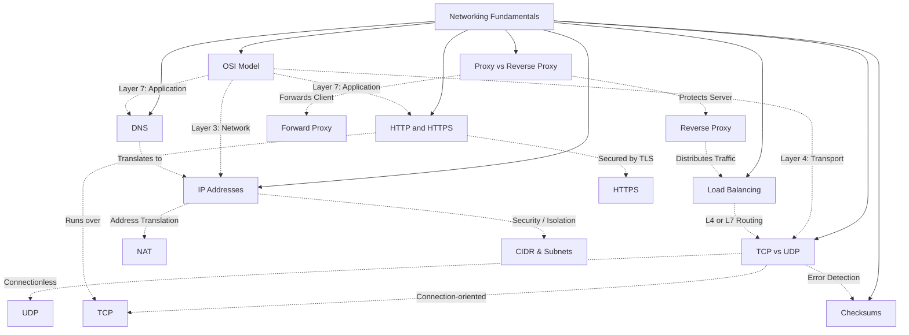

# Networking Fundamentals - Theory Super

## Global Mind Map: Networking Fundamentals



---

# 1. OSI Model

## The Problem - "The Network is Broken"
Early networks were split across vendor-specific protocols and hardware. Systems from one vendor often could not communicate with systems from another. Furthermore, when an API call fails today, saying "the network is broken" is too vague. Is it a bad cable, a routing issue, a TCP timeout, or an application error? 

## The Core Idea
The **OSI (Open Systems Interconnection) model** splits network communication into seven distinct layers, giving the industry a shared vocabulary to diagnose and separate responsibilities.

## How It Works: The 7 Layers
A common mnemonic from bottom to top is *Please Do Not Throw Sausage Pizza Away*.

### Layer 1: Physical
Moves raw bits over a physical medium (copper, fiber, radio waves).
- **Mechanism**: Optical transceivers, cable standards, signal modulation.
- **Failures**: Bad cable, weak WiFi, failing fiber module.

### Layer 2: Data Link
Turns raw bits into frames and handles delivery on a local network (Ethernet, WiFi).
- **Mechanism**: MAC addresses (48-bit, e.g., `00:1A:2B:3C:4D:5E`). Uses Switches to forward frames. Detects corrupted frames using checksums (FCS).
- **Failures**: Host cannot reach local gateway, bad VLAN config.

### Layer 3: Network
Routes traffic *between* networks. It is what lets a laptop in Mumbai reach a server in Virginia.
- **Mechanism**: IP addresses (IPv4, IPv6). Routers look at the destination IP address and forward each packet one hop closer. Uses ICMP (ping), ARP (maps IP to MAC), and BGP (global routing).
- **Failures**: Traffic cannot cross networks, bad route tables, dropped packets.

### Layer 4: Transport
Delivers data between *processes* on the host machines.
- **Mechanism**: Ports (e.g., 443 for HTTPS). Uses TCP (reliable, ordered stream) or UDP (best-effort datagrams). Handles segmentation and reassembly.
- **Failures**: Connection refused, TCP reset, firewall blocking a port.

### Layer 5: Session
Describes how communication sessions are started, kept alive, resumed, and closed. (Often handled by L7 protocols today).
- **Mechanism**: TLS session resumption, WebSocket connections.

### Layer 6: Presentation
Deals with how data is represented, compressed, and encrypted.
- **Mechanism**: Serialization (JSON, Protobuf), Compression (gzip, Brotli), Encryption (TLS 1.3).
- **Failures**: TLS handshake fails, bad certificate, bad compression CPU burn.

### Layer 7: Application
The layer your software most directly speaks.
- **Mechanism**: HTTP, DNS, SMTP, gRPC. API Gateways and Reverse Proxies operate here to route by path, inspect headers, and apply rate limits.
- **Failures**: HTTP 404/503, Auth failures, application capacity saturation.

## Encapsulation
When an application sends data, each lower layer adds its own wrapper. 
1. L7 creates HTTP request (Data).
2. L4 adds TCP header (Segment).
3. L3 adds IP header (Packet).
4. L2 adds Ethernet header/trailer (Frame).
5. L1 sends Bits.
The receiver unwraps (decapsulates) in reverse.

---

# 2. IP Addresses

## The Problem - Routing Coordinates
Routers, firewalls, and load balancers need to know exactly where to send a packet. 

## The Core Idea
An **IP Address** is a network coordinate assigned to a network interface (not a permanent user or device identity) used to route packets across the internet.

## How It Works
Every IP packet carries a Source IP and a Destination IP. Routers use longest prefix match on the destination IP to forward the packet to the next hop.

### IPv4 and CIDR
IPv4 uses 32-bit addresses (e.g., `192.168.1.0`). To manage space, networks use **CIDR** (Classless Inter-Domain Routing).
- `192.168.1.0/24`: The `/24` means the first 24 bits identify the network. The remaining 8 bits are for hosts (256 addresses).
- **Public IPs**: Globally routable on the internet (e.g., `198.51.100.20`).
- **Private IPs** (RFC 1918): Reusable inside local networks (e.g., `10.x.x.x`, `192.168.x.x`). 

### NAT (Network Address Translation)
Because public IPv4 space is exhausted, NAT rewrites packet addresses. A private host sends a packet to the internet. The NAT router replaces the private source IP (`192.168.1.10`) with its public IP (`203.0.113.5`). When the response returns, NAT maps it back.
- **Tradeoffs**: NAT breaks end-to-end connectivity, requires port forwarding for inbound traffic, and can exhaust ports/state tables under heavy load.

### IPv6
Uses 128-bit addresses (e.g., `2001:0db8::ff00:0042:8329`). No NAT is required for address conservation. IPv6 uses `/64` subnets standardly and does not use broadcast (uses multicast instead).

### Special Addresses
- `127.0.0.1` (IPv4) / `::1` (IPv6): Loopback (localhost).
- `0.0.0.0`: Binds to all interfaces on a server, or acts as the default route (`0.0.0.0/0`).
- `169.254.169.254`: Link-local metadata endpoint in cloud environments (highly sensitive).

## What Happens When it Fails
Overlapping CIDR ranges between two VPCs makes routing between them impossible without complex NAT. Relying on an IP address for user identity (e.g., rate limiting) punishes thousands of unrelated users hiding behind a single carrier-grade NAT.

---

# 3. Domain Name System (DNS)

## The Problem - Humans Can't Memorize IPs
Computers communicate using IP addresses (`104.198.32.55`), but humans use names (`google.com`).

## The Core Idea
**DNS** is the internet's phonebook. It translates human-readable domain names into machine-friendly IP addresses.

## How It Works: The Journey of a Query
1. **Browser Cache**: Checks if it recently resolved the domain.
2. **OS Cache**: Checks the operating system's local cache.
3. **Recursive Resolver**: The OS asks a resolver (like Google `8.8.8.8` or Cloudflare `1.1.1.1`) to find the IP.
4. **Root Servers**: The resolver asks one of the 13 global root servers. It points the resolver to the TLD server (e.g., the server handling `.com`).
5. **TLD Servers**: The TLD server points to the Authoritative Name Server for the specific domain (`google.com`).
6. **Authoritative Name Server**: The ultimate source of truth. It returns the exact IP address (A record).
7. **Back to Browser**: The IP is cached locally and the browser connects to the server.

### Types of Records
- **A**: Maps domain to IPv4.
- **AAAA**: Maps domain to IPv6.
- **CNAME**: Alias pointing a domain to another domain.
- **MX**: Routes emails to mail servers.
- **TXT**: Text info, often used for domain verification and security.

### Scale and Reliability
DNS uses **Anycast** routing (the same IP is advertised globally, routing you to the closest physical server) and **GeoDNS** to return different IPs based on your location. It acts as a primitive load balancer by returning multiple A records.

---

# 4. Proxy vs Reverse Proxy

## The Problem - Exposing Internal Systems
Directly exposing backend servers to the internet invites DDoS attacks, security breaches, and limits your ability to cache, load balance, or encrypt traffic centrally. Conversely, letting internal corporate laptops access the wild internet directly invites malware.

## The Core Idea
A **Proxy (Forward Proxy)** sits in front of *clients* and acts on their behalf. A **Reverse Proxy** sits in front of *servers* and acts on their behalf.

## How It Works

### Forward Proxy
- **Flow**: Client -> Proxy -> Internet.
- **Why**: Anonymity (hides client IP), Access Control (blocking bad sites for employees), Caching (saving bandwidth for a whole office).
- **Example**: Bypassing geographic restrictions on Netflix.

### Reverse Proxy
- **Flow**: Internet -> Reverse Proxy -> Backend Servers.
- **Why**: 
  - *Security*: Hides backend server IPs. Acts as a Web Application Firewall (WAF).
  - *Load Balancing*: Distributes traffic across multiple servers.
  - *Caching*: Serves static assets (images, CSS) without hitting the backend.
  - *SSL Termination*: Handles TLS encryption decryption, saving CPU cycles on backend servers.
- **Example**: Cloudflare, Nginx.

```nginx
# Example Nginx Reverse Proxy
server {
    listen 80;
    location / {
        proxy_pass http://backend_server_ip;
        proxy_set_header Host $host;
        proxy_set_header X-Real-IP $remote_addr;
    }
}
```

---

# 5. HTTP and HTTPS

## The Problem - Talking to Web Servers
Clients and servers need a standardized language to request resources and return data, along with a way to ensure that communication isn't intercepted or modified by malicious actors.

## The Core Idea
**HTTP** is the stateless request-response protocol behind APIs and websites. **HTTPS** is HTTP protected by **TLS**, adding encryption, integrity, and server authentication.

## How It Works
A request consists of a Method, Path, Headers, and Body.
### Methods & Status Codes
- **GET** (Safe, Idempotent): Read resource.
- **POST** (Not safe, Not idempotent): Create resource. (Needs idempotency keys for retries).
- **PUT** (Not safe, Idempotent): Replace resource.
- **Status Codes**: 2xx (Success), 3xx (Redirect), 4xx (Client Error - e.g., 401 Unauthorized, 429 Too Many Requests), 5xx (Server Error).

### HTTPS & TLS
HTTPS encrypts the connection. 
1. **ClientHello / ServerHello**: Negotiate encryption options.
2. **Certificate**: Server proves its identity.
3. **Key Setup (ECDHE)**: Both sides create shared keys without sending them over the wire (Forward Secrecy).
4. **Encrypted HTTP**: Traffic flows securely.

### HTTP Versions
- **HTTP/1.1**: Text-based. Reusable TCP connections. *Flaw*: Head-of-line blocking (one slow response blocks the connection).
- **HTTP/2**: Binary frames. Multiplexes multiple streams over ONE TCP connection. *Flaw*: TCP-level head-of-line blocking (if one packet drops, all streams on that TCP connection halt).
- **HTTP/3**: Runs over **QUIC (UDP)**. Streams are completely independent, fixing TCP head-of-line blocking. Allows connection migration (e.g., WiFi to Cellular without dropping).

---

# 6. TCP vs UDP

## The Problem - How to Send the Bytes
Once IP finds the machine, how do the bytes get to the specific program? If a byte drops, do we stop everything and wait for it, or just keep going?

## The Core Idea
**TCP** provides a reliable, ordered stream of bytes (waits for lost data). **UDP** fires independent datagrams (does not care if data is lost). 

## How It Works

### TCP (Transmission Control Protocol)
- **Mechanism**: Uses a 3-way handshake (`SYN` -> `SYN-ACK` -> `ACK`). Tracks bytes with Sequence Numbers. If a segment is lost, it retransmits. Uses Flow Control (receiver says "slow down") and Congestion Control (sender detects network traffic).
- **Tradeoff**: **Head-of-Line Blocking**. If packet #2 drops, packet #3 sits in a buffer until packet #2 is retransmitted. 
- **Use Cases**: HTTP, SSH, Databases (PostgreSQL). When you need perfect data.

### UDP (User Datagram Protocol)
- **Mechanism**: Connectionless. Fire and forget. 8-byte header (Ports, Length, Checksum). No ordering, no retransmission.
- **Tradeoff**: Application must handle lost packets or out-of-order data.
- **Use Cases**: DNS, Voice/Video calls, Multiplayer Games. When fresh data is better than old, perfect data.

### QUIC
Runs over UDP but adds TLS 1.3, reliability, and congestion control itself. Avoids TCP's stream-blocking issues.

---

# 7. Load Balancing

## The Problem - Crushing a Single Server
A single server will crash under heavy traffic. If you scale horizontally to 10 servers, how do you decide which server gets the next request?

## The Core Idea
**Load Balancing** distributes incoming network traffic across multiple servers so no single server is overwhelmed.

## How It Works: The Algorithms

1. **Round Robin**: Cycles through the server list sequentially.
   - *Use*: Homogeneous servers.
   - *Flaw*: Ignores server load or capacity.
2. **Weighted Round Robin**: Servers are assigned weights. (e.g., weight 5 gets 5x the traffic).
   - *Use*: Servers have different CPU/RAM capacities.
3. **Least Connections**: Sends traffic to the server with the fewest active connections.
   - *Use*: Long-lived connections where load builds up unevenly.
4. **Least Response Time**: Routes to the server answering the fastest.
   - *Use*: Minimizing latency.
5. **IP Hash**: Hashes the client's IP to assign them to a specific server deterministically.
   - *Use*: Sticky sessions (session persistence). 
   - *Flaw*: Can lead to uneven distribution if one IP sends massive traffic.

---

# 8. Checksums

## The Problem - Silent Data Corruption
A network packet gets damaged by electrical noise, or a hard drive flips a bit due to cosmic rays. The bytes don't tell the application they are broken. If the application processes corrupt data, it corrupts the database permanently.

## The Core Idea
A **Checksum** is a small value calculated from a larger piece of data, used to detect if the data was altered or corrupted in transit/storage.

## How It Works

### Types of Integrity Checks
- **Parity**: Adds bits to ensure an even/odd number of 1s. (Too weak for modern apps).
- **CRC (Cyclic Redundancy Check)**: e.g., CRC-32C. Fast math designed to catch accidental damage like burst errors or transmission noise. (Used in Ethernet frames, TCP headers).
- **Cryptographic Hashes**: e.g., SHA-256. Creates a unique fingerprint. Statistically impossible to find two files with the same hash. (Used in package managers, container images, Merkle trees).
- **HMAC / Digital Signatures**: Hashes the data *with a secret key*. Proves not just that the data is intact, but *who* sent it. (Used in Webhooks, API auth).

### End-to-End Integrity
A network checksum (L2/L4) only proves the packet survived the wire. It doesn't prove the disk didn't corrupt it months later. **End-to-End Integrity** requires calculating the hash at the producer, storing it as metadata, and verifying it upon every read.

### What to do on Mismatch
Never ignore it. A mismatch means corruption. The system must drop the packet, read from a different replica, or alert an operator.
