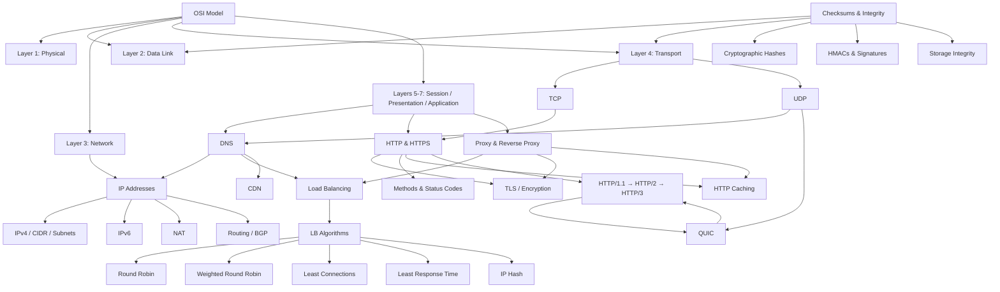
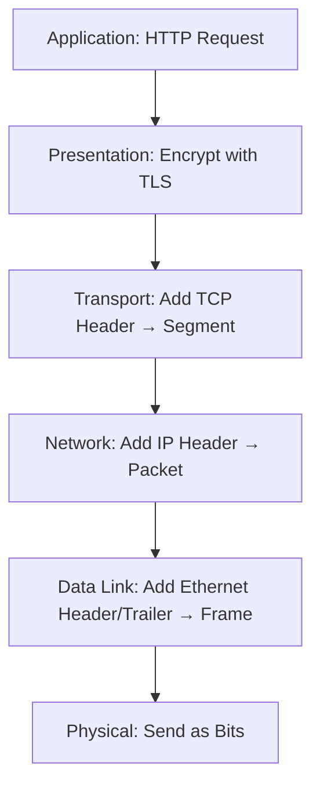
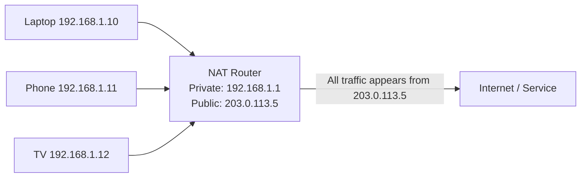
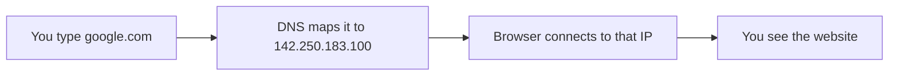
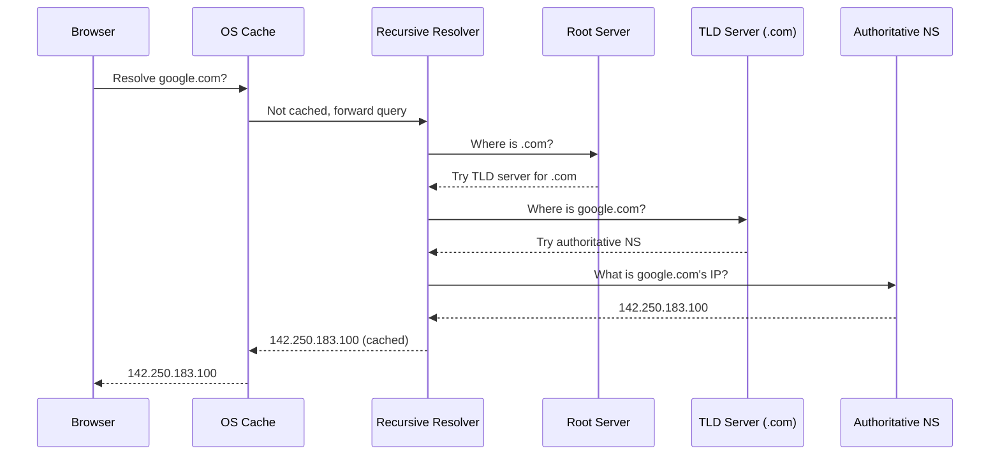
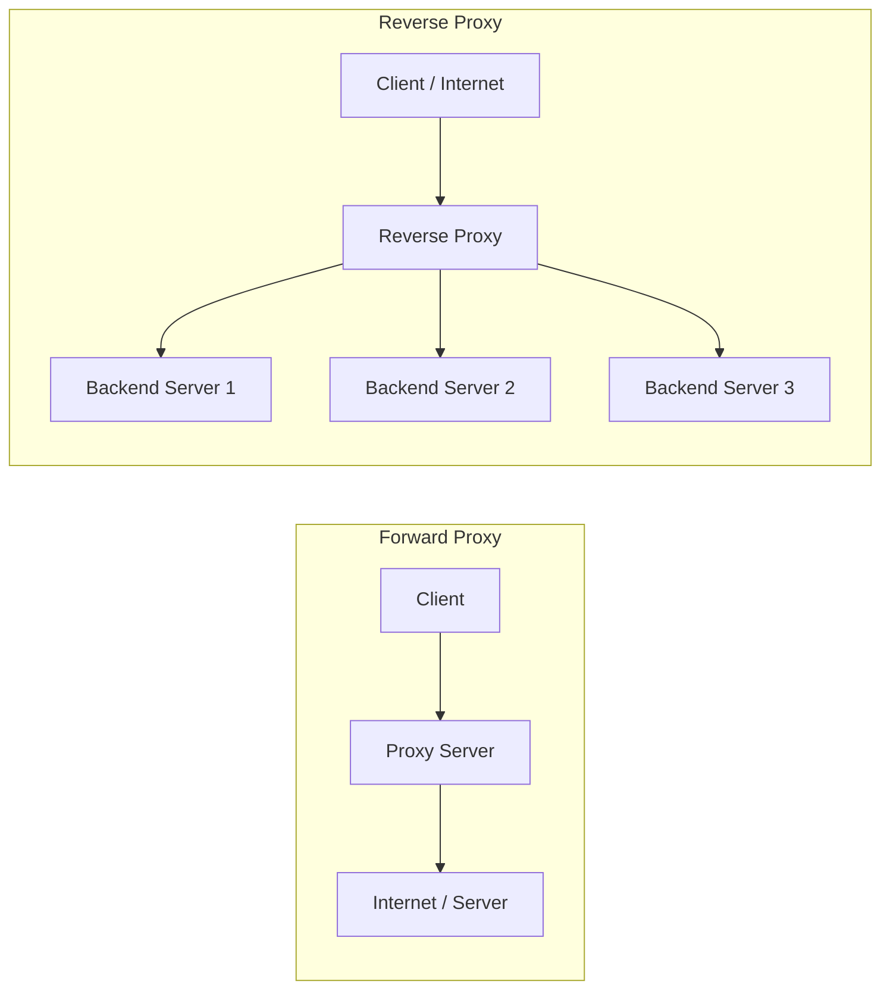
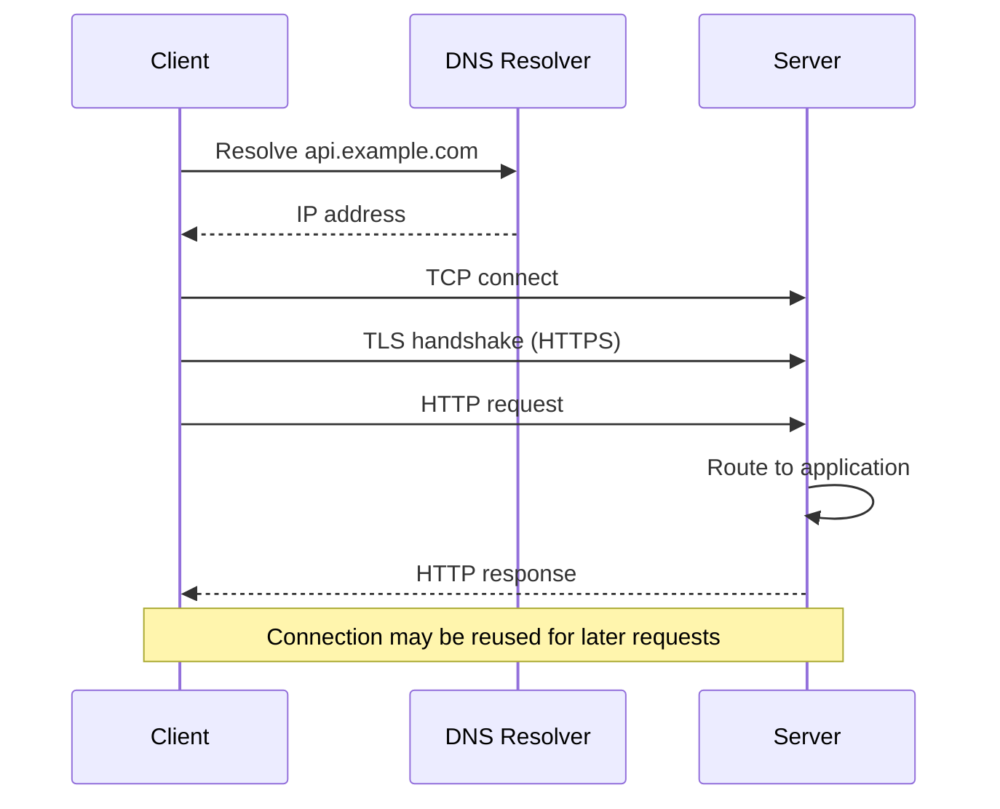
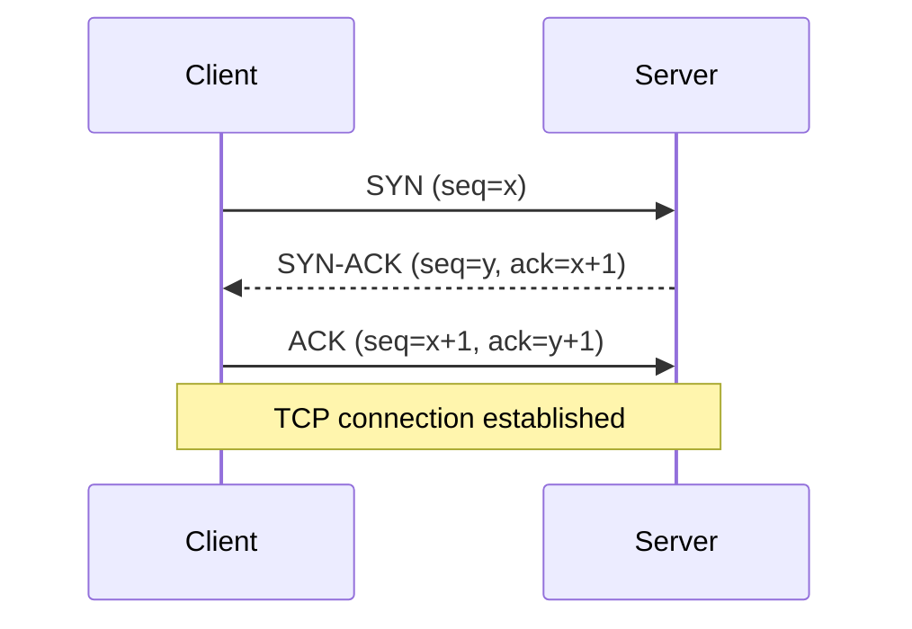
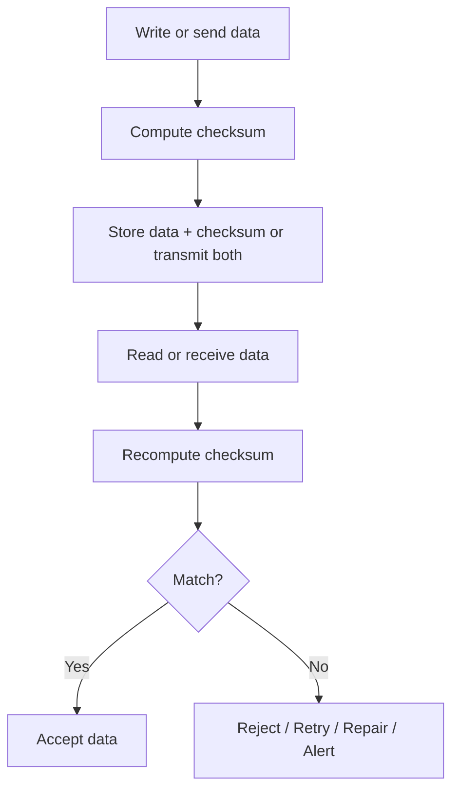

# Networking Fundamentals — Theory Super

## Global Mind Map: How Networking Concepts Connect



---

# 1. The OSI Model

## The Problem — "The Network Is Broken" Is Useless

When an engineer says "the network is broken," the next question should be: **which part?**

Early networks were split across vendor-specific protocols and hardware. Systems from one vendor often could not communicate with systems from another. There was no shared vocabulary for what each piece of networking did.

## What the OSI Model Is

The **OSI (Open Systems Interconnection) model** gives engineers a shared way to talk about network responsibilities. It splits network communication into **seven layers**, from raw electrical or radio signals all the way up to application protocols like HTTP and DNS.

ISO published the model in the 1980s as a common vocabulary for network responsibilities.

Most production systems do not implement OSI literally. The internet is usually described with the **TCP/IP model**, and modern protocols often blur neat OSI boundaries — TLS sits between application and transport, QUIC adds transport behavior on top of UDP, service meshes work at both Layer 4 and Layer 7.

**That is fine.** The OSI model is still useful because it gives **diagnostic clarity**. It turns "the network is broken" into a sharper question: is this a cable problem, a local network problem, a routing problem, a TCP problem, a TLS problem, or an application problem?

## The Seven Layers

Each layer handles one part of the job and passes the result to the next layer. A problem in a lower layer often appears as confusing behavior higher up.

A common mnemonic from bottom to top: **P**lease **D**o **N**ot **T**hrow **S**ausage **P**izza **A**way — Physical, Data Link, Network, Transport, Session, Presentation, Application.

---

### Layer 1: Physical

The Physical layer moves **raw bits** over a physical medium — electrical signals over copper, light through fiber, or radio waves for WiFi and cellular networks.

Layer 1 knows nothing about HTTP, IP addresses, ports, or files. Its job is simply to move signals well enough that the next layer can understand them.

**Layer 1 concerns:**
- Cable and connector standards
- Optical transceivers (convert electrical signals to light and back)
- Radio frequencies and signal modulation
- Signal strength and noise
- Link speed negotiation
- Bit timing and synchronization

| Medium | What to Watch | Typical Use |
|--------|---------------|-------------|
| Twisted-pair Ethernet | Cable category, length, interference, negotiated speed | Offices, racks, edge devices |
| Fiber optic | Transceiver type, wavelength, light level, connector quality | Data centers, metro links, long-haul links |
| WiFi | Signal strength, channel contention, interference, roaming | Laptops, phones, local wireless access |
| Cellular | Coverage, radio conditions, carrier NAT, variable latency | Mobile and IoT clients |

**If Layer 1 is failing, higher-layer fixes do not help.** A bad cable, failing fiber module, weak WiFi signal, or overloaded radio channel can look like random application instability until you check the link.

---

### Layer 2: Data Link

The Data Link layer turns raw bits into **frames** and handles delivery on a **local network**. Ethernet and WiFi are common examples.

Layer 2 introduces **MAC addresses**, which identify network interfaces on a local link. A MAC address is usually a 48-bit value such as `00:1A:2B:3C:4D:5E`. Older explanations often call MAC addresses permanent hardware addresses. In real systems, they can be configured, virtualized, or randomized by operating systems, hypervisors, containers, and cloud platforms.

**Layer 2 responsibilities:**
- Framing data
- Local addressing with MAC addresses
- Detecting corrupted frames using checksums such as Ethernet FCS
- Controlling access to a shared medium
- Switching frames inside a local network

**Ethernet Frame Structure:**

| Field | Size |
|-------|------|
| Preamble | 8 bytes |
| Destination MAC | 6 bytes |
| Source MAC | 6 bytes |
| EtherType | 2 bytes |
| Payload | 46–1500 bytes (typical Ethernet MTU) |
| FCS (Frame Check Sequence) | 4 bytes |

The common Layer 2 device is an **Ethernet switch**. A switch learns which MAC addresses are reachable on which ports and forwards frames accordingly. A hub, by contrast, repeats signals to every port — essentially a Layer 1 device.

| Concept | Role |
|---------|------|
| Frame | Layer 2 data unit |
| MAC address | Local link address for an interface |
| Switch | Forwards frames within a local network |
| VLAN | Separates local Layer 2 networks on shared infrastructure |
| FCS | Detects corrupted Ethernet frames |

**Layer 2 is local.** It can deliver a frame to another device on the same link or VLAN. To reach a different network, traffic needs Layer 3.

---

### Layer 3: Network

The Network layer **routes traffic between networks**. It is what lets a laptop in Mumbai reach an API server in Virginia, or a service in one cloud VPC reach a database subnet in another region.

Layer 3 uses **IP addresses**, most commonly IPv4 and IPv6. Routers look at the destination IP address and forward each packet one hop closer to its destination.

**Layer 3 responsibilities:**
- IP addressing
- Routing between networks
- Packet forwarding
- Network reachability and error reporting through ICMP
- Packet size discovery and fragmentation behavior

**MAC and IP addresses solve different problems.** A MAC address is used for local delivery on one link. An IP address is used for routing across networks. Protocols such as ARP (for IPv4) and Neighbor Discovery (for IPv6) connect those two worlds by mapping an IP address to a local-link address.

| Protocol | Purpose |
|----------|---------|
| IPv4 / IPv6 | Addressing and packet routing |
| ICMP / ICMPv6 | Error reporting and diagnostics (ping, path MTU discovery) |
| ARP | Maps IPv4 addresses to MAC addresses on a local network |
| Neighbor Discovery | IPv6 neighbor resolution and router discovery |
| OSPF / BGP | Routing protocols used to exchange reachability information |

**Be careful with "Layer 3 fragments packets."** IPv4 supports fragmentation, but relying on it is a poor design choice. IPv6 routers do not fragment packets in transit. Modern systems usually depend on **path MTU discovery** — finding the largest packet size the path can handle.

Layer 3 gets a packet to the right host or network interface. It does not know which **process** on that host should receive the data. That is Layer 4.

---

### Layer 4: Transport

The Transport layer delivers data **between processes**. Layer 4 adds **ports**, which identify the application endpoint on a host.

The combination of **protocol, source IP, source port, destination IP, and destination port** identifies a network flow.

**Layer 4 responsibilities:**
- Process-to-process delivery using ports
- Segmentation and reassembly
- Flow control
- Congestion control (depending on protocol)
- Reliability and ordering (depending on protocol)

| Feature | TCP | UDP |
|---------|-----|-----|
| Connection setup | Uses a handshake | No connection setup |
| Delivery model | Reliable, ordered byte stream | Best effort datagrams |
| Retransmission | Built in | Not built in |
| Ordering | Preserved | Not guaranteed |
| Congestion control | Built in | Application must handle it |
| Common use | HTTP/1.1, HTTP/2, databases, SSH | DNS, QUIC, real-time media, games |

**Port number ranges:**

| Range | Type | Examples |
|-------|------|----------|
| 0–1023 | Well-known | HTTP (80), HTTPS (443), SSH (22) |
| 1024–49151 | Registered | PostgreSQL (5432), MySQL (3306) |
| 49152–65535 | Dynamic / Ephemeral | Client-side connections |

Layer 4 is also where many production **load balancers** operate. A Layer 4 load balancer forwards TCP or UDP flows without understanding HTTP routes, headers, cookies, or request bodies. That makes it fast and general, but less aware of application behavior.

---

### Layer 5: Session

The Session layer describes how communication sessions are started, kept alive, resumed, and closed.

In modern internet stacks, there is rarely a separate Session-layer implementation. Session behavior is usually handled by application protocols, libraries, frameworks, or infrastructure.

Still, the concept is useful because production systems are full of **session-like state:**

| Example | Session Concern |
|---------|----------------|
| TLS | Session resumption and key lifecycle |
| WebSocket | Long-lived two-way connection |
| gRPC streaming | Stream lifecycle and cancellation |
| SIP | Voice and video session setup |
| Resumable uploads | Checkpoints and recovery after disconnects |

For system design, the important question is: **what state exists across requests or connections, and what happens when that state is lost?**

---

### Layer 6: Presentation

The Presentation layer deals with how data is **represented** before applications read it or after applications produce it — encoding, serialization, compression, and encryption.

| Function | Examples |
|----------|----------|
| Serialization | JSON, Protocol Buffers, Avro, MessagePack |
| Text encoding | UTF-8 |
| Compression | gzip, Brotli, zstd |
| Encryption | TLS 1.2, TLS 1.3 |
| Media encoding | JPEG, PNG, AV1, H.264 |

**Presentation choices have real operational consequences.** A verbose JSON payload can dominate latency on mobile networks. A badly chosen compression setting can save bandwidth but burn too much CPU. A TLS misconfiguration can break clients or weaken security. A schema change can corrupt data if producers and consumers are not rolled out carefully.

**Use current terminology:** TLS is the modern protocol. SSL is obsolete and should not be used for new systems.

---

### Layer 7: Application

The Application layer is where **application protocols define meaning** — HTTP requests, DNS queries, SMTP messages, SSH sessions, gRPC calls, Kafka protocol requests, and database wire protocols.

Layer 7 covers the protocol surface applications use to communicate. That is different from the business logic those applications implement.

| Protocol | Common Port | Purpose |
|----------|-------------|---------|
| HTTP | 80 | Web and API traffic without TLS |
| HTTPS | 443 | HTTP over TLS; also HTTP/2 and HTTP/3 |
| SSH | 22 | Secure remote access |
| SMTP | 25 | Server-to-server email transfer |
| DNS | 53 | Domain name resolution |
| PostgreSQL | 5432 | PostgreSQL database connections |
| MySQL | 3306 | MySQL database connections |

Layer 7 is where **API gateways, reverse proxies, WAFs, and service meshes** make richer decisions — route by hostname or path, enforce authentication, inspect headers, apply rate limits, terminate TLS, retry selected requests, and emit application-level metrics.

---

## Encapsulation and Decapsulation

When an application sends data, each lower layer adds its own wrapper. This is **encapsulation**.



On the receiving side, **decapsulation** happens in reverse. Each layer reads and removes the wrapper it understands, then passes the remaining data upward.

| Layer | Data Unit |
|-------|-----------|
| Application / Presentation / Session | Data |
| Transport | TCP segment or UDP datagram |
| Network | Packet |
| Data Link | Frame |
| Physical | Bits |

---

## OSI vs. TCP/IP Model

The OSI model is a reference model. The TCP/IP model is closer to how the internet is described and implemented in practice.

| OSI Layers | TCP/IP Layer | Examples |
|------------|-------------|---------|
| Application + Presentation + Session | Application | HTTP, DNS, SSH, TLS, gRPC |
| Transport | Transport | TCP, UDP, QUIC behavior over UDP |
| Network | Internet | IPv4, IPv6, ICMP |
| Data Link + Physical | Network Access | Ethernet, WiFi, fiber, cellular |

The mapping is approximate. Real protocols do not always fit perfectly into one box. ARP sits between local-link and network concerns. TLS is usually discussed near the application layer but operationally sits between application and transport. QUIC is carried inside UDP datagrams but adds reliability, congestion control, streams, and TLS 1.3.

**Layer models are useful mental models, not strict laws.**

---

## Troubleshooting by Layer

| Symptom | Likely Layer to Check | Examples |
|---------|----------------------|----------|
| Link down, no carrier, weak signal | Layer 1 | Cable, transceiver, WiFi signal, radio interference |
| Host cannot reach local gateway | Layer 2 | VLAN, switch port, MAC table, ARP |
| Traffic cannot cross networks | Layer 3 | Route tables, security groups, NACLs, BGP, ICMP, MTU |
| Connection refused or timed out | Layer 4 | Port binding, firewall, load balancer listener, TCP reset |
| TLS handshake fails | Layer 6 / Application boundary | Certificate, SNI, TLS settings, protocol version, mTLS |
| HTTP returns 401, 404, 429, or 503 | Layer 7 | Auth, routing, rate limits, internal service health |
| Request starts but stalls under load | Multiple layers | Congestion, connection pool exhaustion, head-of-line blocking |

**This layered thinking prevents expensive wrong fixes.** A team should not rewrite retry logic before checking whether a load balancer is closing idle connections. It should not tune database queries before confirming DNS, routing, and TLS are healthy.

---

## Infrastructure Choices by Layer

- A **Layer 4 load balancer** is a good fit when you need fast TCP or UDP forwarding and do not need request inspection.
- A **Layer 7 load balancer or reverse proxy** is better when routing depends on hostnames, paths, headers, authentication, or request-level policy.
- A **service mesh** often combines Layer 4 connection handling with Layer 7 policy, telemetry, retries, and mTLS.
- A **CDN** works heavily at Layer 7 but depends on DNS, routing, TLS, caching, and edge network placement.
- A **database connection pool** is an application concern, but failures often surface as Layer 4 connection exhaustion or timeouts.

---
---

# 2. IP Addresses

## The Problem — Packets Need Somewhere to Go

Routers, firewalls, load balancers, cloud networks, and DNS all need one thing before they can move a packet: **somewhere to send it.** An IP address is that "somewhere" — the network address used to decide where packets should go.

An IP address is **not** a permanent identity for a machine. It is assigned to a **network interface** — a laptop's Wi-Fi adapter, a server's network card, a VM, or a container. A laptop can have several IP addresses at once. A container can get a new one every time it starts. Thousands of users can share one public IPv4 address because of NAT. A single public IP can represent a load balancer, CDN edge, or anycast service instead of one specific server.

**In system design, treat IP addresses as routing coordinates. They are not user identity, device identity, or proof of trust.**

---

## What an IP Address Does

Every IP packet carries at least two addresses:
- **Source IP:** where the packet appears to come from.
- **Destination IP:** where the packet should be delivered.

Routers look at the destination IP, compare it with their routing table, and forward the packet to the next hop. Each router only needs to know the **next step**. It does not need to know the full path from client to server.

**MAC addresses vs IP addresses:** MAC addresses are used for local delivery on the current network link (e.g., from your laptop to your router). IP addresses are used for routing across networks. When traffic leaves your local network, the destination MAC address changes at each hop. The destination IP usually stays the same until the packet reaches the target or a device rewrites it through NAT or proxying.

IP addressing shows up constantly in backend work:
- VPC and subnet design
- Kubernetes pod and service networking
- Load balancer listeners and target groups
- Firewall rules and security groups
- Database allowlists
- DNS records
- NAT gateways and egress controls
- Private service connectivity

**If the addressing plan is wrong, systems become hard to connect, hard to secure, and painful to merge later.**

---

## IPv4

IPv4 uses **32-bit addresses**, normally written as four numbers separated by dots (e.g., `192.168.1.10`). Each number is called an **octet** and ranges from 0 to 255. A 32-bit space gives 2^32 ≈ **4.3 billion** possible addresses.

**The public IPv4 pool is exhausted.** The Internet Assigned Numbers Authority handed out its last large blocks to Regional Internet Registries in 2011. IPv4 still works because the industry stretched it with private addressing, NAT, address markets, and careful allocation.

### Historical Address Classes

Early IPv4 used **classful addressing**, where the first bits decided how large the network was.

| Class | First Octet Range | Default Mask | Historical Use |
|-------|-------------------|--------------|----------------|
| A | 1–126 | 255.0.0.0 (/8) | Very large networks |
| B | 128–191 | 255.255.0.0 (/16) | Medium networks |
| C | 192–223 | 255.255.255.0 (/24) | Small networks |
| D | 224–239 | N/A | Multicast |
| E | 240–255 | N/A | Reserved / experimental |

Classful addressing wasted large parts of the address space. A company needing 500 addresses could not fit in a Class C (254 usable), so it got a much larger Class B allocation. **Modern networks use CIDR, not classful addressing.**

---

## CIDR and Subnets

**CIDR (Classless Inter-Domain Routing)** is the standard way to describe an IP address block. The number after the slash says how many leading bits identify the network — the **prefix length**.

In `192.168.1.0/24`: the first 24 bits identify the network, the remaining 8 bits are available for addresses inside that network → 2^8 = **256 IPv4 addresses**.

For a traditional IPv4 subnet, the first address is the network address and the last is the broadcast address, leaving **254 usable** host addresses in a /24.

**Exceptions:**
- A **/32** identifies one IPv4 address — used for exact routes or firewall rules.
- A **/31** can be used for point-to-point links where a broadcast address is not needed.
- Cloud providers often reserve addresses inside each subnet.
- IPv6 does not use broadcast, so the "minus two" rule does not apply the same way.

### Common IPv4 CIDR Blocks

| CIDR | Subnet Mask | Total Addresses | Typical Use |
|------|-------------|-----------------|-------------|
| /8 | 255.0.0.0 | 16,777,216 | Very large private networks |
| /16 | 255.255.0.0 | 65,536 | VPCs, corporate networks |
| /20 | 255.255.240.0 | 4,096 | Medium subnets |
| /24 | 255.255.255.0 | 256 | Small subnets, VLANs, service ranges |
| /28 | 255.255.255.240 | 16 | Small network segments |
| /32 | 255.255.255.255 | 1 | Single host route or exact firewall match |

### Example: 10.0.0.0/20

- Prefix /20 leaves 12 host bits
- Address count: 2^12 = **4,096**
- Range: 10.0.0.0 through 10.0.15.255
- Traditional usable host range: 10.0.0.1 through 10.0.15.254

This calculation matters when designing subnets for application tiers, Kubernetes clusters, NAT gateways, and managed databases.

---

## Designing Subnets in Cloud Systems

A common starting point:

| Range | Purpose |
|-------|---------|
| 10.0.0.0/16 | VPC or virtual network |
| 10.0.0.0/20 | Public subnets across availability zones |
| 10.0.16.0/20 | Private application subnets |
| 10.0.32.0/20 | Data subnets |
| 10.0.48.0/20 | Kubernetes nodes or pods |

**Overlapping CIDR ranges are one of the most expensive cloud networking mistakes.** If two VPCs both use 10.0.0.0/16, routing between them becomes difficult or impossible without NAT, proxying, renumbering, or translation.

**Practical guidance:**
- Avoid using the same default range everywhere
- Reserve space for future environments and regions
- Keep production, staging, data, and shared services in predictable ranges
- Check existing corporate, VPN, partner, and data-center ranges before choosing cloud CIDRs
- Account for Kubernetes pod IP usage early — clusters with many pods consume addresses faster than expected
- Remember that cloud subnets may reserve provider-specific addresses

**An address plan is infrastructure architecture. Treat it that way.**

---

## Public and Private IP Addresses

### Public IP Addresses

A public IP address can be reached through the internet. They are allocated through Regional Internet Registries, ISPs, cloud providers, and network operators.

Used for: internet-facing load balancers, CDN and edge services, NAT gateways, VPN endpoints, public DNS targets, mail servers.

**Public does not mean safe.** A public IP is reachable, nothing more. Security depends on firewall rules, authentication, patching, DDoS protection, and application controls.

### Private IPv4 Addresses (RFC 1918)

| Range | CIDR | Address Count | Common Use |
|-------|------|---------------|------------|
| 10.0.0.0 – 10.255.255.255 | 10.0.0.0/8 | 16,777,216 | Cloud VPCs, large corporate networks |
| 172.16.0.0 – 172.31.255.255 | 172.16.0.0/12 | 1,048,576 | Enterprise networks, containers |
| 192.168.0.0 – 192.168.255.255 | 192.168.0.0/16 | 65,536 | Home networks, small offices, labs |

Private addresses only need to be unique inside the network where they are used.

### Carrier-Grade NAT

| Range | CIDR | Purpose |
|-------|------|---------|
| 100.64.0.0 – 100.127.255.255 | 100.64.0.0/10 | Shared address space for carrier-grade NAT |

Carrier-grade NAT lets providers place many customers behind a smaller number of public IPv4 addresses. It helps with scarcity, but makes inbound connectivity, abuse tracking, and some peer-to-peer protocols harder.

---

## NAT (Network Address Translation)

NAT rewrites packet addresses as traffic crosses a network boundary. The most common form is **source NAT for outbound traffic**.

**How it works:**
1. A private host sends a packet to the internet.
2. The NAT device replaces the private source IP with a public IP and records the mapping.
3. When the response comes back, the NAT device uses that mapping to send the response to the right internal host.



**NAT is one reason IPv4 survived address exhaustion. It is also a source of operational complexity:**
- Inbound connections require port forwarding, load balancers, VPNs, or proxies
- Logs must preserve the original client IP through headers or Proxy Protocol
- NAT tables can fill under high connection churn
- Long-lived idle connections can be dropped by NAT timeouts
- Multiple clients can share one public IP, so IP-based rate limiting can punish unrelated users
- Protocols that embed IP addresses in payloads may need special handling

In cloud systems, **NAT gateways** are common for private subnets needing outbound internet access. They are useful but become capacity, cost, and availability dependencies.

**NAT is a workaround for IPv4 scarcity. It is not a substitute for a clean addressing model.**

---

## IPv6

IPv6 uses **128-bit addresses** — a much larger address space that removes the need for NAT-based conservation.

An IPv6 address is written as eight groups of hexadecimal digits: `2001:0db8:0000:0000:0000:0000:0000:0001`

**Shortening rules:**
- Drop leading zeros in a group: `0db8` → `db8`
- Replace one consecutive run of zero groups with `::`: → `2001:db8::1`

### What Changes with IPv6

- IPv6 has **no broadcast** — uses multicast and neighbor discovery instead
- IPv6 subnets are commonly **/64**, especially for LAN-style networks
- IPv6 routers **do not split packets** in transit — hosts discover the largest packet size the path can handle
- **Link-local addresses** use `fe80::/10` and are normal in IPv6 networks
- Address assignment can use SLAAC (built-in method — hosts create their own addresses from router announcements), DHCPv6, static configuration, or cloud-provider mechanisms
- **NAT is not required** just to conserve addresses, though IPv6 firewalling is still essential

### Adoption

IPv6 is common in mobile networks, large ISPs, consumer broadband, content networks, and major cloud platforms. Adoption is uneven, so most production systems still handle both.

The usual transition model is **dual-stack** — a service supports both IPv4 and IPv6 simultaneously, publishing A records for IPv4 and AAAA records for IPv6. Dual-stack avoids a hard cutover but doubles the number of paths that can fail.

---

## Special IP Addresses

| Address or Range | Name | Purpose |
|-----------------|------|---------|
| 127.0.0.0/8 | IPv4 loopback | Traffic returns to the same host; `127.0.0.1` is the common form |
| ::1/128 | IPv6 loopback | IPv6 loopback address |
| 0.0.0.0 | Unspecified address | Used as a bind address meaning "all IPv4 interfaces," or as a placeholder source |
| :: | IPv6 unspecified | IPv6 equivalent |
| 0.0.0.0/0 | Default IPv4 route | Matches any IPv4 destination if no more specific route exists |
| ::/0 | Default IPv6 route | Matches any IPv6 destination |
| 255.255.255.255 | Limited broadcast | Broadcast on the local IPv4 network |
| 169.254.0.0/16 | IPv4 link-local | Self-assigned when DHCP fails; includes cloud metadata patterns |
| fe80::/10 | IPv6 link-local | Required for local-link IPv6 communication |
| 224.0.0.0/4 | IPv4 multicast | One-to-many delivery |
| 100.64.0.0/10 | Shared address space | Carrier-grade NAT |

**Key details:**

- **Loopback:** Traffic to `127.0.0.1` or `localhost` stays on the local machine. Goes through the local network stack but never reaches the physical network. Binding to `127.0.0.1` exposes the service only locally. Binding to `0.0.0.0` listens on all IPv4 interfaces.

- **0.0.0.0** means different things by context: as a bind address = listen on all interfaces; in a route table = default route; as a source address = no address yet assigned.

- **Link-local and metadata:** If a laptop gets `169.254.x.x`, DHCP likely failed. In cloud environments, `169.254.169.254` is the **metadata endpoint** for instances — can expose credentials, tokens, or configuration. **Treat access to metadata endpoints as security-sensitive.**

---

## How Routing Works

### Routing Tables

A routing table maps destination address ranges to next hops. Routers use **longest prefix match** — the most specific matching route wins.

If a packet for `10.0.1.25` matches both `10.0.0.0/8` and `10.0.1.0/24`, the **/24 wins** because it describes a smaller, more specific range.

### Hop-by-Hop Forwarding

IP routing is **hop by hop**. A router does not need to know the entire path. It only needs to know the next hop for the best matching route. You can inspect paths with tools such as `traceroute` or `tracepath`.

### TTL and Hop Limit

IPv4 uses a **TTL (Time to Live)** field. IPv6 uses a **Hop Limit** field. Each router decrements the value by 1. When it reaches 0, the router drops the packet and usually sends an ICMP time exceeded message. This is how `traceroute` discovers intermediate hops — it sends packets with increasing TTL values and records the routers that report expiration.

### BGP

At internet scale, routing is coordinated by **BGP (Border Gateway Protocol)**. The internet is made of many large networks (ISPs, cloud providers, CDNs, enterprises). BGP lets those networks announce which IP ranges they can reach and choose paths according to routing policy.

BGP is powerful but blunt. It does not know whether your application is healthy — only that an IP range appears reachable through a path. Route leaks, bad announcements, and accidental withdrawals can make large services unreachable.

**Example:** The October 2021 Facebook outage made Facebook, Instagram, and WhatsApp unreachable for hours because the relevant network prefixes disappeared from global routing. The failure was not an HTTP problem or a database problem. It was **reachability at the routing layer.**

---

## IP Addresses in System Design

- **Do not treat IP as identity.** Rate limiting by public IP can group many unrelated users behind one NAT. Allowlisting office IPs breaks with VPNs. Logs may show a proxy IP unless client IP forwarding is configured correctly. Containers and pods have short-lived addresses.

- **Preserve client address carefully.** Use `X-Forwarded-For`, `Forwarded`, Proxy Protocol, or cloud LB metadata. Only trust these values from infrastructure you control.

- **Plan for address exhaustion.** Watch for too-small VPC ranges, overlapping networks after mergers, Kubernetes pod address exhaustion, NAT port exhaustion.

- **Prefer names for service contracts.** Applications should depend on DNS names or service discovery names, not hard-coded IPs. IPs are implementation details. Names allow failover, migration, load balancing, certificate validation, and regional routing.

---
---

# 3. Domain Name System (DNS)

## The Problem — Humans Don't Think in Numbers

On the internet, computers communicate using IP addresses such as `104.198.32.55`. Humans are much better at remembering names like `google.com`. We can't expect users (or even systems) to memorize a string of random numbers for every service they connect to.

## What DNS Does

The **Domain Name System** acts as a translator between human-readable domain names and machine-friendly IP addresses. Without DNS, we would all be forced to type raw IP addresses into our browsers.



---

## The Journey of a DNS Query — Step by Step

When you enter a domain name in your browser, here is the full resolution path:

### Step 1: Browser Cache
The browser first checks its own cache. If it has recently resolved the domain, it uses the cached IP directly. **This is the fastest path — no extra work needed.**

### Step 2: Operating System Cache
If the browser doesn't know, it asks the operating system. The OS maintains its own local cache of recent domain lookups, shared across applications. If the record exists here, the OS returns the IP and the search is complete.

### Step 3: Recursive Resolver
If the OS doesn't have the answer, the computer sends the query to a **Recursive Resolver**. This is usually operated by your ISP or a public DNS service:

- Google DNS: `8.8.8.8`
- Cloudflare DNS: `1.1.1.1`
- OpenDNS: `208.67.222.222`

The recursive resolver's job is to do all the hard work of hunting down the correct IP address. It won't give up until it finds the answer or confirms the domain does not exist.

### Step 4: Root Servers
If the resolver doesn't have the answer cached, it starts at the very top of the internet's hierarchy: the **Root Servers**. There are only **13 sets** of root servers globally (though they are replicated in hundreds of locations for reliability).

Root servers don't know the final IP, but they know where to look next. They look at the last part of the domain (`.com` in `google.com`) and direct the resolver to the appropriate **TLD server**.

### Step 5: TLD Servers
The **Top-Level Domain** server manages all domains ending in a specific extension (`.com`, `.org`, `.gov`, `.in`, etc.). The TLD server doesn't have the final IP address either, but it knows which server is the official record-keeper for the domain. It points the resolver to that domain's **Authoritative Name Server**.

### Step 6: Authoritative Name Server
The **authoritative name server** is the **ultimate source of truth** for a specific domain. It holds the official DNS records and knows the exact IP address. It returns the actual **A record** (for IPv4) or **AAAA record** (for IPv6). It can also return other records depending on the query (MX for email, CNAME for aliases, TXT for verification).

### Step 7: Back to the Browser
The recursive resolver now has the IP address. It passes it back to the computer. The computer caches this answer so it doesn't repeat the whole process next time. The browser uses the IP to connect to the server, and the webpage begins to load. **All of this happens in milliseconds.**



---

## Types of DNS Records

| Record Type | Purpose | Example |
|-------------|---------|---------|
| A | Maps domain to IPv4 address | `google.com → 142.250.183.100` |
| AAAA | Maps domain to IPv6 address | `google.com → 2607:f8b0:4004:800::200e` |
| CNAME | Alias pointing to another domain name | `www.example.com → example.com` |
| MX | Mail exchange — where to send email | `example.com → mail.example.com` |
| TXT | Text record — used for verification, SPF, DKIM | `v=spf1 include:_spf.google.com ~all` |
| NS | Name server — which servers are authoritative | `example.com → ns1.example.com` |
| SOA | Start of Authority — admin info for the zone | Serial number, refresh intervals |
| SRV | Service location — host, port, priority | `_sip._tcp.example.com → sipserver:5060` |
| PTR | Reverse DNS — maps IP to domain name | `100.183.250.142 → google.com` |

---

## What Makes DNS Fast and Reliable

### 1. Global Anycast Networks
Root servers and public resolvers (Cloudflare, Google DNS) use **anycast routing** — the same IP address is advertised from many locations worldwide. When you send a query, it automatically goes to the nearest available server. This reduces latency and prevents your request from traveling halfway across the globe.

### 2. Redundant Authoritative Servers
Domains usually have more than one authoritative name server, spread across different regions. If one fails or becomes unreachable, another can respond. This redundancy ensures high availability and fault tolerance.

### 3. GeoDNS
Some domains use **geographic-based DNS responses**. The same domain may resolve to different IP addresses depending on where the request originates. This improves performance (routing to the closest server) or meets compliance needs (directing to a country-specific data center).

### 4. Load Balancing with DNS
DNS can return **multiple IP addresses** for a single domain. With multiple A records or CNAMEs, traffic gets distributed across several servers. This simple form of load balancing prevents any single server from being overwhelmed.

### 5. Content Delivery Networks (CDNs)
Many websites rely on CDNs. DNS queries resolve to an **edge server located near the user**, so static files (images, videos, scripts) load from the closest location, reducing latency.

---
---

# 4. Proxy vs Reverse Proxy

## The Core Distinction

A **Proxy server** (Forward Proxy) acts on behalf of **clients**. A **Reverse Proxy** acts on behalf of **servers**.



---

## Forward Proxy

A forward proxy is a server that acts **on behalf of clients** on a network. When you send a request (like opening a webpage), the proxy intercepts it, forwards it to the target server, and relays the server's response back to you. Think of it as a **middleman between a private network and the public internet**.

### How a Forward Proxy Handles a Request

1. The user types a website URL. The request is intercepted by the proxy server instead of going directly to the website.
2. The proxy examines the request to decide whether to forward it, deny it, or serve a cached copy.
3. If forwarded, the proxy contacts the target website. **The website sees only the proxy server's IP, not the user's.**
4. The target website responds. The proxy receives the response and relays it to the user.

### Benefits of Forward Proxies

- **Privacy and Anonymity:** Hides your IP address by using the proxy's own, so the destination server cannot know your real location or identity.
- **Access Control:** Organizations use proxies to enforce content restrictions and monitor internet usage.
- **Security:** Proxies can filter malicious content and block suspicious sites — an additional security layer.
- **Improved Performance:** Proxies cache frequently accessed content, reducing latency and bandwidth usage. Uses a **Time-To-Live (TTL)** value to automatically expire cached data.

### Is a VPN the Same as a Proxy?

**No.** While both hide your IP, a VPN encrypts **all** your internet traffic, making it more secure. A proxy only forwards specific requests without necessarily encrypting them.

### Real-World Applications

**Bypassing Geographic Restrictions:** Streaming services offer different content based on location. By connecting to a proxy in the US, your request to the streaming platform appears to come from the US. Example: Accessing the US Netflix library from India.

**Speed and Performance Optimization (Caching):** When a user requests cached content, the proxy serves the stored copy rather than fetching from the destination server. An organization with hundreds of employees frequently accessing the same resources can deploy a caching proxy.

---

## Reverse Proxy

A reverse proxy sits **in front of servers**, intercepting client requests and forwarding them to backend servers based on predefined rules. Instead of hiding clients from the server, it **hides servers from clients**.

Allowing direct access to servers poses security risks — exposing them to hackers and DDoS attacks. A reverse proxy creates a **single, controlled point of entry** that filters and regulates incoming traffic while keeping server IP addresses hidden. **Clients never interact directly with the backend servers.**

### How a Reverse Proxy Handles a Request

1. A user types a website URL, sending a request to the server.
2. The **reverse proxy** receives the request before it reaches the backend.
3. Based on predefined rules (load balancing, server availability), the reverse proxy forwards the request to the appropriate backend server.
4. The backend server processes the request and sends a response back to the reverse proxy.
5. The reverse proxy relays the response to the client.

### Benefits of Reverse Proxies

- **Enhanced Security:** Hides backend servers from clients, reducing the risk of direct attacks on backend infrastructure.
- **Load Balancing:** Distributes incoming requests across multiple backends, improving reliability and preventing overload.
- **Caching Static Content:** Caches static assets (images, CSS, JavaScript), reducing repeated fetching from backends.
- **SSL Termination:** Handles SSL/TLS encryption, offloading this work from backend servers.
- **Web Application Firewall (WAF):** Inspects incoming requests to detect and block malicious traffic.

### Real-World Example: Cloudflare

Cloudflare's reverse proxy provides:
- **WAF and DDoS protection** — blocks malicious traffic before it reaches origin servers
- **Global content caching** — caches static and dynamic content at over 200 data centers worldwide, storing frequently accessed files closer to users

### Setting Up a Reverse Proxy with Nginx

**Install Nginx:**
```bash
sudo apt update
sudo apt install nginx
```

**Basic Reverse Proxy Configuration:**
```nginx
server {
    listen 80;

    location / {
        proxy_pass http://backend_server_ip;
        proxy_set_header Host $host;
        proxy_set_header X-Real-IP $remote_addr;
        proxy_set_header X-Forwarded-For $proxy_add_x_forwarded_for;
    }
}
```

**Load Balancing Across Multiple Servers:**
```nginx
upstream backend_servers {
    ip_hash;
    server backend1.example.com;
    server backend2.example.com;
    server backend3.example.com;
}

server {
    listen 80;
    server_name example.com;

    location / {
        proxy_pass http://backend_servers;
        proxy_set_header Host $host;
        proxy_set_header X-Real-IP $remote_addr;
        proxy_set_header X-Forwarded-For $proxy_add_x_forwarded_for;
    }
}
```

Nginx uses **round robin by default**. To change it, add the required algorithm (e.g., `ip_hash`) in the `upstream` block.

**Test and reload:**
```bash
sudo nginx -t
sudo systemctl reload nginx
```

---

## Forward Proxy vs Reverse Proxy — Comparison

| Feature | Forward Proxy | Reverse Proxy |
|---------|---------------|---------------|
| Acts on behalf of | Clients | Servers |
| Hides | Client IP from servers | Server IP from clients |
| Position | Between clients and internet | Between internet and backend servers |
| Primary Use Cases | Privacy, access control, caching | Load balancing, security, SSL termination |
| Security Role | Filters outbound traffic | Protects backend infrastructure |
| Caching | Caches outbound requests | Caches inbound responses |
| Who configures it | Client-side / network admin | Server-side / infrastructure team |

---
---

# 5. HTTP and HTTPS

## The Problem — The Web Needs a Common Language

Almost everything a modern system does over the network uses HTTP somewhere. HTTP (Hypertext Transfer Protocol) is the **request-response protocol** behind websites, public APIs, mobile backends, and a lot of internal service-to-service calls.

**HTTPS is HTTP protected by TLS** (Transport Layer Security). TLS encrypts the connection and lets the client check that it is talking to the right server. In production, HTTPS is the normal default.

Plain HTTP is mostly limited to local development, tightly controlled internal health checks, and redirects to the HTTPS version. **Anything user-facing or security-sensitive should use HTTPS.**

The HTTP ideas stay the same across versions: methods, status codes, headers, and bodies. What changes is the transport underneath: HTTP/1.1 and HTTP/2 usually run over TCP. HTTP/3 runs over QUIC, which uses UDP.

---

## HTTP Request and Response

A typical HTTP exchange has three parts: a request line (or equivalent fields), headers, and an optional body.

The **request target** identifies the resource (e.g., `/v1/models`). Headers carry extra information (content type, authorization token). The body carries data when the method allows one (e.g., JSON for a POST).

HTTP/2 and HTTP/3 do not send the exact text format on the wire, but the same concepts remain: method, scheme, host, path, headers, status, and body.

---

## How HTTP Works — The Full Path



1. The client resolves the hostname through DNS.
2. The client opens or reuses a transport connection.
3. For HTTPS, the client and server perform a TLS handshake.
4. The client sends an HTTP request.
5. The server routes the request to application code or another internal service.
6. The server sends an HTTP response.
7. The connection may be reused for later requests.

This simple flow often hides many production components: CDNs, WAFs, API gateways, reverse proxies, service meshes, load balancers, sidecars, and application servers. Those components can read or change HTTP headers only after the traffic has been decrypted — that point is called **TLS termination**.

### Stateless Protocol, Stateful Systems

HTTP is **stateless at the protocol level** — each request should carry enough information for the server to understand it. But real systems keep state in cookies, session stores, OAuth tokens, JWTs, CSRF tokens, server-side caches, and databases.

**The important design question:** where does the state live, and what happens if a request is retried, routed to another server, or finishes after the client has timed out?

---

## Methods and Status Codes

### HTTP Methods

| Method | Common Use | Safe | Idempotent |
|--------|-----------|------|------------|
| GET | Read a resource | Yes | Yes |
| HEAD | Read response headers only | Yes | Yes |
| POST | Create a resource or start a command | No | No by default |
| PUT | Replace or create a resource at a known URL | No | Yes |
| PATCH | Partially update a resource | No | Not guaranteed |
| DELETE | Delete a resource | No | Yes |

**Safe** means the client is asking to read, not change, server state. **Idempotent** means repeating the same request should have the same intended effect as sending it once.

**Idempotency is not trivia.** It decides whether clients can safely retry after timeouts, connection resets, and load balancer failures. `POST /payments` should usually require an **idempotency key**. `GET /orders/123` should not change state.

### HTTP Status Codes

| Range | Meaning | Examples |
|-------|---------|----------|
| 1xx | Informational | 100 Continue, 103 Early Hints |
| 2xx | Success | 200 OK, 201 Created, 204 No Content |
| 3xx | Redirect | 301 Moved Permanently, 302 Found, 304 Not Modified |
| 4xx | Client-side problem | 400 Bad Request, 401 Unauthorized, 403 Forbidden, 404 Not Found, 409 Conflict, 429 Too Many Requests |
| 5xx | Server-side problem | 500 Internal Server Error, 502 Bad Gateway, 503 Service Unavailable, 504 Gateway Timeout |

Use status codes as part of the API contract. A vague 500 for validation errors forces clients to guess. A 200 with an error object confuses caches, metrics, SDKs, and retry policies.

---

## Caching and Conditional Requests

HTTP has mature caching rules. Used well, caching makes systems faster, reduces load, lowers cost, and can keep users working during partial failures.

| Header | Purpose |
|--------|---------|
| Cache-Control | Defines who may cache and for how long |
| ETag | Version-like value for a cached response |
| If-None-Match | Client asks whether an ETag is still current |
| Last-Modified | Timestamp to check whether content changed |
| Vary | Tells caches which request headers affect the response |
| Content-Encoding | Indicates compression (gzip, br, zstd) |

**Caching is not only for browsers.** CDNs, API gateways, package registries, feature stores, model metadata endpoints, and documentation sites all benefit from correct cache headers.

For personalized or sensitive responses, be explicit: use `Cache-Control: private` or `no-store`.

---

## What HTTPS Adds

HTTPS is HTTP over TLS. **TLS provides three main protections:**

1. **Confidentiality:** People or systems in the middle cannot read the protected HTTP data.
2. **Integrity:** People or systems in the middle cannot change protected traffic without being detected.
3. **Server authentication:** The client can check that the server is allowed to use the hostname.

**HTTPS does NOT solve:**
- It does not authenticate the user (application must add authentication)
- It does not make a vulnerable API safe
- It does not hide the destination IP address
- It may still expose the hostname through DNS and SNI
- It does not prevent a compromised endpoint from reading data

**HTTPS is the baseline expectation.** Browsers warn on plain HTTP. Many platform features require a secure context.

---

## How TLS Works

The secure connection in HTTPS starts with a **TLS handshake** — the setup conversation where client and server agree on how to protect the connection.

**TLS 1.3 handshake steps:**

1. **ClientHello:** The client says which TLS versions and encryption options it supports. Also sends SNI and ALPN.
2. **ServerHello:** The server chooses the shared settings for this connection.
3. **Certificate:** The server sends certificates proving it is allowed to serve the hostname.
4. **Certificate verification:** The client checks hostname, expiration date, signatures, and trusted certificate authority chain.
5. **Key setup:** Both sides create shared encryption keys without sending the final keys over the network.
6. **Encrypted HTTP:** HTTP requests and responses flow through the encrypted connection.

Modern TLS uses **temporary key exchange (commonly ECDHE)**. The practical benefit is **forward secrecy**: even if a server's long-term private key is stolen later, old recorded connections should still be hard to decrypt.

TLS also uses **ALPN** (Application-Layer Protocol Negotiation) so client and server can agree on the application protocol (`http/1.1` or `h2`). HTTP/3 uses QUIC, where TLS 1.3 is built into the QUIC handshake.

### 0-RTT

TLS 1.3 and QUIC can support **0-RTT data** for repeat connections — the client sends data very early, reducing latency. The tradeoff is **replay risk**: an attacker may replay that early data. Use 0-RTT only for operations that are safe to repeat (idempotent reads).

---

## HTTP vs HTTPS

| Feature | HTTP | HTTPS |
|---------|------|-------|
| Protection | Plaintext | Encrypted with TLS |
| Common Port | 80 | 443 |
| Server Authentication | None by default | Certificate-based hostname verification |
| Tamper Resistance | None | Protected by TLS |
| Browser Treatment | Marked insecure | Required for most production features |
| Production Use | Redirects, local development | Default for web apps, APIs, mobile backends |

**Do not choose plain HTTP for performance.** TLS overhead is usually small compared with application work, database calls, network distance, and payload size.

---

## HTTP Versions

### HTTP/1.1

Made reusable connections the default. Added important behavior around hostnames, caching, content negotiation, range requests, and transfer encodings.

**Weakness:** Limited concurrency. A single connection handles responses in order — one slow response holds up later responses (**head-of-line blocking**). Clients often open multiple connections to work around this.

### HTTP/2

Keeps the same HTTP meaning but changes the wire format to **binary frames**. Adds:
- Multiple streams over one TCP connection
- Header compression with **HPACK**
- Stream priorities
- Better connection reuse

HTTP/2 reduces head-of-line blocking at the HTTP layer. **But it does not remove TCP-level head-of-line blocking.** If one TCP segment is lost, all streams on that TCP connection may wait until the missing bytes are recovered.

HTTP/2 server push has been removed or disabled in major browsers. Do not design new systems around it.

### HTTP/3

Keeps the same HTTP meaning but runs over **QUIC** instead of TCP. QUIC runs over UDP and includes TLS 1.3, multiple streams, loss recovery, flow control, congestion control, and **connection migration** (a connection can survive network changes, e.g., mobile client moving from Wi-Fi to cellular).

HTTP/3 helps with:
- Reducing TCP-level head-of-line blocking between streams
- Faster connection setup
- Better behavior when mobile clients change networks

HTTP/3 is not automatically faster for every workload. Some networks block or degrade UDP.

| Version | Transport | Wire Format | Main Benefit | Main Caveat |
|---------|-----------|-------------|-------------|-------------|
| HTTP/1.1 | TCP | Textual messages | Universal support, simple debugging | Limited concurrency per connection |
| HTTP/2 | TCP | Binary frames | Multiple streams and header compression | TCP-level head-of-line blocking |
| HTTP/3 | QUIC over UDP | Binary HTTP/3 frames over QUIC | Stream-level recovery, connection migration | UDP reachability, operational complexity |

---

## HTTP in Distributed Systems

### Timeouts
Every HTTP client should set timeouts for each stage: DNS lookup, connection setup, TLS handshake, writing the request, and waiting for response headers. Also set an overall deadline and an idle timeout for connection pools. **The defaults in many libraries are unsafe for production.**

### Retries
Retries should respect HTTP method behavior and application idempotency. Retrying a GET is usually safe. Retrying a POST can create duplicates unless the API supports idempotency keys. Use **bounded retries, backoff, jitter, deadlines, and clear retry budgets**. Jitter means adding randomness so many clients do not retry at the exact same time.

### Streaming
HTTP is not only for short JSON responses. Streaming is common: Server-Sent Events for token streaming, chunked HTTP responses, WebSockets for two-way communication, gRPC streaming over HTTP/2, and HTTP/3 streams over QUIC.

### Proxies and Headers
Most production requests pass through proxies or load balancers. Handle forwarded request information carefully: `Host`, `X-Forwarded-For`, `X-Forwarded-Proto`, `Forwarded`, `X-Request-ID`, `Authorization`. **Only trust forwarding headers from infrastructure you control.**

### Observability
HTTP gives excellent operational signals: request rate, latency percentiles, status code distribution, retry rate, payload size, TLS handshake failures, cache hit ratio, time to first byte, stream duration. **Break these down by route, method, status class, client, region, and internal service. Averages hide the failures users actually feel.**

---
---

# 6. TCP vs UDP

## The Problem — Getting Data to the Right Program

Every networked application has to move data from one program to another. Most of that data moves through one of two transport protocols: **TCP** or **UDP**.

Both sit above IP. IP gets packets to the right machine. TCP and UDP help get the data to the right program on that machine by using **ports**.

The difference is in what help they provide:
- **TCP** gives you a **reliable, ordered stream of bytes**.
- **UDP** gives you small **independent messages called datagrams**, but does not promise delivery or order.

**The real design question: What should the application do when data is lost, late, duplicated, or arrives out of order?**

---

## TCP (Transmission Control Protocol)

TCP is **connection-oriented**. Before normal application data flows, the client and server first agree to open a connection. After that, TCP gives the application a **stream of bytes**.

**TCP is a stream, not a message protocol.** If an application writes three messages, the receiver may read them as one combined chunk, three chunks, or several partial chunks. TCP keeps the bytes in order, but it does not remember your message boundaries. The application protocol must define where one message ends and the next begins (using length prefixes, delimiters, or structured formats).

### What TCP Provides

- **Connection setup:** A three-way handshake opens the connection and agrees on sequence numbers.
- **Ordered delivery:** Bytes are delivered to the application in sequence.
- **Retransmission:** Lost segments are resent.
- **Duplicate suppression:** Duplicate data detected through sequence numbers.
- **Flow control:** The receiver advertises how much data it can accept.
- **Congestion control:** The sender adjusts its rate to avoid overloading the network.
- **Backpressure:** A slow receiver or congested path eventually slows the sender.

**TCP does not guarantee that a business operation succeeded.** It only guarantees reliable, ordered delivery of bytes while the connection stays healthy. If a server commits a database transaction but the connection breaks before the client receives the response, the client does not know what happened. That is why real systems still need **timeouts, retries, idempotency keys, and duplicate handling**.

### Three-Way Handshake



1. **SYN:** The client asks to open a connection and sends an initial sequence number.
2. **SYN-ACK:** The server acknowledges the client sequence number and sends its own.
3. **ACK:** The client acknowledges the server sequence number.

The handshake costs **at least one round trip** before application data flows. Systems reduce that cost with connection reuse, TLS 1.3, TCP Fast Open, or QUIC.

### Data Transfer

During transfer, TCP tracks byte positions with **sequence numbers**. The receiver confirms what it has received. If something is missing, the sender sends it again.

**Head-of-line blocking:** If one TCP segment is lost, later bytes may already be in the receiver's buffer. But the application cannot receive those later bytes until the missing earlier bytes arrive. For many systems (SQL results, HTTP response bodies, file downloads), that waiting is exactly what you want — the data is useless if bytes are missing or out of order.

### Connection Close

TCP connections can close:
- **Gracefully** with FIN packets (each side finishes sending bytes)
- **Abruptly** with RST packets (connection torn down immediately)

A graceful close means each side finished sending. **It does not mean the business operation succeeded.**

### Where TCP Fits

HTTP/1.1 and HTTP/2, traditional HTTPS, SSH, SMTP/IMAP, database connections (PostgreSQL, MySQL), most internal RPC (standard gRPC over HTTP/2), message brokers requiring ordered byte streams.

**For request-response APIs, admin tools, database protocols, and most service-to-service calls, TCP is still the boring and correct choice.**

---

## UDP (User Datagram Protocol)

UDP is **connectionless**. It sends independent datagrams without opening a transport connection first. UDP does not provide reliable delivery, ordering, retransmission, flow control, or congestion control by itself.

A UDP datagram may arrive, arrive late, arrive twice, arrive out of order, or **never arrive**. That tradeoff is intentional. **For real-time systems, waiting for old data can be worse than dropping it and moving on.**

### What UDP Provides

- **Ports:** Source and destination program identifiers.
- **Datagram boundaries:** One send maps to one datagram at the UDP layer.
- **Length:** The receiver knows the datagram size.
- **Checksum:** Corruption detection. Mandatory in IPv6, optional in IPv4 (commonly used).
- **No connection setup:** The sender can transmit immediately.

**UDP's header is 8 bytes. TCP's base header is 20 bytes** before options. But the bigger difference is behavior: UDP does not make the sender wait for acknowledgments.

### How UDP Works

An application creates a datagram and sends it to a destination IP and port. If a program is listening there and the network delivers it, the receiver can process it. If the datagram is lost, UDP does not recover it.

**Applications that use UDP responsibly usually add the pieces they need:**
- Sequence numbers to detect loss or reordering
- Timestamps to discard stale data
- Application-level acknowledgments for important messages
- Forward error correction for media
- Rate control so they don't flood the network
- Encryption through DTLS, SRTP, or QUIC

**UDP is not permission to ignore the network.** A high-volume UDP system that sends faster than the network can carry will cause packet loss, hurt other traffic, and usually hurt itself too.

### Where UDP Fits

DNS queries, real-time voice and video, online games, WebRTC media, QUIC and HTTP/3, service discovery and local network protocols, telemetry where occasional loss is acceptable.

---

## TCP vs UDP — Full Comparison

| Feature | TCP | UDP |
|---------|-----|-----|
| Basic model | Ordered byte stream | Independent datagrams |
| Connection setup | Three-way handshake | No transport handshake |
| Reliability | Retransmits lost data while connection is healthy | No built-in retransmission |
| Ordering | Delivers bytes in order | No ordering guarantee |
| Message boundaries | Not preserved | Preserved per datagram |
| Flow control | Built in | Not built in |
| Congestion control | Built in | Not built in |
| Head-of-line blocking | Yes, within the TCP stream | Not at UDP layer |
| Header size | 20 bytes (base) | 8 bytes |
| Typical protocols | HTTP/1.1, HTTP/2, SSH, databases, SMTP | DNS, QUIC, WebRTC media, games |

**The simplest rule:**
- Use **TCP** when the application needs a complete ordered stream.
- Use **UDP** when the application can tolerate some loss, needs low-latency datagrams, or uses a protocol like QUIC that adds reliability on top.

**Avoid the shortcut "TCP is slow and UDP is fast."** TCP can be very fast on healthy networks. UDP can perform badly if the application handles packet loss, pacing, or packet size poorly.

---

## QUIC and HTTP/3

**QUIC** is a transport protocol that runs inside UDP datagrams. Originally developed at Google, later standardized by IETF. **HTTP/3 is HTTP running over QUIC.**

QUIC uses UDP because UDP is already supported by most networks. It also lets QUIC implement its own rules for reliability, ordering, and congestion control instead of depending on the OS TCP stack.

### What QUIC Provides

- Connection setup with built-in TLS 1.3
- Encryption by default
- Reliability and retransmission
- Congestion control
- Flow control
- Multiplexed streams
- **Connection migration** when a client changes networks

### Why QUIC Helps

In HTTP/2 over TCP, many streams share one TCP connection. If one TCP segment is lost, all streams behind that missing byte can be blocked at the TCP layer. **QUIC has independent streams**, so loss on one stream does not block unrelated streams.

QUIC is not always better. Some networks block or degrade UDP. Teams need monitoring, fallback to TCP-based HTTP, and careful rollout.

---

## Choosing Between TCP, UDP, and QUIC

| Choose... | When... |
|-----------|---------|
| **TCP** | Every byte matters, data must be in order, using HTTP/1.1, HTTP/2, SSH, databases, gRPC. Most day-to-day backend traffic. |
| **UDP** | Fresh data > complete old data, can tolerate loss, using existing UDP-based protocol. Real-time voice/video, game state, DNS, local discovery, telemetry. |
| **QUIC / HTTP/3** | Want HTTP over modern encrypted transport, connection setup time matters, clients move between networks, many streams suffer from TCP head-of-line blocking. |

---

## Production Design Considerations

### Timeouts and Retries
TCP resends missing bytes but does not retry application operations. APIs that change state need **idempotency keys, request IDs, deduplication, or clear retry rules**. For UDP systems, retry behavior must be designed by the application.

### Packet Size and MTU
**MTU = the largest packet size a network path can carry without splitting.** Large packets are more likely to be split or dropped. Fragmentation is especially painful for UDP — losing one fragment loses the whole datagram. Keep UDP datagrams comfortably below common path MTUs. Do not assume jumbo frames outside controlled networks.

### Load Balancing
TCP load balancers assign a connection to a backend and keep it stable. UDP is trickier — no real connection at the transport layer. QUIC has **connection IDs** that help keep connections together even when client IP or port changes.

### Monitoring
- **TCP signals:** connection counts, resets, retransmits, SYN backlog, accept queue, connection duration
- **UDP signals:** datagrams sent/received, estimated loss, jitter, reordering, application-level acknowledgments, dropped packets at socket buffers
- **QUIC/HTTP/3:** handshake failures, fallback rates, stream resets, congestion metrics, UDP reachability

### Security
Neither TCP nor UDP automatically makes an application secure. TCP applications use TLS. UDP applications can use DTLS, SRTP, WireGuard-style protocols, or QUIC's built-in TLS 1.3. **UDP services need care around spoofing and amplification attacks** — enforce rate limits and validate clients before sending large responses.

---
---

# 7. Load Balancing Algorithms

## The Problem — One Server Is Not Enough

Load balancing is the process of distributing incoming network traffic across multiple servers to ensure no single server is overwhelmed. It aims to:
- Prevent overload on a single server
- Enhance performance by reducing response times
- Improve availability by rerouting traffic in case of server failures

Choosing the right load balancing algorithm depends on server capabilities, workload distribution, and performance requirements.

---

## Algorithm 1: Round Robin

**How it works:**
1. A request is sent to the first server in the list.
2. The next request goes to the second server, and so on.
3. After the last server, the algorithm loops back to the first.

**When to use:** When all servers have similar processing capabilities and equal capacity.

| Pros | Cons |
|------|------|
| Simple to implement and understand | Does not consider server load or response time |
| Ensures even distribution of traffic | Inefficient if servers have different capabilities |

---

## Algorithm 2: Weighted Round Robin

**How it works:** Each server is assigned a **weight** based on processing power or available resources. Servers with higher weights receive a proportionally larger share of incoming requests.

**Example:** If weights are `[5, 1, 1]`, Server 1 will be selected 5 times more often than Server 2 or Server 3.

**When to use:** When servers have different processing capabilities or available resources.

| Pros | Cons |
|------|------|
| Balances load according to server capacity | More complex than simple Round Robin |
| More efficient use of server resources | Does not consider current server load |

---

## Algorithm 3: Least Connections

**How it works:** Monitors the number of active connections on each server. Assigns incoming requests to the server with the **fewest active connections**.

**When to use:** When servers have similar capabilities but may have different levels of concurrent connections.

| Pros | Cons |
|------|------|
| Dynamically balances based on current load | May not be optimal with different server capabilities |
| Prevents any server from being overloaded | Requires tracking active connections per server |

The `release_connection()` method is called when a connection is closed, decrementing the count for that server.

---

## Algorithm 4: Least Response Time

**How it works:** Monitors the response time of each server. Assigns incoming requests to the server with the **fastest response time**.

**When to use:** When servers have varying response times and you want to route to the fastest.

| Pros | Cons |
|------|------|
| Minimizes overall latency | Requires accurate measurement of response times |
| Adapts dynamically to changing server performance | May not consider other factors (load, connections) |
| Improves user experience | |

---

## Algorithm 5: IP Hash

**How it works:** Calculates a **hash value from the client's IP address** and uses it to determine which server receives the request.

**When to use:** When you need **session persistence** (sticky sessions) — requests from the same client are always directed to the same server.

| Pros | Cons |
|------|------|
| Simple to implement | Uneven load if certain IPs generate more traffic |
| Useful for applications requiring sticky sessions | Lacks flexibility if a server goes down |

---

## Algorithm Comparison Summary

| Algorithm | Distribution | Considers Load? | Session Persistence | Best For |
|-----------|-------------|-----------------|---------------------|----------|
| Round Robin | Even, cyclic | No | No | Homogeneous servers |
| Weighted Round Robin | Proportional to weights | No | No | Heterogeneous server capacities |
| Least Connections | Dynamic, real-time | Yes (connections) | No | Varying workloads |
| Least Response Time | Dynamic, real-time | Yes (latency) | No | Environments with varying server performance |
| IP Hash | Hash-based | No | Yes | Stateful applications |

---
---

# 8. Checksums and Data Integrity

## The Problem — Bytes Lie

Data does not always arrive exactly the way it was sent. A network packet can get damaged, a disk can return an old block, or a download can stop halfway through. **The tricky part is that the bytes usually do not announce "I am broken."**

## What a Checksum Is

A checksum is a **small value calculated from a larger piece of data**. Later, another part of the system calculates the value again and compares the two results.

**Example:** A storage system may store:
```
object: product-image.jpg
checksum: crc32c = 0x7f9c2ba4
```

When the object is read back, the system calculates crc32c again over the bytes it received. If the new value is different, the system knows the object changed somehow — corrupted, cut short, mixed with the wrong bytes, or damaged.

A checksum is useful because it is **much smaller than the data**. A 4-byte CRC can protect a network frame. A 32-byte SHA-256 digest can identify a file that is many gigabytes large.

Because the checksum is smaller than the data, two different inputs can sometimes produce the same checksum (**collision**). Good algorithms make accidental missed corruption extremely unlikely.

---

## What Checksums Can and Cannot Tell You

Checksums answer a narrow question: **Do these bytes match the bytes I expected, according to this algorithm?**

**Useful for detecting:**
- Bit flips
- Truncated writes
- Partial reads
- Wrong block reads
- Corrupted network frames
- Damaged files
- Bad disk sectors
- Memory or DMA corruption
- Replication or backup transfer errors

**They do NOT answer:**
- Who created the data?
- Was the checksum itself tampered with?
- Is this data authorized?
- Is the algorithm secure against an attacker?

**If an attacker can change both the file and the checksum, a plain checksum does not protect you.** When people may be tampering, use: HMACs, digital signatures, signed manifests, TLS, package signatures, or another trusted verification mechanism.

---

## Verification Flow



**What happens after a mismatch depends on where it was found:**
- A network card may drop the frame and rely on a higher layer to retransmit
- TCP may discard a bad segment — the sender resends when it notices data is missing
- A storage engine may read another replica
- An object store may fail the request and return a data-integrity error
- A backup system may mark the backup as unusable
- A database may stop startup rather than replay a corrupt page

**Checksums detect corruption. They do not repair it.** Recovery needs another mechanism: retransmission, another replica, backup restore, repair job, or manual intervention.

---

## Types of Integrity Checks

### Parity
A parity bit records whether a group of bits contains an even or odd number of 1 bits. Can detect any single-bit error. Cannot detect many multi-bit errors. Simple and cheap, but too weak for most application-level integrity checks.

### Simple Additive Checksums
Add bytes or words together and store part of the result. Fast and easy, but weak — may miss reordered bytes or error patterns that cancel each other out. Use only when an existing protocol requires them.

### CRC (Cyclic Redundancy Check)
A family of fast checks used heavily in networking and storage. CRCs are designed to catch **common patterns of accidental damage** — especially good at catching burst errors, bit flips, and transmission noise.

**Common CRC variants:**
- CRC-32
- CRC-32C
- CRC-64

**CRC-32C** is widely used in storage and networking because it catches common errors well and many CPUs can compute it quickly in **hardware**.

**CRC is not a cryptographic algorithm.** An attacker can deliberately modify data and compute a new CRC.

### Cryptographic Hashes
Produce a fixed-size digest (e.g., SHA-256 = 32 bytes). Designed so that attackers cannot realistically find another input with the same digest or work backward from digest to original input.

**Common algorithms:** SHA-256, SHA-384, SHA-512, BLAKE3

**Useful for:**
- Verifying downloads
- Identifying content by digest
- Avoiding duplicate storage for immutable blobs
- Building Merkle trees
- Verifying container images and package files
- Comparing large files without reading them repeatedly

**MD5 and SHA-1 should not be used when security matters** because attackers can create collisions in practice.

### HMACs and Digital Signatures

If you need to prove that data came from a **trusted party** and was not modified, a plain checksum or hash is not enough.

| Mechanism | How It Works | Who Can Verify | Who Can Create |
|-----------|-------------|---------------|----------------|
| **HMAC** | Uses one shared secret key. Sender calculates a tag from data + key. | Anyone with the shared key | Anyone with the shared key |
| **Digital Signature** | Signer uses private key. Verifiers use matching public key. | Anyone with the public key | Only the private key holder |

**HMAC** is good for two parties that already trust each other (e.g., webhook provider and receiving backend). Proves data came from someone holding the shared secret, but doesn't prove *which* holder.

**Digital signature** lets one publisher sign a software release and millions of people verify it safely. The cost is key management: verifiers must trust that the public key really belongs to the publisher.

**Examples:** signed package repositories, signed container images, webhook signatures, API request signatures, software update manifests.

---

## Algorithm Comparison

| Mechanism | Good For | Not Good For |
|-----------|---------|-------------|
| Parity | Very cheap single-bit error detection | Multi-bit corruption, files, deliberate tampering |
| Additive checksum | Simple protocol checks | Strong error detection or security |
| CRC-32 / CRC-32C | Accidental corruption in frames, blocks, files | Malicious tampering |
| SHA-256 | Strong content digest and file verification | Proving who produced the digest |
| HMAC | Integrity and authenticity with a shared secret | Public verification without sharing the secret |
| Digital signature | Proving data came from a trusted signer | Very high-throughput per-packet checks |

**The common mistake is choosing a tool that solves a different problem.** A CRC is excellent for detecting disk corruption but wrong for verifying software from an untrusted mirror.

---

## Where Checksums Are Used

### Networking
- Ethernet frames include a **Frame Check Sequence (FCS)** — commonly a CRC. Damaged frames are discarded.
- IPv4 has a checksum for its header. **IPv6 removed the IP-layer checksum** and relies on lower and higher layers.
- TCP and UDP have checksums covering header, payload, and some IP information. Catches accidental damage, not attacks. Stronger protection comes from TLS, QUIC, IPsec, or application-level signatures.

### Storage Systems
Used to detect corruption during storage and movement: disk blocks, filesystem blocks, database pages, write-ahead logs, object storage parts, backup chunks, recovery fragments. Modern storage systems often keep checksums in **metadata** instead of trusting the data block alone.

### Databases
Use checksums on pages and logs to detect torn writes, disk corruption, and bad replication data. If a checksum fails, the database should NOT pretend the page is valid — read from a replica, restore from backup, stop the process, or mark the page corrupt.

### Object Storage and Uploads
Object stores let clients send a checksum with an upload. The service calculates its own and rejects the object if values differ. For multipart uploads, provider-specific ETags are not always a simple MD5. **Use the provider's documented checksum fields.**

### Package and Artifact Distribution
Package managers, container registries, and release systems use cryptographic hashes to identify released files. **The digest only helps if the expected value comes from somewhere you trust** — a signed release manifest, package index, transparency log, or secure website.

### Distributed Systems
- Replication systems compare checksums for log segments
- Replica repair uses hashes or **Merkle trees** to find ranges that differ
- Content-addressable storage names data by digest
- Deduplication systems avoid storing identical chunks twice
- Backup systems verify that restored data matches what was written

**At this layer, checksums become a design tool for finding differences cheaply.**

---

## End-to-End Integrity

A common mistake is assuming a checksum at one layer protects the whole system. **It does not.**

A network frame checksum shows that one frame arrived intact on one link. It does not prove that the application wrote the right object, that a proxy returned the right file, or that storage kept the block intact months later.

**For important data, use end-to-end integrity:**
1. Compute a checksum or digest at the producer.
2. Store it with trusted metadata.
3. Verify after every important boundary: upload, replication, storage, restore, and download.
4. Repair from another copy when verification fails.

Corruption can happen in many places: client memory, network cards, kernel buffers, disks, SSD firmware, replication jobs, compaction, backup pipelines, or restore tooling.

---

## Checksums vs Encryption

| Concept | What It Does |
|---------|-------------|
| Checksum / Hash | **Detects changes** — does NOT hide anything |
| Encryption | **Hides content** from parties without the key |

Modern secure protocols often provide both. But the ideas are different.

**In practice:**
- Use CRCs for fast accidental corruption detection
- Use SHA-256 for content identity
- Use HMACs or signatures when you need to prove who produced the data
- Use TLS for protected communication
- Use encryption at rest when stored data must stay private

---

## Design Considerations

### Choose the Right Granularity
Checksumming an entire 10 GB object tells you something is wrong but not which part. Checksumming 4 MB chunks lets you retry or repair only the damaged chunk. Smaller chunks = more precise repair, but more metadata and verification work.

### Store Checksums Where They Catch the Failure
If data and checksum are damaged together, verification may not help. Storage engines keep checksums in page headers, metadata blocks, manifests, or separate indexes depending on the failures they want to catch.

### Verify on Both Write and Read
Verifying only during writes catches upload/transmission errors. Verifying on reads catches **bit rot** and silent corruption that happened while stored. Cold data needs periodic checking — it may not be read for months. **A backup that is never restored or verified is only a theory.**

### Do Not Ignore Mismatches
A checksum mismatch is not a warning to log and ignore. It means the bytes are not the bytes this layer expected. Possible responses: retry the transfer, read another replica, reconstruct from recovery fragments, quarantine the object, mark the backup invalid, alert an operator. **Continuing with corrupt data often turns a contained data-integrity failure into a larger incident.**

---
---

# Cross-Concept Summary Table

| Concept | Core Question | Key Mechanism | First Action |
|---------|--------------|---------------|-------------|
| OSI Model | Which layer is broken? | 7-layer separation of concerns | Troubleshoot by layer, not by guessing |
| IP Addresses | Where should this packet go? | CIDR subnets, routing tables, longest prefix match | Plan addressing before building |
| DNS | How do names become addresses? | Hierarchical resolution (browser → OS → resolver → root → TLD → authoritative) | Cache at every layer, use multiple NS |
| Proxy vs Reverse Proxy | Who does this middleman represent? | Forward = hides clients; Reverse = hides servers | Use reverse proxy for security + LB |
| HTTP & HTTPS | What is the request-response contract? | Methods, status codes, headers, TLS handshake | Use HTTPS everywhere, set timeouts |
| TCP vs UDP | What happens when data is lost? | TCP = reliable stream; UDP = independent datagrams | Match protocol to loss tolerance |
| Load Balancing | How do we distribute work? | Round Robin, Weighted RR, Least Connections, IP Hash | Choose algorithm based on server heterogeneity |
| Checksums | Are these the bytes I expected? | CRC for accidental damage, SHA-256 for content identity, HMAC for authenticity | Verify at every system boundary |
