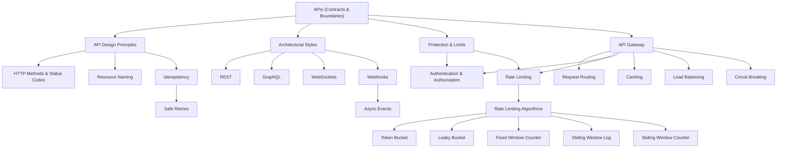
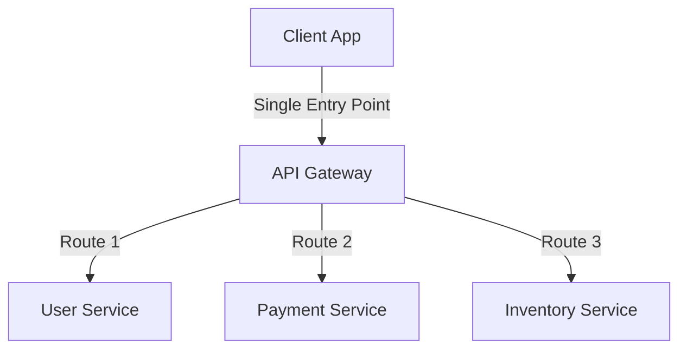
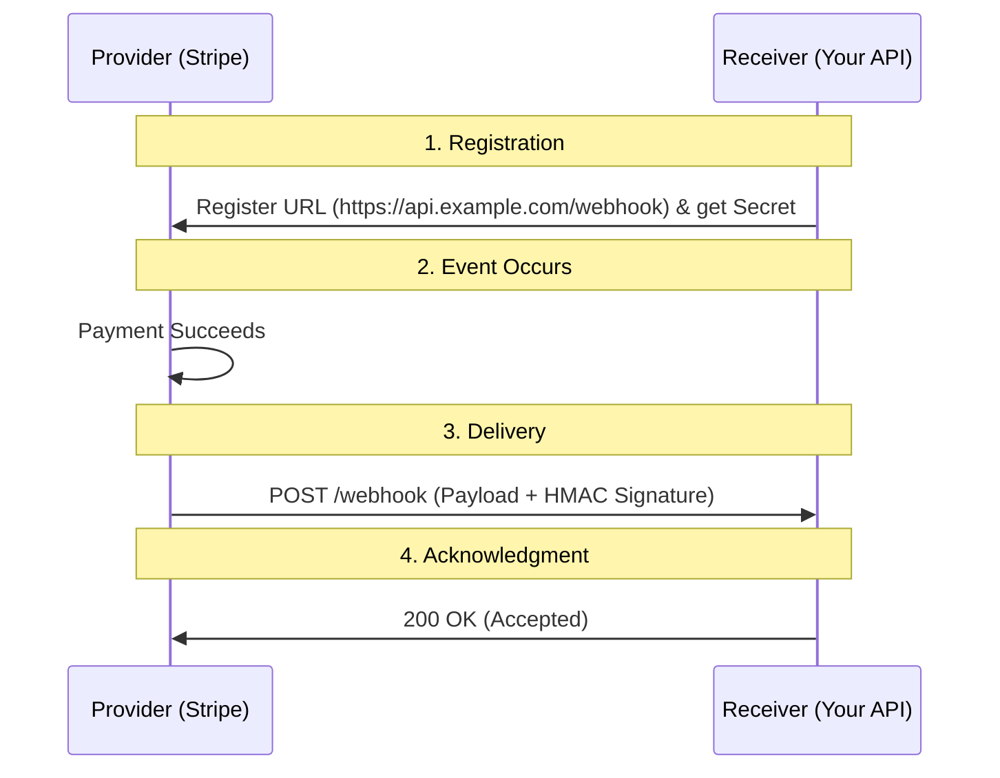

# API Fundamentals - Theory Super

## Global Mind Map: How API Concepts Connect



---

# 1. APIs: Contracts and Boundaries

## The Problem - Systems Need a Safe Way to Talk
Software is usually made of many smaller pieces. Those pieces need a safe, predictable way to talk to each other. You cannot have one service walking directly into another's database, inspecting its source code, or reaching into its internal memory. 

## What an API Is
An **API (Application Programming Interface)** is the agreed way of talking. It acts as a front desk for a system. The caller sends a request to the API, and the API decides what to do.

It tells one piece of software:
- What it can ask for
- What data it must send
- What it will get back
- What errors can happen

A good API also **protects the system behind it**. It checks input, verifies who is calling, limits abusive traffic, and keeps internal services from being exposed directly.

## What an API Contract Defines
An API contract is the agreement between the caller and the provider. 

| Question | Example |
|----------|---------|
| What can the caller do? | `GET /v1/orders/ord_123` |
| What must the caller send? | Path values, query values, headers, request body |
| What comes back? | JSON response, file, stream, or event |
| What can go wrong? | Status codes, error codes, retry safety |
| Who is calling? | API key, OAuth token, session cookie, mTLS |
| What are the limits? | Rate limits, request size, timeout, pagination |
| How does it change safely? | Versions, support windows, optional fields |

## APIs Are Boundaries
APIs separate **what callers are allowed to use** from **how the system works internally**.
As long as the API still behaves the same from the caller's point of view, the inside can evolve (e.g., swapping a database, changing a queue, moving to a new model server).

**Benefits of this boundary:**
- **Hiding internals:** Callers use behavior without knowing implementation.
- **Safer changes:** Old clients keep working while the server changes.
- **Security:** Controlled access instead of direct system access.
- **Debugging:** Requests can be logged, measured, traced, and audited at the edge.

## Types of APIs
1. **Public APIs:** Used by external developers/customers. Need stable behavior, strong auth, strict rate limits, and safe versioning (e.g., Stripe, Google Maps).
2. **Partner APIs:** Used by selected external organizations. Need tenant-level access, audit logs, and strong support.
3. **Internal APIs:** Used inside one organization (e.g., checkout service calling inventory). Still need owners, documentation, timeouts, and stable shapes.
4. **Library APIs:** Called inside the same running program (e.g., Python standard library, Pandas). 

---

# 2. REST API Design Best Practices

REST (Representational State Transfer) is a resource-based architectural style for developing APIs. While not a strict standard, following established best practices ensures your API is intuitive, predictable, and robust.

### 1. Learn the Basics of HTTP
REST leverages HTTP. You must understand its building blocks:
- **Verbs (Methods):** `GET` (Read), `POST` (Create), `PUT`/`PATCH` (Update), `DELETE` (Delete).
- **URIs:** Represent resources (`/books/`).
- **Status Codes:** `1xx` (Info), `2xx` (Success), `3xx` (Redirect), `4xx` (Client Error), `5xx` (Server Error).

### 2. Do Not Return Plain Text
Always return JSON and explicitly set the `Content-Type: application/json` header. Programmatic clients rely on this header to decode the response correctly.

### 3. Do Not Use Verbs in URIs
The HTTP verb already describes the action. The URI should only describe the resource.
- **Bad:** `POST /books/createNewBook/`
- **Good:** `POST /books/`

### 4. Use Plural Nouns for Resources
Keep it consistent to avoid ambiguity. `GET /books/2/` is better than `GET /book/2/` because it fits smoothly with `GET /books/` (fetch all).

### 5. Return Error Details in the Body
Help consumers debug by returning specific error messages and highlighting affected fields inside the JSON body.

### 6. Use HTTP Status Codes Correctly and Consistently
The worst thing an API can do is return an error response with a `200 OK` status code. It breaks trust. Use the correct HTTP status code, and use the response body only for error details.
- `GET`, `PUT`, `PATCH` -> `200 OK`
- `POST` -> `201 Created`
- `DELETE` -> `204 No Content`

### 7. Do Not Nest Resources Deeply
Flat is better than nested.
- **Bad:** `GET /authors/Cagan/books/` (Ambiguous resource type)
- **Good:** `GET /books?author=Cagan` (Clear resource, filtered via query)

### 8. Use the Querystring for Filtering and Pagination
Traits of data (like state, page size, page number) belong in the querystring, not in the URI path.
- **Example:** `GET /books?published=true&page=2&page_size=10`

### 9. Know the Difference Between 401 and 403
- **401 Unauthorized:** The caller provided no authentication credentials or invalid/expired ones. ("Who are you?")
- **403 Forbidden:** The caller is authenticated, but does not have the required permissions/clearance to access the resource. ("You are not allowed to do this.")

### 10. Make Good Use of 202 Accepted
Use `202 Accepted` when the server has understood the request, but the resource will be created/processed asynchronously in the future (e.g., triggering a long-running background job).

---

# 3. REST vs GraphQL

As applications grew complex, REST's fixed endpoint model began to show limitations regarding flexible data fetching. Facebook introduced **GraphQL** in 2015 to solve this.

## REST
Centers around **resources** identified by URLs. The server dictates the shape and size of the response data.

**Benefits:**
- Simple, intuitive, aligns with business domains.
- Stateless and highly cacheable at the HTTP layer.
- Mature tooling and ecosystem.

**Drawbacks:**
- **Over-fetching:** Getting more data than needed (e.g., fetching a full user object when you only need the email), wasting bandwidth.
- **Under-fetching:** Not getting enough related data, requiring multiple round-trip requests (the `n+1` query problem).
- **Rigid Structure & Versioning:** Clients must adapt to server-defined schemas; changes often require `/v1`, `/v2` endpoints.

## GraphQL
Centers around a **schema** that defines available data types. Clients query a single endpoint (`/graphql`) and specify exactly what fields they want.

```graphql
query {
  user(id: 123) {
    name
    email
    posts {
      title
    }
  }
}
```

### Core Functionalities
1. **Queries:** Fetch specific data. Solves over/under-fetching.
2. **Mutations:** Modify data (Create, Update, Delete).
3. **Subscriptions:** Real-time updates over WebSockets.

**Benefits:**
- **Precise Data Fetching:** Request exactly what you need.
- **Single Request:** Aggregate data from multiple services in one call.
- **Strong Typing:** Schema defines available data, making exploration easy.
- **No Versioning:** Add new fields without breaking existing queries.

**Drawbacks & Risks:**
- **Caching Challenges:** Uses `POST` requests, breaking standard HTTP/CDN caching.
- **Complex Setup:** Requires a GraphQL server, schemas, and resolvers.
- **Security & Performance Risks:** Deeply nested or complex queries can trigger massive database scans (DoS risk). Requires strict query depth limits and cost analysis.

## Which to Choose?
- **Use REST if:** The API is simple, you need HTTP caching, you are building third-party integrations, or you prioritize a standardized approach.
- **Use GraphQL if:** You serve multiple clients (web, mobile) with different data needs, require real-time subscriptions, or deal with deeply nested, highly relational data.

---

# 4. API Gateways

As microservices grow, having clients talk directly to multiple backend services creates chaos: clients must know every service's location, and developers must implement auth, rate limiting, and security on every single service.

An **API Gateway** acts as a central server that sits between clients and backend services. Clients send all requests to the gateway, which processes them and routes them appropriately.



## Core Features of an API Gateway

1. **Authentication & Authorization:** Verifies identity (OAuth, JWT) and checks permissions centrally, removing redundancy from backend services.
2. **Rate Limiting:** Controls request frequency (e.g., 100 req/min) to prevent abuse and DDoS attacks.
3. **Load Balancing:** Distributes incoming requests evenly across multiple healthy service instances.
4. **Caching:** Temporarily stores frequently requested data to reduce backend load and latency.
5. **Request Transformation:** Modifies incoming requests (e.g., converting address to GPS coords) or outgoing responses (XML to JSON) for compatibility.
6. **Service Discovery:** Dynamically identifies appropriate backend instances as services scale up or down.
7. **Circuit Breaking:** Temporarily stops routing requests to a failing/slow backend service, allowing it to recover instead of overwhelming it.
8. **Logging & Monitoring:** Centralized tracking of metrics (latency, error rates) and request logs.

## Step-by-Step Execution Flow
1. **Reception:** Receives request from client.
2. **Validation:** Checks headers, parameters, and payload format. Rejects immediately if invalid.
3. **Auth:** Verifies JWT token and permissions.
4. **Rate Limit:** Checks if the user has exceeded their allowed quota.
5. **Transformation:** Adapts payload if required by the backend.
6. **Routing:** Uses service discovery and load balancing to forward to the right instance.
7. **Response Handling:** Transforms or caches the backend response before returning it to the client.
8. **Logging:** Records the latency, status code, and path for monitoring.

---

# 5. Rate Limiting Algorithms

Rate limiting protects services from being overwhelmed. Different algorithms offer different trade-offs between accuracy, memory usage, and smoothness of traffic.

### 1. Token Bucket
- **How it works:** A bucket has a max capacity of tokens. Tokens are added at a fixed rate (e.g., 10/sec). A request removes a token. If empty, the request is dropped.
- **Pros:** Simple. Allows sudden bursts of traffic up to the bucket's capacity.
- **Cons:** Memory usage scales with the number of users. Doesn't guarantee perfectly smooth traffic.

### 2. Leaky Bucket
- **How it works:** Requests enter a bucket. The bucket processes ("leaks") requests at a constant, fixed rate. If the bucket is full, new requests are dropped.
- **Pros:** Smooths out bursty traffic into a steady, predictable stream.
- **Cons:** Drops excess requests immediately during sudden bursts; slightly more complex.

### 3. Fixed Window Counter
- **How it works:** Time is divided into fixed windows (e.g., 12:00-12:01). Requests increment a counter. If the limit is hit, requests are denied until the next window starts.
- **Pros:** Very easy to implement and understand.
- **Cons:** **The Boundary Problem.** A user can send 100 requests at 12:00:59 and 100 requests at 12:01:01, effectively pushing 200 requests in 2 seconds, defeating the rate limit.

### 4. Sliding Window Log
- **How it works:** Keeps a log of exact timestamps for every request. On a new request, removes entries older than the window size. If the remaining count is below the limit, the request is allowed.
- **Pros:** Extremely accurate. Fixes the boundary problem entirely.
- **Cons:** Highly memory-intensive and slow for high-volume APIs, as it must store and search timestamps for every single request.

### 5. Sliding Window Counter
- **How it works:** Combines Fixed Window and Sliding Window Log. Tracks request counts for the current and previous fixed windows. Calculates a weighted sum based on the overlap percentage of the sliding window.
  - `weight = (100 - overlap%) * lastWindowRequests + currentWindowRequests`
- **Pros:** Highly accurate (smooths out window edges) and memory-efficient (only stores counters, not timestamps).
- **Cons:** Slightly more complex mathematically.

---

# 6. Idempotency

A client sends a request, the network drops the response, and the client retries. Without protection, a blind retry can charge a credit card twice or create duplicate orders.

**Idempotency** is the property that makes retries safe: running an operation multiple times has the **same intended effect** as running it once.

- **Natural idempotency:** The operation intrinsically sets a final state (e.g., `UPDATE users SET status='ACTIVE'`).
- **Engineered idempotency:** The system uses a stable operation ID to detect and handle duplicates (e.g., `POST /payments` with an `Idempotency-Key` header).

## Idempotency Keys
An idempotency key is a stable, client-generated ID for one logical operation. The same logical operation must reuse the same key on every retry. 
- Must be unique per operation.
- Must be bound to the request (if the payload changes but the key stays the same, reject it).

## Server-Side Implementation

1. **Request Arrives:** Check if the key exists in the database.
2. **Atomic Reservation:** Try to insert the key into a database with a `status = IN_PROGRESS` and a `locked_until` lease. This must be atomic (e.g., unique constraint) to prevent race conditions from concurrent retries.
3. **If new key:** Process the operation, store the response, and update status to `COMPLETED`.
4. **If key exists & COMPLETED:** Immediately return the stored response without re-running the logic.
5. **If key exists & IN_PROGRESS:** Check the lease. If expired (worker crashed), take over. If still active, return `409 Conflict` (tell client to wait/retry).

## Handling Side Effects
The hardest idempotency bugs happen when calling external systems. If you charge a card in Stripe, but your database crashes before saving the state, a retry might charge again.
- Pass your idempotency key down to the external provider.
- Store local state *before* calling the provider, and update it *after*.

## HTTP Method Rules
- **Idempotent by definition:** `GET`, `HEAD`, `PUT` (replace), `DELETE`.
- **Not idempotent:** `POST`, `PATCH` (depending on implementation, e.g., incrementing a value).

---

# 7. Webhooks

When your system needs to know when an event happens in another system (e.g., Stripe payment succeeds, GitHub PR opened), polling repeatedly (`GET /events`) wastes resources and adds latency.

A **Webhook** flips the direction: it is a **push-based** HTTP request sent from the provider to your system when an event occurs.



## Anatomy of a Webhook
- **Method:** Usually `POST`.
- **Headers:** Contains Event Type, Delivery ID, and crucially, a **Signature** (e.g., HMAC) to verify the sender.
- **Body:** The event envelope and resource data.

## Building a Safe Receiver
Webhooks are just HTTP requests crossing the internet. They can be delayed, duplicated, arrive out of order, or be faked by attackers.

1. **Verify Signatures First:** Always verify the HMAC signature using the shared secret and the *raw* request body before parsing JSON. This prevents attackers from triggering fake events.
2. **Make Processing Safe to Repeat (Idempotency):** Providers use at-least-once delivery. Use the provider's event ID to detect duplicates. If you see a duplicate, return `200 OK` but skip processing.
3. **Do Not Depend on Order:** Retries can mix up event order. Don't assume `created` always arrives before `paid`. Fetch the latest state from the provider before applying critical changes.
4. **Acknowledge Fast, Process Later:** Do minimal work (verify, save to DB/Queue) and immediately return `200 OK`. Do the heavy processing in background workers. If you take too long, the provider will timeout and retry.
5. **Return Correct Status Codes:** 
   - `2xx` = Accepted.
   - `401/403` = Signature failed.
   - `5xx` = Temporary failure, provider should retry. (Do NOT return 200 if you failed to save the event).

## Scalable Webhook Architecture
- **Receiver Endpoint:** Verifies signature, saves raw event to database, drops it onto a Queue (e.g., SQS, Kafka), returns 200 OK.
- **Workers:** Read from the queue, fetch data, update DB, trigger workflows.
- **Dead Letter Queue (DLQ):** If processing fails repeatedly, move to a DLQ for operator investigation and manual replay.

---

# 8. WebSockets

Traditional HTTP uses a Request-Response model. It is stateless and unidirectional (client must ask server for data).
Polling and Long-Polling try to simulate real-time behavior but waste resources and introduce latency.

**WebSockets** are a communication protocol that establishes a **two-way (full-duplex), persistent connection** between client and server over a single TCP connection. Both sides can send messages independently at any time.

## How WebSockets Work
1. **Handshake:** Client sends a standard HTTP `GET` request with an `Upgrade: websocket` header.
2. **Server Agreement:** If supported, server returns an HTTP `101 Switching Protocols` status code.
3. **Persistent Connection:** The TCP connection stays open.
4. **Data Transfer:** Messages are sent as small packets (frames) with minimal overhead (as little as 2 bytes of header).
5. **Closure:** Either side can close the connection cleanly.

## Why Use WebSockets?
- **Real-Time Updates:** Instant transmission (Live chat, multiplayer games, financial trading, collaborative docs like Google Docs).
- **Reduced Latency:** No connection setup overhead for every message.
- **Efficient Resource Usage:** Eliminates the wasted empty responses of polling.
- **Lower Overhead:** Tiny frame headers compared to massive HTTP headers.

## WebSockets vs HTTP & Polling
| Protocol | Behavior | Latency | Resource Usage |
|----------|----------|---------|----------------|
| **HTTP** | Client requests, server responds, connection closes. | High (new handshake every time) | Normal |
| **Polling** | Client asks every X seconds. | Medium (delays between polls) | High (wasted empty requests) |
| **Long-Polling** | Server holds request open until data exists. Client reconnects immediately. | Medium | High (server holds many idle connections) |
| **WebSocket** | Persistent, two-way push/pull. | Very Low | Efficient |

## Challenges
- **Proxy/Firewall Support:** Some older infrastructure blocks WebSocket upgrades.
- **Scalability:** Holding thousands of persistent connections requires specific server tuning and distributed architecture (e.g., Redis Pub/Sub backplanes for load balancers).
- **State Management:** Connections can drop. You need heartbeat (ping/pong) mechanisms to detect dead connections and automatic reconnection logic on the client.
- **Security:** Vulnerable to Cross-Site WebSocket Hijacking (CSWSH) and DDoS. Ensure you use `wss://` (WebSocket over TLS) and authenticate connections during the initial HTTP handshake.
