# Database Fundamentals - Theory Super

## Global Mind Map: How Database Concepts Connect

```mermaid
graph TB
    DB[Databases] --> TYPE[Database Types]
    DB --> SCALE[Scaling & Architecture]
    DB --> PERF[Performance & Optimization]
    DB --> ACID[ACID Transactions]

    TYPE --> SQL[SQL / Relational]
    TYPE --> NOSQL[NoSQL]
    NOSQL --> KV[Key-Value]
    NOSQL --> DOC[Document]
    NOSQL --> COL[Wide-Column]
    NOSQL --> GRAPH[Graph]
    NOSQL --> TS[Time-Series]
    NOSQL --> SEARCH[Search]

    ACID --> A[Atomicity]
    ACID --> C[Consistency]
    ACID --> I[Isolation]
    ACID --> D[Durability]

    SCALE --> VERT[Vertical Scaling]
    SCALE --> HORIZ[Horizontal Scaling]
    SCALE --> REP[Replication]
    SCALE --> SHARD[Sharding]

    REP --> SYNC[Synchronous]
    REP --> ASYNC[Asynchronous]
    
    SHARD --> KEY[Shard Key]
    SHARD --> RANGE[Range-Based]
    SHARD --> HASH[Hash-Based]
    SHARD --> DIR[Directory-Based]

    PERF --> INDEX[Database Indexes]
    PERF --> CACHE[Caching]
    PERF --> DENORM[Denormalization]
    PERF --> MVIEW[Materialized Views]
    PERF --> BLOOM[Bloom Filters]

    INDEX --> BTREE[B-Tree]
    INDEX --> HASH_IDX[Hash Index]
    INDEX --> BITMAP[Bitmap]
    INDEX --> COMP[Composite]
```



---

# 1. ACID Transactions

## The Problem - Preventing Data Corruption on Failures
Consider a money transfer between two bank accounts. The transfer looks like one action to the user, but the database has to make at least two changes: subtract money from account A, and add money to account B. If the database subtracts the money and then crashes before adding it, money disappears.

## What is a Transaction?
A transaction is a group of database operations that should succeed or fail as one single unit. Either the whole group is saved, or none of it is.

```sql
BEGIN;
  UPDATE accounts SET balance = balance - 100 WHERE id = 1;
  UPDATE accounts SET balance = balance + 100 WHERE id = 2;
COMMIT;
```
If something goes wrong before `COMMIT`, the database can `ROLLBACK` the transaction, throwing away half-finished changes.

## ACID Guarantees

### Atomicity (All or Nothing)
Either every operation takes effect, or none do. It prevents the broken state of partial updates. Databases achieve this via bookkeeping (transaction logs, undo/redo logs) to ensure no half-finished results are left behind.

### Consistency (Rule Enforcement)
A committed transaction must leave the database in a valid state, following defined rules:
- Primary key uniqueness
- Foreign key references
- `NOT NULL` and `CHECK` constraints (e.g., `CHECK (balance >= 0)`)

*Note: The database enforces schema rules, but application logic must enforce business rules (e.g., order fulfillment).*

### Isolation (Safe Concurrency)
Controls what transactions see when they run at the same time. Without it, two transactions could overwrite each other (Lost Update) or read half-finished work (Dirty Read).

**Isolation Levels:**
1. **Read Uncommitted:** Fast, but allows dirty reads.
2. **Read Committed:** Prevents dirty reads, but allows non-repeatable reads.
3. **Repeatable Read:** Prevents most read anomalies.
4. **Serializable:** Makes transactions behave as if they ran strictly sequentially. (Highest safety, highest blocking/retry cost).

*Real-world example: Overselling inventory. If two users read `stock = 1` concurrently, both might check out. To fix this, use a row lock (`SELECT ... FOR UPDATE`), a conditional update (`WHERE stock > 0`), or Serializable isolation.*

### Durability (Crash Survival)
Once committed, the database can recover the data after a crash. 
Databases achieve this via the **Write-Ahead Log (WAL)**. 
- Change data -> Append to WAL -> Flush to disk -> Acknowledge commit -> Write actual data pages later. 
If the DB crashes, it replays the WAL to restore committed changes.

---

# 2. SQL vs NoSQL

The choice between SQL and NoSQL is about how data is shaped, read, written, and scaled.

## The Core Difference
- **SQL (Relational):** Data is modeled in tables with explicit schemas. Relationships use foreign keys. Queries use SQL. Strict ACID transactions.
- **NoSQL:** Organizes data around how it will be read/written (Key-Value, Document, Graph, etc.). Schemas are flexible (enforced by the app). Scaling horizontally is often a native design priority.

## NoSQL Data Models
| Type | Model | Good Fit | Example |
|------|-------|----------|---------|
| **Key-Value** | Key points to value | Sessions, caches, simple lookups | Redis, DynamoDB |
| **Document** | JSON-like object | User profiles, catalogs (read whole object together) | MongoDB |
| **Wide-Column**| Key + sorted rows/cols | High-write events, time-series | Cassandra |
| **Graph** | Nodes and edges | Social networks, recommendations, fraud rings | Neo4j |
| **Search** | Search index | Text search, filtering, ranking | Elasticsearch |

## Schema & Query Patterns
- **Relational databases normalize data:** Fewer duplicates, strong rules, flexible queries (joins). *Cost: Joins get slow at scale.*
- **NoSQL databases duplicate data for reads:** Fast reads for known access patterns. *Cost: Duplicate data makes updates harder and risks stale copies.*

## How to Choose
- **Choose SQL when:** Data relationships matter, strict multi-row transactions are required, queries will evolve, and data quality/integrity must be enforced by the DB.
- **Choose NoSQL when:** The read/write pattern is known and maps directly to a NoSQL model (e.g., fetching a whole JSON document), extreme horizontal scale is needed, or records require highly flexible structures.

---

# 3. Database Indexes

## The Problem - Full Table Scans are Slow
If a table has 100 million rows and you query `WHERE email = 'mia@mail.com'` without an index, the database must scan every single row.

## What is an Index?
An index is an extra data structure that stores selected column values in a lookup-friendly, sorted format, with a pointer back to the actual table row. It provides a fast shortcut to skip the full scan.

## Selectivity
An index helps most when the filter is highly **selective** (narrows down the search significantly).
- `email` (Unique) -> High selectivity (Very useful index).
- `is_deleted` (True/False) -> Low selectivity (Weak index, useless alone).

## Index Types
1. **B-Tree Indexes (The Default):** Keep keys sorted. Great for equality (`=`), ranges (`>`, `<`), and ordered reads (`ORDER BY`).
2. **Hash Indexes:** Fast for exact equality (`=`), but useless for ranges or sorting.
3. **Bitmap Indexes:** Represents matches as bit strings (1s and 0s). Great for analytics on low-cardinality columns (e.g., `status`, `region`) where bits can be combined using bitwise `AND/OR`. Expensive for write-heavy tables.
4. **Partial/Filtered Indexes:** Indexes only a subset of data (e.g., `WHERE status = 'ACTIVE'`). Saves space.
5. **Expression Indexes:** Indexes the result of a function (e.g., `CREATE INDEX ON users (LOWER(email))`).

## Composite & Covering Indexes
- **Composite Index:** Multi-column index. *Rule of thumb for ordering columns: 1. Equality filters, 2. Range filters, 3. Sort columns.*
- **Covering Index:** An index that contains *all* columns requested by the `SELECT` query. The database can return the result directly from the index without fetching the actual table row (Index-Only Scan).

## The Cost of Indexes
Indexes are not free. They use storage, consume memory cache, and **slow down writes** (every `INSERT`/`UPDATE`/`DELETE` must update the indexes). Never add indexes blindly; build them based on real, measured query patterns.

---

# 4. Database Sharding

## The Problem - Outgrowing a Single Node
When a single database server maxes out its CPU, RAM, or disk space, you must scale. Read replicas help with reads, but if *writes* or *storage* exceed one machine, you must partition the data across multiple machines.

## What is Sharding?
Sharding splits rows of a dataset across multiple database nodes (shards). Each shard stores only a portion of the total data.

## The Shard Key
The column used to determine which shard receives the data. Choosing this is the most critical decision.
- **Good Shard Key:** `user_id`. (Routes all data for one user to one shard).
- **Bad Shard Key:** `created_at`. (All new writes hit the "today" shard, creating a massive hotspot).
- **Bad Shard Key:** `country`. (Uneven data distribution; USA shard will be massive, Iceland shard empty).

## Sharding Strategies
1. **Hash-Based:** `hash(user_id) % num_shards`. Spreads data very evenly. *Tradeoff: Adding/removing shards is a nightmare (requires massive data movement).*
2. **Range-Based:** Shard 1: IDs 1-10M, Shard 2: IDs 10M-20M. Good for range queries. *Tradeoff: Prone to hotspots if sequential keys are used.*
3. **Directory-Based:** A lookup service maps specific tenants/keys to specific shards. Flexible, but introduces a single point of failure (the directory).

## The Costs of Sharding
- **Scatter-Gather Queries:** If a query doesn't include the shard key, the router must ask *every* shard, merge results, and sort them. Terribly slow.
- **Cross-Shard Joins:** Databases cannot perform native joins across different servers. You must handle this in application code or duplicate data.
- **Cross-Shard Transactions:** Requires complex Distributed Transactions (e.g., 2-Phase Commit).
- **Rebalancing:** Moving data between shards without downtime is exceptionally difficult.

---

# 5. Data Replication

## The Problem - Single Point of Failure
If your database crashes, your app goes offline, and data might be lost.

## What is Replication?
Keeping copies of the same data across multiple locations to ensure high availability, disaster recovery, and improved read performance. 

## Types of Replication
1. **Synchronous Replication:** Primary writes to itself and the replica, and waits for the replica to acknowledge before returning success to the client. *Pros: Zero data loss. Cons: High write latency (bad for cross-region).*
2. **Asynchronous Replication:** Primary writes to itself, returns success to the client, and sends changes to the replica in the background. *Pros: Fast writes. Cons: Replication lag (stale reads on replica), and potential data loss if primary dies before changes are sent.*
3. **Transactional / Change Data Capture (CDC):** Reads the database's transaction log (e.g., WAL) and streams exact sequential changes to replicas.

## Architecture Approaches
- **Single-Leader (Active-Passive):** One node accepts writes, others only read. Good for read-heavy workloads.
- **Multi-Leader (Active-Active):** Multiple regions accept writes. Eliminates cross-region write latency. *Tradeoff: Requires complex Conflict Resolution (e.g., Last-Write-Wins, or CRDTs).*

---

# 6. Database Scaling & Performance Strategies

Before resorting to Sharding, you should utilize these scaling strategies:

1. **Vertical Scaling:** Add more CPU, RAM, or SSD to a single server. Quick, but hits hardware limits and retains a single point of failure.
2. **Indexing:** Optimize read performance by preventing full table scans.
3. **Caching:** Store frequently accessed, read-heavy data (e.g., user profiles, viral articles) in a fast in-memory store like Redis.
4. **Replication:** Add Read-Replicas to distribute read traffic.
5. **Data Denormalization:** Intentionally duplicate data (combine tables) to avoid slow, complex joins on read-heavy paths. (e.g., embedding recent `comments` as JSON inside a `post` row).
6. **Materialized Views:** Pre-compute and store the results of complex, slow aggregation queries on disk. Excellent for dashboards and analytics that run frequently but don't need real-time up-to-the-millisecond accuracy.
7. **Vertical Partitioning:** Split a wide table by columns. Put frequently accessed columns (ID, Name, Price) in one table, and large/rarely accessed columns (Description, Bio, Image Blobs) in another.

---

# 7. Bloom Filters

## The Problem - Checking for Missing Data is Expensive
Looking up a key on disk or in a remote database is slow. If the key doesn't exist, you wasted that time entirely. You need a fast, memory-efficient way to ask: "Does this item exist?"

## How a Bloom Filter Works
A space-saving probabilistic data structure. 
- It uses a **Bit Array** (initially all 0s) and `K` different hash functions.
- **To add an item:** Hash it `K` times. Each hash outputs an index. Set the bit at those indices to `1`.
- **To query an item:** Hash it `K` times. Check those bit indices. 
  - If **any** bit is `0` -> The item is **definitely not present**. (Definite miss).
  - If **all** bits are `1` -> The item is **probably present**. (Possible false positive).

## False Positives
Because multiple items might hash to the same overlapping bits, a Bloom Filter can give a **False Positive**, but NEVER a **False Negative**. 
- If it says "No", skip the disk read.
- If it says "Yes", you must still do the actual disk/cache lookup to verify.

## Sizing and Tradeoffs
Bloom filters must be sized in advance based on the expected number of items (`n`) and acceptable false positive rate (`p`).
- They cannot be easily resized.
- You **cannot delete** an item from a standard Bloom Filter (because unsetting a bit might accidentally "delete" another overlapping item).
- **Use Cases:** LSM-Tree databases (Cassandra, RocksDB) to skip reading SSTables that don't contain a key; Cache lookups to prevent Cache Penetration; Web crawlers preventing duplicate URL fetching.
