# Caching Fundamentals — Theory Super

## Global Mind Map: How Caching Concepts Connect

```mermaid
graph TB
    CACHE[Caching] --> CORE[Core Concepts]
    CACHE --> STRAT[Caching Strategies]
    CACHE --> EVICT[Eviction Policies]
    CACHE --> DIST[Distributed Caching]
    CACHE --> CDN[Content Delivery Networks]

    CORE --> HIT[Hit Ratio]
    CORE --> TTL[TTL / Expiration]
    CORE --> LAYERS[Cache Layers: Browser, CDN, App, DB]

    STRAT --> CASIDE[Cache-Aside]
    STRAT --> RTHRU[Read-Through]
    STRAT --> WTHRU[Write-Through]
    STRAT --> WAROUND[Write-Around]
    STRAT --> WBACK[Write-Back / Behind]

    EVICT --> LRU[Least Recently Used]
    EVICT --> LFU[Least Frequently Used]
    EVICT --> FIFO[First In, First Out]
    EVICT --> RR[Random Replacement]
    EVICT --> MRU[Most Recently Used]
    EVICT --> ETTL[Time to Live]
    EVICT --> TIERED[Two-Tiered Caching]

    DIST --> HASH[Consistent Hashing]
    DIST --> DEDICATED[Dedicated Servers]
    DIST --> COLOCATED[Co-located]

    CDN --> EDGE[Edge Nodes]
    CDN --> ORIGIN[Origin Server]
    CDN --> KEY[Cache Key Design]
```

---

# 1. Caching 101

## The Problem — Hitting the Database is Expensive
Consider a social media feed. Without caching, a single feed load might trigger 50+ database queries (Auth, Profile, Follows, Posts, Like counts, Images). Under heavy traffic, the database becomes a massive bottleneck, slowing down requests and scaling costs exponentially.

## What is a Cache?
A cache is a fast storage layer (usually in-memory) that keeps copies of frequently used data. Instead of computing or querying the slow database repeatedly, the system returns the fast cached copy.

## Cache Layers
Caching happens at multiple levels:
1. **Browser Cache:** Closest to the user. Stores static assets (images, CSS, JS) locally. Controlled by HTTP headers (`Cache-Control`, `ETag`).
2. **CDN Cache:** Edge locations globally distributed.
3. **Load Balancer / API Gateway:** Caches shared API responses.
4. **Application Cache:** In-memory inside the app process (e.g., Caffeine, Guava). Extremely fast, but local to that specific server.
5. **Distributed Cache:** A shared cluster (Redis, Memcached). Slightly slower than local memory (network hop), but perfectly consistent across all app servers.
6. **Database Buffer Pool:** The DB's internal memory cache to avoid disk reads.

## Cache Hits, Misses, and The 80/20 Rule
- **Cache Hit:** Data found in cache. Return immediately.
- **Cache Miss:** Data missing. Fetch from DB, store in cache, return.
- **Hit Ratio:** `(Cache Hits) / (Cache Hits + Cache Misses)`. A 90% hit ratio implies a 10x reduction in database load.

**The 80/20 Rule:** 20% of the data usually serves 80% of the requests. Focus caching on this "hot" data. Don't cache everything (an anti-pattern).

## The Thundering Herd Problem
When a highly popular cache entry (e.g., viral post) expires, hundreds of concurrent requests will experience a Cache Miss simultaneously. All of them hit the database at the exact same moment, causing a system crash.
*Fixes:* Per-key locking (only one thread fetches, others wait), background refresh before TTL expires.

---

# 2. Caching Strategies

How do reads and writes interact with the cache and the database? 

### 1. Cache-Aside (Lazy Loading)
The application code manually manages both.
- **Read:** App checks cache. If miss, app reads from DB, updates cache.
- **Write:** App writes to DB, then deletes (or updates) the cache entry.
- **Pros:** Resilient (if cache dies, DB still works), simple, only caches requested data.
- **Cons:** First read is always slow. App code is bloated with caching logic.
- **Best for:** Read-heavy, general-purpose workloads.

### 2. Read-Through
The application *only* talks to the Cache layer. 
- **Read:** App asks cache. If miss, the *cache layer itself* knows how to query the database, load it, and return it.
- **Best for:** Shared read paths across many microservices.

### 3. Write-Through
The application writes to the Cache. The Cache synchronously writes to the DB before returning success.
- **Pros:** Perfect consistency. Data is always perfectly fresh in the cache.
- **Cons:** Writes are slow (must hit both systems synchronously).
- **Best for:** Workloads where data is heavily read immediately after being written.

### 4. Write-Around
The application writes directly to the DB, explicitly skipping the cache.
- **Pros:** Prevents cache churn. Doesn't fill cache with data that won't be read.
- **Cons:** Read-after-write is a cache miss (slow).
- **Best for:** Write-heavy systems (e.g., logging, bulk imports) where written data isn't immediately read.

### 5. Write-Back (Write-Behind)
The application writes to the Cache, which returns success *instantly*. The Cache flushes writes to the DB asynchronously in the background.
- **Pros:** Lightning-fast writes. Can batch writes to save DB load.
- **Cons:** **Massive Risk.** If the cache crashes before flushing to the DB, the data is permanently lost.
- **Best for:** Low-risk, extreme volume metrics (e.g., YouTube view counters, likes). Never use for payments or critical data.

---

# 3. Cache Eviction Policies

Cache memory is limited and expensive. When the cache is full, how do you decide what gets deleted to make room?

### 1. Least Recently Used (LRU)
Evicts the item that hasn't been accessed for the longest time. 
- **How:** Usually a Doubly Linked List + Hash Map. On access, move item to the front. Evict from the tail.
- **Pros:** Matches real-world access patterns perfectly.
- **Cons:** Tracking metadata adds memory overhead.

### 2. Least Frequently Used (LFU)
Evicts the item with the lowest access count.
- **Pros:** Great for long-term "hot" items.
- **Cons:** High overhead. An item that was popular yesterday but dead today might never be evicted because its counter is artificially high (requires decay mechanisms).

### 3. First In, First Out (FIFO)
Evicts the oldest item inserted, regardless of how often it's used.
- **Pros:** Stupidly simple. No tracking overhead.
- **Cons:** Evicts highly popular items just because they are old. Rarely used in modern caching.

### 4. Random Replacement (RR)
Picks a random key and deletes it.
- **Pros:** Zero overhead. No tracking needed.
- **Cons:** Might delete your most valuable, highly-accessed key.

### 5. Time to Live (TTL)
Items expire automatically after a set lifespan (e.g., 5 minutes), regardless of usage.
- **Pros:** Guarantees stale data is eventually flushed.
- **Cons:** Might prematurely evict highly popular items that haven't actually changed in the DB.

### 6. Two-Tiered Caching
Combining a local in-memory cache (Tier 1, ultra-fast) with a distributed cache like Redis (Tier 2).
- **Workflow:** App -> Local Cache -> Redis -> Database.
- **Pros:** Prevents network hops for extreme hot-keys.
- **Cons:** Huge complexity keeping Tier 1 synchronized with Tier 2 across 50 different servers.

---

# 4. Distributed Caching

When a single server cannot hold all the cache data, it must be distributed.

## Why Distributed?
1. **Scalability:** Add more RAM by adding more nodes.
2. **Fault Tolerance:** If one cache node dies, only a fraction of the cache is lost.

## Co-located vs Dedicated
- **Dedicated Servers:** Cache runs on separate servers from the App. (Pros: Independent scaling, isolation. Cons: Network latency, infrastructure cost).
- **Co-located:** Cache runs on the same VMs as the App. (Pros: Zero network latency. Cons: Resource contention between app logic and cache memory).

## How it Works: Consistent Hashing
To route requests, the client hashes the cache key to figure out which node owns the data. If standard modulo hashing (`hash(key) % N`) is used, adding or removing a node breaks 90% of the routing. **Consistent Hashing** ensures that when a node is added/removed, only `1/N` of the keys need to move, keeping the cluster stable.

## Popular Solutions
1. **Redis:** In-memory data structures (Strings, Lists, Sets, Hashes, HyperLogLogs). Supports persistence and replication.
2. **Memcached:** Pure, dead-simple in-memory key-value cache. No persistence. Multi-threaded out of the box.

---

# 5. Content Delivery Network (CDN)

## The Problem — Geography Dictates Speed
A request from Sydney to a server in Virginia is physically bound by the speed of light. It takes time.

## What is a CDN?
A CDN is a network of edge locations (Points of Presence / PoPs) placed geographically close to users worldwide. Instead of hitting the "Origin Server", the user hits the nearest Edge node, which returns a cached copy of the asset.

## CDN Routing
Users do not pick their edge node. When they resolve a DNS name (`static.example.com`), the CDN's DNS system uses Anycast or Geo-DNS to route the user to the closest, healthiest edge server.
- **Cache Hit:** Edge returns the file (ms latency).
- **Cache Miss:** Edge asks Origin, returns to user, and stores it for the next user.

## What to Cache?
- **Good Fits:** Static assets (Images, CSS, JS, Fonts, Videos, Patches).
- **Dynamic Fits:** Public API responses (e.g., product catalog JSON).
- **NEVER Cache:** Authenticated data (shopping carts, user profiles, banking balances). *A cache key mistake here leaks private data to strangers.*

## The Cache Key
A CDN operates as a massive key-value store. The default key is usually `Scheme + Host + Path + QueryString`.
- `https + static.example.com + /image.png + ?w=800`
If you include HTTP Headers (like `User-Agent` or `Cookie`) in the cache key, you risk destroying your Hit Ratio (because every user has a unique cookie).

## Purging and Invalidation
When an asset changes, how do you fix the CDN?
1. **Versioned URLs (Best Practice):** Never mutate a file. Upload a new file `app-v2.js` and change the HTML. The old `app-v1.js` will naturally age out.
2. **Short TTL:** For files that must keep the same name, use a short TTL (e.g., 5 mins).
3. **Manual Purge:** Force the CDN to delete a URL. *Danger: Prone to human error, API limits, and causes a massive traffic spike to the Origin when repopulated.*

## Advanced Defenses
- **Origin Shielding:** If a cache miss happens in London, Paris, and Berlin simultaneously, they don't all hit the Origin. They hit a regional "Shield" node first, which collapses the requests into a single Origin hit.
- **Stale-While-Revalidate:** The CDN serves a slightly stale file to the user instantly, while secretly fetching the fresh file from the Origin in the background.
