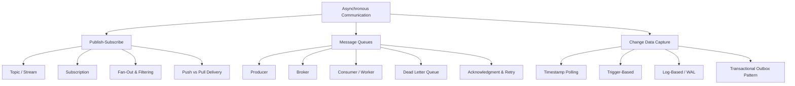

# Asynchronous Communication - Theory Super

## Global Mind Map: How Asynchronous Concepts Connect



---

# 1. Publish-Subscribe (Pub/Sub)

## The Problem - The Tight Coupling of Events
When an order is placed, many independent systems need to react: inventory, emails, analytics, fraud detection, and shipping. If the Order Service has to call all of these services directly (synchronously), the checkout process becomes incredibly slow. Furthermore, if the Email Service goes down, the entire checkout process might fail. 

## What is Pub/Sub?
Pub/sub allows a publisher to announce an event to a central "Topic" without knowing who is listening. Subscribers that care about that topic receive their own copy of the message and react independently.

## Core Concepts
- **Publisher:** Creates events and sends them to a topic. It publishes *facts* (`{"orderId": 123, "status": "placed"}`), not instructions.
- **Topic:** A named channel where events are published (e.g., `orders.events`).
- **Subscription:** Connects a service to a topic. Each subscription tracks its own state: what is waiting, what was acknowledged, retry rules, and filtering.

## Pub/Sub vs Work Queues
- **Work Queue:** "Someone needs to do this task." (1 message = 1 worker processes it).
- **Pub/Sub:** "This thing happened." (1 message = Copied to every interested subscription).

## Key Features
- **Fan-Out:** Sending one event to multiple distinct subscriptions.
- **Filtering:** Allowing a subscription to receive only matching messages (e.g., `region = 'EU'`), saving the consumer from downloading and discarding irrelevant events.
- **Push vs Pull:** 
  - *Push:* Broker calls the subscriber's HTTP endpoint. Great for webhooks, but the endpoint must survive traffic spikes.
  - *Pull:* Subscribers fetch messages at their own pace. Great for controlling batch sizes and protecting the worker from overload.

## Durability and Ordering
- **Temporary vs Durable:** Some systems only deliver to currently online subscribers (Redis Pub/Sub). Others save messages until acknowledged (Google Cloud Pub/Sub, AWS SNS/SQS). Others maintain a replayable log (Kafka).
- **Ordering:** Global exact ordering is usually impossible at scale. Order related events using a routing key (e.g., `orderId`) so events for the same order stay sequential.

---

# 2. Message Queues

## The Problem - Synchronous Bottlenecks
If a web server accepts a user's video upload and directly processes the video, the user has to stare at a loading spinner for 10 minutes. The server is tied up and cannot serve other users.

## What is a Message Queue?
A message queue sits between producers and consumers as a buffer. The producer puts a message in the queue and returns success to the user instantly. Later, a consumer reads the message and does the heavy lifting in the background.

## Core Components
- **Producer:** Creates messages and sends them to the broker.
- **Broker:** The system that owns the storage and delivery (e.g., RabbitMQ, SQS).
- **Queue:** The buffer holding the messages.
- **Consumer:** Reads messages and does the work. Multiple consumers can read from the same queue to parallelize work.
- **Message:** Payload (data) + Metadata (ID, retries, timestamps).

## How it Works & Acknowledgment (ACK)
The most critical part of a queue is the **Acknowledgment**. 
1. Consumer receives message.
2. Consumer processes work.
3. Consumer sends `ACK` to the broker.
4. Broker deletes the message.
*If the consumer crashes before step 3, the broker waits for a timeout and then puts the message back in the queue for another consumer to try.* 

Because of this retry logic, **consumers must be idempotent** (safe to process the exact same message twice without causing duplicate charges or corrupted state).

## Common Queue Patterns
- **Work Queue:** Spreads tasks across a pool of identical workers.
- **Priority Queue:** Urgent messages jump the line (e.g., password resets process before marketing emails).
- **Delayed Queue:** Hides a message until a set time passes (e.g., checking if a cart is still abandoned 24 hours later).
- **Dead Letter Queue (DLQ):** When a message fails processing repeatedly (e.g., a bug in the code, or a corrupted payload), it is moved to a DLQ so it stops blocking the main queue. Engineers can inspect the DLQ later.

## Trade-offs
- **Duplicate Processing:** At-least-once delivery means you *will* process duplicates eventually.
- **Backlogs:** A growing queue means consumers are falling behind. This becomes a severe incident if messages get too old.
- **Amplified Failures:** If a 3rd party API goes down, thousands of workers will fail and retry aggressively. You must use **exponential backoff and jitter** to avoid DDoSing the failing API.

---

# 3. Change Data Capture (CDC)

## The Problem - Keeping Distributed Systems in Sync
If you have a PostgreSQL database as your source of truth, but you need that data in Elasticsearch for searching, Redis for caching, and Snowflake for analytics, how do you keep them updated? 
Nightly batch jobs result in stale data and heavy database scans. 

## What is CDC?
Change Data Capture turns database changes (Inserts, Updates, Deletes) into a real-time stream of events.

**Example CDC Event:**
```json
{
  "op": "update",
  "table": "customers",
  "before": {"id": 1, "balance": 120},
  "after": {"id": 1, "balance": 80},
  "ts_ms": 1698765432100
}
```

## CDC Approaches

### 1. Timestamp-Based (Polling)
- Queries `WHERE updated_at > last_check`.
- *Pros:* Easy to build.
- *Cons:* Misses hard deletes. Misses intermediate changes if a row updates twice between polls. Inefficient (full table scans if unindexed).

### 2. Trigger-Based
- Database triggers run on `INSERT/UPDATE/DELETE` and copy the change to an audit table.
- *Pros:* Captures deletes and exact before/after states.
- *Cons:* Slows down normal application writes (extra DB overhead). Triggers are hard to maintain.

### 3. Log-Based (The Gold Standard)
- Reads the database's internal transaction recovery log (Postgres WAL, MySQL binlog).
- *Pros:* Zero impact on application queries. Captures absolutely everything in perfect commit order.
- *Cons:* Complex to set up (requires tools like Debezium + Kafka). Needs careful management of log retention.

## CDC vs Domain Events
- **CDC:** "Row ID 5 in `orders` table changed status to 'paid'." (Raw database state).
- **Domain Event:** "Order #5 was Paid." (Business logic).

### The Transactional Outbox Pattern
A perfect hybrid of the two.
To avoid the "Dual Write Problem" (where writing to the DB succeeds, but publishing to Kafka fails), the application writes the business change AND an event record into an `outbox` table in the *same single database transaction*.
Then, a CDC tool tails the database log, reads the `outbox` insertions, and reliably pushes those exact business events to Kafka.

## Operational Challenges
- **The Initial Snapshot:** When attaching CDC to an existing 1TB table, it must first snapshot the current state before it can begin streaming live changes. This can take days and massive DB load.
- **Deletes:** Downstream systems need to know how to handle a delete event. Should Elasticsearch hard-delete it, or mark it inactive?
- **Security:** CDC exposes *everything*. If you stream the `users` table to a data warehouse, you might accidentally stream plaintext passwords or PII. Columns must be masked or filtered.
