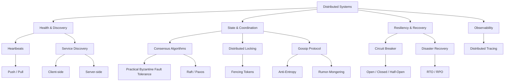

# Distributed System and Microservices — Theory Super

## Global Mind Map: How Distributed System Concepts Connect

---

# 1. Heartbeats

## The Problem — How do we know if a node is dead?
In a distributed system, things fail constantly. Hardware malfunctions, software crashes, or network connections drop. If a node fails, the load balancer or coordinator needs to know immediately so it can stop routing traffic to the dead node and spin up a replacement. 

## What is a Heartbeat?
A heartbeat is a periodic message sent from one component to another to monitor each other's health and status. It's a simple "Hey, I'm still alive!" signal.

## How it Works
1. **Heartbeat Sender (Node):** Sends a small packet of data at regular intervals (e.g., every 30 seconds).
2. **Heartbeat Receiver (Monitor):** Receives the signal and marks the node as "alive".
3. **Timeout:** If the monitor misses several expected heartbeats in a row, it marks the node as "dead" and triggers failover procedures.

## Types of Heartbeats
- **Push Heartbeats:** Nodes actively send signals to the monitor.
- **Pull Heartbeats:** The monitor actively pings nodes to ask for their status.

## Challenges
- **False Positives:** If the network is congested, a heartbeat might be delayed, causing the monitor to declare a perfectly healthy node as "dead".
- **Split-Brain:** A network failure partitions a system into two halves. Both halves think the other half is dead.

## Real-World Examples
- **Database Replication:** Primary and replica databases exchange heartbeats to trigger failover.
- **Kubernetes:** Kubelets send heartbeats to the control plane.
- **Elasticsearch:** Nodes exchange heartbeats via gossip protocol to form a cluster map.

---

# 2. Service Discovery

## The Problem — Finding Services in a Dynamic World
In modern architectures, you might have hundreds of microservices. They are deployed on containers, scaled up and down dynamically, and given random IP addresses. Hardcoding IP addresses is impossible. When Service A needs to call Service B, how does it know Service B's current IP address?

## What is Service Discovery?
Service discovery is an address book for microservices. It is a mechanism that allows services to find and communicate with each other dynamically. A **Service Registry** maintains a real-time record of all active services, their IP addresses, ports, and health status.

## Service Registration (How do IPs get into the Registry?)
1. **Self-Registration:** The service itself sends an API request to the registry when it boots up.
2. **Third-Party (Sidecar):** An external agent detects the service and registers it on its behalf.
3. **Orchestrator (Kubernetes):** The platform automatically manages registration via built-in DNS.

## Types of Service Discovery

### 1. Client-Side Discovery
The Client queries the Service Registry directly, gets a list of all IPs for Service B, and uses a client-side load balancer to pick one and connect.
- *Pros:* Simple, no central load balancer bottleneck.
- *Cons:* Every client (in every language) must implement the discovery and load balancing logic. (e.g., Netflix Eureka).

### 2. Server-Side Discovery
The Client sends the request to a central Load Balancer / API Gateway. The Gateway queries the Service Registry, picks an IP, and forwards the request.
- *Pros:* The client is dumb. It just makes a simple HTTP call.
- *Cons:* Extra network hop, Load Balancer is a single point of failure. (e.g., AWS ELB).

---

# 3. Consensus Algorithms

## The Problem — Agreeing in the Face of Failure and Treachery
In a distributed system, multiple nodes must agree on a common value (e.g., Who is the leader? Was this transaction committed?). This is complicated by the fact that nodes can crash, network packets can be lost, and in some cases, nodes might be malicious.

## Crash Failure vs Byzantine Failure
- **Crash Failure:** A node simply stops responding. Handled by ignoring it.
- **Byzantine Failure:** A node behaves maliciously, sending contradictory messages to different peers to sow chaos (e.g., a hacked node).

## How Consensus Works (The Rules)
1. **Agreement:** All non-faulty nodes must agree on the same value.
2. **Validity:** The agreed value must have been proposed by a non-faulty node.
3. **Termination:** Every non-faulty node must eventually make a decision.

## Practical Byzantine Fault Tolerance (pBFT)
Based on the Byzantine Generals Problem. Leslie Lamport proved: *If more than 2/3 of all nodes in a system are honest, consensus can be reached.*
1. A client sends a request to the Primary Node.
2. Primary broadcasts it to Secondary Nodes.
3. All nodes process it and reply to the client.
4. The request is successful if the client receives matching replies from `2/3` of the nodes.

## Other Notable Algorithms
- **Crash-Fault Tolerant (Standard Systems):** Paxos, Raft, Zab (ZooKeeper).
- **Byzantine-Fault Tolerant (Blockchain):** Proof of Work (PoW), Proof of Stake (PoS).

---

# 4. Distributed Locking

## The Problem — Protecting Shared Resources
If two servers try to write to the same file in S3 at the exact same time, the file will be corrupted or an update will be lost. You need a lock. But a local mutex doesn't work across multiple servers. You need a distributed lock.

### Efficiency vs Correctness
- **Efficiency:** You want a lock so two nodes don't waste CPU computing the exact same expensive report. If the lock fails, it's just a minor waste of money. (Redis is fine here).
- **Correctness:** You want a lock to prevent data corruption. If the lock fails, patient records are ruined. (Redis/Redlock is **NOT** safe here).

## Why Distributed Locks Fail (The GC Pause Problem)
1. Client 1 acquires the lock (TTL = 10s).
2. Client 1 experiences a massive 15-second Garbage Collection "stop-the-world" pause.
3. The lock expires in the central system.
4. Client 2 acquires the lock.
5. Client 2 writes to the DB.
6. Client 1 wakes up (still thinking it holds the lock) and writes to the DB, destroying Client 2's data.

## The Solution: Fencing Tokens
To make a lock safe for *correctness*, the lock server must generate a strictly increasing **Fencing Token**.
1. Client 1 gets lock with token `33`. Pauses. Lease expires.
2. Client 2 gets lock with token `34`. Writes to DB with `token=34`. DB accepts.
3. Client 1 wakes up. Writes to DB with `token=33`. 
4. DB rejects Client 1's write because `33 < 34`.

*Takeaway:* Do not use Redis (Redlock) for correctness locks because it assumes perfectly synchronized clocks and bounded network delays (which don't exist). Use consensus systems like ZooKeeper for correctness.

---

# 5. Gossip Protocol

## The Problem — Spreading Information at Massive Scale
How do 25,000 nodes in a cluster (like Cassandra) know the state of every other node without a central server? A central server (like ZooKeeper) would become a massive bottleneck and single point of failure.

## What is Gossip Protocol?
Also known as the epidemic protocol. Every node periodically selects a few random peer nodes and shares its state (node liveness, token assignments) with them. Like a rumor in an office, the information spreads exponentially and the entire cluster learns the truth in `O(log N)` rounds.

## Types of Gossip
1. **Anti-Entropy:** Nodes compare their full datasets and sync the differences (using Merkle Trees to save bandwidth). Reliable, but heavy.
2. **Rumor-Mongering:** Nodes only share the *latest* updates. Lightweight, but messages age out and might not reach 100% of nodes if unlucky.
3. **Aggregation:** Nodes compute system-wide stats (average load) by mixing values during gossip.

## Push vs Pull
- **Push:** Node with new info sends it to random peers. Best when updates are rare.
- **Pull:** Nodes poll random peers asking for updates. Best when updates are frequent.
- **Push-Pull:** Highly optimal hybrid.

## Pros and Cons
- **Pros:** Infinitely scalable, extremely robust (decentralized, symmetric nodes), bounded network load, resilient to network partitions.
- **Cons:** **Eventually Consistent** (it takes time for the rumor to spread), hard to debug, wastes bandwidth if nodes gossip data they already both know.

---

# 6. Circuit Breaker

## The Problem — Cascading Failures
Service A calls Service B. Service B is completely overwhelmed and takes 30 seconds to respond. 
Because A is waiting on B, all of A's threads get blocked. Now A cannot process any requests. Because A is down, the API Gateway goes down. The entire system crashes because one tiny downstream service was slow.

## What is a Circuit Breaker?
An electrical circuit breaker stops current when there is a short to prevent the house from burning down. A software Circuit Breaker stops sending requests to a failing service to prevent cascading system failure.

## The 3 States
1. **CLOSED (Normal):** Requests flow freely. The breaker monitors response times and error rates.
2. **OPEN (Failing):** If the failure threshold is crossed (e.g., 75% of requests take > 200ms), the breaker trips. ALL incoming requests instantly fail-fast (return an error immediately) without even trying to call the broken service. *This saves threads and gives the broken service time to recover without being hammered by retries.*
3. **HALF-OPEN (Testing):** After a timeout (e.g., 30s), the breaker lets a *limited* number of test requests through. If they succeed, it goes back to CLOSED. If they fail, it trips back to OPEN.

## Why Fail-Fast?
From the user's perspective, it is better to instantly see an error message ("Service unavailable") than to stare at a loading spinner for 30 seconds only to get an error anyway. It protects system resources.

---

# 7. Disaster Recovery (DR)

## The Problem — When the Worst Happens
Ransomware, earthquakes, datacenter fires, or an intern dropping a production table. You must be able to restore the system.

## DR vs Backup
- **Backup:** Copying data to a separate location.
- **Disaster Recovery:** The process of restoring access to infrastructure, software, and systems. (Backup is a *subset* of DR).

## Key Metrics
1. **Recovery Point Objective (RPO):** The maximum age of data you can tolerate losing. (e.g., RPO of 1 hour means you must back up every hour).
2. **Recovery Time Objective (RTO):** The maximum amount of time the system can be completely down before the business suffers catastrophic damage. (e.g., RTO of 5 minutes means you need automated failover).

## Types of DR
- **Backups:** Storing data offline (Long RTO, high RPO).
- **Snapshots:** Point-in-time state of a DB.
- **Virtual DR:** Replicating VMs offsite.
- **Hot DR Site:** A fully operational secondary data center running in parallel. (Near-zero RPO/RTO, massively expensive).

---

# 8. Distributed Tracing

## The Problem — Debugging a Microservice Maze
A user clicks "Checkout". The request passes through an API Gateway, an Auth Service, an Inventory Service, a Pricing Service, and a Payment Service. The request took 5 seconds. *Which service was slow?*
Centralized logging doesn't help because you have 5 different log files with no way to connect the dots.

## What is Distributed Tracing?
A method of observing requests as they propagate through distributed environments. 

## How it Works
When a request enters the system, it is assigned a unique **Trace ID**. This ID is passed along in the HTTP headers to every subsequent microservice. 
Each distinct operation within a service creates a **Span** (which contains a start time, end time, and parent span ID).

- **Trace:** The entire journey of the request.
- **Span:** A single unit of work (e.g., a DB query, an API call). Spans are nested in a parent-child hierarchy.

## Why We Need It
- **Pinpoint Bottlenecks:** Instantly see that 4.8 seconds of the 5-second request was spent executing a bad SQL query in the Pricing Service.
- **Reduce Mean Time To Repair (MTTR):** No more "war rooms" where teams blame each other. The trace proves exactly where the latency lives.
- **Understand Architecture:** Automatically map out the dependencies of complex microservices.

## Challenges
- **Manual Instrumentation:** Developers often have to modify code to pass the Trace ID along.
- **Sampling:** Tracing 100% of billions of requests generates massive data. Most systems use "Head-based sampling" (randomly picking 1% of requests at the start). This means you might miss the trace of the one user who actually experienced a bug. Advanced systems use "Tail-based sampling" (keeping the trace only if an error or high latency occurred).
