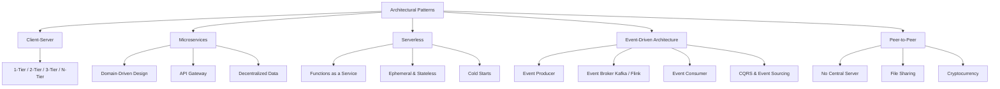

# Architectural Patterns — Theory Super

## Global Mind Map: How Architectural Patterns Connect

---

# 1. Client-Server Architecture

## The Problem — Centralizing Trust and Data
When many people use an application (like a banking app), your phone cannot be the only place that knows your bank balance. That information must live somewhere central and trusted. If users could execute business logic directly on their devices, they could tamper with their balances.

## What is Client-Server Architecture?
A system where one side asks for work (the Client) and the other side does the work and protects the data (the Server).
- **Client:** Browser, mobile app, or background job. "Can you do this for me?"
- **Server:** "Yes, no, or here is the result." Enforces rules, limits access, and talks to the database.

## Tiers (Evolution of the Architecture)
- **1-Tier:** UI, logic, and database all run on the exact same machine (e.g., a local desktop spreadsheet).
- **2-Tier:** Client talks directly to a Database server. Usually bad for the internet (security risk), okay for internal LAN tools.
- **3-Tier:** Presentation Layer (Client) -> Application Layer (Backend Server) -> Data Layer (Database). The gold standard for modern web apps.
- **N-Tier:** Adds API Gateways, Caches, Event Queues, and AI model endpoints.

## Why it Exists & Tradeoffs
- **Pros:** Centralized rules (fraud checks happen on the server, not the client), safer secrets (API keys don't leak to users), easier updates (change backend logic without updating the mobile app).
- **Cons:** Network Latency (every action takes a round trip), Single Point of Failure (if the server dies, the app stops), Scaling complexity (managing sessions and state).

---

# 2. Microservices Architecture

## The Problem — The Monolith Bottleneck
As an application grows, a massive single codebase (Monolith) becomes impossible to maintain. A bug in the "Recommendation" module crashes the "Payments" module. You can't deploy a tiny CSS fix without redeploying the entire gigabyte-sized application. You are forced into a "one-size-fits-all" technology stack.

## What are Microservices?
Taking the Single Responsibility Principle and applying it to infrastructure. An application is broken down into small, loosely coupled services that are developed, deployed, and maintained independently. 

## How it Works
- **Decomposition:** Broken down by *Business Capability* (e.g., User Management, Order Management, Inventory).
- **Decentralized Data:** The biggest rule is that **Services do not share databases.** If Service 2 needs Service 1's data, it calls Service 1's API. It never queries Service 1's database directly. If you share a DB, you lose the ability to change schemas safely.
- **Polyglot:** The User service can be written in Java + MySQL. The Analytics service can be written in Python + MongoDB.

## Common Patterns & Pitfalls
- **API Gateway:** Since IPs change and protocols differ, clients don't talk to microservices directly. They talk to a central API Gateway that routes the request.
- **Service Discovery:** Services use tools like Consul or etcd to find each other dynamically.
- **Bulkheads & Circuit Breakers:** Microservices are *not* resilient by default. If the Inventory service dies, the Order service will hang waiting for it. Circuit Breakers fail-fast to prevent cascading system collapse.
- **Monitoring:** You must use Centralized Logging (ELK stack) and Distributed Tracing. Otherwise, tracking a bug across 40 services is impossible.

---

# 3. Serverless Architecture

## The Problem — Paying for Idle Time and Managing Infrastructure
Running servers means paying for them 24/7, even when no one is using your app at 3 AM. It also means your engineers are wasting time patching Linux, configuring load balancers, and provisioning capacity for Black Friday spikes. 

## What is Serverless?
Serverless does not mean there are no servers. It means the cloud provider (AWS, GCP, Azure) manages the servers completely. You just upload a function, and the cloud provider runs it when an event happens. 

## How it Works (Functions as a Service - FaaS)
- **Event-Driven:** A function executes only when triggered (e.g., HTTP request, file uploaded to S3, database row inserted).
- **Ephemeral & Stateless:** The function spins up, runs, and dies. It saves nothing in memory. All state must be saved to an external database (like DynamoDB).
- **Auto-Scaling:** If 1 request comes in, 1 function runs. If 10,000 requests come in, 10,000 functions run in parallel instantly.
- **Pay-per-use:** You pay *only* for the milliseconds the code is actively executing.

## Tradeoffs
- **Cold Starts:** If a function hasn't run in a while, the cloud provider spins down the container. The next request has to wait for a new container to boot up (Cold Start), adding severe latency. (Mitigated by keeping functions "warm").
- **Vendor Lock-in:** Code written for AWS Lambda relies heavily on AWS API Gateway and S3, making it hard to move to Azure.
- **Limits:** Functions have strict execution time limits (e.g., max 15 minutes) and memory limits.

---

# 4. Event-Driven Architecture (EDA)

## The Problem — Synchronous Coupling
In a microservices world, if an Order Service directly calls the Payment, Inventory, and Shipping services via HTTP, it creates tight coupling. If the Shipping service goes down, the Order fails. This is slow and brittle.

## What is Event-Driven Architecture?
A system where components react to real-time events asynchronously. When a change happens, the system broadcasts a fact ("Order #123 Placed") to an event bus. Any system that cares about that fact consumes it and reacts.

## How it Works
1. **Producer:** Generates an event and pushes it to a broker. (Does not care who listens).
2. **Broker:** A highly scalable stream (e.g., Apache Kafka).
3. **Consumer:** Listens to the broker and pulls events to process.

## Advanced Patterns in EDA
- **Event Sourcing:** Instead of storing the *current state* of an object (e.g., User Balance = $50), you store *every event that ever happened* (Deposited $100, Withdrew $50). The current state is calculated by replaying the events. Gives you a perfect audit log and the ability to time-travel the system state.
- **CQRS (Command Query Responsibility Segregation):** Separates the Write path (Commands that generate events) from the Read path (Queries that read from a highly optimized materialized view).

## Pros & Cons
- **Pros:** Massive scalability, extreme loose coupling, highly fault-tolerant (if Shipping is down, the events just wait in Kafka until Shipping comes back online).
- **Cons:** **Eventual Consistency** (there is a delay before all systems reflect the change). Hard to debug (no clear linear request path). Event Ordering is difficult to guarantee at scale.

---

# 5. Peer-to-Peer (P2P) Architecture

## The Problem — Central Server Bottleneck
In a standard client-server model, if millions of people try to download a file from one server, the server's bandwidth is instantly overwhelmed, and it crashes. The server pays for all the bandwidth.

## What is Peer-to-Peer?
A decentralized network where every participant (node) acts as *both* a client and a server. They communicate directly with each other without a central authority.

## How it Works
- **Self-Organizing:** Nodes discover each other using Distributed Hash Tables (DHTs) or peer exchange. 
- **Resource Sharing:** Instead of downloading a file from a central server, you download tiny chunks of the file from 50 different peers simultaneously. As you download chunks, you immediately upload them to other peers. 

## Real-World Examples
- **File Sharing (BitTorrent):** The more popular a file is, the faster it downloads, because more peers are hosting it. (The exact opposite of a traditional server, which gets slower when popular).
- **Cryptocurrency (Bitcoin):** A P2P network maintains a decentralized ledger (blockchain). Nodes directly exchange and verify transactions.
- **Content Delivery Networks (P2P CDNs):** Users streaming a video share the video chunks with their neighbors, reducing load on the central CDN.

## Pros & Cons
- **Pros:** Infinite scalability (capacity grows as users grow), no single point of failure, massive cost savings on infrastructure, highly resilient to censorship.
- **Cons:** No central control (hard to enforce security policies), variable performance (depends entirely on the upload speed of random peers), Security risks (malicious peers), Legal/Copyright issues.
