# System Design Tradeoffs — Theory Super

## Global Mind Map: System Design Tradeoffs

```mermaid
graph TB
    TR[System Design Tradeoffs] --> SC[Scalability vs Performance]
    TR --> VH[Vertical vs Horizontal Scaling]
    TR --> CP[Concurrency vs Parallelism]
    TR --> LW[Long Polling vs WebSockets]
    TR --> BS[Batch vs Stream Processing]
    TR --> SS[Stateful vs Stateless]
    TR --> CE[Consistency: Strong vs Eventual]
    TR --> CACHE[Cache: Read-Through vs Write-Through]
    TR --> PP[Push vs Pull Architecture]
    TR --> RR[REST vs RPC]
    TR --> ASYNC[Synchronous vs Asynchronous]
    TR --> LT[Latency vs Throughput]

    VH --> V[Vertical: Scale Up]
    VH --> H[Horizontal: Scale Out]
    
    CE --> CAP[CAP Theorem]
    CE --> STRONG[Strong: Bank Balances]
    CE --> EVENTUAL[Eventual: Social Likes]
    
    ASYNC --> SYNC[Blocking]
    ASYNC --> ASYN[Non-Blocking via Queues]
    
    LT --> LAT[Latency: Time delay]
    LT --> THRU[Throughput: Volume over time]
```

---

# 1. Scalability vs. Performance
- **Scalability** is about size: "Can the system grow to handle more work?"
- **Performance** is about speed: "How fast can the system complete a task?"

**The Tradeoff:** They often pull in opposite directions. Adding more machines makes a system scalable, but coordinating tasks across them introduces network delays, reducing raw performance. Optimizing for pure performance on a single machine limits scalability when demand spikes.

---

# 2. Vertical vs. Horizontal Scaling

## The Problem — Hitting a Bottleneck
Scaling starts with a bottleneck: CPU, memory, disk I/O, network bandwidth, or a shared dependency. Once you identify the limit, you must add capacity.

## Vertical Scaling (Scaling Up)
Adding more resources (CPU, RAM, faster storage) to an *existing* node.
- **How it works:** Moving a database from 8 vCPU to 32 vCPU, or moving to a larger GPU instance.
- **Pros:** Extremely simple. Requires no code changes. Keeps related data together (great for databases and caches). Less coordination (no distributed locks or replica lag).
- **Cons:** Hard ceiling (you can only buy so large a machine). Single point of failure. Upgrades require process restarts/downtime.

## Horizontal Scaling (Scaling Out)
Adding *more* nodes (machines, containers, pods) and spreading work across them via a Load Balancer.
- **How it works:** Instead of one massive API server, you run 50 smaller API servers.
- **Pros:** Higher capacity ceiling. High availability (if one node dies, others survive). Easy to absorb traffic spikes.
- **Cons:** High complexity. Shared dependencies (the database) become a massive risk. Data consistency gets much harder (sharding, replication). Slower cross-node calls.

## When to Use Which?
- **Vertical:** Start here. Best for stateful systems (databases, search nodes) and when the bottleneck is simply a lack of RAM.
- **Horizontal:** Use for stateless API servers, background queue workers, and when you *must* survive machine failures.

---

# 3. Concurrency vs. Parallelism

## The Problem — Maximizing Processing Power
You have multiple tasks to perform, and you want to finish them as efficiently as possible using the CPU.

## Concurrency (Managing multiple things at once)
Concurrency means making progress on multiple tasks at the same time by rapidly switching between them (Context Switching).
- **How it works:** A single CPU core alternates between tasks so quickly it *feels* simultaneous. Threads are used to manage this.
- **Why it exists:** To prevent the CPU from sitting idle while waiting for slow I/O operations (like network calls or disk reads).
- **Example:** A web server handling 100 HTTP requests. While Request 1 waits for the database, the CPU switches to Request 2.

## Parallelism (Executing multiple things at once)
Parallelism means multiple tasks are executing simultaneously at the exact same millisecond.
- **How it works:** A task is split into independent subtasks, and each subtask is assigned to a *separate* physical CPU core or GPU core.
- **Why it exists:** For heavy, pure computation (CPU-bound tasks).
- **Example:** Video rendering, machine learning model training, 3D graphics.

---

# 4. Long Polling vs. WebSockets

## The Problem — Real-Time Updates
Traditional HTTP is "Client asks, server answers." The server cannot push data to the client proactively. Regular polling (asking every 1 second) wastes massive amounts of bandwidth if there's no new data.

## Long Polling
The client sends an HTTP request, but the server *holds the connection open* until it has new data (or times out).
- **How it works:** Client -> Request -> Server waits -> Data arrives -> Server Responds -> Client immediately requests again.
- **Pros:** Universally supported. Works through all firewalls/proxies. Simple standard HTTP.
- **Cons:** Re-establishing the connection after every update adds latency and overhead.
- **Example:** Simple chat, notification alerts.

## WebSockets
A full-duplex, persistent TCP connection between client and server.
- **How it works:** Client sends HTTP `Upgrade: websocket`. If accepted, the connection stays open indefinitely. Both sides can send data at any time.
- **Pros:** Ultra-low latency. Massive reduction in HTTP header overhead.
- **Cons:** Complex to manage connection state. Difficult to load-balance. Proxies might kill idle connections.
- **Example:** Multiplayer gaming, collaborative editing (Google Docs), live financial tickers.

---

# 5. Batch vs. Stream Processing

## Batch Processing
Collecting a massive volume of data over time and processing it all at once on a schedule.
- **Characteristics:** High throughput, high latency. 
- **How it works:** Data is stored in a warehouse -> A job runs (e.g., via Hadoop/Spark) -> Processes the whole dataset -> Outputs result.
- **Example:** Generating monthly payroll, end-of-day bank settlements.

## Stream Processing
Processing data in real-time as soon as it arrives, event by event.
- **Characteristics:** Low latency, continuous infinite flow.
- **How it works:** Data ingested via Kafka -> Processed instantly by Flink -> Dashboard updated in milliseconds.
- **Example:** Real-time credit card fraud detection, IoT sensor monitoring.

---

# 6. Stateful vs. Stateless Design

## Stateful Architecture
The server remembers client data (state) across multiple requests.
- **How it works:** Client connects -> Server creates a Session in memory (or Redis) -> Client sends ID on next request -> Server looks up history.
- **Pros:** Contextual continuity (shopping carts), personalized experience.
- **Cons:** Hard to scale. If using "Sticky Sessions" (routing client to the same server), the server failing destroys the session.
- **Example:** Multiplayer games, legacy enterprise apps.

## Stateless Architecture
The server retains absolutely no memory of previous interactions. Each request contains all necessary data.
- **How it works:** Client logs in -> Server issues a JWT (JSON Web Token) -> Client sends JWT with *every* request -> Server validates token mathematically, no database lookup required.
- **Pros:** Trivial horizontal scaling. Any server can handle any request. Highly resilient.
- **Cons:** Larger request payloads (tokens are sent every time). Harder to invalidate tokens instantly.
- **Example:** REST APIs, microservices.

---

# 7. Strong vs. Eventual Consistency (CAP Theorem)

## The Problem — Distributed Data
In a distributed system, data is replicated across multiple nodes. When a write happens to Node A, it takes time to copy that write to Node B. What happens if a user reads from Node B during that delay?

## CAP Theorem
You can only guarantee two out of three:
1. **Consistency:** Every read receives the most recent write.
2. **Availability:** Every request receives a non-error response.
3. **Partition Tolerance:** The system continues operating despite network failures.
*Because networks fail, Partition Tolerance is mandatory. You must choose between Consistency and Availability.*

## Strong Consistency
Once a write completes, *every* subsequent read returns the updated value.
- **How it works:** Node A receives write -> Synchronously coordinates with Node B and C (via consensus like Raft) -> Confirms write *only* when all agree.
- **Pros:** Predictable, perfectly accurate.
- **Cons:** High latency (waiting for global coordination). System goes down if nodes can't communicate.
- **Example:** Bank account balances, inventory management.

## Eventual Consistency
If no new updates are made, all replicas will *eventually* converge to the same value. Temporary inconsistencies are allowed.
- **How it works:** Node A receives write -> Confirms to user instantly -> Asynchronously replicates to Node B and C in the background.
- **Pros:** Blazing fast. Highly available even during network partitions.
- **Cons:** Users might read stale data. Complex conflict resolution (Last Write Wins, CRDTs).
- **Example:** Social media likes, YouTube view counts, CDN caching.

---

# 8. Read-Through vs. Write-Through Cache

## Read-Through Cache
The application always asks the cache for data. The cache manages the database.
- **How it works:** App asks Cache -> Cache Miss -> Cache queries Database -> Cache saves data -> Cache returns data to App.
- **Pros:** Simplified app logic. Great for read-heavy workloads.
- **Cons:** Initial read is slow (Cache Miss penalty). Data can become stale if the DB is updated directly.

## Write-Through Cache
Every write operation writes to *both* the cache and the database simultaneously.
- **How it works:** App writes to Cache -> Cache writes to Database -> Returns success only when *both* succeed.
- **Pros:** Absolute data consistency. Zero risk of data loss. Reads are always fast.
- **Cons:** High write latency. Wastes memory if written data is never read.

---

# 9. Push vs. Pull Architecture

## Push Architecture
Server initiates communication, pushing updates to clients as soon as they exist.
- **Pros:** Timely updates, reduced latency, no empty polling.
- **Cons:** Managing millions of persistent connections is hard. Server can overwhelm slow clients.
- **Example:** Mobile Push Notifications, Live Feeds.

## Pull Architecture
Client initiates communication, requesting data from the server.
- **Pros:** Client controls the pace. Highly scalable, simple to implement.
- **Cons:** Increased traffic from empty polling. Stale data between intervals.
- **Example:** Web browsing, standard REST APIs.

---

# 10. REST vs. RPC

## REST (Representational State Transfer)
Resource-oriented architecture. Everything is a noun (User, Order) manipulated by standard HTTP verbs (GET, POST, PUT, DELETE).
- **Pros:** Standardized, cacheable, highly scalable, universally understood.
- **Cons:** Verbose, over-fetching (getting 50 fields when you need 2), hard to model complex actions (e.g., `POST /users/1/calculate-taxes`).
- **Example:** Public-facing web APIs.

## RPC (Remote Procedure Call)
Action-oriented architecture. It looks like calling a local function, but it executes on a remote server.
- **How it works:** `getBooks()`, `addBook()`. Often uses gRPC over HTTP/2.
- **Pros:** High performance, low overhead, highly flexible for complex operations.
- **Cons:** Tight coupling between client and server. Less standardized. Harder to cache.
- **Example:** Internal microservice-to-microservice communication.

---

# 11. Synchronous vs. Asynchronous Communication

## Synchronous
Blocking operation. The sender stops and waits for the receiver to respond.
- **How it works:** HTTP Request-Response.
- **Pros:** Simple, immediate feedback, easy to debug.
- **Cons:** Tight coupling. If the receiver is slow, the sender is slow. Cascading failures.
- **Example:** User login validation.

## Asynchronous
Non-blocking operation. The sender fires a message and immediately moves on.
- **How it works:** Sender drops an event into a Message Queue (Kafka/RabbitMQ). Receiver pulls it later.
- **Pros:** Loose coupling, massive scalability, fault tolerance (if receiver dies, messages wait in the queue).
- **Cons:** Complex. Eventual consistency. Hard to debug distributed traces.
- **Example:** Sending email confirmations, video processing pipelines.

---

# 12. Latency vs. Throughput

- **Latency:** The *time delay* for a single packet of data to travel from source to destination (measured in milliseconds, ms). Influenced by physical distance (propagation), network congestion, and processing time.
- **Throughput:** The *volume* of data that successfully passes through the network over a specific time (measured in MBps or GBps). Influenced by bandwidth limits and packet loss.

**The Relationship:** 
You can have high throughput but terrible latency (shipping a hard drive full of data across the country via FedEx — huge throughput, multi-day latency).
- **To improve Latency:** Use CDNs to move data geographically closer to users.
- **To improve Throughput:** Increase bandwidth, optimize protocols (UDP vs TCP), use Quality of Service (QoS).
