# The Grand Unified Theory of System Design: A First-Principles Connected Summary

---

## The Connected Summary — From Atoms to Architecture

Every system begins with a single truth: a **Client** wants something from a **Server**. This is the **Client-Server Architecture** — the gravitational center of all system design. But for that conversation to happen, the client must first *find* the server. Since humans cannot memorize numerical **IP Addresses**, the **Domain Name System (DNS)** acts as the internet's phonebook, translating human-friendly names into machine-routable IPs. DNS itself relies on the **OSI Model's** layered abstraction — domain resolution operates at Layer 7 (Application), the resolved IP is a Layer 3 (Network) concept, and the actual bytes that carry the request will flow over either **TCP** (Layer 4, reliable and ordered, used by HTTP and databases) or **UDP** (Layer 4, fast and fire-and-forget, used by DNS lookups themselves, voice calls, and the modern **QUIC** protocol that powers HTTP/3). Data integrity across these layers is guarded by **Checksums** — from CRC at the Ethernet frame level to cryptographic SHA-256 hashes that verify downloaded files and container images end-to-end.

Once the client knows the server's address, communication follows a protocol. **HTTP** is the lingua franca of the web — a stateless, text-based request-response protocol operating at Layer 7, structured around methods (GET, POST, PUT, DELETE) and status codes (2xx success, 4xx client error, 5xx server error). But HTTP sends data in plain text, so **HTTPS** wraps it in **TLS encryption**, using a handshake that negotiates cipher suites, proves server identity via certificates, and establishes forward-secret session keys via ECDHE — ensuring that even if an attacker intercepts the packets, they cannot read or tamper with the content. The protocol itself has evolved: HTTP/1.1 introduced persistent connections but suffered head-of-line blocking; HTTP/2 multiplexed streams over a single TCP connection but remained vulnerable to TCP-level blocking; HTTP/3 runs over QUIC (built on UDP), eliminating stream-blocking entirely and enabling seamless connection migration between WiFi and cellular.

But HTTP alone is just a transport mechanism — it doesn't define *how* to structure the conversation. That's the role of **APIs (Application Programming Interfaces)**, which act as contracts and boundaries between systems: they specify what a caller can ask for, what data it must send, what it will receive back, what errors can occur, and who is authorized to call. APIs come in several flavors: **Public APIs** (Stripe, Google Maps) demand stable versioning, strong auth, and strict rate limits; **Internal APIs** connect microservices within an organization; and **Library APIs** (Python's standard library) operate within a single process. The dominant architectural style for web APIs is **REST (Representational State Transfer)**, which models everything as resources identified by URLs, manipulated by HTTP verbs, and communicated as JSON. REST is stateless (each request is self-contained), cacheable, and intuitive — but it suffers from **over-fetching** (returning 50 fields when you need 2) and **under-fetching** (requiring multiple round trips to assemble related data). **GraphQL**, introduced by Facebook, solves this by exposing a single endpoint where clients compose queries requesting exactly the fields they need — including nested relationships — in a single request. GraphQL's strongly-typed schema supports real-time **Subscriptions** (built on WebSockets) and evolves without versioning, but it trades caching simplicity (everything is POST) for query flexibility, and unguarded deeply-nested queries can trigger catastrophic database scans. For internal microservice-to-microservice communication, **RPC (Remote Procedure Call)** — particularly **gRPC** over HTTP/2 with Protocol Buffers — offers high-performance, low-overhead, action-oriented interfaces (e.g., `getBooks()`, `addBook()`) that look like local function calls but execute on remote servers.

Not all communication fits the request-response paradigm. **WebSockets** upgrade an HTTP connection into a persistent, full-duplex TCP channel where both client and server can push messages at any time with minimal overhead (as little as 2 bytes of framing), making them essential for real-time chat, collaborative editing (Google Docs), multiplayer gaming, and live financial tickers. The alternative — **Long Polling** — holds an HTTP connection open until the server has data, then immediately reconnects, which is universally compatible but adds reconnection overhead. When the need is inter-system event notification rather than real-time streaming, **Webhooks** flip the direction entirely: instead of polling, your app registers a callback URL with a provider (Stripe, GitHub), and when an event occurs, the provider pushes an HTTP POST to your endpoint — signed with an HMAC for authenticity and requiring idempotent processing because providers use at-least-once delivery. This push-versus-pull duality is itself a fundamental **System Design Tradeoff**: **Push Architectures** deliver timely updates with minimal empty traffic but struggle to manage millions of persistent connections, while **Pull Architectures** let clients control the pace but waste bandwidth on empty polls and tolerate stale data between intervals.

Now, the server must handle the request. But a single server has finite CPU, RAM, and disk — and when traffic grows, it becomes a bottleneck. **Scalability** is the system's ability to handle increased load by adding resources. **Vertical Scaling (Scaling Up)** — adding more CPU, RAM, or faster SSDs to the existing machine — is simple, requires no code changes, and keeps data local, but it hits a hard hardware ceiling, costs escalate exponentially, and the single machine remains a **Single Point of Failure (SPOF)**. A SPOF is any component whose failure takes down a critical user flow with no working alternative — and SPOFs hide not just in servers but in network gateways, DNS providers, deployment pipelines, and even the one human who knows the admin password. The antidote is **Horizontal Scaling (Scaling Out)** — adding more commodity machines and distributing the workload across them. Horizontal scaling is virtually limitless in the cloud, eliminates SPOF through redundancy, and is cost-effective — but it demands **stateless services** (session data must live in a shared store like Redis so any server can handle any request) and introduces distributed coordination complexity.

But with N servers, how does a client know which one to talk to? A **Load Balancer** sits between clients and the server pool, distributing incoming requests using algorithms: **Round Robin** cycles sequentially (simple but blind to server load), **Weighted Round Robin** assigns proportional traffic based on server capacity, **Least Connections** routes to the server with the fewest active tasks (excellent for long-lived connections), **Least Response Time** routes to the fastest responder (actively minimizing latency), and **IP Hash** deterministically maps a client IP to a specific server (enabling sticky sessions for stateful applications, but risking uneven distribution if one IP generates disproportionate traffic). Load balancers operate at Layer 4 (TCP — routing by port/IP, fast but blind to content) or Layer 7 (HTTP — routing by URL path, headers, or cookies, slower but intelligent).

Before the request even reaches the backend, it typically passes through a **Proxy** layer. A **Forward Proxy** sits in front of clients, hiding their IP addresses, enforcing access control, and caching content for a private network. A **Reverse Proxy** sits in front of servers, hiding backend infrastructure, acting as a Web Application Firewall (WAF) against DDoS and malicious traffic, handling SSL/TLS termination to offload encryption from backend servers, caching static assets, and often performing load balancing. In a microservices world, this reverse proxy evolves into an **API Gateway** — a centralized single entry point that handles authentication (verifying JWT tokens), authorization (checking permissions), **Rate Limiting** (preventing abuse by restricting how many requests a client can make per time window), request routing (forwarding to the correct microservice via service discovery), request/response transformation (e.g., converting REST to gRPC), **Circuit Breaking** (stopping traffic to a failing service to prevent cascading collapse), caching, and centralized logging and monitoring. Rate limiting itself is implemented through several algorithms with distinct tradeoffs: **Token Bucket** (allows controlled bursts, memory-intensive), **Leaky Bucket** (enforces perfectly smooth traffic, drops bursts), **Fixed Window Counter** (simple but vulnerable to the boundary problem where users exploit window edges), **Sliding Window Log** (perfectly accurate but disastrously memory-hungry), and **Sliding Window Counter** (the industry standard hybrid — accurate and memory-efficient by weighting overlapping fixed windows).

Network retries caused by failures introduce a deadly risk: a user clicking "Pay" might trigger duplicate charges if the server blindly processes every request. **Idempotency** is the mathematical property that makes retries safe — performing an operation multiple times yields the exact same result and side effects as performing it once. HTTP GET, PUT, and DELETE are naturally idempotent; POST is not, which is why payment APIs require **Idempotency Keys** — client-generated UUIDs attached to requests that the server checks against a database to detect and skip duplicates. The server must implement atomic reservation (inserting the key with a lease and `IN_PROGRESS` status) to handle concurrent retries, and must pass idempotency keys downstream to external providers (like Stripe) to prevent double-charging when the local database crashes after the external call succeeds.

Now, the request reaches the backend logic. In a **Monolithic Architecture**, all code lives in one giant codebase — simple to deploy initially but catastrophic at scale: a bug in the recommendation module crashes payments, a CSS fix requires redeploying the entire multi-gigabyte application, and the entire team is locked into a single technology stack. **Microservices Architecture** applies the Single Responsibility Principle to infrastructure: the application is decomposed into small, independent services (User Service, Payment Service, Inventory Service), each owning its own database (the cardinal rule: services never share databases), deployable independently, and potentially written in different languages and backed by different data stores (polyglot persistence). Services find each other through **Service Discovery** — a dynamic registry (Consul, etcd, Kubernetes DNS) where services register their IP addresses and ports. Discovery can be **Client-Side** (the calling service queries the registry directly and load-balances itself — no bottleneck but every client must implement discovery logic) or **Server-Side** (a central load balancer/gateway queries the registry and forwards — the client is simple but the gateway is a potential SPOF). The health of each service is monitored through **Heartbeats** — periodic "I'm alive" signals sent from nodes to a monitor, which triggers failover if heartbeats stop. Heartbeat monitoring must guard against **false positives** (network congestion delaying a heartbeat from a healthy node) and **split-brain** scenarios (a network partition causing both halves of a system to believe the other is dead).

Microservices communicating synchronously (direct HTTP/RPC calls) create tight coupling: if Service B is slow, Service A's threads block, and the slowness cascades upstream until the entire system collapses. The **Circuit Breaker** pattern prevents this by monitoring error rates and response times: in the **CLOSED** state, requests flow normally; when failures exceed a threshold, the breaker trips to **OPEN**, causing all requests to fail-fast instantly (returning an error without calling the broken service, freeing threads and giving it recovery time); after a timeout, it enters **HALF-OPEN**, allowing a limited number of test requests through — if they succeed, it closes; if they fail, it reopens. But the deeper solution to synchronous coupling is **Asynchronous Communication** via **Message Queues** — an intermediary buffer (RabbitMQ, Apache Kafka, AWS SQS) where **Producers** place messages and **Consumers** process them at their own pace. The queue decouples services in time and failure: the producer doesn't wait for the consumer, and if the consumer crashes, the message waits safely in the queue until it recovers. The **Acknowledgment (ACK)** mechanism is critical — a consumer receives a message, processes it, and sends an ACK; if it crashes before ACKing, the broker redelivers the message to another consumer. Because of at-least-once delivery, **consumers must be idempotent**. Queue patterns include **Work Queues** (spreading tasks across a pool of identical workers), **Priority Queues** (urgent tasks jump the line), **Delayed Queues** (hiding messages until a set time), and **Dead Letter Queues (DLQ)** — a quarantine for messages that fail processing repeatedly, preventing them from blocking the main queue while engineers investigate.

Beyond point-to-point queues, the **Publish-Subscribe (Pub/Sub)** pattern enables fan-out event distribution: a publisher emits a fact ("Order #123 Placed") to a named **Topic**, and every independent **Subscription** (Inventory, Email, Analytics, Fraud Detection) receives its own copy and reacts independently. Pub/Sub supports **Filtering** (subscriptions receive only matching messages, e.g., `region = 'EU'`) and two delivery modes: **Push** (the broker calls the subscriber's HTTP endpoint — great for webhooks but the endpoint must survive spikes) and **Pull** (subscribers fetch at their own pace — great for controlling batch sizes). Durability varies: Redis Pub/Sub only delivers to currently online subscribers; Google Cloud Pub/Sub saves messages until acknowledged; Kafka maintains a replayable, append-only log. This event-driven paradigm scales into full **Event-Driven Architecture (EDA)**, where components react to real-time events asynchronously via an event broker (Kafka). EDA enables advanced patterns like **Event Sourcing** — instead of storing current state (User Balance = $50), you store every event that ever happened (Deposited $100, Withdrew $50), deriving current state by replaying the event log, which gives you a perfect audit trail and the ability to "time-travel" system state — and **CQRS (Command Query Responsibility Segregation)**, which separates the write path (Commands that generate events) from the read path (Queries that read from highly optimized materialized views), allowing each to scale independently. Keeping distributed data stores (Elasticsearch, Redis, analytics warehouses) synchronized with the source-of-truth database is the job of **Change Data Capture (CDC)** — a mechanism that turns database changes into a real-time event stream. The gold standard is **Log-Based CDC** (reading the database's internal WAL/binlog via tools like Debezium + Kafka), which has zero impact on application queries and captures everything in perfect commit order. To solve the **Dual Write Problem** (where writing to the DB succeeds but publishing to Kafka fails), the **Transactional Outbox Pattern** writes both the business change and an event record into an `outbox` table in a single database transaction, then CDC tails the log and reliably streams those events to Kafka.

At the heart of the system is the **Database** — a dedicated server for storing, managing, and retrieving data. Data comes in fundamentally different shapes and access patterns, so no single database type fits all: **Relational (SQL) databases** (MySQL, PostgreSQL) store data in tables with strict schemas, enforce **ACID** properties — **Atomicity** (all-or-nothing transactions, achieved via undo/redo logs), **Consistency** (every committed transaction leaves the database in a valid state per defined constraints), **Isolation** (concurrent transactions don't interfere, enforced through isolation levels from Read Uncommitted to Serializable), and **Durability** (committed data survives crashes, achieved via the **Write-Ahead Log (WAL)** that logs changes to disk before acknowledging them) — and excel at complex JOIN queries and strict data integrity (banking, healthcare). **NoSQL databases** trade strict consistency for horizontal scalability and flexible schemas: **Key-Value Stores** (Redis, DynamoDB) for sessions, caches, and simple lookups; **Document Stores** (MongoDB) for JSON-like objects with flexible schemas (user profiles, catalogs); **Wide-Column Stores** (Cassandra) for massive write throughput and time-series data; **Graph Databases** (Neo4j) for highly interconnected data (social networks, fraud detection, recommendations); **Time-Series databases** (InfluxDB) for timestamped data (monitoring, IoT); **Search databases** (Elasticsearch) for full-text indexing and ranking; **Vector databases** (Pinecone, Milvus) for AI/ML similarity search; and **Blob Datastores** (Amazon S3) for massive unstructured binary files (images, videos). The SQL-versus-NoSQL choice maps to a deeper tradeoff: SQL databases guarantee strict **ACID** transactions but scale vertically (bigger server = more expensive and still a SPOF); NoSQL databases follow **BASE** semantics (Basically Available, Soft state, Eventual consistency), sacrifice immediate consistency, but scale horizontally by design.

To make database reads fast, **Database Indexing** creates auxiliary data structures — like a book's index — that store sorted column values with pointers to actual rows, enabling the database to jump directly to matching data instead of scanning every row. **B-Tree Indexes** (the default) support equality, range, and sorted queries; **Hash Indexes** are blazing fast for exact equality but useless for ranges; **Bitmap Indexes** are powerful for analytics on low-cardinality columns (status, region); **Composite Indexes** cover multi-column queries (ordered by equality filters, then ranges, then sorts); and **Covering Indexes** contain all columns needed by a query, enabling index-only scans that never touch the table. But indexes are not free: they consume storage and memory, and every write must update every affected index, slowing insertions and updates. Another read optimization is **Denormalization** — intentionally duplicating data by pre-joining tables (e.g., embedding comments as JSON inside a post row) to eliminate expensive runtime JOINs, trading write complexity and storage for read speed. **Materialized Views** take this further by pre-computing and storing complex aggregation query results on disk, perfect for dashboards that don't need real-time precision. At the probabilistic frontier, **Bloom Filters** — space-efficient bit arrays hashed K times — answer "Is this key *definitely not* present?" with zero false negatives, saving expensive disk reads in LSM-Tree databases (Cassandra, RocksDB), preventing cache penetration, and avoiding duplicate URL fetches in web crawlers. They never give false negatives, but can give false positives (requiring a verification lookup), cannot delete items, and must be sized in advance.

When a single database server maxes out, the data itself must be distributed. **Replication** creates exact copies across multiple servers: a **Primary (Leader)** handles all writes, and **Read Replicas** handle read queries, spreading read load and providing redundancy — if the Primary fails, a replica can be promoted via **Failover** (the automated process of switching traffic from a failed primary to a standby, detected via heartbeat monitoring). Replication can be **Synchronous** (the primary waits for the replica to acknowledge before confirming the write — zero data loss but high write latency) or **Asynchronous** (the primary confirms immediately and syncs in the background — fast writes but risks replication lag and data loss if the primary dies before syncing). **Multi-Leader (Active-Active)** replication allows writes in multiple regions simultaneously, eliminating cross-region write latency but requiring complex **Conflict Resolution** (Last-Write-Wins, CRDTs). When even replication isn't enough — when writes or total data volume exceed a single machine — **Sharding (Horizontal Partitioning)** splits the dataset across multiple servers by rows based on a **Shard Key** (e.g., `user_id`). Sharding strategies include **Hash-Based** (`hash(key) % N` — even distribution but painful resharding), **Range-Based** (sequential ranges — good for range queries but prone to hotspots on sequential keys), and **Directory-Based** (a lookup service maps keys to shards — flexible but introduces a SPOF). Sharding's costs are severe: scatter-gather queries without the shard key must hit every shard; cross-shard JOINs are impossible natively; cross-shard transactions require complex two-phase commit; and rebalancing data without downtime is exceptionally difficult. Complementing horizontal sharding, **Vertical Partitioning** splits a wide table by columns based on access patterns — putting frequently accessed columns (ID, Name, Price) in one table and large rarely accessed columns (Description, Bio, Image Blobs) in another — reducing unnecessary disk I/O.

Distributed databases face a fundamental physics constraint codified by the **CAP Theorem**: no distributed system can simultaneously guarantee **Consistency** (every read returns the most recent write), **Availability** (every request receives a non-error response), and **Partition Tolerance** (the system operates despite network failures between nodes). Since network partitions are inevitable, the system must choose: **CP Systems** (Consistency + Partition Tolerance) — like banking ATMs — reject requests during partitions to prevent incorrect data; **AP Systems** (Availability + Partition Tolerance) — like Amazon shopping carts and Cassandra — always respond, even with potentially stale data, resolving conflicts later through **Eventual Consistency** (given enough time without new updates, all replicas converge to the same value). This Strong-vs-Eventual consistency tradeoff permeates every layer: strong consistency (achieved via consensus algorithms like **Raft/Paxos** for crash-fault tolerance or **pBFT** for Byzantine-fault tolerance) is essential for bank balances and inventory reservations; eventual consistency is acceptable for social media likes, YouTube view counts, and CDN caches. **Consensus algorithms** solve the fundamental problem of getting multiple nodes to agree on a value (Who is the leader? Was this transaction committed?) in the face of node crashes and network failures — Raft elects a leader and replicates a log; pBFT tolerates up to 1/3 malicious nodes by requiring 2/3 matching replies.

Coordinating access to shared resources across distributed nodes requires **Distributed Locking** — but naively using TTL-based locks (like Redis) is dangerous because a garbage collection pause can cause a client to hold an expired lock and overwrite another client's data. The safe solution is **Fencing Tokens** — strictly increasing tokens issued with each lock acquisition, checked by the storage system, ensuring that a stale client's writes are rejected. For correctness-critical locks, use consensus systems like ZooKeeper (not Redis/Redlock, which assumes perfectly synchronized clocks). At massive scale (25,000+ nodes in a Cassandra cluster), centralized coordination is itself a bottleneck. The **Gossip Protocol** (epidemic protocol) solves this: every node periodically shares its state with a few random peers, spreading information exponentially in O(log N) rounds — using **Anti-Entropy** (full dataset comparison via Merkle Trees) for reliable but heavy synchronization, or **Rumor-Mongering** (sharing only latest updates) for lightweight but eventually-consistent propagation. Gossip is infinitely scalable, decentralized, and resilient to partitions, but inherently eventually consistent.

Between the database and the application sits the **Cache** — a fast in-memory layer (Redis, Memcached) that stores copies of frequently accessed data to avoid hitting the slow disk-based database repeatedly. The **80/20 Rule** dictates that 20% of data serves 80% of requests, so caching focuses on this "hot" data. Caching strategies define how reads and writes interact with the cache and database: **Cache-Aside (Lazy Loading)** — the application manually checks the cache, on miss queries the DB and populates the cache (resilient but first-read-cold); **Read-Through** — the cache itself fetches from the DB on a miss (simplified app logic); **Write-Through** — every write hits both cache and DB synchronously (perfect consistency but slow writes); **Write-Around** — writes bypass the cache entirely (prevents cache pollution for rarely-read data); and **Write-Back** — writes hit the cache and return instantly while the cache syncs to the DB asynchronously (lightning-fast but risks data loss if the cache crashes). When cache memory fills, **Eviction Policies** decide what to discard: **LRU (Least Recently Used)** — evicts the item not accessed for the longest time, matching real-world access patterns perfectly; **LFU (Least Frequently Used)** — evicts the item with the lowest access count, great for long-term hot items but requires decay mechanisms; **FIFO** — evicts the oldest inserted item regardless of usage; **TTL** — items expire automatically after a set lifespan, guaranteeing stale data is eventually flushed. The **Thundering Herd Problem** occurs when a highly popular cache entry expires and hundreds of concurrent requests simultaneously miss the cache and slam the database — solved by per-key locking or background refresh before TTL expires. For extreme performance, **Two-Tiered Caching** combines a local in-memory cache (ultra-fast, zero network hops) with a distributed Redis cluster (consistent across all servers), but at the cost of enormous complexity keeping tiers synchronized.

At the distributed cache level, routing cache requests to the correct node uses **Consistent Hashing** — a technique that places both servers and keys on a circular hash ring, where each key is owned by the first server encountered clockwise. When a node is added or removed, only the keys immediately adjacent to it on the ring need to move (approximately 1/N of all keys), avoiding the catastrophic **cache miss storm** that naive modulo hashing (`hash(key) % N`) causes when the cluster size changes. **Virtual Nodes (vnodes)** — hashing each physical server hundreds of times onto the ring — guarantee smooth, even distribution of keys.

Static assets — images, CSS, JavaScript, fonts, videos — are served not from the origin server but from a **Content Delivery Network (CDN)**, a global network of edge servers (Points of Presence / PoPs) that cache content geographically close to users. When a user resolves a CDN-hosted domain, **Anycast** or **GeoDNS** routes them to the nearest healthy edge node, which returns the cached file in milliseconds (cache hit) or fetches it from the origin, caches it, and serves it (cache miss). CDN cache key design is critical: the default key (Scheme + Host + Path + QueryString) works for most static assets, but including headers like `Cookie` in the key destroys hit ratios. Cache invalidation — famously one of the two hardest problems in computer science — is managed through **Versioned URLs** (uploading `app-v2.js` and changing the HTML reference, letting `app-v1.js` age out naturally), short TTLs, and manual purges (dangerous, error-prone, and spike-inducing). Advanced CDN patterns include **Origin Shielding** (collapsing simultaneous edge misses from multiple PoPs into a single origin hit via a regional shield node) and **Stale-While-Revalidate** (serving slightly stale content instantly while fetching fresh content from the origin in the background). CDNs also act as massive shields against DDoS attacks by absorbing traffic across hundreds of globally distributed nodes.

All of this infrastructure must be **observable**. **Distributed Tracing** assigns a unique **Trace ID** to every request at the system's edge, propagating it through HTTP headers to every downstream microservice. Each operation within a service creates a **Span** (with start time, end time, and parent span ID), building a hierarchical tree that reveals exactly which service, which database query, or which external API call caused a 5-second delay. Tracing reduces **Mean Time To Recovery (MTTR)** by eliminating blame-shifting war rooms — the trace proves where the latency lives. Sampling strategies manage the data volume: head-based sampling randomly picks 1% of requests upfront (risking missing the one buggy trace), while tail-based sampling keeps traces only when errors or high latency occur.

The system must also survive the worst: ransomware, earthquakes, datacenter fires, or an intern dropping a production table. **Disaster Recovery (DR)** is governed by two metrics: **RPO (Recovery Point Objective)** — the maximum age of data you can tolerate losing (drives backup frequency) — and **RTO (Recovery Time Objective)** — the maximum downtime the business can survive (drives failover automation). DR strategies range from cold backups (high RPO/RTO, cheap) to hot DR sites (near-zero RPO/RTO, massively expensive), and are built on deep **Fault Tolerance** — multi-layered redundancy spanning node-level survival (Kubernetes restarting crashed pods), Availability Zone-level survival (deploying across multiple isolated data centers), region-level survival (cross-geographic database replication), and even cloud-level survival (multi-cloud architectures spanning AWS + GCP). Availability is measured in **Nines** — 99.9% (three nines) allows 8.76 hours of downtime per year; 99.99% (four nines) allows only 52.6 minutes — achieved through **Active-Passive** redundancy (a standby takes over on failure) or **Active-Active** redundancy (all components handle traffic, the load balancer simply stops sending to failed ones). **Reliability** — whether the system does what it *should* correctly — is measured by MTBF (how often things break), MTTR (how fast you fix them), error rates, and most critically, data correctness (a successful HTTP 200 that returns wrong data is a reliability failure). Defenses include **Graceful Degradation** (if the recommendation engine fails, show "Trending Items" instead of crashing the page) and **Circuit Breakers** (fail-fast to prevent cascading collapse).

How you wire these pieces together defines your **Architectural Pattern**. The simplest is **Client-Server** (N-Tier), evolving from 1-Tier (everything on one machine) to 3-Tier (Presentation → Application → Data) to N-Tier (adding API Gateways, caches, event queues, AI endpoints). **Microservices** decompose by business capability with decentralized data and polyglot tech stacks. **Serverless** (Functions as a Service / FaaS) — exemplified by AWS Lambda — eliminates infrastructure management entirely: functions execute only when triggered (event-driven), are ephemeral and stateless, auto-scale from 1 to 10,000 instances instantly, and bill per millisecond of execution — but suffer from **Cold Starts** (latency when a dormant container boots) and vendor lock-in. **Event-Driven Architecture (EDA)** — where producers broadcast facts to an event broker (Kafka) and consumers react independently — enables massive scalability, extreme loose coupling, and fault tolerance (if a consumer is down, events wait in Kafka until it recovers), but introduces eventual consistency, event ordering challenges, and debugging complexity. At the far end of decentralization, **Peer-to-Peer (P2P)** architecture eliminates the central server entirely: every node is both client and server, sharing resources directly (BitTorrent file sharing, Bitcoin blockchain, P2P CDNs) — infinitely scalable with no SPOF, but with no central control, variable performance, and security risks.

Every decision in system design is a **tradeoff**. **Scalability vs. Performance**: adding machines increases capacity but coordination overhead reduces single-request speed. **Vertical vs. Horizontal Scaling**: simplicity and data locality vs. limitless capacity and fault tolerance. **Stateful vs. Stateless**: contextual continuity (shopping carts, game sessions) vs. trivial horizontal scaling (any server handles any request, using JWTs for authentication). **Synchronous vs. Asynchronous**: simplicity and immediate feedback vs. loose coupling, massive scalability, and fault tolerance via message queues. **Batch vs. Stream Processing**: high-throughput scheduled processing of accumulated data (Hadoop/Spark for monthly payroll, end-of-day settlements) vs. low-latency real-time event processing (Kafka/Flink for fraud detection, IoT monitoring). **Concurrency vs. Parallelism**: managing multiple tasks on one core via context switching (handling 100 HTTP requests while waiting for I/O) vs. executing multiple tasks simultaneously across multiple cores (video rendering, ML training). **Latency vs. Throughput**: the time delay for a single operation (improved by CDNs, caching, edge computing) vs. the volume of operations completed per unit time (improved by horizontal scaling, async processing, batching). And threading through everything, the **CAP Theorem** forces the ultimate distributed-data tradeoff: consistency or availability when the network inevitably partitions.

What makes system design beautiful is that these concepts are not isolated — they are deeply, recursively interconnected. DNS resolution uses UDP, which is a Layer 4 protocol in the OSI model. CDNs use DNS (GeoDNS/Anycast) to route users to the nearest edge server, which caches static assets using TTL-based eviction, reducing latency. The API Gateway is a reverse proxy that performs load balancing, rate limiting (using Token Bucket or Sliding Window Counter algorithms), authentication, circuit breaking, and request routing to microservices discovered via service discovery. Microservices communicate asynchronously via message queues (ensuring idempotent consumers), read fast data from distributed caches (routed via consistent hashing), and read/write persistent data to databases (scaled via replication and sharding, subject to the CAP theorem's consistency-availability tradeoff). Event-Driven Architecture uses Pub/Sub for fan-out, message queues for work distribution, CDC for keeping read models synchronized, and the Transactional Outbox Pattern for reliable event publishing. Fault tolerance layers redundancy from individual pods (heartbeats + failover) to availability zones to geographic regions, measured by availability nines and governed by disaster recovery RPO/RTO targets. And distributed tracing stitches the observability thread through every layer — from the API Gateway through each microservice through every database query — so that when something breaks in this beautifully complex machine, you can find exactly where, and exactly why.

---

## Grand Unified Mind Map — How Every Concept Connects

```mermaid
graph TB
    %% ============================================================
    %% LAYER 0: THE FOUNDATION — Client, Server, and Finding Each Other
    %% ============================================================
    
    CLIENT["👤 Client<br/>(Browser / Mobile App)"]
    SERVER["🖥️ Server<br/>(Backend Application)"]
    CS_ARCH["Client-Server Architecture<br/>(1-Tier → N-Tier)"]
    
    CLIENT -->|"Wants data from"| SERVER
    CLIENT -.->|"Follows"| CS_ARCH
    
    %% --- Addressing & Resolution ---
    IP["IP Addresses<br/>(IPv4 / IPv6 / CIDR)"]
    DNS["DNS<br/>(Domain Name System)"]
    NAT["NAT<br/>(Network Address Translation)"]
    
    CLIENT -->|"1. Resolve domain name"| DNS
    DNS -->|"Returns"| IP
    IP -.->|"Private→Public rewrite"| NAT

    %% ============================================================
    %% LAYER 1: THE NETWORK — OSI, Protocols, Integrity
    %% ============================================================

    OSI["OSI Model<br/>(7 Layers)"]
    TCP["TCP<br/>(Reliable, Ordered)"]
    UDP["UDP<br/>(Fast, Fire-and-Forget)"]
    QUIC["QUIC<br/>(UDP + TLS + Reliability)"]
    CHECKSUM["Checksums<br/>(CRC, SHA-256, HMAC)"]

    DNS -.->|"Runs over"| UDP
    OSI -->|"Layer 3: Network"| IP
    OSI -->|"Layer 4: Transport"| TCP
    OSI -->|"Layer 4: Transport"| UDP
    TCP -.->|"Evolved into"| QUIC
    UDP -.->|"Foundation of"| QUIC
    TCP -.->|"Error detection via"| CHECKSUM
    UDP -.->|"Error detection via"| CHECKSUM

    %% ============================================================
    %% LAYER 2: THE PROTOCOL — HTTP, HTTPS, TLS
    %% ============================================================

    HTTP["HTTP<br/>(Request-Response Protocol)"]
    HTTPS["HTTPS<br/>(HTTP + TLS Encryption)"]
    HTTP_VERSIONS["HTTP Versions<br/>(1.1 → 2 → 3/QUIC)"]

    OSI -->|"Layer 7: Application"| HTTP
    HTTP -->|"Secured by TLS"| HTTPS
    HTTP -.->|"Versions"| HTTP_VERSIONS
    HTTP_VERSIONS -.->|"HTTP/3 runs over"| QUIC
    HTTP -->|"Runs over"| TCP

    %% ============================================================
    %% LAYER 3: THE API CONTRACT — REST, GraphQL, RPC, Real-Time
    %% ============================================================

    API["APIs<br/>(Contracts & Boundaries)"]
    REST["REST<br/>(Resource-Oriented)"]
    GRAPHQL["GraphQL<br/>(Query Language)"]
    RPC["RPC / gRPC<br/>(Action-Oriented)"]
    WEBSOCKETS["WebSockets<br/>(Full-Duplex Persistent)"]
    WEBHOOKS["Webhooks<br/>(Push-Based Callbacks)"]
    LONG_POLLING["Long Polling<br/>(Held HTTP Connection)"]
    IDEMPOTENCY["Idempotency<br/>(Safe Retries via Keys)"]

    HTTP -->|"Defines transport for"| API
    API -->|"Architectural styles"| REST
    API -->|"Architectural styles"| GRAPHQL
    API -->|"Architectural styles"| RPC
    API -->|"Real-time protocols"| WEBSOCKETS
    API -->|"Event notifications"| WEBHOOKS
    API -.->|"Near-real-time"| LONG_POLLING
    REST -.->|"POST needs"| IDEMPOTENCY
    WEBHOOKS -.->|"Requires"| IDEMPOTENCY
    WEBSOCKETS -.->|"Upgrades from"| HTTP
    GRAPHQL -.->|"Subscriptions via"| WEBSOCKETS

    %% ============================================================
    %% LAYER 4: THE GATEWAY — Proxy, API Gateway, Rate Limiting
    %% ============================================================

    FWD_PROXY["Forward Proxy<br/>(Client-Side Middleman)"]
    REV_PROXY["Reverse Proxy<br/>(Server-Side Gatekeeper)"]
    API_GATEWAY["API Gateway<br/>(Centralized Entry Point)"]
    RATE_LIMITING["Rate Limiting<br/>(Token Bucket, Sliding Window)"]
    AUTH["Authentication & Authorization<br/>(JWT, OAuth, mTLS)"]
    CIRCUIT_BREAKER["Circuit Breaker<br/>(Open / Closed / Half-Open)"]

    CLIENT -->|"May route through"| FWD_PROXY
    CLIENT -->|"2. Send request to"| REV_PROXY
    REV_PROXY -.->|"Evolves into"| API_GATEWAY
    API_GATEWAY -->|"Enforces"| RATE_LIMITING
    API_GATEWAY -->|"Verifies"| AUTH
    API_GATEWAY -->|"Protects backends via"| CIRCUIT_BREAKER
    API_GATEWAY -->|"Handles SSL/TLS"| HTTPS
    REV_PROXY -.->|"Acts as WAF"| RATE_LIMITING

    %% ============================================================
    %% LAYER 5: TRAFFIC DISTRIBUTION — Load Balancing, Scaling
    %% ============================================================

    LB["Load Balancer<br/>(Round Robin, Least Conn, IP Hash)"]
    V_SCALE["Vertical Scaling<br/>(Scale Up: More CPU/RAM)"]
    H_SCALE["Horizontal Scaling<br/>(Scale Out: More Machines)"]
    SCALABILITY["Scalability<br/>(Grow Without Overhaul)"]
    SPOF["Single Point of Failure<br/>(Achilles Heel)"]
    STATELESS["Stateless Design<br/>(JWT, No Server Memory)"]
    STATEFUL["Stateful Design<br/>(Sessions, Sticky Routing)"]

    API_GATEWAY -->|"Routes to"| LB
    LB -->|"Distributes traffic across"| H_SCALE
    SCALABILITY -->|"Strategy 1"| V_SCALE
    SCALABILITY -->|"Strategy 2"| H_SCALE
    H_SCALE -.->|"Requires"| STATELESS
    H_SCALE -.->|"Eliminates"| SPOF
    V_SCALE -.->|"Retains risk of"| SPOF
    LB -.->|"IP Hash enables"| STATEFUL

    %% ============================================================
    %% LAYER 6: PERFORMANCE METRICS
    %% ============================================================

    LATENCY["Latency<br/>(Delay per Request, ms)"]
    THROUGHPUT["Throughput<br/>(Requests Per Second)"]
    BANDWIDTH["Bandwidth<br/>(Max Network Capacity, Gbps)"]
    AVAILABILITY["Availability<br/>(Uptime %, The Nines)"]
    RELIABILITY["Reliability<br/>(Correctness: MTBF, MTTR)"]

    SCALABILITY -.->|"Measured by"| THROUGHPUT
    LATENCY -.->|"Reduced by"| CDN
    LATENCY -.->|"Reduced by"| CACHE_SYSTEM
    THROUGHPUT -.->|"Capped by"| BANDWIDTH
    THROUGHPUT -.->|"Improved by"| H_SCALE
    AVAILABILITY -.->|"Achieved via"| REDUNDANCY
    RELIABILITY -.->|"Defended by"| CIRCUIT_BREAKER
    RELIABILITY -.->|"Defended by"| IDEMPOTENCY

    %% ============================================================
    %% LAYER 7: MICROSERVICES & DISTRIBUTED SYSTEMS
    %% ============================================================

    MICROSERVICES["Microservices<br/>(Independent Services, Own DBs)"]
    MONOLITH["Monolith<br/>(Single Codebase)"]
    SVC_DISCOVERY["Service Discovery<br/>(Registry: Consul, etcd, K8s DNS)"]
    HEARTBEATS["Heartbeats<br/>(Alive Signals, Push/Pull)"]
    FAILOVER["Failover<br/>(Automated Primary→Standby)"]
    REDUNDANCY["Redundancy<br/>(Active-Active / Active-Passive)"]
    FAULT_TOLERANCE["Fault Tolerance<br/>(Node → AZ → Region → Cloud)"]
    GRACEFUL_DEG["Graceful Degradation<br/>(Show Fallback, Not Crash)"]

    MONOLITH -.->|"Decomposes into"| MICROSERVICES
    LB -->|"Sends traffic to"| MICROSERVICES
    MICROSERVICES -->|"Find each other via"| SVC_DISCOVERY
    SVC_DISCOVERY -.->|"Registered via"| HEARTBEATS
    HEARTBEATS -->|"Triggers"| FAILOVER
    FAILOVER -.->|"Requires"| REDUNDANCY
    REDUNDANCY -->|"Enables"| FAULT_TOLERANCE
    REDUNDANCY -->|"Enables"| AVAILABILITY
    FAULT_TOLERANCE -.->|"Fallback via"| GRACEFUL_DEG
    API_GATEWAY -.->|"Routes to"| MICROSERVICES

    %% ============================================================
    %% LAYER 8: ASYNCHRONOUS COMMUNICATION
    %% ============================================================

    MSG_QUEUE["Message Queues<br/>(RabbitMQ, SQS, Kafka)"]
    PUBSUB["Publish-Subscribe<br/>(Topics, Fan-Out)"]
    DLQ["Dead Letter Queue<br/>(Failed Message Quarantine)"]
    ACK["Acknowledgment<br/>(Consumer ACK/NACK)"]
    CDC["Change Data Capture<br/>(WAL/Binlog Streaming)"]
    OUTBOX["Transactional Outbox Pattern<br/>(Atomic DB + Event Write)"]
    ASYNC_COMM["Asynchronous Communication<br/>(Non-Blocking, Decoupled)"]
    SYNC_COMM["Synchronous Communication<br/>(Blocking, Request-Response)"]

    MICROSERVICES -->|"Async via"| MSG_QUEUE
    MICROSERVICES -->|"Sync via"| SYNC_COMM
    SYNC_COMM -.->|"Risk: Cascading failure"| CIRCUIT_BREAKER
    MSG_QUEUE -->|"Pattern"| PUBSUB
    MSG_QUEUE -->|"Failed messages →"| DLQ
    MSG_QUEUE -->|"Delivery guarantee via"| ACK
    ACK -.->|"Consumers must be"| IDEMPOTENCY
    MSG_QUEUE -.->|"Belongs to"| ASYNC_COMM
    PUBSUB -.->|"Delivery via"| WEBHOOKS
    CDC -.->|"Streams DB changes to"| MSG_QUEUE
    OUTBOX -.->|"Reliable publish via"| CDC

    %% ============================================================
    %% LAYER 9: ARCHITECTURAL PATTERNS
    %% ============================================================

    EDA["Event-Driven Architecture<br/>(React to Events via Broker)"]
    EVENT_SOURCING["Event Sourcing<br/>(Store Events, Replay State)"]
    CQRS["CQRS<br/>(Separate Read/Write Paths)"]
    SERVERLESS["Serverless / FaaS<br/>(Ephemeral, Auto-Scale, Pay-per-Use)"]
    P2P["Peer-to-Peer<br/>(Decentralized, No Central Server)"]
    BATCH["Batch Processing<br/>(Hadoop/Spark, Scheduled)"]
    STREAM["Stream Processing<br/>(Kafka/Flink, Real-Time)"]

    ASYNC_COMM -->|"Enables"| EDA
    EDA -->|"Advanced pattern"| EVENT_SOURCING
    EDA -->|"Advanced pattern"| CQRS
    EDA -.->|"Uses"| MSG_QUEUE
    CQRS -.->|"Read side uses"| MAT_VIEWS
    SERVERLESS -.->|"Event-triggered by"| EDA
    SERVERLESS -.->|"Auto-scales like"| H_SCALE
    P2P -.->|"Eliminates"| SPOF
    BATCH -.->|"High throughput, high latency"| THROUGHPUT
    STREAM -.->|"Low latency, continuous"| LATENCY
    STREAM -.->|"Powered by"| MSG_QUEUE

    %% ============================================================
    %% LAYER 10: DATABASES
    %% ============================================================

    DATABASE["Databases<br/>(Persistent Data Storage)"]
    SQL["SQL / Relational<br/>(MySQL, PostgreSQL)"]
    NOSQL["NoSQL<br/>(Flexible, Horizontally Scalable)"]
    KV_STORE["Key-Value Store<br/>(Redis, DynamoDB)"]
    DOC_STORE["Document Store<br/>(MongoDB)"]
    WIDE_COL["Wide-Column<br/>(Cassandra)"]
    GRAPH_DB["Graph DB<br/>(Neo4j)"]
    TIMESERIES["Time-Series DB<br/>(InfluxDB)"]
    SEARCH_DB["Search DB<br/>(Elasticsearch)"]
    VECTOR_DB["Vector DB<br/>(Pinecone, Milvus)"]
    BLOB_STORE["Blob Storage<br/>(Amazon S3)"]
    ACID["ACID Transactions<br/>(Atomicity, Consistency,<br/>Isolation, Durability)"]
    WAL["Write-Ahead Log<br/>(Crash Recovery)"]
    BASE["BASE Semantics<br/>(Basically Available,<br/>Soft State, Eventually Consistent)"]

    MICROSERVICES -->|"Read/Write to"| DATABASE
    DATABASE -->|"Type"| SQL
    DATABASE -->|"Type"| NOSQL
    NOSQL --> KV_STORE
    NOSQL --> DOC_STORE
    NOSQL --> WIDE_COL
    NOSQL --> GRAPH_DB
    NOSQL --> TIMESERIES
    NOSQL --> SEARCH_DB
    NOSQL --> VECTOR_DB
    DATABASE -->|"Unstructured files"| BLOB_STORE
    SQL -->|"Guarantees"| ACID
    ACID -.->|"Durability via"| WAL
    NOSQL -.->|"Follows"| BASE
    CDC -.->|"Reads"| WAL

    %% ============================================================
    %% LAYER 11: DATABASE SCALING & OPTIMIZATION
    %% ============================================================

    INDEXING["Database Indexing<br/>(B-Tree, Hash, Bitmap, Composite)"]
    DENORM["Denormalization<br/>(Pre-Join for Read Speed)"]
    MAT_VIEWS["Materialized Views<br/>(Pre-Computed Aggregations)"]
    BLOOM["Bloom Filters<br/>(Probabilistic Existence Check)"]
    REPLICATION["Replication<br/>(Primary + Read Replicas)"]
    SHARDING["Sharding<br/>(Horizontal Partitioning by Shard Key)"]
    VERT_PARTITION["Vertical Partitioning<br/>(Split Table by Columns)"]
    SYNC_REP["Synchronous Replication<br/>(Zero Data Loss, High Latency)"]
    ASYNC_REP["Asynchronous Replication<br/>(Fast Writes, Risk of Loss)"]
    MULTI_LEADER["Multi-Leader Replication<br/>(Active-Active, Conflict Resolution)"]

    DATABASE -->|"Read optimization"| INDEXING
    DATABASE -->|"Read optimization"| DENORM
    DATABASE -->|"Read optimization"| MAT_VIEWS
    DATABASE -->|"Existence check"| BLOOM
    DATABASE -->|"Read scaling"| REPLICATION
    DATABASE -->|"Write + Storage scaling"| SHARDING
    DATABASE -->|"Column splitting"| VERT_PARTITION
    REPLICATION -->|"Mode"| SYNC_REP
    REPLICATION -->|"Mode"| ASYNC_REP
    REPLICATION -->|"Multi-Region"| MULTI_LEADER
    REPLICATION -.->|"Failover via"| FAILOVER
    SHARDING -.->|"Key routing via"| CONSISTENT_HASH
    BLOOM -.->|"Used in"| WIDE_COL

    %% ============================================================
    %% LAYER 12: THE CAP THEOREM & CONSISTENCY
    %% ============================================================

    CAP["CAP Theorem<br/>(Pick 2 of 3 During Partition)"]
    STRONG_C["Strong Consistency<br/>(Every Read = Latest Write)"]
    EVENTUAL_C["Eventual Consistency<br/>(Replicas Converge Over Time)"]
    CONSENSUS["Consensus Algorithms<br/>(Raft, Paxos, pBFT)"]
    DIST_LOCK["Distributed Locking<br/>(Fencing Tokens, ZooKeeper)"]
    GOSSIP["Gossip Protocol<br/>(Epidemic State Propagation)"]

    REPLICATION -.->|"Subject to"| CAP
    CAP -->|"CP choice"| STRONG_C
    CAP -->|"AP choice"| EVENTUAL_C
    SQL -.->|"Typically"| STRONG_C
    NOSQL -.->|"Typically"| EVENTUAL_C
    STRONG_C -.->|"Achieved via"| CONSENSUS
    CONSENSUS -.->|"Leader election for"| REPLICATION
    DIST_LOCK -.->|"Safe via"| CONSENSUS
    GOSSIP -.->|"Cluster state in"| WIDE_COL
    GOSSIP -.->|"Inherently"| EVENTUAL_C

    %% ============================================================
    %% LAYER 13: CACHING
    %% ============================================================

    CACHE_SYSTEM["Caching<br/>(In-Memory Fast Layer)"]
    CACHE_ASIDE["Cache-Aside<br/>(Lazy Loading)"]
    READ_THROUGH["Read-Through<br/>(Cache Manages DB Reads)"]
    WRITE_THROUGH["Write-Through<br/>(Sync Write to Cache + DB)"]
    WRITE_BACK["Write-Back<br/>(Async Flush to DB)"]
    WRITE_AROUND["Write-Around<br/>(Bypass Cache on Write)"]
    EVICTION["Eviction Policies<br/>(LRU, LFU, TTL, FIFO)"]
    THUNDERING["Thundering Herd<br/>(Mass Cache Miss Storm)"]
    CONSISTENT_HASH["Consistent Hashing<br/>(Hash Ring + Virtual Nodes)"]
    DIST_CACHE["Distributed Cache<br/>(Redis Cluster, Memcached)"]
    TWO_TIER["Two-Tiered Cache<br/>(Local + Distributed)"]

    MICROSERVICES -->|"Read fast data from"| CACHE_SYSTEM
    CACHE_SYSTEM -->|"Strategy"| CACHE_ASIDE
    CACHE_SYSTEM -->|"Strategy"| READ_THROUGH
    CACHE_SYSTEM -->|"Strategy"| WRITE_THROUGH
    CACHE_SYSTEM -->|"Strategy"| WRITE_BACK
    CACHE_SYSTEM -->|"Strategy"| WRITE_AROUND
    CACHE_SYSTEM -->|"When full"| EVICTION
    CACHE_SYSTEM -.->|"Risk"| THUNDERING
    CACHE_SYSTEM -.->|"Backed by"| KV_STORE
    DIST_CACHE -->|"Routing via"| CONSISTENT_HASH
    DIST_CACHE -.->|"Layered in"| TWO_TIER
    CACHE_SYSTEM -.->|"Reduces load on"| DATABASE
    WRITE_BACK -.->|"Risk of data loss"| RELIABILITY

    %% ============================================================
    %% LAYER 14: CDN & STATIC ASSETS
    %% ============================================================

    CDN["CDN<br/>(Global Edge Network)"]
    ORIGIN["Origin Server"]
    EDGE["Edge Nodes / PoPs<br/>(Geographically Distributed)"]
    CACHE_KEY["Cache Key Design<br/>(Scheme+Host+Path+Query)"]
    ORIGIN_SHIELD["Origin Shielding<br/>(Collapse Edge Misses)"]
    STALE_REVAL["Stale-While-Revalidate<br/>(Serve Stale, Refresh Behind)"]

    CLIENT -->|"3. Fetch static assets from"| CDN
    CDN -->|"Deployed as"| EDGE
    EDGE -.->|"Cache miss → fetch from"| ORIGIN
    CDN -.->|"Routed via"| DNS
    CDN -.->|"Reduces"| LATENCY
    CDN -->|"Keyed by"| CACHE_KEY
    CDN -.->|"Advanced: collapse misses"| ORIGIN_SHIELD
    CDN -.->|"Advanced: background refresh"| STALE_REVAL
    BLOB_STORE -.->|"Served via"| CDN
    CDN -.->|"DDoS shield via"| RATE_LIMITING

    %% ============================================================
    %% LAYER 15: OBSERVABILITY & DISASTER RECOVERY
    %% ============================================================

    TRACING["Distributed Tracing<br/>(Trace ID, Spans, Sampling)"]
    DR["Disaster Recovery<br/>(RPO / RTO, Hot/Cold Sites)"]
    CONCURRENCY["Concurrency<br/>(Context Switching, I/O-bound)"]
    PARALLELISM["Parallelism<br/>(Multi-Core, CPU-bound)"]

    MICROSERVICES -.->|"Observed via"| TRACING
    TRACING -.->|"Reduces"| RELIABILITY
    FAULT_TOLERANCE -.->|"Recovery governed by"| DR
    DR -.->|"Metrics: RPO, RTO"| AVAILABILITY
    CONCURRENCY -.->|"Web server I/O"| MICROSERVICES
    PARALLELISM -.->|"Heavy compute"| BATCH
```

---

## How to Read the Mind Map

The diagram above traces the **complete lifecycle of a request** through a modern distributed system, from top to bottom:

1. **Finding the Server** (Layers 0–1): Client → DNS → IP → OSI/TCP/UDP → Checksums
2. **Speaking the Language** (Layers 2–3): HTTP/HTTPS → APIs → REST/GraphQL/RPC/WebSockets/Webhooks → Idempotency
3. **Guarding the Gate** (Layer 4): Forward Proxy → Reverse Proxy → API Gateway → Rate Limiting + Auth + Circuit Breaker
4. **Distributing the Load** (Layer 5): Load Balancer → Horizontal/Vertical Scaling → Stateless/Stateful Design → SPOF Elimination
5. **Measuring Health** (Layer 6): Latency, Throughput, Bandwidth, Availability (Nines), Reliability (MTBF/MTTR)
6. **Running the Services** (Layer 7): Microservices → Service Discovery → Heartbeats → Failover → Redundancy → Fault Tolerance
7. **Communicating Asynchronously** (Layer 8): Message Queues → Pub/Sub → DLQ → ACK → CDC → Transactional Outbox
8. **Choosing Architecture** (Layer 9): EDA → Event Sourcing → CQRS → Serverless → P2P → Batch/Stream Processing
9. **Storing Data** (Layers 10–11): SQL/NoSQL (15 types) → ACID/BASE → Indexing → Denormalization → Bloom Filters → Replication → Sharding
10. **Navigating Tradeoffs** (Layer 12): CAP Theorem → Strong/Eventual Consistency → Consensus → Distributed Locking → Gossip Protocol
11. **Caching for Speed** (Layer 13): 5 Strategies → Eviction Policies → Thundering Herd → Consistent Hashing → Two-Tiered Caching
12. **Delivering Content** (Layer 14): CDN → Edge Nodes → Cache Key Design → Origin Shielding → Stale-While-Revalidate
13. **Observing & Surviving** (Layer 15): Distributed Tracing → Disaster Recovery (RPO/RTO) → Concurrency/Parallelism

> [!TIP]
> Every concept exists because a **specific problem** at a lower layer forced its invention. DNS exists because humans can't memorize IPs. Load balancers exist because horizontal scaling needs a traffic director. Caching exists because databases are too slow for hot paths. Message queues exist because synchronous coupling causes cascading failures. The CAP theorem exists because physics prevents perfect distributed data. Understanding the *problem* each concept solves is the key to internalizing the entire system.
