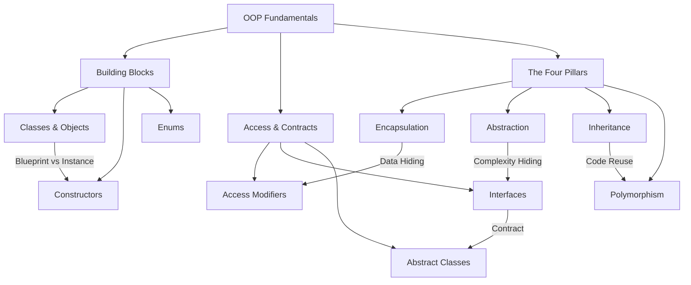

# OOP Fundamentals - Theory Super

## Global Mind Map: OOP Fundamentals



---

# 1. Classes and Objects

## The Problem - Unorganized State and Behavior
Before Object-Oriented Programming (OOP), code was often a scattered collection of variables and functions. Keeping track of which data belonged to which function was difficult and error-prone, especially as programs grew larger.

## The Core Idea
OOP organizes software around **objects**. An object binds two things together:
1. **State:** The data it stores.
2. **Behavior:** The actions it can perform on that data.

## How It Works: Classes (The Blueprint)
A **class** is a blueprint or template for creating objects. It defines the structure (data) and behavior (actions) that all objects of this type will have.

```java
class User {
    String name;
    String email;

    void login() {
        System.out.println(name + " logged in");
    }
}
```
This blueprint says every user will have a `name`, an `email`, and a `login` behavior. But a blueprint is not a real user yet.

## How It Works: Objects (The Instance)
An **object** is an actual instance created from the class blueprint.

```java
User user1 = new User();
user1.name = "Alice";
user1.email = "alice@example.com";

User user2 = new User();
user2.name = "Bob";
user2.email = "bob@example.com";

user1.login(); // Alice logged in
user2.login(); // Bob logged in
```
Here, both `user1` and `user2` are objects of the same `User` class. They share the same structure and behavior, but they store different state (data).

## Constructors
Setting every field manually after creating an object is repetitive and risky (you might forget a field, leaving the object in an incomplete state). 

A **constructor** is a special method that runs the moment an object is created. Its job is to initialize the object with required data and ensure the object starts in a valid state.

```java
class User {
    String name;
    String email;

    // Constructor with validation
    User(String name, String email) {
        if (email == null || !email.contains("@")) {
            throw new IllegalArgumentException("Invalid email: " + email);
        }
        this.name = name;
        this.email = email;
    }

    void login() {
        System.out.println(name + " logged in");
    }
}
```

---

# 2. Enums

## The Problem - Invalid Values
Sometimes a field should only accept a small, strict set of predefined values (e.g., an order status). If you use a `String`, typos can easily occur (`"shiped"` instead of `"shipped"`), and the compiler won't catch them.

## The Core Idea
An **Enum** (enumeration) restricts a variable to be one of a fixed set of predefined constants, making invalid states impossible at compile-time.

## How It Works
```java
enum OrderStatus {
    PENDING, SHIPPED, DELIVERED, CANCELLED
}

OrderStatus status = OrderStatus.PENDING;
status = OrderStatus.SHIPPED; // only valid values are allowed
```

## Real-World Anchoring
Any time you have a fixed set of options-`OrderStatus` in e-commerce, `PaymentStatus` (SUCCESS, FAILED), `UserRole` (ADMIN, USER), or `DifficultyLevel` (EASY, MEDIUM, HARD)-enums are the right choice.

---

# 3. Access Modifiers

## The Problem - Unrestricted Access
If all data inside a class is visible to the entire application, any part of the code can modify it unexpectedly. This leads to fragile systems where a change in one place breaks things elsewhere.

## The Core Idea
**Access modifiers** control the visibility of classes, fields, constructors, and methods, enforcing boundaries between different parts of the system.

## How It Works (in Java)

| Modifier | Accessible From |
| :--- | :--- |
| **`public`** | Anywhere in the application. |
| **`private`** | Only inside the exact same class. |
| **`protected`** | The same package and any child classes (inheritance). |

```java
class UserAccount {
    private String email; // Internal state, hidden

    public String getEmail() { // Public API
        return email;
    }

    public void updateEmail(String newEmail) {
        if (isValidEmail(newEmail)) {
            email = newEmail;
            logChange();
        }
    }

    protected void logChange() { // Reusable by child classes
        System.out.println("Account updated");
    }

    private boolean isValidEmail(String email) { // Internal implementation detail
        return email.contains("@");
    }
}
```
**Rule of Thumb:** Expose only what other parts of the application *actually* need to call. Keep everything else `private`.

---

# 4. Interfaces

## The Problem - Rigid Dependencies
If a class depends directly on a specific implementation (e.g., `LocalDiskStorage`), changing to a different implementation (e.g., `CloudStorage`) requires rewriting the code.

## The Core Idea
An **Interface** defines a strict contract. It specifies *what* a class must do, but not *how* it should do it.

## How It Works
An interface declares method signatures without bodies. Any class that `implements` the interface must provide the actual code for those methods.

```java
interface FileStorage {
    void save(String fileName, byte[] data);
}

class LocalDiskStorage implements FileStorage {
    public void save(String fileName, byte[] data) {
        System.out.println("Saving " + fileName + " to local disk");
    }
}

class CloudStorage implements FileStorage {
    public void save(String fileName, byte[] data) {
        System.out.println("Uploading " + fileName + " to cloud storage");
    }
}
```

Now, the rest of the application depends on the *Interface*, not the concrete class. This allows you to swap implementations without breaking existing code.

```java
class BackupService {
    private FileStorage storage; // Depends on the contract

    BackupService(FileStorage storage) {
        this.storage = storage;
    }

    void backup(String fileName, byte[] data) {
        storage.save(fileName, data);
    }
}
```

---

# 5. Abstract Classes

## The Problem - Shared Code in Contracts
Interfaces are great for contracts, but what if multiple classes implementing that contract share the exact same helper logic or state? Duplicating that code across all implementations violates the DRY (Don't Repeat Yourself) principle.

## The Core Idea
An **Abstract Class** is a class that cannot be instantiated directly. It serves as a base class that can provide *both* shared implemented methods (code reuse) and abstract methods (contracts that children must implement).

## How It Works
```java
abstract class ReportGenerator {

    // Shared behavior
    void generate(List<String> data) {
        String content = format(data);
        save(content);
    }

    // Shared behavior
    void save(String content) {
        System.out.println("Saving report: " + content);
    }

    // Abstract contract: children must implement this
    abstract String format(List<String> data);
}

class CsvReportGenerator extends ReportGenerator {
    String format(List<String> data) {
        return String.join(",", data);
    }
}

class JsonReportGenerator extends ReportGenerator {
    String format(List<String> data) {
        return "[\"" + String.join("\", \"", data) + "\"]";
    }
}
```
Here, `generate` and `save` are shared by all report generators. Only the specific `format` logic is left to the child classes.

## Interface vs. Abstract Class
- Use an **interface** to define a capability or contract (e.g., "Can be saved").
- Use an **abstract class** when closely related classes need to share common code or state.

---

# 6. Encapsulation (Pillar 1)

## The Problem - Invalid Object States
If internal data is exposed (e.g., `public double balance;`), anyone can change it arbitrarily, bypassing business rules. An admin tool might accidentally set a bank balance to negative, corrupting the system.

## The Core Idea
**Encapsulation** bundles data and the methods that operate on it together, while heavily restricting direct access to the data from the outside.

## How It Works
Instead of exposing the data, you make it `private` and expose controlled methods (`public`) that enforce business logic.

```java
class BankAccount {
    private double balance; // Encapsulated data

    void deposit(double amount) {
        if (amount <= 0) {
            throw new IllegalArgumentException("deposit must be positive");
        }
        balance += amount;
    }

    void withdraw(double amount) {
        if (amount <= 0 || amount > balance) {
            throw new IllegalArgumentException("invalid withdrawal");
        }
        balance -= amount;
    }

    boolean isOverdrawn() {
        return balance < 0;
    }
}
```
Now, the balance can *only* be modified through `deposit` and `withdraw`, where validations are strictly enforced. The object protects its own integrity.

---

# 7. Abstraction (Pillar 2)

## The Problem - Cognitive Overload
If a developer has to understand networking, buffering, codecs, and frame decoding just to play a video file, the system is too complex to use efficiently.

## The Core Idea
**Abstraction** hides the complex internal details of an operation and exposes only a simple, high-level API to the caller. 

## How It Works
```java
class VideoPlayer {

    // Simple public API (Abstraction)
    public void play(String fileName) {
        connect(fileName);
        buffer();
        decodeFrames();
        render();
    }

    // Hidden complexity
    private void connect(String fileName) { /* networking */ }
    private void buffer() { /* buffering strategy */ }
    private void decodeFrames() { /* codecs and decoding */ }
    private void render() { /* frame rendering */ }
}

// The caller only needs this:
VideoPlayer player = new VideoPlayer();
player.play("movie.mp4");
```
The caller knows *what* the method does, but doesn't need to know *how*. 

## Encapsulation vs. Abstraction
- **Encapsulation** controls *who* can access or modify data (Security/Integrity).
- **Abstraction** controls *which details* the caller needs to see (Simplicity).

---

# 8. Inheritance (Pillar 3)

## The Problem - Redundant Object Definitions
If you have `EmailNotification` and `SmsNotification` classes, they likely share fields like `recipient` and methods like `log()`. Rewriting these in every new notification class wastes time and creates maintenance nightmares.

## The Core Idea
**Inheritance** allows a new class (child) to inherit and reuse the fields and behavior of an existing class (parent). It represents an **"is-a"** relationship.

## How It Works
```java
class Notification {
    protected String recipient;

    Notification(String recipient) {
        this.recipient = recipient;
    }

    void log(String message) {
        System.out.println("Sent: " + message);
    }
    
    void send(String message) {
        System.out.println("Sending notification to " + recipient);
    }
}

class EmailNotification extends Notification {
    EmailNotification(String recipient) {
        super(recipient); // Calls parent constructor
    }

    // Method Overriding
    @Override
    void send(String message) {
        System.out.println("Sending email to " + recipient + ": " + message);
    }
}
```
Both classes get the `recipient` field and `log()` method for free. 

## Method Overriding
When a child class provides a specialized implementation of a parent's method, it **overrides** it. The `@Override` annotation ensures the compiler checks that the method signatures match exactly.

## The Trap: Inheritance vs. Composition
A common mistake is using inheritance just to reuse code. For example, an `OrderService` should NOT extend `EmailSender` just because it needs to send emails. An order service *is not* an email sender.

Instead, use **Composition** (has-a relationship):
```java
class OrderService {
    private EmailSender emailSender; // Composition

    OrderService(EmailSender emailSender) {
        this.emailSender = emailSender;
    }

    void placeOrder() {
        emailSender.send("Your order has been placed");
    }
}
```
**Rule:** Use inheritance for genuine specialized versions ("is-a"). Use composition when you just need to use a behavior ("has-a").

---

# 9. Polymorphism (Pillar 4)

## The Problem - Rigid Typing
If you want to process a list of 100 different notifications (some emails, some SMS), without polymorphism, you would need complex `if/else` statements to check the type of each object before calling its specific send method.

## The Core Idea
**Polymorphism** (meaning "many forms") allows different object types to be treated as instances of the same parent class or interface. The exact method implementation that runs is determined dynamically at runtime based on the *actual* object type.

## How It Works
```java
Notification email = new EmailNotification("alice@example.com");
Notification sms = new SmsNotification("+1-555-0142");

// Same method call, completely different behaviors
email.send("Your order has shipped"); 
// Output: Sending email to alice@example.com: Your order has shipped

sms.send("Your order has shipped"); 
// Output: Sending SMS to +1-555-0142: Your order has shipped
```

This allows us to write high-level, generic code that loops through mixed object types:

```java
List<Notification> notifications = List.of(
    new EmailNotification("alice@example.com"),
    new SmsNotification("+1-555-0142")
);

for (Notification notification : notifications) {
    // The language runtime automatically chooses the correct overridden method
    notification.send("Your order has shipped");
}
```
If you add a `PushNotification` class later, this loop *does not need to change*. This makes the system incredibly extensible.
