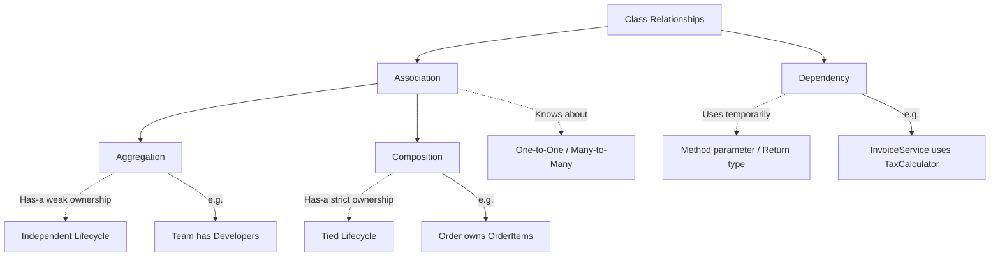

# Class Relationships — Theory Super

## Global Mind Map: Class Relationships



---

# 1. Association

## The Problem — Isolated Objects
If objects cannot know about or communicate with other objects, they are useless in a complex system. An order has no meaning without a customer, and a user profile has no meaning without a user.

## The Core Idea
**Association** is the most general relationship between classes. It simply means that one class is connected to another—one object *knows about* another object.

## How It Works
Usually, this is implemented by one class storing a reference to another as part of its state.

```java
class Customer {
    private String name;
    private String email;

    Customer(String name, String email) {
        this.name = name;
        this.email = email;
    }
}

class Order {
    private String orderId;
    private Customer customer; // Association

    Order(String orderId, Customer customer) {
        this.orderId = orderId;
        this.customer = customer;
    }
}
```
Here, the `Order` class stores a reference to a `Customer`. This tells us that every order is connected to a customer.

## Forms of Association
| Form | Example |
| :--- | :--- |
| **One-to-one** | A `User` has a `Profile` |
| **One-to-many** | One `Customer` can place many `Orders` |
| **Many-to-one** | Many `Students` learn from one `Teacher` |
| **Many-to-many** | One `Student` can join many `Courses`, and each `Course` can contain many `Students` |

---

# 2. Aggregation

## The Problem — Grouping without Owning
Sometimes, an object needs to group other objects together, but it shouldn't destroy them if it gets destroyed. If a sports team is disbanded, the players don't cease to exist—they just become free agents.

## The Core Idea
**Aggregation** is a specialized form of Association. It represents a **"has-a"** relationship with **weak ownership**. One object contains or groups other objects, but the contained objects have an *independent lifecycle*.

## How It Works
The grouped objects are usually created outside the parent object and passed into it (e.g., via the constructor).

```java
class EngineeringTeam {
    private String teamName;
    private List<Developer> developers; // Aggregation

    EngineeringTeam(String teamName, List<Developer> developers) {
        this.teamName = teamName;
        this.developers = developers;
    }
}

// Developers are created OUTSIDE the team
Developer developer1 = new Developer("Alice");
Developer developer2 = new Developer("Bob");

// Developers are passed INTO the team
EngineeringTeam team = new EngineeringTeam(
    "Payments",
    List.of(developer1, developer2)
);
```

## What Happens When It Fails / Is Destroyed
If the `EngineeringTeam` is removed from the system, `developer1` and `developer2` still exist in memory. They can move to another team or remain without one. The parent does not own the lifecycle of the child.

---

# 3. Composition

## The Problem — Strict Ownership
Some objects have no logical meaning without their parent. A line item on a receipt shouldn't exist if the receipt itself is deleted.

## The Core Idea
**Composition** is a stricter **"has-a"** association representing **strong ownership**. The child object is an important part of the parent, and its lifecycle is *tied to the parent*. If the parent dies, the child dies.

## How It Works
The parent usually creates and strictly manages the child objects internally.

```java
class OrderItem {
    private String productName;
    private int quantity;

    OrderItem(String productName, int quantity) {
        this.productName = productName;
        this.quantity = quantity;
    }
}

class Order {
    private String orderId;
    private List<OrderItem> items = new ArrayList<>(); // Composition

    Order(String orderId) {
        this.orderId = orderId;
    }

    void addItem(String productName, int quantity) {
        // The Order creates and strictly owns the OrderItem
        items.add(new OrderItem(productName, quantity));
    }
}
```

## Aggregation vs. Composition
| Aspect | Aggregation | Composition |
| :--- | :--- | :--- |
| **Ownership** | Weak | Strong |
| **Child lifecycle** | Independent of the parent | Tied to the parent |
| **Example** | A team has developers | An order owns its order items |

*Note: In most languages, there are no special keywords for aggregation vs composition. The difference purely comes from how you architect the creation and deletion of the objects.*

---

# 4. Dependency

## The Problem — Temporary Utilization
Sometimes a class doesn't need to "own" or even "associate" with another object permanently as part of its state. It just needs to use a tool to get a job done right now, and then forget about it.

## The Core Idea
A **Dependency** exists when one class simply *uses* another class to perform some work. It is generally a weaker relationship than association.

## How It Works
With a dependency, the other object usually only appears as a method parameter, local variable, or return type—it is NOT stored as a class-level field.

```java
class InvoiceService {

    // Dependency: TaxCalculator is just passed in to do a job
    void createInvoice(int amount, TaxCalculator taxCalculator) {
        int tax = taxCalculator.calculateTax(amount);
        int total = amount + tax;
        System.out.println("Invoice total: " + total);
    }
}
```
Here, `InvoiceService` depends on `TaxCalculator` to calculate the tax. It does not create or own the calculator.

## When to use it and when NOT to
- **Real-world examples:** An `OrderService` depending on an inventory service, a `UserService` depending on an email sender, a `ReportService` depending on a PDF generator.
- **The Tradeoff:** When a class creates and depends directly on many *concrete implementations* inside its methods, the code becomes tightly coupled and impossible to unit test.
- **The Solution:** Good OOP designs depend on **interfaces** and receive their dependencies through constructors or method parameters (Dependency Injection). This allows implementations (like a fake email sender for testing) to be swapped out without rewriting the high-level logic.
