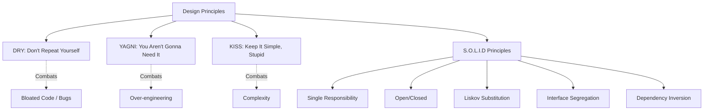

# Design Principles — Theory Super

## Global Mind Map: Design Principles



---

# 1. The DRY Principle (Don't Repeat Yourself)

## The Problem — Scattered Knowledge
If you copy the exact same validation logic, configuration string, or database query into five different files, what happens when the business rule changes? You have to find and update all five places. If you miss even one, the system becomes inconsistent, leading to severe, hard-to-trace bugs.

## The Core Idea
*“Every piece of knowledge must have a single, unambiguous, authoritative representation within a system.”* 
When you need that knowledge somewhere else, you reference the single source rather than creating a second copy.

## How It Works
DRY is not just about code lines—it applies to business rules, configs, data models, and tests.

**Before (Violating DRY):**
```java
// In AuthService.java
public boolean isValidEmail(String email) {
    return email != null && email.contains("@") && email.contains(".");
}

// In PaymentService.java
public boolean isValidEmail(String email) {
    return email != null && email.contains("@") && email.contains(".");
}
```

**After (Applying DRY):**
Extract the logic into a dedicated utility that acts as the single source of truth.
```java
public class EmailValidator {
    public static boolean isValid(String email) {
        return email != null && email.contains("@") && email.contains(".");
    }
}

// In AuthService.java
if (EmailValidator.isValid(user.getEmail())) { ... }

// In PaymentService.java
if (EmailValidator.isValid(customer.getEmail())) { ... }
```

## The Rule of Three (When NOT to apply DRY)
Don't extract shared code too early. Wait until you see the exact same pattern **three times**. Two occurrences might be a coincidence that will soon diverge. Premature abstractions create tight coupling for things that aren't genuinely the same. 

*“Duplication is far cheaper than the wrong abstraction.” — Sandi Metz*

---

# 2. The YAGNI Principle (You Aren't Gonna Need It)

## The Problem — Speculative Engineering
Developers often try to predict the future: *"What if we need cloud storage later? What if we need a plugin system?"* We build massive interfaces, factories, and abstractions for features that do not exist yet. This wastes time, clutters the codebase with dead code, and delays shipping actual value.

## The Core Idea
*“Always implement things when you actually need them, never when you just foresee that you need them.”*
Don’t build for tomorrow. Build for today.

## How It Works
Instead of building a `MediaProcessingEngine` with a `MediaHandlerFactory` and a `CloudStorageAdapter` just to resize a profile picture, you build exactly what is required right now.

**YAGNI Applied (Simple, sufficient code):**
```java
class ImageUploader {
    private final ImageResizer resizer;
    private final LocalStorage storage;

    public void upload(File imageFile) {
        File resized = resizer.resize(imageFile, 300, 300);
        storage.save(resized);
    }
}
```
If the requirement for cloud storage arises tomorrow, *that* is the time to refactor.

## When to Bend the Rule
You must plan ahead for **known, concrete constraints**, not imagined ones.
- Legal/Security compliance (e.g., encryption for financial data).
- Contractual SLAs (e.g., high-availability architectural choices that cannot be retrofitted).
- Reusable public library APIs.

---

# 3. The KISS Principle (Keep It Simple, Stupid)

## The Problem — The Complexity Cycle
Complexity creeps in gradually. A bug gets patched with a clever workaround instead of a proper fix, adding indirection. Soon, fixing a bug requires tracing through 5 layers of factories and interfaces. Complex code hides bugs, slows down onboarding, and turns debugging into a nightmare.

## The Core Idea
Most systems work best when they are kept simple. Write code that is easy to read, easy to understand, and easy to change.

## How It Works
Do not use an interface, four concrete classes, and a delegator just to build a four-function arithmetic calculator. Use a simple switch statement.

**Violating KISS (Over-engineered):**
```java
interface Operation { double calculate(double a, double b); }
class Addition implements Operation { ... }
class Subtraction implements Operation { ... }
class Calculator { public double execute(Operation op, ... ) { ... } }
```

**Applying KISS:**
```java
class Calculator {
    public double calculate(String operator, double a, double b) {
        switch (operator) {
            case "+": return a + b;
            case "-": return a - b;
            case "*": return a * b;
            case "/": return a / b;
            default: throw new UnsupportedOperationException();
        }
    }
}
```

## Guidelines for KISS
1. **Write code for humans**, not machines. Name things clearly.
2. **Favor composition over deep inheritance.** Flat structures are easier to read.
3. **Keep functions short.** If you use the word "and" to describe what a function does, split it.
4. **Use familiar constructs.** Don't reinvent the wheel when a simple `List` or `for` loop works.

---

# 4. S.O.L.I.D Principles

SOLID is an acronym for five design principles intended to make software designs more understandable, flexible, and maintainable.

## S — Single Responsibility Principle (SRP)
**The Core Idea:** A class should have one, and only one, reason to change. (A class should have a single responsibility).

**The Problem:** If a `UserManager` class handles authentication, profile updating, *and* sending email notifications, a change to the email server might accidentally break authentication.

**How it Works:**
Separate behaviors so that bugs arising from changes do not affect unrelated behaviors.
```java
// VIOLATION: Doing too much
class UserManager {
    void authenticateUser() { ... }
    void updateProfile() { ... }
    void sendEmail() { ... }
}

// SOLUTION: Split into focused classes
class UserAuthenticator { void authenticate() { ... } }
class UserProfileManager { void update() { ... } }
class EmailNotifier { void send() { ... } }
```

## O — Open/Closed Principle (OCP)
**The Core Idea:** Software entities (classes, modules, functions) should be **open for extension, but closed for modification**.

**The Problem:** If you have to modify an existing, tested class every time a new feature is added, you risk introducing bugs into systems that currently work perfectly.

**How it Works:**
If you want a class to perform more functions, add to the system via interfaces/abstractions rather than altering existing code.
```java
// VIOLATION: Modifying existing code to add a Triangle
class ShapeCalculator {
    double calculateArea(Object shape) {
        if (shape instanceof Circle) return ...;
        if (shape instanceof Rectangle) return ...;
        // Adding Triangle requires modifying this method!
    }
}

// SOLUTION: Use Abstractions
interface Shape { double getArea(); }
class Circle implements Shape { public double getArea() { ... } }
class Rectangle implements Shape { public double getArea() { ... } }

class ShapeCalculator {
    double calculateArea(Shape shape) {
        return shape.getArea(); // Never needs to change when new shapes are added!
    }
}
```

## L — Liskov Substitution Principle (LSP)
**The Core Idea:** Objects of a superclass should be replaceable with objects of its subclasses without affecting the correctness of the program.

**The Problem:** When a child class cannot perform the same actions as its parent class (e.g. throwing an `UnsupportedOperationException` for a parent method), the program will crash if someone treats the child as the parent.

**How it Works:**
The child class must process the same requests and deliver the same result type as the parent.
```java
// VIOLATION: Bicycle cannot start an engine
class Vehicle { void startEngine() { ... } }
class Car extends Vehicle { void startEngine() { ... } }
class Bicycle extends Vehicle { 
    void startEngine() { throw new Error("I don't have an engine!"); } 
}

// SOLUTION: Fix the abstraction hierarchy
class Vehicle { void move() { ... } }
class Car extends Vehicle { void move() { startEngine(); } }
class Bicycle extends Vehicle { void move() { pedal(); } }
```

## I — Interface Segregation Principle (ISP)
**The Core Idea:** Clients should not be forced to depend on interfaces they do not use.

**The Problem:** "Fat" or "bloated" interfaces force classes to implement methods that are completely irrelevant to them, creating wasteful, confusing code.

**How it Works:**
Split large sets of actions into smaller, specific interfaces.
```java
// VIOLATION: AudioPlayer is forced to implement video methods
interface MediaPlayer {
    void playAudio();
    void playVideo();
}
class AudioPlayer implements MediaPlayer {
    public void playAudio() { ... }
    public void playVideo() { throw new Error("Can't play video!"); }
}

// SOLUTION: Segregate the interfaces
interface AudioPlayer { void playAudio(); }
interface VideoPlayer { void playVideo(); }

class MP3Player implements AudioPlayer {
    public void playAudio() { ... }
}
```

## D — Dependency Inversion Principle (DIP)
**The Core Idea:** 
1. High-level modules should not depend on low-level modules. Both should depend on abstractions (interfaces).
2. Abstractions should not depend on details. Details should depend on abstractions.

**The Problem:** If a high-level `EmailService` is hardcoded to use a low-level `GmailClient`, you cannot switch to Outlook without completely rewriting the `EmailService`.

**How it Works:**
Introduce an interface between the high-level class and the low-level tool.
```java
// VIOLATION: High-level depends on low-level detail
class EmailService {
    private GmailClient gmail = new GmailClient(); // Tightly coupled
    void send() { gmail.sendEmail(); }
}

// SOLUTION: Both depend on an abstraction
interface EmailClient { void sendEmail(); }

class GmailClient implements EmailClient { public void sendEmail() { ... } }
class OutlookClient implements EmailClient { public void sendEmail() { ... } }

class EmailService {
    private EmailClient client; // Loosely coupled
    EmailService(EmailClient client) { this.client = client; }
    void send() { client.sendEmail(); }
}
```
