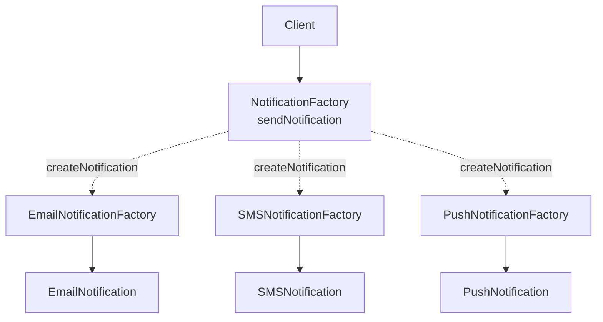

3. Factory Method
Consider a notification system that supports email, SMS, and push notifications. Each notification follows the same interface:

interface Notification {
    void send(String msg);
}

Each notification channel class provides its own implementation, along with its own setup:

class EmailNotification implements Notification {
    EmailNotification(String sender) { ... }
    void setRetryPolicy(RetryPolicy p) { ... }
    public void send(String msg) { sendEmail(msg); }
}

class SMSNotification implements Notification {
    SMSNotification(String gateway) { ... }
    void setRateLimit(RateLimit limit) { ... }
    public void send(String msg) { sendSms(msg); }
}

class PushNotification implements Notification {
    PushNotification(String token) { ... }
    void setPriority(Priority priority) { ... }
    public void send(String msg) { sendPush(msg); }
}

Creating these objects directly would tightly couple the client to a specific notification class:

var email = new EmailNotification(sender);
email.setRetryPolicy(RetryPolicy.EXPONENTIAL);

email.send("Your order has shipped");

If the type of notification changes, the client must also change its object creation logic. And if the same creation logic appears in several places, it can quickly become duplicated across the application.

The Factory Method Pattern moves that object creation behind a dedicated method.

We start by creating an abstract notification factory. The sendNotification method defines the overall workflow for creating and sending a notification, but it does not know which concrete notification object will be created. That decision is delegated to the createNotification factory method:

abstract class NotificationFactory {
    protected abstract Notification createNotification();

    public void sendNotification(String msg) {
        Notification notification = createNotification();
        notification.send(msg);
    }
}

Subclasses extend from this abstract class and decide how and which notification object to return:

class EmailNotificationFactory extends NotificationFactory {
    protected Notification createNotification() {
        var email = new EmailNotification(sender);
        email.setRetryPolicy(RetryPolicy.EXPONENTIAL);
        return email;
    }
}

class SMSNotificationFactory extends NotificationFactory {
    protected Notification createNotification() {
        var sms = new SMSNotification(gateway);
        sms.setRateLimit(RateLimit.perMinute(60));
        return sms;
    }
}

class PushNotificationFactory extends NotificationFactory {
    protected Notification createNotification() {
        var push = new PushNotification(deviceToken);
        push.setPriority(Priority.HIGH);
        return push;
    }
}

The client can now work with the base factory class:

NotificationFactory factory = new EmailNotificationFactory();
factory.sendNotification("Your order has shipped");

The client uses the common workflow without knowing the internal details of how the notification object is created.

To switch from email to SMS, we can simply provide a different factory:
NotificationFactory factory = new SMSNotificationFactory();
factory.sendNotification("Your order has shipped");

The rest of the client code remains unchanged.

Structural Patterns
So far, we have focused on how objects are created. But once those objects exist, we also need effective ways to connect, organize, and combine them. That brings us to the next category: Structural Design Patterns.

In this section, we'll cover five important structural patterns: Adapter, Facade, Proxy, Decorator, and Composite.

Let's begin with the Adapter Pattern.

