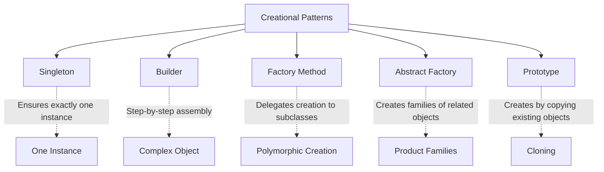
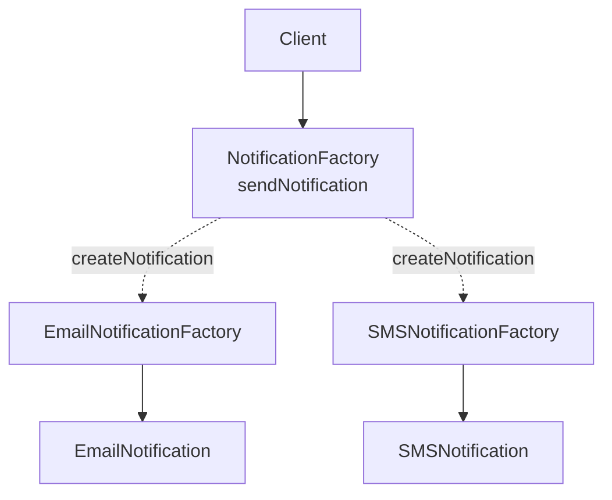

# Creational Design Patterns — Theory Super

## Global Mind Map: Creational Patterns



---

# 1. Singleton

## The Problem — Wasteful or Conflicting Instances
Sometimes, an application genuinely needs exactly *one* shared instance of a class. Common examples include a configuration manager, a logger, a cache manager, or a thread pool. Creating multiple instances of these objects can waste memory, consume too many network connections, or lead to inconsistent behavior (like two different loggers writing over each other).

## The Core Idea
The **Singleton Pattern** solves this by ensuring that only one instance of a class exists, and providing a consistent, global way to access it.

## How It Works
```java
enum AppConfig {
    INSTANCE;

    private String environment = "production";

    public String getEnvironment() {
        return environment;
    }
}
```

We can now access the exact same instance from anywhere in the application:
```java
// in OrderService
String env = AppConfig.INSTANCE.getEnvironment();

// in EmailWorker
log(AppConfig.INSTANCE.getEnvironment());
```

## When to use it and when NOT to
- **When to use:** Use Singleton *only* when the application genuinely requires one shared instance.
- **When NOT to use:** Do not use it simply because global access is convenient. Because a Singleton is globally accessible, it hides dependencies and makes testing extremely difficult. 
- **The Alternative:** In many cases, creating the object once at startup and passing it explicitly to the classes that need it (Dependency Injection) is much cleaner:
```java
// created once, then passed in
AppConfig config = new AppConfig("production");

OrderService orderService = new OrderService(config);
EmailWorker emailWorker = new EmailWorker(config);
```
Now the dependency is visible in the constructor, and a test can easily pass a different or mocked `AppConfig`.

---

# 2. Builder

## The Problem — Telescoping Constructors
Consider a `UserProfile` class. The name and email are required, while fields like age, location, bio, and notification preferences are optional. If you pass everything through the constructor, it looks like this:

```java
UserProfile profile = new UserProfile(
        "Alice",
        "alice@example.com",
        29,
        "Berlin",
        null,
        true
);
```
Without checking the constructor definition, it is impossible to read. What does `29` mean? What does `null` mean? What does `true` mean? You could create multiple overloaded constructors, but that leads to the "telescoping constructor" anti-pattern, where you maintain dozens of variations for different combinations of parameters.

## The Core Idea
The **Builder Pattern** lets us construct complex objects step by step using clearly named, chainable methods.

## How It Works
You provide the required fields first, and optional fields are added via clearly named methods only when needed.

```java
UserProfile profile =
    new UserProfile.Builder("Alice", "alice@example.com")
        .age(29)
        .city("Berlin")
        .build();
```

Here is a simplified implementation:
```java
public static class Builder {
    private final String name;
    private final String email;
    private int age;
    private String city;

    public Builder(String name, String email) {
        this.name = name;
        this.email = email;
    }

    public Builder age(int age) {
        this.age = age;
        return this; // Return 'this' to allow chaining
    }

    public Builder city(String city) {
        this.city = city;
        return this;
    }

    public UserProfile build() {
        return new UserProfile(this);
    }
}
```
Internally, each builder method updates one property and returns the same builder instance. Finally, the `build()` method creates and returns the complete, immutable `UserProfile` object.

---

# 3. Factory Method

## The Problem — Tightly Coupled Creation Logic
Consider a notification system that supports email, SMS, and push notifications. Creating these objects directly tightly couples your client code to a specific notification class.

```java
var email = new EmailNotification(sender);
email.setRetryPolicy(RetryPolicy.EXPONENTIAL);
email.send("Your order has shipped");
```
If you switch to SMS, you have to rewrite the object creation logic in every place that sends notifications.

## The Core Idea
The **Factory Method Pattern** moves object creation behind a dedicated method, allowing subclasses to alter the type of objects that will be created without changing the core workflow.

## How It Works
We start by creating an abstract factory. The `sendNotification` method defines the overall workflow, but the exact creation is delegated to the `createNotification` factory method:

```java
abstract class NotificationFactory {
    protected abstract Notification createNotification();

    public void sendNotification(String msg) {
        Notification notification = createNotification();
        notification.send(msg);
    }
}
```

Subclasses extend this abstract class and decide how to configure and return the notification object:

```java
class EmailNotificationFactory extends NotificationFactory {
    protected Notification createNotification() {
        var email = new EmailNotification(sender);
        email.setRetryPolicy(RetryPolicy.EXPONENTIAL);
        return email;
    }
}

class SMSNotificationFactory extends NotificationFactory {
    protected Notification createNotification() {
        var sms = new SMSNotification(gateway);
        sms.setRateLimit(RateLimit.perMinute(60));
        return sms;
    }
}
```

The client code now only interacts with the base factory class:
```java
NotificationFactory factory = new EmailNotificationFactory();
factory.sendNotification("Your order has shipped");
```
To switch from email to SMS, simply pass in a `SMSNotificationFactory`. The rest of the client code remains completely untouched.



---

# 4. Abstract Factory

## The Problem — Inconsistent Object Families
Imagine building a cross-platform desktop application supporting Windows and macOS. You need to create buttons, checkboxes, and menus. If you manually instantiate `new WindowsButton()` and `new MacOSCheckbox()`, nothing stops a developer from mixing them up. You also end up with platform-checking `if (isWindows)` logic scattered everywhere in your code. Adding a third platform (like Linux) forces you to edit hundreds of files.

## The Core Idea
The **Abstract Factory Pattern** provides an interface for creating *families* of related or dependent objects without specifying their concrete classes. It guarantees that all components produced are compatible (i.e., belong to the same platform/theme).

## How It Works

### Step 1: Define Abstract Product Interfaces
```java
interface Button { void paint(); }
interface Checkbox { void paint(); }
```

### Step 2: Create Concrete Products
```java
class WindowsButton implements Button {
    public void paint() { System.out.println("Windows-style button"); }
}
class MacOSButton implements Button {
    public void paint() { System.out.println("macOS-style button"); }
}
// (Same for WindowsCheckbox and MacOSCheckbox)
```

### Step 3: Define the Abstract Factory
Declares one creation method per product type.
```java
interface GUIFactory {
    Button createButton();
    Checkbox createCheckbox();
}
```

### Step 4: Implement Concrete Factories
Each concrete factory produces a *complete, compatible set* of products.
```java
class WindowsFactory implements GUIFactory {
    public Button createButton() { return new WindowsButton(); }
    public Checkbox createCheckbox() { return new WindowsCheckbox(); }
}
class MacOSFactory implements GUIFactory {
    public Button createButton() { return new MacOSButton(); }
    public Checkbox createCheckbox() { return new MacOSCheckbox(); }
}
```

### Step 5: The Client Code
The client receives a factory through its constructor and works *only* with the abstract interfaces.
```java
class Application {
    private Button button;
    private Checkbox checkbox;

    public Application(GUIFactory factory) {
        button = factory.createButton();
        checkbox = factory.createCheckbox();
    }

    public void render() {
        button.paint();
        checkbox.paint();
    }
}
```

### Step 6: Wire Everything Together
This is the *only* place in the codebase that references concrete factories.
```java
GUIFactory factory;
String osName = System.getProperty("os.name").toLowerCase();
if (osName.contains("mac")) {
    factory = new MacOSFactory();
} else {
    factory = new WindowsFactory();
}
Application app = new Application(factory);
app.render();
```

## What We Achieved
- **Platform independence:** Application code never references platform-specific classes.
- **Consistency:** A `WindowsFactory` can ONLY produce Windows components. There is zero risk of mixing families.
- **Open/Closed Principle:** Add support for Linux by creating a `LinuxFactory`. Nothing existing changes.

---

# 5. Prototype

## The Problem — Expensive or Repetitive Instantiation
Imagine you’re developing a 2D shooting game. You have an `Enemy` class with health, speed, armor, and weapon type. You need to spawn a `FlyingEnemy` hundreds of times. If you instantiate them from scratch, you duplicate the setup logic over and over, scatter defaults across your codebase, and tightly couple your game loop to concrete classes. You also can't easily copy an object if its fields are private (encapsulation blocks you).

## The Core Idea
The **Prototype Pattern** lets you create new objects by *copying (cloning)* pre-configured existing ones (prototypes), rather than instantiating them from scratch. The object itself knows how to clone itself.

## How It Works
The object provides a `clone()` method. The client does not need to know the concrete class; it just calls `clone()`.

### Step 1: Define the Prototype Interface
```java
interface Prototype {
    Prototype clone();
}
```

### Step 2: Concrete Prototype (Self-Cloning)
```java
class Enemy implements Prototype {
    private int health;
    private int speed;
    private String type;

    // Standard constructor
    public Enemy(int health, int speed, String type) {
        this.health = health;
        this.speed = speed;
        this.type = type;
    }

    // Copy constructor
    private Enemy(Enemy original) {
        this.health = original.health;
        this.speed = original.speed;
        this.type = original.type;
    }

    @Override
    public Prototype clone() {
        return new Enemy(this);
    }
    
    public void setHealth(int health) { this.health = health; }
}
```

### Step 3: Prototype Registry (Optional but powerful)
Store pre-configured prototypes and return clones by key.
```java
class EnemyRegistry {
    private Map<String, Enemy> cache = new HashMap<>();

    public void register(String key, Enemy prototype) {
        cache.put(key, prototype);
    }

    public Enemy get(String key) {
        return (Enemy) cache.get(key).clone(); // ALWAYS return a clone!
    }
}
```

### Step 4: Client Code
```java
EnemyRegistry registry = new EnemyRegistry();

// Configure prototypes ONCE
registry.register("flying", new Enemy(50, 10, "flying"));
registry.register("armored", new Enemy(200, 2, "armored"));

// Spawn by cloning
Enemy enemy1 = registry.get("flying");
Enemy enemy2 = registry.get("flying");

// Customize clone
enemy2.setHealth(20);
```

## Shallow Copy vs. Deep Copy (The Trap)
If your object contains a mutable reference field (e.g., a `List` of items), a **shallow copy** means both the original and the clone point to the *exact same list* in memory. Altering the clone's list alters the prototype's list!

When using Prototype with mutable references, you MUST implement a **deep copy**:
```java
class Enemy implements Prototype {
    private List<String> inventory;

    private Enemy(Enemy original) {
        // ... primitive copies ...
        // Deep copy the mutable reference!
        this.inventory = new ArrayList<>(original.inventory);
    }
}
```
