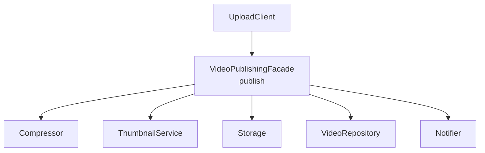

5. Facade
The Facade Pattern provides a simple interface to a complex subsystem.

Consider building a client for a video publishing platform like YouTube. Publishing a video may involve several steps. Without a facade, the client must coordinate every service itself:

Java

String video = compressor.compress("clip.mp4");
String thumb = thumbnails.generate(video);

String videoUrl = storage.upload(video);
String thumbUrl = storage.upload(thumb);

repository.save(videoUrl, thumbUrl);
notifier.notifyPublished(videoUrl);

12345678
This forces the client to understand the complete workflow, including which services to call and in what order. If this workflow is needed in multiple places, the same coordination logic may also get duplicated across the application.

A facade hides those details behind one simple method provided by the video publishing platform:

Java

class VideoPublishingFacade {

    public void publish(String videoFile) {
        String video = compressor.compress(videoFile);
        String thumb = thumbnails.generate(video);

        String videoUrl = storage.upload(video);
        String thumbUrl = storage.upload(thumb);

        repository.save(videoUrl, thumbUrl);
        notifier.notifyPublished(videoUrl);
    }
}

12345678910111213
Now the client only needs to make one simple call:

Java

VideoPublishingFacade facade = new VideoPublishingFacade();

facade.publish("clip.mp4");

123
The client no longer needs to know how compression, storage, metadata, or notifications work internally.

UploadClient

VideoPublishingFacade
publish

Compressor

ThumbnailService

Storage

VideoRepository

Notifier

Facade gives us a simpler way to interact with a complex system. But what if we need to control access to an object instead? That brings us to the Proxy pattern.

