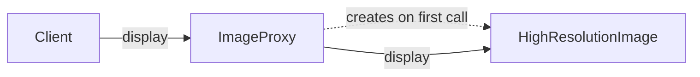

6. Proxy
The Proxy Pattern places a substitute object in front of a real object to control access to it. Both the real object and the proxy expose the same interface, so the client can use the proxy just like the original object.

Consider an image gallery application where the high-resolution image class loads the image in the constructor when its object is created:

Java

class HighResolutionImage implements Image {

    private final String fileName;

    public HighResolutionImage(String fileName) {
        this.fileName = fileName;
        loadFromDisk();
    }

    private void loadFromDisk() {
        System.out.println("Loading " + fileName);
    }

    @Override
    public void display() {
        System.out.println("Showing " + fileName);
    }
}

123456789101112131415161718
Creating every image immediately would waste memory and processing time, especially if the client never opens most of them by calling the display method:

Java

Image image1 = new HighResolutionImage("photo-1.jpg");
Image image2 = new HighResolutionImage("photo-2.jpg");
Image image3 = new HighResolutionImage("photo-3.jpg");

image1.display();   // the only one actually opened

12345
If you are not allowed to modify the high-resolution image class, a proxy can delay loading until the image is actually needed by the client.

We create a proxy class called ImageProxy. It wraps the HighResolutionImage class and starts as a lightweight object. It creates and loads the real image only when the display method is called:

Java

class ImageProxy implements Image {
    private final String fileName;
    private HighResolutionImage realImage;

    public ImageProxy(String fileName) {
        this.fileName = fileName;
    }

    @Override
    public void display() {
        if (realImage == null) {
            realImage = new HighResolutionImage(fileName);
        }

        realImage.display();
    }
}

1234567891011121314151617
The client now uses the proxy class instead of the original high-resolution image class:

Java

Image image3 = new ImageProxy("photo-3.jpg");

image3.display();

123
Most of the client code stays the same, since both the proxy and the original object implement the same interface.

display

creates on first call

display

Client

ImageProxy

HighResolutionImage

Proxy controls access, while the next pattern, Decorator, adds new behavior to an object.

