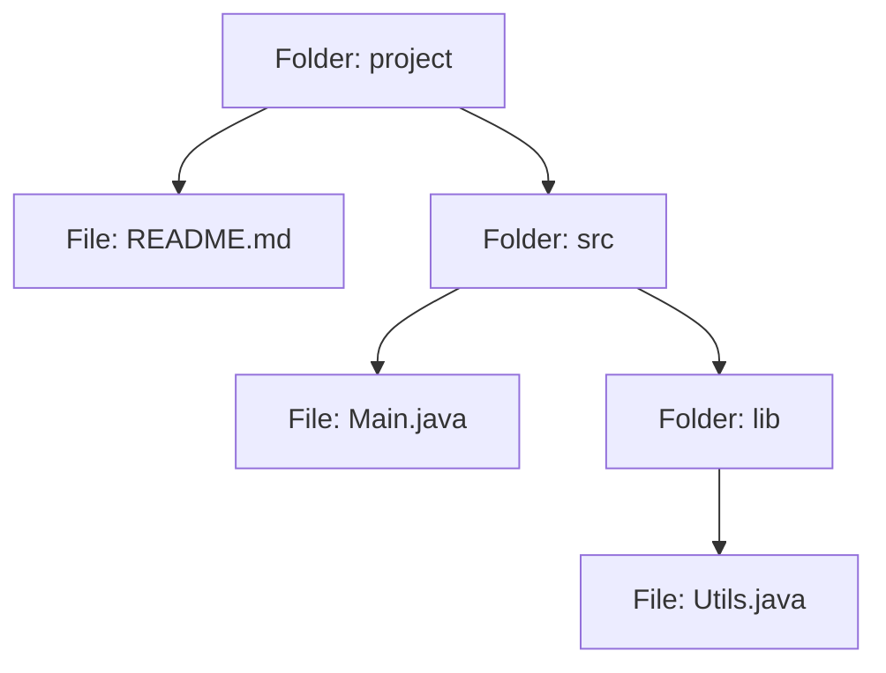

8. Composite
The Composite Pattern lets us treat individual objects and groups of objects through the same interface.

A file system is a perfect example. A file is a single object, while a folder can contain files and other folders. But we still want to perform operations like calculating size or printing details on both.

Without the Composite Pattern, the client may need separate logic for files and folders:

Java

long total = 0;

if (item instanceof FileItem) {
    FileItem file = (FileItem) item;
    total += file.getSize();
} else if (item instanceof Folder) {
    Folder folder = (Folder) item;
    total += sizeOf(folder);
}

123456789
The client needs to check which type of object it received and handle each one differently. This becomes even more complicated because folders can contain other folders, which may contain even more files and folders:

Java

for (Object child : folder.getChildren()) {
    if (child instanceof FileItem) {
        total += ((FileItem) child).getSize();
    } else if (child instanceof Folder) {
        Folder inner = (Folder) child;

        for (Object item : inner.getChildren()) {
            if (item instanceof FileItem) {
                total += ((FileItem) item).getSize();
            } else if (item instanceof Folder) {
                // ... and again, one level down
            }
        }
    }
}

123456789101112131415
This is where the Composite Pattern helps. We start with a common interface called FileSystemItem that represents anything in the file system:

Java

12345
Now both individual files and folders can implement the same interface. A file is the simplest type of object and simply returns its own size and prints its own name:

Java

class FileItem implements FileSystemItem {
    private final String name;
    private final long size;

    public long getSize() {
        return size;
    }

    public void print(String indent) {
        System.out.println(indent + "- " + name);
    }
}

123456789101112
A folder contains other file-system items and delegates the operation to them:

Java
class Folder implements FileSystemItem {
    private final String name;
    private final List<FileSystemItem> children = new ArrayList<>();

    public void add(FileSystemItem item) {
        children.add(item);
    }

    public long getSize() {
        long total = 0;
        for (FileSystemItem child : children) {
            total += child.getSize();
        }
        return total;
    }

    public void print(String indent) {
        System.out.println(indent + "+ " + name);
        for (FileSystemItem child : children) {
            child.print(indent + "  ");
        }
    }
}

1234567891011121314151617181920212223
When we ask a folder for its size, it asks every child for its size and adds the results together. This recursive structure is what makes the pattern so powerful.

Folder: project

File: README.md

Folder: src

File: Main.java

Folder: lib

File: Utils.java

Now we can build an entire directory tree:

Java

Folder project = new Folder("project");
project.add(new FileItem("README.md", 2_000));

Folder src = new Folder("src");
src.add(new FileItem("Main.java", 8_000));
project.add(src);

123456
The client can now treat the entire folder tree exactly like a single file-system item:

Java
FileSystemItem item = project;

System.out.println(item.getSize());
item.print("");

1234
Those last two lines would work identically if item were a single file.

Behavioral Patterns
So far, we have looked at how objects are created and how they are connected. But software is not just about structure. Objects also need to communicate, respond to events, switch behavior, and coordinate workflows. That brings us to the final category: Behavioral Design Patterns.

In this section, we'll cover seven important behavioral patterns: Strategy, Observer, State, Command, Template Method, Iterator, and Chain of Responsibility.

Let's begin with one of the most commonly used patterns: the Strategy Pattern.

