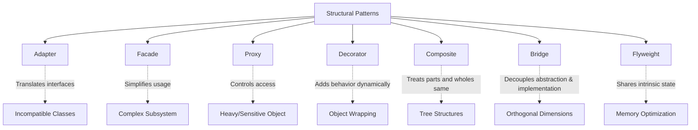

# Structural Design Patterns — Theory Super

## Global Mind Map: Structural Patterns



---

# 1. Adapter

## The Problem — Incompatible Interfaces
Imagine you have an e-commerce checkout system that processes payments via a standard `PaymentProcessor` interface (using cents). Now, you need to integrate a legacy or third-party `ExternalPaymentGateway` that expects dollars and uses a completely different method name. You cannot rewrite the third-party gateway, and rewriting your entire checkout system to match their interface would tightly couple you to their exact implementation.

## The Core Idea
The **Adapter Pattern** helps two components work together when their interfaces do not match, just like a physical travel adapter lets a European plug work in a US socket.

## How It Works
Instead of changing the gateway or rewriting our checkout system, we create an adapter that implements the interface our application expects.

```java
// What our system expects
interface PaymentProcessor {
    void pay(int amountInCents);
}

// What the 3rd party provides
class ExternalPaymentGateway {
    public void makePayment(double amountInDollars) {
        System.out.println("Charging $" + amountInDollars);
    }
}
```

The Adapter:
```java
class ExternalPaymentAdapter implements PaymentProcessor {
    private final ExternalPaymentGateway gateway;

    public ExternalPaymentAdapter(ExternalPaymentGateway gateway) {
        this.gateway = gateway;
    }

    @Override
    public void pay(int amountInCents) {
        double amountInDollars = amountInCents / 100.0;
        gateway.makePayment(amountInDollars);
    }
}
```

The client simply uses the Adapter through the standard interface:
```java
PaymentProcessor processor = new ExternalPaymentAdapter(new ExternalPaymentGateway());
processor.pay(4999);
```

---

# 2. Facade

## The Problem — Complex Subsystems
If you are building a client for a video publishing platform, publishing a video involves compression, generating thumbnails, uploading to storage, saving to a repository, and sending notifications. If the client has to coordinate all these steps, it becomes tightly coupled to the internal workflow.

```java
String video = compressor.compress("clip.mp4");
String thumb = thumbnails.generate(video);
String videoUrl = storage.upload(video);
// ... and so on
```

## The Core Idea
The **Facade Pattern** provides a single, simple interface to a complex subsystem, hiding the underlying coordination details.

## How It Works
You create a Facade class that encapsulates the workflow.

```java
class VideoPublishingFacade {
    public void publish(String videoFile) {
        String video = compressor.compress(videoFile);
        String thumb = thumbnails.generate(video);
        String videoUrl = storage.upload(video);
        String thumbUrl = storage.upload(thumb);
        repository.save(videoUrl, thumbUrl);
        notifier.notifyPublished(videoUrl);
    }
}
```

Now the client only needs to make one simple call:
```java
VideoPublishingFacade facade = new VideoPublishingFacade();
facade.publish("clip.mp4");
```

---

# 3. Proxy

## The Problem — Expensive Object Creation
Imagine an image gallery app where high-resolution images are loaded from disk the moment they are instantiated. If you instantiate 100 images but the user only views 1, you have wasted massive amounts of memory and processing time.

## The Core Idea
The **Proxy Pattern** places a substitute (proxy) object in front of a real object to control access to it (e.g., delaying initialization until absolutely necessary). Both share the same interface.

## How It Works
The Proxy wraps the real class. It starts as a lightweight object and only loads the heavy object when the user actually interacts with it.

```java
class HighResolutionImage implements Image {
    private final String fileName;
    public HighResolutionImage(String fileName) {
        this.fileName = fileName;
        loadFromDisk(); // Expensive!
    }
    // ...
}

class ImageProxy implements Image {
    private final String fileName;
    private HighResolutionImage realImage;

    public ImageProxy(String fileName) {
        this.fileName = fileName;
    }

    @Override
    public void display() {
        if (realImage == null) {
            realImage = new HighResolutionImage(fileName); // Lazy loading
        }
        realImage.display();
    }
}
```

Client code works exactly the same, but saves massive overhead:
```java
Image image3 = new ImageProxy("photo-3.jpg");
image3.display(); // Only loads now!
```

---

# 4. Decorator

## The Problem — Subclass Explosion
You have a `TextView` that renders plain text. You want to add Bold, Italic, and Underline formatting. If you try to do this via inheritance, you need a `BoldTextView`, an `ItalicTextView`, a `BoldItalicTextView`, etc. This leads to an explosion of subclasses.

## The Core Idea
The **Decorator Pattern** lets us add new behavior to an object dynamically at runtime by wrapping it in a decorator object, without modifying its original class.

## How It Works
Create decorators that implement the same interface and wrap the original object.

```java
interface TextView { String render(); }
class PlainTextView implements TextView { ... }

abstract class TextDecorator implements TextView {
    protected final TextView wrapped;
    public TextDecorator(TextView wrapped) { this.wrapped = wrapped; }
}

class BoldDecorator extends TextDecorator {
    public BoldDecorator(TextView t) { super(t); }
    public String render() { return "<b>" + wrapped.render() + "</b>"; }
}
class ItalicDecorator extends TextDecorator {
    public ItalicDecorator(TextView t) { super(t); }
    public String render() { return "<i>" + wrapped.render() + "</i>"; }
}
```

You can now stack behaviors infinitely:
```java
TextView plain = new PlainTextView("Design Patterns");
TextView boldItalic = new ItalicDecorator(new BoldDecorator(plain));
```

---

# 5. Composite

## The Problem — Handling Parts and Wholes Differently
In a file system, a file is a single object, while a folder contains files and other folders. If a client wants to calculate the total size, it has to write complex `instanceof` checks and recursive loops that treat files and folders differently.

## The Core Idea
The **Composite Pattern** lets us treat individual objects (Files) and groups of objects (Folders) uniformly through the exact same interface.

## How It Works
Both the "leaf" (File) and the "composite" (Folder) implement the same interface.

```java
interface FileSystemItem {
    long getSize();
    void print(String indent);
}

class FileItem implements FileSystemItem {
    private final String name;
    private final long size;

    public long getSize() { return size; }
    public void print(String indent) { System.out.println(indent + "- " + name); }
}

class Folder implements FileSystemItem {
    private final String name;
    private final List<FileSystemItem> children = new ArrayList<>();

    public void add(FileSystemItem item) { children.add(item); }

    public long getSize() {
        long total = 0;
        for (FileSystemItem child : children) {
            total += child.getSize(); // Recursive magic!
        }
        return total;
    }
    // print() is similarly recursive...
}
```

The client can treat a massive folder tree exactly like a single file:
```java
FileSystemItem item = projectFolder;
System.out.println(item.getSize());
```

---

# 6. Bridge

## The Problem — Orthogonal Dimensions causing Class Explosion
Imagine drawing shapes (Circle, Rectangle) using different renderers (Vector, Raster). If you use inheritance, you need a `VectorCircle`, `RasterCircle`, `VectorRectangle`, `RasterRectangle`. (Shapes × Renderers = Subclass Explosion). They are tightly coupled, and adding a new renderer requires editing or adding every shape.

## The Core Idea
The **Bridge Pattern** splits a class into two separate hierarchies: one for the abstraction (Shapes) and one for the implementation (Renderers). The abstraction *has a* reference to the implementor (Composition over Inheritance).

## How It Works
**1. The Implementor:**
```java
interface Renderer {
    void renderCircle(float radius);
    void renderRectangle(float width, float height);
}
class VectorRenderer implements Renderer { ... }
class RasterRenderer implements Renderer { ... }
```

**2. The Abstraction:**
```java
abstract class Shape {
    protected Renderer renderer; // The Bridge
    public Shape(Renderer renderer) { this.renderer = renderer; }
    public abstract void draw();
}
```

**3. The Refined Abstraction:**
```java
class Circle extends Shape {
    private float radius;
    public Circle(Renderer renderer, float radius) {
        super(renderer);
        this.radius = radius;
    }
    public void draw() {
        renderer.renderCircle(radius);
    }
}
```

**Client Code:**
```java
Renderer vector = new VectorRenderer();
Shape circle = new Circle(vector, 5.0f);
circle.draw();
```

---

# 7. Flyweight

## The Problem — Massive Memory Redundancy
Imagine a text editor rendering 500,000 characters. If every character object stores its own font, size, color, and X/Y position, you waste 50MB of memory on duplicated formatting data (since most characters share the exact same font/color).

## The Core Idea
The **Flyweight Pattern** minimizes memory usage by separating and sharing *intrinsic state* (immutable, repeated data) across many objects, while the *extrinsic state* (unique context, like position) is passed in at runtime.

## How It Works
**1. The Flyweight (Intrinsic State Only):**
```java
class CharacterGlyph implements CharacterFlyweight {
    private final char symbol;
    private final String fontFamily;
    private final int fontSize;
    private final String color;

    // Notice: NO x/y position in the object!
    public CharacterGlyph(char symbol, String font, int size, String color) { ... }

    // Extrinsic state is passed in
    public void draw(int x, int y) { ... }
}
```

**2. The Factory (Manages Caching):**
```java
class CharacterFlyweightFactory {
    private Map<String, CharacterFlyweight> flyweightMap = new HashMap<>();

    public CharacterFlyweight getFlyweight(char symbol, String font, int size, String color) {
        String key = symbol + font + size + color;
        if (!flyweightMap.containsKey(key)) {
            flyweightMap.put(key, new CharacterGlyph(symbol, font, size, color));
        }
        return flyweightMap.get(key);
    }
}
```

**3. The Client wrapper (Extrinsic State):**
```java
class RenderedCharacter {
    private final CharacterFlyweight flyweight;
    private final int x;
    private final int y;

    public void render() {
        flyweight.draw(x, y);
    }
}
```
Now, 500,000 "e" characters in Arial size 12 black will all point to the exact same `CharacterGlyph` instance in memory.
