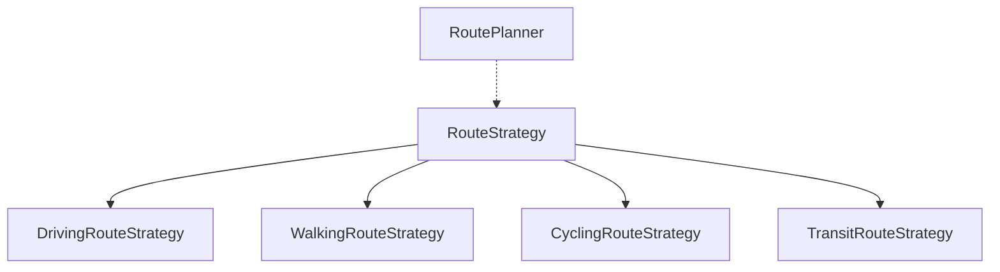

9. Strategy
The Strategy Pattern lets us define multiple ways to perform the same task and switch between them when needed.

Consider a navigation app that calculates routes for driving, walking, cycling, or public transport. One way to implement this is to have a RoutePlanner class with a large if-else block that selects the routing logic based on the travel mode:

Java

class RoutePlanner {
    public void buildRoute(
            String start,
            String destination,
            String travelMode) {

        if (travelMode.equals("DRIVING")) {
            buildDrivingRoute(start, destination);
        } else if (travelMode.equals("WALKING")) {
            buildWalkingRoute(start, destination);
        } else if (travelMode.equals("CYCLING")) {
            buildCyclingRoute(start, destination);
        } else if (travelMode.equals("TRANSIT")) {
            buildTransitRoute(start, destination);
        }
    }
}

1234567891011121314151617
But this approach does not scale well. As new travel modes are added, the conditional logic keeps growing, making the class harder to understand, test, and maintain:

Java

} else if (travelMode.equals("RIDESHARE")) {
    buildRideshareRoute(start, destination);
} else if (travelMode.equals("SCOOTER")) {
    buildScooterRoute(start, destination);
} else if (travelMode.equals("FERRY")) {
    buildFerryRoute(start, destination);
}

1234567
It also means modifying the RoutePlanner every time we introduce a new routing algorithm, which tightly couples the class to all possible routing strategies.

This is where the Strategy Pattern helps. We start by defining a common interface for building routes:

Java

interface RouteStrategy {
    void buildRoute(String start, String destination);
}

123
Each routing algorithm becomes a separate strategy class implementing the interface:

Java

class DrivingRouteStrategy implements RouteStrategy {
    public void buildRoute(String start, String destination) {
        System.out.println("Fastest driving route");
    }
}

class WalkingRouteStrategy implements RouteStrategy {
    public void buildRoute(String start, String destination) {
        System.out.println("Pedestrian-friendly route");
    }
}

class CyclingRouteStrategy implements RouteStrategy {
    public void buildRoute(String start, String destination) {
        System.out.println("Cycling route");
    }
}

class TransitRouteStrategy implements RouteStrategy {
    public void buildRoute(String start, String destination) {
        System.out.println("Public transport route");
    }
}

1234567891011121314151617181920212223
Now the route planner no longer needs to know how each algorithm works. It simply delegates the task to the selected strategy:

Java

class RoutePlanner {
    private RouteStrategy strategy;

    public RoutePlanner(RouteStrategy strategy) {
        this.strategy = strategy;
    }

    public void setStrategy(RouteStrategy strategy) {
        this.strategy = strategy;
    }

    public void buildRoute(String start, String destination) {
        strategy.buildRoute(start, destination);
    }
}

123456789101112131415

RoutePlanner

RouteStrategy

DrivingRouteStrategy

WalkingRouteStrategy

CyclingRouteStrategy

TransitRouteStrategy

The client can choose the appropriate strategy when creating the route planner:

Java

RoutePlanner planner = new RoutePlanner(new DrivingRouteStrategy());
planner.buildRoute("Berlin", "Munich");

12
And if the user switches from driving to walking, we can change the strategy at runtime:

Java

planner.setStrategy(new WalkingRouteStrategy());
planner.buildRoute("Berlin", "Munich");

12
The RoutePlanner remains unchanged. Only the selected algorithm changes.

Strategy allows one object to choose between different behaviors. But sometimes we need several objects to react when something happens. That brings us to the Observer pattern.

