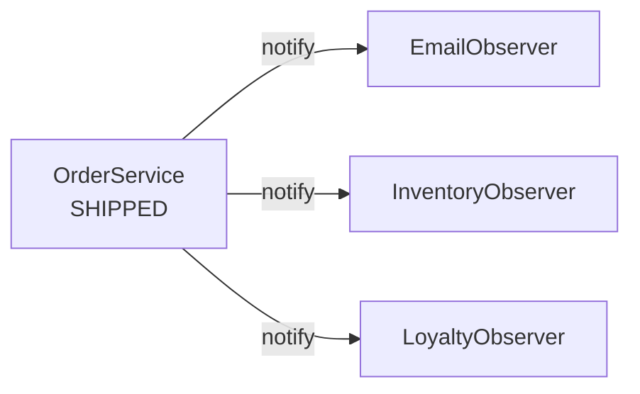
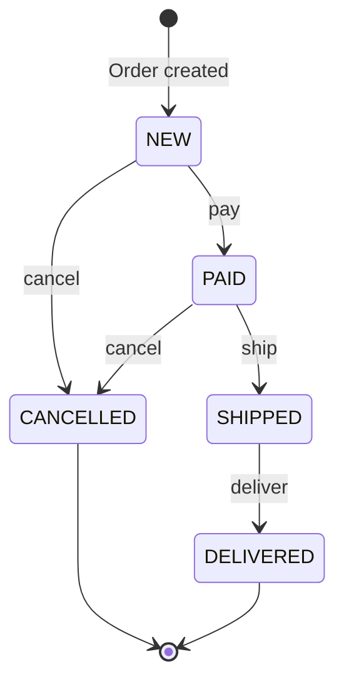

10. Observer
The Observer Pattern is useful when multiple objects need to react to the same event.

Consider an e-commerce system. When an order is shipped, we may need to send an email, update the inventory, and reward the customer. Calling each service directly would tightly couple the order service to all of these actions:

Java

class OrderService {
    private final EmailService emailService;
    private final InventoryService inventoryService;
    private final AnalyticsService analyticsService;
    private final LoyaltyService loyaltyService;

    public void shipOrder(Order order) {
        order.markShipped();

        emailService.sendShippingEmail(order);
        inventoryService.updateInventory(order);
        analyticsService.trackShipment(order);
        loyaltyService.addRewardPoints(order);
    }
}

123456789101112131415
The order service is now responsible not only for shipping the order, but also for knowing everything that should happen afterward.

This is where the Observer Pattern helps. Instead of calling every component directly, the order service simply announces that an event has occurred. Any interested component can subscribe and react to that event.

We begin with a common observer interface:

Java

interface OrderObserver {
    void onOrderShipped(Order order);
}

123
Each observer handles one specific reaction:

Java

class EmailObserver implements OrderObserver {
    public void onOrderShipped(Order order) {
        System.out.println("Sending shipping email");
    }
}

class InventoryObserver implements OrderObserver {
    public void onOrderShipped(Order order) {
        System.out.println("Updating inventory");
    }
}

class LoyaltyObserver implements OrderObserver {
    public void onOrderShipped(Order order) {
        System.out.println("Adding reward points");
    }
}

1234567891011121314151617
The order service maintains a list of subscribers and notifies them when the event occurs:

Java

class OrderService {
    private final List<OrderObserver> observers = new ArrayList<>();

    public void subscribe(OrderObserver observer) {
        observers.add(observer);
    }

    public void shipOrder(Order order) {
        order.markShipped();

        for (OrderObserver observer : observers) {
            observer.onOrderShipped(order);
        }
    }
}

123456789101112131415

notify

notify

notify

OrderService
SHIPPED

EmailObserver

InventoryObserver

LoyaltyObserver

The observers are wired up once, and shipOrder no longer names any of them:

Java
OrderService orderService = new OrderService();

orderService.subscribe(new EmailObserver());
orderService.subscribe(new InventoryObserver());
orderService.subscribe(new LoyaltyObserver());

orderService.shipOrder(order);

1234567

Observer allows several objects to react when something happens. But what if one object changes its own behavior based on its current condition? That brings us to the State pattern.

