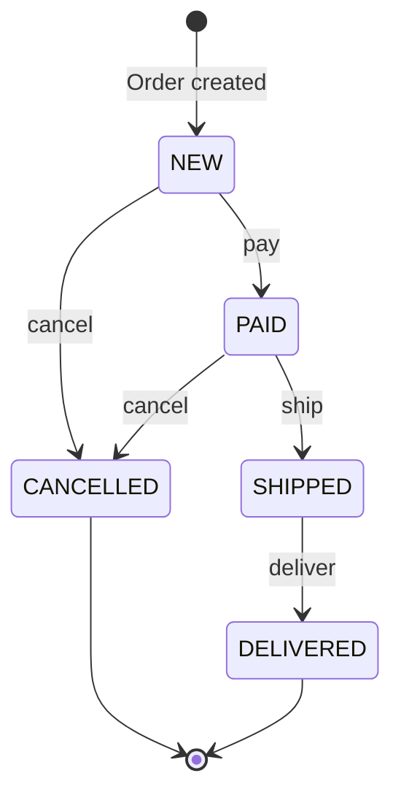

11. State
The State Pattern allows an object to change its behavior when its internal state changes.

Consider an e-commerce system. An order can move through several states: New, Paid, Shipped, Delivered, or Cancelled. The operations allowed on the order depend on its current state. A new order can be paid. A paid order can be shipped. A shipped order can be delivered. But a delivered order cannot be shipped again.

Order created

pay

cancel

ship

cancel

deliver

NEW

PAID

CANCELLED

SHIPPED

DELIVERED

A simple approach is to store the current status and use conditionals throughout the Order class:

Java
class Order {
    private String status = "NEW";

    public void pay() {
        if (status.equals("NEW")) {
            status = "PAID";
        } else if (status.equals("PAID")) {
            System.out.println("Already paid");
        } else {
            System.out.println("Cannot pay this order");
        }
    }

    public void ship() {
        if (status.equals("PAID")) {
            status = "SHIPPED";
        } else if (status.equals("NEW")) {
            System.out.println("Pay before shipping");
        } else {
            System.out.println("Cannot ship this order");
        }
    }
}

1234567891011121314151617181920212223
This may look manageable with only a few states. But as the order lifecycle grows, every method starts accumulating more if-else or switch statements. Soon, the Order class becomes responsible for the behavior of every possible state and every valid transition between them.

This is where the State Pattern helps. Instead of representing the state using a string or enum alone, we represent each state as a separate object.

We begin with a common interface for order state:

Java

interface OrderState {
    void pay(Order order);
    void ship(Order order);
    void deliver(Order order);
}

12345
Each concrete state defines which operations are valid and what should happen next:

Java

class NewOrderState implements OrderState {
    public void pay(Order order) {
        System.out.println("Payment completed");
        order.setState(new PaidOrderState());
    }
}

class PaidOrderState implements OrderState {
    public void ship(Order order) {
        System.out.println("Order shipped");
        order.setState(new ShippedOrderState());
    }
}

class ShippedOrderState implements OrderState {
    public void deliver(Order order) {
        System.out.println("Order delivered");
        order.setState(new DeliveredOrderState());
    }
}

1234567891011121314151617181920
The Order class now delegates its behavior to the current state object:

Java
class Order {
    private OrderState state = new NewOrderState();

    public void setState(OrderState s) { state = s; }

    public void pay() { state.pay(this); }
    public void ship() { state.ship(this); }
    public void deliver() { state.deliver(this); }
}

123456789
The client can use the order without writing any state-specific conditions:

Java

Order order = new Order();

order.pay();        // Payment completed
order.ship();       // Order shipped
order.deliver();    // Order delivered

12345
Internally, the same method call behaves differently depending on the current state object. For example, calling ship on a new order produces an error. Calling ship after payment moves the order to the shipped state. And calling it after delivery tells us that the order has already been shipped.

Each state owns its own behavior and controls the valid transitions from that state. This makes it easier to add a new state, such as CancelledOrderState or ReturnedOrderState, without filling the main Order class with even more conditions.

State changes how an object behaves over time. But sometimes, instead of performing an action immediately, we want to represent that action as an object so it can be queued, logged, retried, or undone. That brings us to the next pattern: Command.

