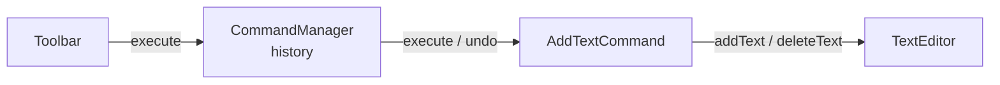

12. Command
The Command Pattern turns a request or action into a separate object.

Why is that useful? Because once an action becomes an object, we can store it, queue it, retry it, keep a history, or undo it later.

Consider a text editor with multiple options in the toolbar, where users can add or delete text, copy and paste, and undo the most recent operation. A simple approach is to put all of this logic directly inside the toolbar:

Java

class Toolbar {
    private final TextEditor editor;

    public void onButtonClick(String action) {
        if (action.equals("ADD")) {
            editor.addText("Hello");
        } else if (action.equals("DELETE")) {
            editor.deleteText(5);
        } else if (action.equals("UNDO")) {
            // what exactly do we reverse?
        }
    }
}

12345678910111213
This works for executing actions, but undo becomes difficult. The toolbar knows that a button was clicked, but it does not have enough information to reverse the action. As more actions are added, the toolbar also becomes tightly coupled to every operation supported by the editor.

This is where the Command Pattern helps. Instead of executing actions directly, we represent each action as a command object.

Here is the TextEditor class that performs the actual work of adding and deleting text:

Java

class TextEditor {
    private final StringBuilder content = new StringBuilder();

    public void addText(String text) {
        content.append(text);
    }

    public String deleteText(int length) {
        int start = Math.max(0, content.length() - length);
        String deleted = content.substring(start);
        content.delete(start, content.length());
        return deleted;
    }

    public String getContent() {
        return content.toString();
    }
}

123456789101112131415161718
To turn these operations into commands, we first define a common Command interface:

Java

interface Command {
    void execute();
    void undo();
}

1234
We then create concrete command classes for each type of action. Each command stores the information needed to execute and reverse the operation, and wraps the TextEditor object to perform the actual work:

Java

class AddTextCommand implements Command {
    private final TextEditor editor;
    private final String text;

    public AddTextCommand(TextEditor editor, String text) {
        this.editor = editor;
        this.text = text;
    }

    public void execute() { editor.addText(text); }
    public void undo() { editor.deleteText(text.length()); }
}

123456789101112
We also need a way to keep track of executed commands so they can be undone in the correct order. That is the responsibility of the CommandManager class. It maintains the command history, delegates execution to the appropriate command, and handles undo operations:

Java

class CommandManager {
    private final Stack<Command> history = new Stack<>();

    public void execute(Command command) {
        command.execute();
        history.push(command);
    }

    public void undo() {
        if (!history.isEmpty()) history.pop().undo();
    }
}

123456789101112

execute

execute / undo

addText / deleteText

Toolbar

CommandManager
history

AddTextCommand

TextEditor

The client can now use it like this:

Java

TextEditor editor = new TextEditor();
CommandManager manager = new CommandManager();

manager.execute(new AddTextCommand(editor, "Design "));
manager.execute(new AddTextCommand(editor, "Patterns"));

System.out.println(editor.getContent());   // Design Patterns

1234567
Now suppose the user presses Undo. This reverses the most recent command:

Java

manager.undo();

System.out.println(editor.getContent());   // Design

123
Command lets us package an individual action as an object. But sometimes, we have an entire process made up of several steps, where the overall workflow stays the same but some steps need to vary. That brings us to the next pattern: Template Method.

