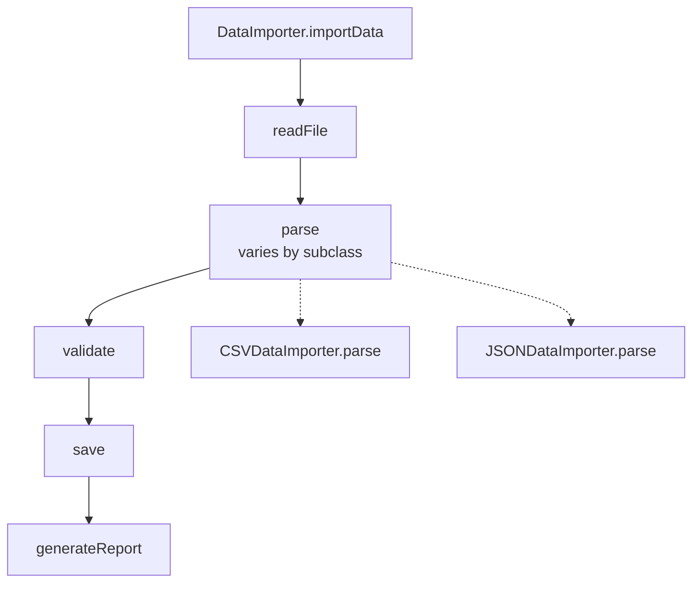

13. Template Method
The Template Method Pattern is useful when several processes follow the same overall workflow, but a few steps vary.

Consider a data import system that needs to support different file formats, such as CSV and JSON. All formats follow the same sequence: read the file, parse the content, validate the records, save them, and generate a report.

If each importer implements the full workflow separately, most of the code gets duplicated:

Java

class CSVDataImporter {

    public void importData(String filePath) {
        String content = readFile(filePath);
        List<Record> records = parseCSV(content);
        validate(records);
        save(records);
        generateReport(records);
    }
}

class JSONDataImporter {

    public void importData(String filePath) {
        String content = readFile(filePath);
        List<Record> records = parseJSON(content);
        validate(records);
        save(records);
        generateReport(records);
    }
}

123456789101112131415161718192021
The only major difference is how the content is parsed.

This is where the Template Method Pattern helps. We move the common workflow into a base class:

Java

abstract class DataImporter {

    public final void importData(String filePath) {
        String content = readFile(filePath);
        List<Record> records = parse(content);
        validate(records);
        save(records);
        generateReport(records);
    }

    protected abstract List<Record> parse(String content);

    private String readFile(String path) { ... }
    protected void validate(List<Record> records) { ... }
    protected void save(List<Record> records) { ... }
    protected void generateReport(List<Record> records) { ... }
}

1234567891011121314151617
The importData method is the template method. It defines the overall algorithm and fixes the order of the steps, while subclasses customize only what differs.

Now every importer follows the same workflow while providing its own parsing logic:

Java

class CSVDataImporter extends DataImporter {
    @Override
    protected List<Record> parse(String content) {
        System.out.println("Parsing CSV content");
        return new ArrayList<>();
    }
}

class JSONDataImporter extends DataImporter {
    @Override
    protected List<Record> parse(String content) {
        System.out.println("Parsing JSON content");
        return new ArrayList<>();
    }
}

123456789101112131415

DataImporter.importData

readFile

parse
varies by subclass

validate

save

generateReport

CSVDataImporter.parse

JSONDataImporter.parse

The base class controls the structure of the algorithm, while subclasses customize specific steps. The client can now use either importer through the same process:

Java

DataImporter csv = new CSVDataImporter();
csv.importData("users.csv");

DataImporter json = new JSONDataImporter();
json.importData("users.json");

12345
Template Method defines the structure of an algorithm while letting us customize specific steps. But what if we need to traverse a collection without caring how its data is stored? That brings us to the Iterator pattern.

