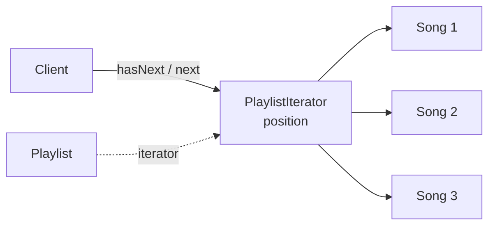

14. Iterator
The Iterator Pattern lets us move through a collection without exposing how its elements are stored.

Consider a music application with a playlist. Internally, the playlist might store songs in an array, a linked list, a database, or even fetch them from an external service.

Initially, the playlist class might expose its internal data structure directly to the client:

Java

class Playlist {
    private final List<Song> songs = new ArrayList<>();

    public List<Song> getSongs() {
        return songs;
    }
}

1234567
The client then traverses it by index:

Java

List<Song> songs = playlist.getSongs();

for (int i = 0; i < songs.size(); i++) {
    Song song = songs.get(i);
    System.out.println(song.getTitle());
}

123456
This works, but it creates a few problems. The client now knows that songs are stored in a List and accessed using an index. If we later update the Playlist and replace the data structure with a linked list, a tree, or a remote data source, the traversal logic may also need to change on the client side.

This is where the Iterator Pattern helps. Instead of exposing the internal collection, the playlist provides an iterator.

An iterator usually supports two basic operations: hasNext, which tells us whether another element is available, and next, which returns that element and moves the iterator forward:

Java

interface Iterator<T> {
    boolean hasNext();
    T next();
}

1234
The iterator keeps track of the current position internally:

Java

class PlaylistIterator implements Iterator<Song> {
    private final List<Song> songs;
    private int position = 0;

    public PlaylistIterator(List<Song> songs) {
        this.songs = songs;
    }

    public boolean hasNext() {
        return position < songs.size();
    }

    public Song next() {
        if (!hasNext()) throw new NoSuchElementException();
        return songs.get(position++);
    }
}

1234567891011121314151617
The playlist provides an iterator without exposing its internal list:

Java

class Playlist implements Iterable<Song> {
    private final List<Song> songs = new ArrayList<>();

    public void addSong(Song song) { ... }

    public Iterator<Song> iterator() {
        return new PlaylistIterator(songs);
    }
}

123456789

hasNext / next

iterator

Client

PlaylistIterator
position

Song 1

Song 2

Song 3

Playlist

Here is what it looks like in code. The client can now traverse the playlist by repeatedly calling hasNext and next until every song has been visited:

Java

Playlist playlist = new Playlist();
playlist.addSong(new Song("Nightcall"));
playlist.addSong(new Song("Resonance"));

Iterator<Song> it = playlist.iterator();
while (it.hasNext()) {
    Song song = it.next();
    System.out.println(song.getTitle());
}

123456789

The client no longer needs to manage indexes or know how the playlist stores its songs. And because Playlist implements Iterable, it also works with the enhanced for loop, which is Java's own use of this pattern:

Java

for (Song song : playlist) {
    System.out.println(song.getTitle());
}

123

