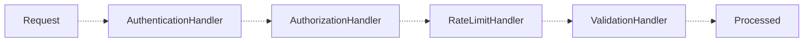

15. Chain of Responsibility
The final pattern in the chain is the Chain of Responsibility Pattern. This pattern lets you pass a request through a sequence of independent handlers. Each handler performs one part of the processing and either stops the request or forwards it to the next handler.

Consider an API request that must pass authentication, authorization, rate limiting, and validation. Putting every check inside one method creates a long conditional that is difficult to reuse or rearrange:

Java

class APIService {
    public void handle(Request request) {
        if (!request.isAuthenticated()) {
            System.out.println("Authentication failed");
            return;
        }
        if (!request.isAuthorized()) {
            System.out.println("Access denied");
            return;
        }
        if (request.hasExceededRateLimit()) {
            System.out.println("Rate limit exceeded");
            return;
        }
        if (!request.isValid()) {
            System.out.println("Invalid request");
            return;
        }

        System.out.println("Processing request");
    }
}

12345678910111213141516171819202122
This is where the Chain of Responsibility Pattern helps. We begin with a base handler:

Java

abstract class RequestHandler {
    private RequestHandler next;

    public RequestHandler setNext(RequestHandler next) {
        this.next = next;
        return next;
    }

    public final void handle(Request r) {
        if (!process(r)) return;
        if (next != null) next.handle(r);
    }

    protected abstract boolean process(Request r);
}

123456789101112131415
Each handler implements the process method and handles one responsibility. If the handler returns true, the request continues to the next handler. If it returns false, the chain stops immediately:

Java

class AuthenticationHandler extends RequestHandler {
    protected boolean process(Request r) { return r.isAuthenticated(); }
}

class AuthorizationHandler extends RequestHandler {
    protected boolean process(Request r) { return r.isAuthorized(); }
}

class RateLimitHandler extends RequestHandler {
    protected boolean process(Request r) { return r.isUnderLimit(); }
}

class ValidationHandler extends RequestHandler {
    protected boolean process(Request r) { return r.isValid(); }
}

123456789101112131415
We can then build the pipeline dynamically by connecting these handlers into a chain:

Java

RequestHandler authentication = new AuthenticationHandler();

authentication
        .setNext(new AuthorizationHandler())
        .setNext(new RateLimitHandler())
        .setNext(new ValidationHandler());

123456

Request

AuthenticationHandler

AuthorizationHandler

RateLimitHandler

ValidationHandler

Processed

To process a request, the sender only needs to know where the chain begins:

Java

Request request = new Request(user, "/api/orders");

authentication.handle(request);
// stops at the rate limit

1234
Another advantage is that the chain can be configured differently for different situations. For example, a public endpoint may only require rate limiting and validation:

Java

RequestHandler publicChain = new RateLimitHandler();
publicChain.setNext(new ValidationHandler());

12
An admin endpoint may require the full chain:

Java

RequestHandler adminChain = new AuthenticationHandler();

adminChain
        .setNext(new AuthorizationHandler())
        .setNext(new RateLimitHandler())
        .setNext(new ValidationHandler());

123456
We can also change the order of the handlers without modifying their internal logic.

Choosing the Right Pattern
You do not need to remember every class or implementation you saw in this chapter. Instead, focus on the problem each pattern is designed to solve. When you recognize the problem, the right pattern becomes much easier to identify.

Pattern	Use it when
Singleton	The application genuinely requires one shared instance of a class
Builder	An object has many optional fields and its constructor is hard to read
Factory Method	Subclasses should decide which concrete object gets created
Adapter	Two components must work together but their interfaces do not match
Facade	A working subsystem is too complicated for clients to use directly
Proxy	Access to an object needs to be controlled, delayed, or checked
Decorator	Behavior must be added to an object without modifying its class
Composite	Individual objects and groups of them should be treated the same way
Strategy	One task has multiple interchangeable algorithms
Observer	Several objects need to react to the same event
State	An object's behavior depends on the state it is currently in
Command	An action must be stored, queued, logged, retried, or undone
Template Method	Several processes share a workflow but differ in a few steps
Iterator	A collection must be traversed without exposing how it stores data
Chain of Responsibility	A request should pass through a configurable series of handlers
Several of these patterns look similar in a diagram and differ in intent. Adapter and Decorator both wrap an object, but an adapter changes the interface while a decorator keeps it and adds behavior. Proxy also keeps the interface, and controls access rather than extending it. Strategy and State both delegate to an interchangeable object, but a strategy is chosen by the client while a state is chosen by the object itself as part of its own lifecycle.