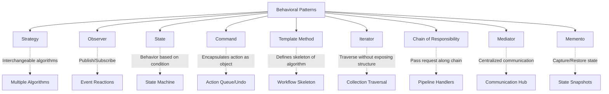

# Behavioral Design Patterns - Theory Super

## Global Mind Map: Behavioral Patterns



---

# 1. Strategy

## The Problem - Massive Conditional Blocks
Imagine a navigation app (`RoutePlanner`) that calculates routes for driving, walking, cycling, or transit. If you put all the logic in one class with massive `if-else` blocks, the class becomes unmaintainable, hard to test, and tightly coupled to every possible routing algorithm. Every time you add a new travel mode, you have to edit this core class.

## The Core Idea
The **Strategy Pattern** lets us define multiple ways to perform the same task (interchangeable algorithms) and switch between them dynamically at runtime.

## How It Works
We define a common interface for the strategy:
```java
interface RouteStrategy {
    void buildRoute(String start, String destination);
}
```

Each algorithm becomes a separate strategy class:
```java
class DrivingRouteStrategy implements RouteStrategy {
    public void buildRoute(String start, String destination) {
        System.out.println("Fastest driving route");
    }
}
// Same for WalkingRouteStrategy, CyclingRouteStrategy, TransitRouteStrategy
```

The planner delegates to the chosen strategy:
```java
class RoutePlanner {
    private RouteStrategy strategy;

    public RoutePlanner(RouteStrategy strategy) { this.strategy = strategy; }
    public void setStrategy(RouteStrategy strategy) { this.strategy = strategy; }

    public void buildRoute(String start, String destination) {
        strategy.buildRoute(start, destination);
    }
}
```

Client usage:
```java
RoutePlanner planner = new RoutePlanner(new DrivingRouteStrategy());
planner.buildRoute("Berlin", "Munich");

// Change behavior at runtime
planner.setStrategy(new WalkingRouteStrategy());
planner.buildRoute("Berlin", "Munich");
```

---

# 2. Observer

## The Problem - Tightly Coupled Reactions
In an e-commerce system, when an order is shipped, you need to send an email, update inventory, track analytics, and add loyalty points. If `OrderService.shipOrder()` calls all these services directly, it becomes tightly coupled to everything that happens *after* an order is shipped.

## The Core Idea
The **Observer Pattern** allows multiple objects (subscribers/observers) to react to an event published by another object (publisher/subject) without the publisher knowing who they are.

## How It Works
Define an observer interface:
```java
interface OrderObserver {
    void onOrderShipped(Order order);
}
```

Each reactor implements the interface:
```java
class EmailObserver implements OrderObserver {
    public void onOrderShipped(Order order) { System.out.println("Sending shipping email"); }
}
class InventoryObserver implements OrderObserver {
    public void onOrderShipped(Order order) { System.out.println("Updating inventory"); }
}
```

The publisher manages a list of observers and notifies them:
```java
class OrderService {
    private final List<OrderObserver> observers = new ArrayList<>();

    public void subscribe(OrderObserver observer) { observers.add(observer); }

    public void shipOrder(Order order) {
        order.markShipped();
        for (OrderObserver observer : observers) {
            observer.onOrderShipped(order);
        }
    }
}
```

---

# 3. State

## The Problem - Complex State Machines
An Order can be `NEW`, `PAID`, `SHIPPED`, or `DELIVERED`. Calling `ship()` on a `NEW` order is an error. Using `if(status.equals("..."))` inside every method creates brittle, massive classes that are a nightmare to maintain.

## The Core Idea
The **State Pattern** allows an object to alter its behavior when its internal state changes by representing each state as a separate object.

## How It Works
Define a State interface:
```java
interface OrderState {
    void pay(Order order);
    void ship(Order order);
    void deliver(Order order);
}
```

Create concrete state classes that handle transitions:
```java
class NewOrderState implements OrderState {
    public void pay(Order order) {
        System.out.println("Payment completed");
        order.setState(new PaidOrderState());
    }
}
class PaidOrderState implements OrderState {
    public void ship(Order order) {
        System.out.println("Order shipped");
        order.setState(new ShippedOrderState());
    }
}
```

The context object (`Order`) delegates to its state:
```java
class Order {
    private OrderState state = new NewOrderState();
    public void setState(OrderState s) { state = s; }

    public void pay() { state.pay(this); }
    public void ship() { state.ship(this); }
    public void deliver() { state.deliver(this); }
}
```

---

# 4. Command

## The Problem - Hardcoded Actions and No Undo
In a text editor, a Toolbar button triggers an action. If the Toolbar calls `editor.addText()` directly, it is tightly coupled to the editor. Furthermore, if the user clicks "Undo", the Toolbar has no idea what was just done or how to reverse it.

## The Core Idea
The **Command Pattern** turns a request or action into a standalone object. This allows you to queue actions, track history, and easily implement undo operations.

## How It Works
Define a Command interface:
```java
interface Command {
    void execute();
    void undo();
}
```

Create concrete commands that wrap the action and store its parameters:
```java
class AddTextCommand implements Command {
    private final TextEditor editor;
    private final String text;

    public AddTextCommand(TextEditor editor, String text) {
        this.editor = editor;
        this.text = text;
    }
    public void execute() { editor.addText(text); }
    public void undo() { editor.deleteText(text.length()); }
}
```

A Command Manager tracks the history stack:
```java
class CommandManager {
    private final Stack<Command> history = new Stack<>();

    public void execute(Command command) {
        command.execute();
        history.push(command);
    }
    public void undo() {
        if (!history.isEmpty()) history.pop().undo();
    }
}
```

---

# 5. Template Method

## The Problem - Duplicated Workflows
You have a data importer for CSV and JSON. Both follow the exact same steps: read file, parse, validate, save, generate report. The only difference is the "parse" step. If you write two separate classes, you duplicate the entire workflow.

## The Core Idea
The **Template Method Pattern** defines the skeleton (workflow) of an algorithm in a base class, but lets subclasses override specific steps without changing the algorithm's structure.

## How It Works
The abstract base class defines the `final` template method:
```java
abstract class DataImporter {
    public final void importData(String filePath) {
        String content = readFile(filePath);
        List<Record> records = parse(content);
        validate(records);
        save(records);
        generateReport(records);
    }

    protected abstract List<Record> parse(String content);

    private String readFile(String path) { ... }
    protected void validate(List<Record> records) { ... }
    // ...
}
```

Subclasses only implement what varies:
```java
class CSVDataImporter extends DataImporter {
    @Override
    protected List<Record> parse(String content) {
        System.out.println("Parsing CSV content");
        return new ArrayList<>();
    }
}
```

---

# 6. Iterator

## The Problem - Exposed Internal Structures
If a `Playlist` exposes its internal `List<Song>`, the client code is forced to use a specific traversal method (like a `for` loop with an index). If the `Playlist` changes to use a Tree or a Linked List, the client code breaks.

## The Core Idea
The **Iterator Pattern** lets you traverse elements of a collection without exposing its underlying representation (list, stack, tree, etc.).

## How It Works
Provide an iterator interface:
```java
interface Iterator<T> {
    boolean hasNext();
    T next();
}
```

The concrete iterator keeps track of traversal state:
```java
class PlaylistIterator implements Iterator<Song> {
    private final List<Song> songs;
    private int position = 0;

    public PlaylistIterator(List<Song> songs) { this.songs = songs; }
    public boolean hasNext() { return position < songs.size(); }
    public Song next() {
        if (!hasNext()) throw new NoSuchElementException();
        return songs.get(position++);
    }
}
```

The collection returns the iterator:
```java
class Playlist implements Iterable<Song> {
    private final List<Song> songs = new ArrayList<>();
    public Iterator<Song> iterator() { return new PlaylistIterator(songs); }
}
```

---

# 7. Chain of Responsibility

## The Problem - Rigid Processing Pipelines
An API request needs Authentication, Authorization, Rate Limiting, and Validation. Hardcoding these checks inside a single `APIService.handle()` method makes it impossible to reuse checks, reorder them, or apply different chains to different endpoints.

## The Core Idea
The **Chain of Responsibility Pattern** passes a request along a chain of independent handlers. Each handler decides either to process the request or pass it to the next handler.

## How It Works
Create a base handler:
```java
abstract class RequestHandler {
    private RequestHandler next;

    public RequestHandler setNext(RequestHandler next) {
        this.next = next;
        return next; // allows chaining
    }

    public final void handle(Request r) {
        if (!process(r)) return; // Stop if check fails
        if (next != null) next.handle(r); // Pass to next
    }

    protected abstract boolean process(Request r);
}
```

Implement concrete handlers:
```java
class AuthenticationHandler extends RequestHandler {
    protected boolean process(Request r) { return r.isAuthenticated(); }
}
class RateLimitHandler extends RequestHandler {
    protected boolean process(Request r) { return r.isUnderLimit(); }
}
```

Chain them together dynamically:
```java
RequestHandler chain = new AuthenticationHandler();
chain.setNext(new AuthorizationHandler())
     .setNext(new RateLimitHandler())
     .setNext(new ValidationHandler());

chain.handle(request);
```

---

# 8. Mediator

## The Problem - Tightly Coupled Components (Spaghetti Communication)
In a UI form (TextFields, Button, Label), if the Button needs to check the TextFields before enabling, and the TextField needs to tell the Button when to update, every component holds references to every other component. It becomes a tangled web of dependencies.

## The Core Idea
The **Mediator Pattern** restricts direct communications between objects and forces them to collaborate only via a centralized mediator object (like an Air Traffic Control tower).

## How It Works
Components communicate *only* with the Mediator:
```java
abstract class UIComponent {
    protected final UIMediator mediator;
    public UIComponent(UIMediator mediator) { this.mediator = mediator; }
    public void notifyMediator() { mediator.componentChanged(this); }
}
```

The concrete Mediator handles all logic and knows about all components:
```java
class FormMediator implements UIMediator {
    private TextField username;
    private TextField password;
    private Button loginButton;
    private Label statusLabel;
    
    // ... setup methods ...

    @Override
    public void componentChanged(UIComponent component) {
        if (component == username || component == password) {
            boolean isValid = !username.getText().isEmpty() && !password.getText().isEmpty();
            loginButton.setEnabled(isValid);
        } else if (component == loginButton) {
            statusLabel.setText("Logging in " + username.getText() + "...");
        }
    }
}
```

---

# 9. Memento

## The Problem - Breaking Encapsulation to Save State
To implement Undo in a text editor, the client might try to save the editor's state (`String content`). But if the editor later adds `cursorPosition` and `selectionRange`, the client has to be updated to capture those too. The editor's private internals have leaked into the client.

## The Core Idea
The **Memento Pattern** lets you capture and store an object’s internal state so it can be restored later, *without violating encapsulation*. The originator (editor) creates the snapshot, and the caretaker (client/undo manager) stores it as a black box.

## How It Works
**1. The Memento (The snapshot):**
```java
class TextEditorMemento {
    private final String state; // Immutable
    public TextEditorMemento(String state) { this.state = state; }
    public String getState() { return state; }
}
```

**2. The Originator (The Editor):**
```java
class TextEditor {
    private String content = "";
    public void type(String text) { content += text; }

    public TextEditorMemento save() { return new TextEditorMemento(content); }
    public void restore(TextEditorMemento m) { this.content = m.getState(); }
}
```

**3. The Caretaker (Undo Manager):**
```java
class TextEditorUndoManager {
    private final Stack<TextEditorMemento> history = new Stack<>();

    public void save(TextEditor editor) {
        history.push(editor.save()); // Stores as a black box
    }
    public void undo(TextEditor editor) {
        if (!history.isEmpty()) editor.restore(history.pop());
    }
}
```

If the editor adds a `cursorPosition`, you only update `TextEditor` and `TextEditorMemento`. The `UndoManager` and client code require zero changes!
