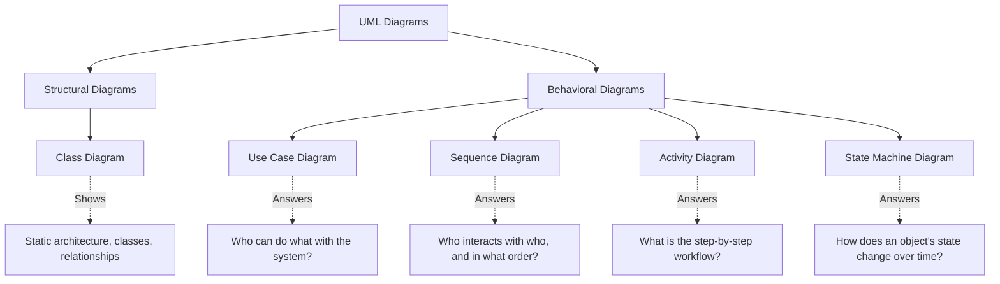

# UML (Unified Modeling Language) — Theory Super

## Global Mind Map: UML Diagrams

---

# 1. Class Diagram

## The Problem — Invisible Architecture
When looking at raw code, you can't easily see the big picture. How does an `Order` relate to a `LineItem`? Does a `Teacher` own a `Student` or just reference them? Without a visual map, onboarding new developers or reasoning about architectural changes requires reading thousands of lines of code.

## The Core Idea
A **Class Diagram** provides a static blueprint of an object-oriented system, showing classes, interfaces, their attributes, methods, and precisely how they are connected.

## How It Works

### Anatomy of a Class
A class is drawn as a rectangle divided into three compartments:
1. **Name** (Top): PascalCase name of the class.
2. **Attributes** (Middle): State of the class. Format: `visibility name: type`.
3. **Methods** (Bottom): Behavior. Format: `visibility name(params): returnType`.

**Visibility Markers:**
- `+` Public
- `-` Private
- `#` Protected
- `~` Package

### Special Class Types
- **Interfaces**: Labeled with `<<interface>>`. Defines a contract (methods) with no state.
- **Abstract Classes**: Labeled with `<<abstract>>`. Methods in italics mean they must be implemented by a subclass.
- **Enumerations**: Labeled with `<<enumeration>>`. A fixed set of named constants.

### Relationships (Weakest to Strongest)

1. **Dependency (Weakest):** Dashed line with open arrow `..>`. Class A temporarily uses Class B (e.g., passing a parameter). Doesn't store a reference.
2. **Association:** Solid line with open arrow `->`. Class A holds a persistent reference to Class B. Both have independent lifecycles. (e.g., Teacher -> Student).
3. **Aggregation:** Solid line with hollow diamond `<>--`. A weak "whole-part" relationship. If the "whole" is destroyed, the "parts" survive. (e.g., Playlist <>-- Song).
4. **Composition:** Solid line with filled diamond `<*>--`. A strong "whole-part" relationship. The "whole" creates and destroys the "parts". (e.g., Order <*>-- LineItem).
5. **Inheritance (Generalization):** Solid line with hollow triangle `---|>`. Structural "is-a" relationship where a subclass inherits from a superclass. (e.g., Dog extends Animal).
6. **Realization (Implementation):** Dashed line with hollow triangle `..|>`. Contractual "can-do" relationship. A class implements an interface. (e.g., Airplane implements Flyable).

> **Tradeoff/Rule of Thumb:** Prefer weaker relationships when possible. Dependency is better than association; association is better than composition. Weaker coupling means more flexible code.

---

# 2. Use Case Diagram

## The Problem — Missing the Forest for the Trees
Before writing code or database schemas, developers often get bogged down in implementation details. If you don't know exactly *who* uses the system and *what* their goals are, you build features nobody needs or miss critical external interactions (like a payment gateway).

## The Core Idea
A **Use Case Diagram** models the system from the user’s perspective. It defines the system boundary, external actors, and the goals those actors want to achieve. It explicitly ignores *how* those goals are implemented.

## How It Works

### Building Blocks
1. **Actors (Stick Figures):** External entities interacting with the system.
   - *Primary Actors* (Left): Initiate interactions (e.g., Customer, Rider).
   - *Secondary Actors* (Right): Called upon by the system (e.g., PaymentGateway).
2. **Use Cases (Ovals):** Specific, meaningful goals (e.g., "Book Ticket", not "Enter Credit Card"). Always start with a verb.
3. **System Boundary (Rectangle):** Visually separates what is inside your system (use cases) from what is outside (actors).
4. **Relationships:**
   - **Association (Solid Line):** Connects an actor to a use case.
   - **Include (`<<include>>`):** Mandatory dependency. "Checkout" *always* triggers "ValidatePayment".
   - **Extend (`<<extend>>`):** Optional enhancement. "Apply Coupon" *optionally* extends "Book Ticket".
   - **Generalization:** Inheritance. An Admin actor inherits everything a regular User can do.

---

# 3. Sequence Diagram

## The Problem — "Spaghetti" Control Flow
In a microservices or heavily layered architecture, a single user click triggers a cascade of method calls across controllers, services, and databases. Finding out exactly *what order* things happen in, and who waits for what, is nearly impossible by just reading static class definitions.

## The Core Idea
A **Sequence Diagram** models interactions over time. It shows "who is doing what, and when" by mapping messages between participants in chronological order.

## How It Works

### Building Blocks
1. **Actors/Participants:** The entities interacting. Drawn as boxes at the top.
2. **Lifelines:** Dashed vertical lines showing the passage of time (top to bottom).
3. **Activation Bars:** Thin rectangles on lifelines indicating when a participant is actively processing (blocking/working).

### Message Types
1. **Synchronous (Solid line, filled arrow):** The sender is blocked until the receiver responds (e.g., a standard HTTP call).
2. **Asynchronous (Solid line, open arrow):** Fire-and-forget. The sender moves on immediately (e.g., publishing to a message queue).
3. **Return (Dashed line, open arrow):** Data flowing back to complete a synchronous call.
4. **Self-Message (Looped arrow):** An object calling one of its own internal methods.
5. **Create Message:** Sender instantiates a new object dynamically.
6. **Destroy Message (X):** An object's lifecycle is terminated (e.g., session invalidated).

### Combined Fragments (Control Flow)
Real interactions have logic. Fragments wrap sections of the diagram:
- **alt**: `if/else` logic. Only the true path executes.
- **loop**: `for/while` logic. Iterates while a condition is met.
- **opt**: `if` without an `else`. An optional step.
- **par**: Parallel execution. Multiple paths execute simultaneously.

---

# 4. Activity Diagram

## The Problem — Verbally Tangled Workflows
Describing a complex business process verbally ("If X happens, do Y, unless Z, in which case do A and B in parallel until C...") is a recipe for disaster. Edge cases get missed, and bottlenecks are invisible.

## The Core Idea
An **Activity Diagram** is an advanced flowchart that models step-by-step business workflows, specifically highlighting decision trees, loops, and parallel execution.

## How It Works

### Components
1. **Initial Node (Start):** Filled black circle. The "Go" signal.
2. **Action Node:** Rounded rectangle. A single step (verb-noun, e.g., "Validate Order").
3. **Final Node (End):** Bullseye. Terminates the entire activity.
4. **Flow Final Node (X):** Terminates *only* the specific branch it's on; other parallel branches continue.
5. **Decision Node (Diamond, 1 in, many out):** Branches based on mutually exclusive conditions (`[guards]`).
6. **Merge Node (Diamond, many in, 1 out):** Funnels alternative paths back into a single flow.
7. **Fork (Thick bar, 1 in, many out):** Splits flow into simultaneous parallel paths.
8. **Join (Thick bar, many in, 1 out):** Synchronizes parallel paths. Flow proceeds only when *all* incoming paths finish.

### Swimlanes (Partitions)
Swimlanes visually divide the diagram by actor/component (e.g., Customer, System, Warehouse). They explicitly show *who* is responsible for an action and exactly where handoffs occur.

---

# 5. State Machine Diagram

## The Problem — Lifecycle Bugs
Some objects (like a Vending Machine, an Order, or an Elevator) are defined by their state. If you can cancel a "Delivered" order, or insert money while an ATM is "Dispensing", you have a critical bug. Activity diagrams model *steps*, but they don't cleanly model *lifecycles and allowed operations*.

## The Core Idea
A **State Machine Diagram** shows how a specific object changes its state over time in response to external events, acting as a strict whitelist of valid transitions.

## How It Works

### Components
1. **State:** A rounded rectangle representing a condition. Nouns/adjectives (e.g., `Idle`, `HasMoney`, `Dispensing`).
   - *Internal Activities:* `entry /` (on entering), `do /` (ongoing), `exit /` (on leaving).
2. **Initial State (Solid dot):** Where the lifecycle begins.
3. **Final State (Bullseye):** A terminal state (e.g., `Delivered`, `Cancelled`).
4. **Transition:** An arrow between states triggered by an event. Occurs instantaneously.
5. **Event:** The trigger (e.g., `insertMoney`, `timeout`).
6. **Guard Condition (`[condition]`):** Evaluated when the event occurs. The transition only fires if the guard is true (e.g., `[itemInStock]`).
7. **Action (`/ action`):** Behavior executed precisely during the transition (e.g., `/ updateInventory()`).

### Advanced States
- **Composite (Nested) States:** A high-level state containing sub-states. E.g., An `Active` state containing `Standard` and `Premium`. If an outer transition fires (e.g., `violatePolicy`), you exit the entire `Active` state regardless of the sub-state.
- **Self-Transitions:** The object leaves and re-enters the same state, triggering exit/entry actions (e.g., `insertMoreMoney`).
- **Choice Pseudo-State:** A diamond that dynamically routes flow to different states based on runtime evaluation (e.g., routing based on a calculated score).

> **Real-World Anchor:** State diagrams map directly to code implementation. States map to `Enums`, Transitions map to methods, and Guard conditions map to `if` statements.
