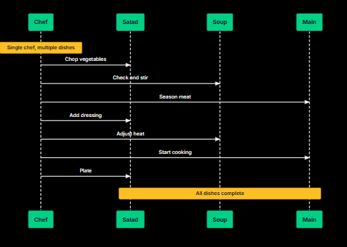
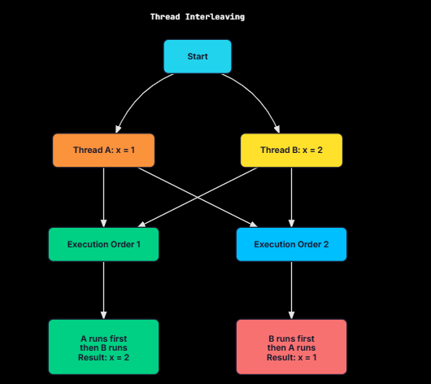
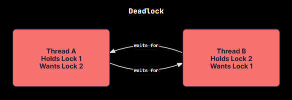
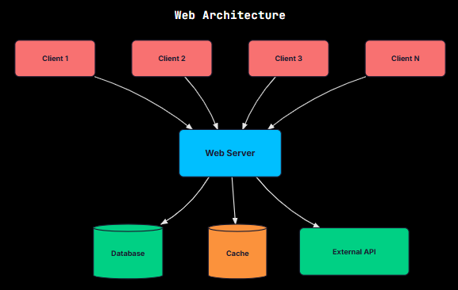

Every modern software system deals with concurrency. Your phone runs dozens of apps simultaneously. A web server handles thousands of requests at once.

Understanding concurrency is fundamental to building software that works in the real world. It is also a topic that is easy to get wrong, because the rules that govern concurrent execution are different from the sequential logic most code is written with.

This chapter builds the foundation you need to think clearly about concurrent systems.

What is Concurrency?
Concurrency is the ability of a system to handle multiple tasks during overlapping time periods. The phrase "overlapping time periods" is doing the work here, not "at the same time." A concurrent system makes progress on several tasks without necessarily running any two of them at the exact same instant.

Real-World Analogy

Consider a chef preparing multiple dishes. They might chop vegetables for the salad, then check the soup, then return to the salad. The chef is making progress on multiple tasks by switching between them.

At any given instant, they are working on exactly one thing, but over time, all dishes move toward completion. This is concurrency.

In software terms, concurrency means structuring a program so that multiple tasks can make progress. The tasks might not execute simultaneously, but the program is organized to handle them in an interleaved fashion. Put another way, concurrency is about dealing with multiple things at once. Running them at the same time is parallelism, a related but distinct idea.

Benefits of Concurrency
It helps to know why concurrency is worth the trouble before getting into how it works.

1. Responsiveness
Without concurrency, a program does one thing at a time. If that thing takes 10 seconds (e.g., downloading a file, processing data), the user waits 10 seconds with no feedback, unable to do anything else.

With concurrency, the program can handle the long-running task while remaining responsive to user input. The download happens in the background and the application stays interactive.

This is why GUI frameworks are built around concurrency: the main thread handles UI events while background threads handle slow operations.

2. Resource Utilization
Consider a web server. Most of the time spent handling a request is waiting: waiting for the database to respond, waiting for an external API, waiting for the disk. If the server handled one request at a time, the CPU would sit idle during all that waiting.

With concurrency, the server handles multiple requests. While one request waits for the database, the CPU processes another request. The system resources (CPU, memory, network) stay busy instead of sitting idle.

The arithmetic is straightforward. If a request spends 90% of its time waiting for I/O, a single-threaded server uses only 10% of its CPU capacity. Handling 10 requests concurrently lets the server approach full utilization.

3. Throughput
Throughput is the amount of work completed in a given time period. Concurrency increases throughput in two ways:

I/O-bound workloads
By overlapping waiting times, more operations complete per second. A single-threaded server might handle 100 requests/second. A concurrent server handling 10 requests simultaneously might achieve 800 requests/second (not quite 10x due to overhead, but close).

For CPU-bound workloads (with parallelism)
By using multiple CPU cores, computation happens faster. Sorting a billion numbers on one core might take 10 minutes. Splitting the work across 8 cores might take under 2 minutes.

These two cases capture the difference between the ideas. Concurrency helps I/O-bound work even on a single core, because it overlaps the waiting. Parallelism helps CPU-bound work by spreading computation across multiple cores.

Challenges of Concurrency
Concurrency gives us responsiveness, better resource use, and higher throughput, but each of those gains carries a cost. Concurrent programming is hard, and it helps to understand exactly where the difficulty comes from.

1. Non-Determinism
A sequential program runs the same way every time. Given the same input, you get the same output. You can reason about it step by step.

A concurrent program has multiple possible execution orders. The operating system's scheduler decides which thread runs when. Different runs can produce different results, even with identical inputs.

This non-determinism makes concurrent programs hard to reason about. A bug might surface in a small fraction of runs, often only in production and only when the system is under load.

2. Race Conditions
A race condition occurs when the program's correctness depends on the timing of events. Two threads race to access shared data, and whoever gets there first determines the outcome.

A classic example is two threads incrementing a shared counter.

Initial: counter = 0

Thread A                    Thread B
--------                    --------
Read counter (gets 0)
                            Read counter (gets 0)
Add 1 (calculates 1)
                            Add 1 (calculates 1)
Write counter (writes 1)
                            Write counter (writes 1)

Final: counter = 1 (should be 2!)

Both threads read the same value, both calculate the same result, and one write overwrites the other. This is called a lost update.

Race conditions are hard to catch because they don't always manifest. The code might work correctly thousands of times, then fail once under slightly different timing conditions.

3. Deadlocks
A deadlock occurs when two or more threads are waiting for each other, and none can proceed.

Thread A holds Lock 1 and wants Lock 2. Thread B holds Lock 2 and wants Lock 1. Neither can proceed. The program hangs forever.

Deadlocks don't corrupt data like race conditions. Instead, the program stops making progress. In production, this often manifests as a service becoming unresponsive under load.

4. Debugging Difficulty
Concurrent bugs are hard to find for two reasons. They are intermittent, appearing only under specific timing conditions, so a bug might show up once and then hide for a thousand runs. And observation changes behavior: adding print statements or attaching a debugger shifts the timing, which can make the bug disappear entirely.

This is called a "heisenbug," a bug that seems to disappear when you try to observe it (named after Heisenberg's uncertainty principle).

5. Complexity
Even without bugs, concurrent code is harder to understand than sequential code. You have to keep track of what data is shared between threads, what synchronization protects it, what happens if thread A runs before thread B and the other way around, and whether the compiler or CPU can reorder any of those operations.

This added overhead makes concurrent code harder to write and review.

Where Concurrency Appears in Real Systems
Concurrency is tricky to get right, but modern software would not work without it. It runs through every layer of the stack, from the operating system that runs your code to the distributed systems your code talks to.

Operating Systems
Every process and thread relies on OS-level concurrency. The scheduler decides which thread gets CPU time next, while multiple processes share memory and I/O devices. File systems also deal with concurrency constantly, handling overlapping reads and writes.

Web Servers
When you open a website, the server processes your request alongside thousands of others. A single request often involves multiple slow operations: querying databases, calling external APIs, reading from disk, and computing results. To stay fast and keep throughput high, the server overlaps these operations instead of doing them strictly one after another.

Databases
Databases are concurrent by design. Many queries run at the same time, transactions must stay isolated from each other, writers must not corrupt data that readers are using, and replication copies data across servers concurrently. Keeping all of this correct under concurrent access is what makes concepts like locks, MVCC, and isolation levels so central to building reliable applications.

User Interfaces
Every GUI app depends on concurrency. The main thread handles user input like clicks and keystrokes, background work handles slow tasks like network calls, disk access, and heavy computation, and rendering may run on additional threads or a separate pipeline. Without this separation, the UI would freeze the moment something slow happens.

Distributed Systems
Modern backends run across many machines, and each machine runs multiple threads. A single request can pass through load balancers, app servers, caches, databases, and message queues.

Every hop involves concurrent work, and every network call can fail, timeout, or arrive out of order. Concurrency becomes harder when it crosses machine boundaries.

