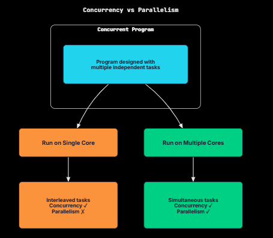
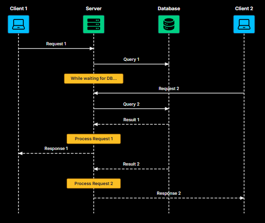
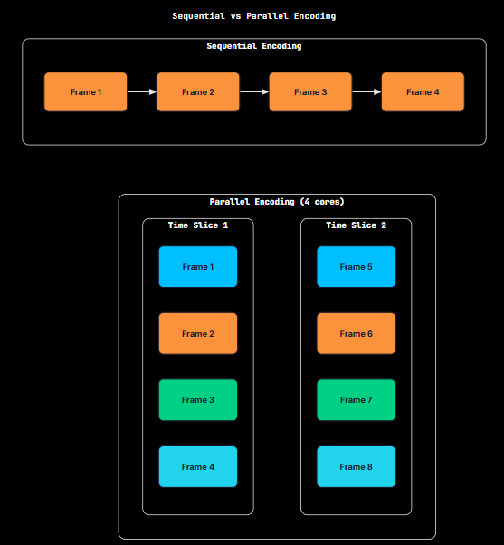
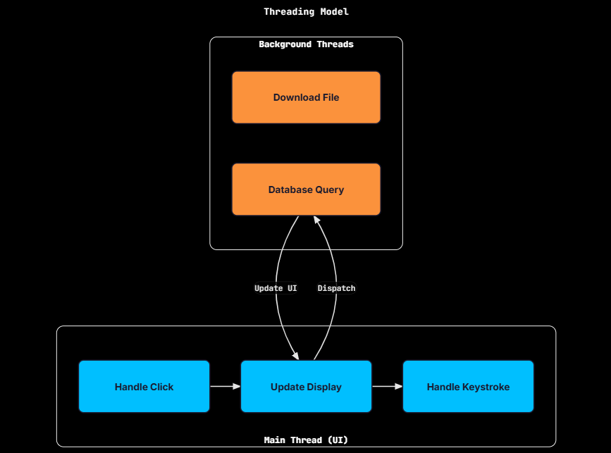
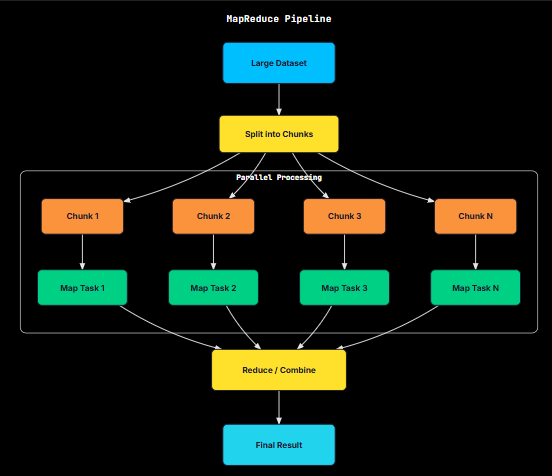
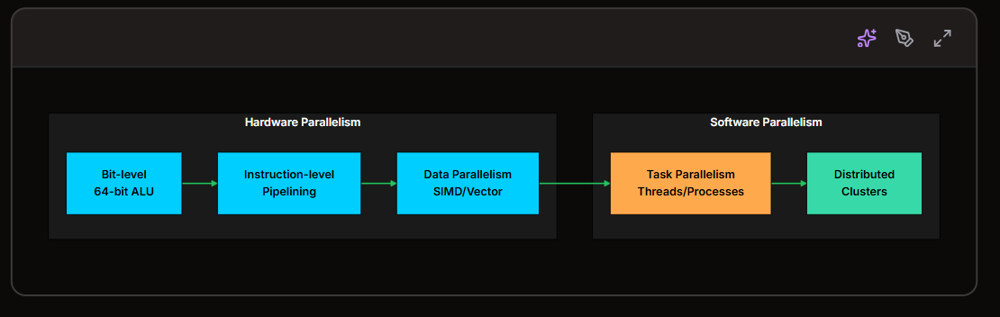

Concurrency and parallelism are easy to confuse, and the two terms often get used interchangeably. The distinction also comes up regularly in concurrency interviews.

While they might sound similar, they refer to different approaches to handling tasks. One is about managing multiple tasks, while the other is about executing multiple tasks at the same time.

The Core Distinction
Concurrency is about structure. It's how you organize a program to handle multiple tasks. A concurrent program is designed so that multiple tasks can be in progress during overlapping time periods.

Parallelism is about execution. It's multiple tasks literally running at the same instant on different processors or cores.

Concurrency is a property of the program. Parallelism is a property of the execution.

A program can be concurrent without running in parallel. A single-core CPU can run a concurrent program by switching between tasks. The tasks make progress during overlapping time periods, but only one runs at any instant.

A program cannot run in parallel unless it's structured to be concurrent. Parallelism requires multiple independent tasks, which means the program must first have concurrent structure.

On a single core, the CPU can only run one task at a time. Concurrency happens because the CPU switches between tasks quickly, giving each a slice of time.

Multiple tasks move forward over the same time window, but they never run simultaneously. The operating system's scheduler decides when to pause one task and resume the other.

With multiple cores, tasks can truly run at the same time. Task A can run on Core 1 while Task B runs on Core 2. Because the work is happening simultaneously, both tasks finish sooner.

Rob Pike's Definition
Rob Pike, one of the creators of Go, put it memorably:

"Concurrency is about dealing with lots of things at once. Parallelism is about doing lots of things at once."

The distinction has two halves:

Concurrency is about the design and composition of the program. It's a way of structuring software.
Parallelism is about simultaneous execution. It's a runtime property.
You can write a concurrent program that never runs in parallel (single core). You cannot write a parallel program that isn't concurrent (you need multiple tasks to parallelize).

The Restaurant Analogy
Consider a restaurant kitchen.

Scenario 1: Sequential (No Concurrency)
One chef. One dish at a time. The chef prepares appetizer A completely, then moves to appetizer B, then to main course C.

Customers wait a long time. If dish A takes 20 minutes, customers ordering B don't start seeing progress until minute 20.

Scenario 2: Concurrent (One Chef, Multiple Dishes)
Same single chef, but now working on multiple dishes during overlapping periods. While the soup simmers, the chef chops vegetables for the salad. While the mushroom rests, the chef plates the appetizer.

All three dishes make progress. None waits until another is completely finished. This is concurrency without parallelism. At any instant, only one task executes, but the program is structured to handle multiple tasks during overlapping periods.

Scenario 3: Parallel (Multiple Chefs, Multiple Dishes)
Three chefs, each working on a dish simultaneously.

All three dishes are literally being prepared at the same instant. This is parallelism (which requires concurrency, since we have three independent tasks).

Scenario 4: Concurrent and Parallel (Multiple Chefs, Many Dishes)
Three chefs, each handling multiple dishes concurrently, all working in parallel.

Each chef is concurrent (juggling multiple dishes). The chefs together are parallel (working simultaneously). This is how modern web servers work: multiple threads or processes, each handling multiple connections.

Relationship Between Concurrency and Parallelism
Concurrency and parallelism are closely related, but they are not the same thing. You can map the possibilities like this:

Concurrent?	Parallel?	Example
No	No	Single-threaded program running one task
Yes	No	Single-core CPU running multiple threads
No	Yes	Impossible (parallelism requires multiple tasks)
Yes	Yes	Multi-core CPU running multiple threads
Concurrency is necessary for parallelism, but not sufficient. To run tasks in parallel, you need multiple independent tasks, and that is what a concurrent structure provides. But having that structure does not guarantee parallel execution: on a single core, the tasks will still be interleaved. Whether a concurrent program actually runs in parallel depends on the hardware and the runtime scheduler.

In short:

Concurrent program + single core → interleaved execution (no parallelism)
Concurrent program + multi-core → parallel execution (potential parallelism)
Sequential program + any hardware → no parallelism possible

Real-World Examples
These differences are easiest to see in real systems.

Web Server
A web server handles many connections at once. For each request, the work usually looks like this: receive the request (an I/O wait), query a database (another I/O wait), process the data (CPU work), and send the response (a final I/O wait). Most of the time is spent waiting on I/O, not doing computation. A concurrent design lets the server keep making progress by working on other requests while one request is blocked on the database or network.

With concurrency alone (for example, a single-threaded async server), you can still handle thousands of connections because you are overlapping waits. Adding parallelism (multiple threads or processes) helps mainly with the CPU-heavy parts and can also provide better fault isolation.

Video Encoding
Video encoding is mostly CPU-bound. Each frame can require substantial computation.

Sequential: encode frame 1, then frame 2, then frame 3…
Concurrent without parallelism: still one frame at a time, so there's little benefit
Concurrent with parallelism: encode multiple frames at the same time on different cores

Parallelism is well-suited to this workload. More cores usually means faster encoding (up to practical limits like memory bandwidth, codec dependencies, and overhead).

GUI Application
A desktop app must juggle several responsibilities at once: responding to user input like clicks and keystrokes, updating the display, and running slow tasks like file I/O, network calls, and database queries. The UI thread must remain responsive. To keep it that way, background work runs concurrently, so a slow download or file operation does not freeze the interface.

Here the biggest win is concurrency for responsiveness. Parallelism can help if the background work is heavy, but the core requirement is to never block the UI thread.

MapReduce / Big Data Processing
Processing terabytes of data requires both concurrency and parallelism. The concurrent structure comes from partitioning the data into independent chunks, and the parallel execution comes from processing those chunks simultaneously across many machines.

The concurrent structure (independent chunks) is what makes massive parallelism possible across a cluster.

Common Misconceptions
Misconception 1: "Concurrent means parallel"
Not quite. A concurrent program can run on a single core, where tasks are interleaved but never truly simultaneous. Concurrency is about how you structure the program to handle multiple tasks. Parallelism is about what actually happens at runtime, when tasks run at the same time.

Misconception 2: "Adding more threads always helps"
More threads do not automatically mean more speed. For CPU-bound work on a 4-core machine, running far more than 4 active threads often increases context-switching and scheduling overhead. For I/O-bound workloads, extra threads can help hide waiting time, but the gains taper off and eventually disappear.

Misconception 3: "Asynchronous means parallel"
Async/await is primarily a way to write non-blocking concurrent code. A single-threaded event loop (like Node.js) can be highly concurrent because it overlaps waiting tasks, but it is still not parallel unless work is moved to multiple threads or processes.

Misconception 4: "You need multiple cores for concurrency"
You do not. A single core can run concurrent programs through time-slicing, switching between tasks quickly enough to make progress on all of them. Concurrency existed long before multi-core CPUs. Operating systems have supported time-sharing since the 1960s.

Misconception 5: "Parallel is always faster"
Not necessarily. Parallelism carries its own overhead: thread creation and management, synchronization and communication, cache coherency traffic, and the limits described by Amdahl's Law. For small tasks, that overhead can outweigh the benefit. In some cases, the fastest solution is the simplest one: run it sequentially.

The Levels of Parallelism
Parallelism shows up at multiple layers of a modern system, from what the CPU does internally to what happens across entire clusters.

Level	Example	Scale
Bit-level	64-bit operations vs 8-bit	Within CPU
Instruction-level	CPU pipeline, superscalar execution	Within CPU
Data parallelism	SIMD (Single Instruction, Multiple Data)	Within CPU
Task parallelism	Multiple threads on multiple cores	Within machine
Distributed parallelism	MapReduce across cluster	Across machines
When people discuss concurrency vs. parallelism, they are usually talking about task-level parallelism: multiple threads or processes running on multiple cores.

CPUs already exploit a lot of parallelism internally, overlapping and parallelizing work at the bit, instruction, and data levels.

This is one reason adding more threads does not always translate into a proportional speedup. Sometimes the CPU is already doing as much parallel work as it reasonably can, and additional threads mostly add coordination overhead.

Designing for Concurrency
A good concurrent design makes it easy for the system to do work in parallel when the hardware allows it. These principles help you get there.

1. Identify Independent Tasks
Start by splitting the problem into units of work that can run without depending on each other. The more independent the tasks are, the more of them can run in parallel.

Good
Handle each HTTP request independently
Bad
Every request depends on results from previous requests
2. Minimize Shared State
Shared, mutable state forces you to add synchronization (locks, atomic operations, coordination). Every synchronization point becomes a bottleneck that serializes execution and reduces parallelism.

Good
Each worker maintains its own local state, then results are merged at the end
Bad
All workers constantly update shared counters or shared data structures
3. Use Appropriate Granularity
Task size matters. If tasks are too small, the overhead of scheduling, context switches, and coordination can outweigh the benefit. If they are too large, you cannot distribute work evenly, and some workers sit idle.

Example: processing 1 million items

1 million tasks of 1 item: too fine-grained (overhead dominates)
1 task of 1 million items: too coarse-grained (no parallelism)
1000 tasks of 1000 items: usually a better balance
4. Consider the Workload Type
Different workloads benefit from different approaches.

Workload	Strategy
I/O-bound	Concurrency matters most; async often helps
CPU-bound	Parallelism matters most; scale up to core count
Mixed	Split into I/O and CPU phases, and optimize each separately

