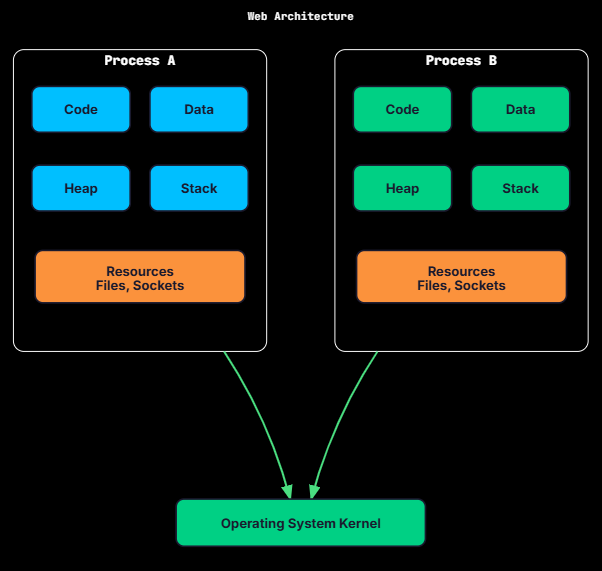

Processes vs Threads

When you write a concurrent program, you face a fundamental choice: should you use multiple processes or multiple threads? This decision affects everything from memory usage to fault isolation to communication patterns.

Both processes and threads allow concurrent execution, but they work very differently. These differences shape how you design a system, and they come up often in interviews.

What is a Process?
A process is an instance of a running program. When you double-click an application or run a command in the terminal, the operating system creates a process.

Each process has its own:

Address space: A private chunk of virtual memory for code, data, heap, and stack
Resources: Open file handles, network sockets, environment variables
Execution state: Program counter, CPU registers, stack pointer
Security context: User ID, permissions, capabilities
The operating system isolates processes from each other. Process A cannot directly read or write Process B's memory. If Process A crashes, Process B keeps running unaffected.

Real-World Analogy

Think of a process like a house. Each house has its own walls, rooms, plumbing, and electrical system. What happens in one house doesn't affect the neighbors. You can't just walk into someone else's house; you need explicit permission.

Process Memory Layout
A process's virtual address space is divided into segments:

Segment	Contents	Growth
Text (Code)	Executable instructions	Fixed
Data	Initialized global/static variables	Fixed
BSS	Uninitialized global/static variables	Fixed
Heap	Dynamically allocated memory (malloc, new)	Grows upward
Stack	Local variables, function call frames	Grows downward

Process Virtual Address Space
Process Virtual Address Space
High Addresses
Stack ↓Local variables, return addresses
↕ Unused space
Heap ↑Dynamic allocations
BSSUninitialized globals
DataInitialized globals
TextProgram code
Low Addresses
The gap between heap and stack allows both to grow. If they meet, you get a stack overflow or out-of-memory error.

What is a Thread?
A thread is a unit of execution within a process. Every process has at least one thread (the main thread). A process can create additional threads that run concurrently within the same address space.

Threads within the same process share:

Address space: Same code, data, and heap
Resources: Same open files, sockets, memory mappings
Process ID: All threads belong to one process
Each thread has its own:

Stack: Separate call stack for local variables and function calls
Registers: Program counter, stack pointer, CPU state
Thread ID: Unique identifier within the process
Thread-local storage: Data private to each thread (optional)

Threads Within a Process
Process
Thread 1
Thread 2
Thread 3
Shared by All Threads
Stack 1
Registers 1
TLS 1
Stack 2
Registers 2
TLS 2
Stack 3
Registers 3
TLS 3
Code
Data
Heap
Open Files
Real-World Analogy

If a process is a house, threads are the people living in it. They share the kitchen, living room, and bathroom. They can easily communicate by talking or leaving notes. But they can also get in each other's way, fight over resources, and create messes that affect everyone.

Key Differences
Processes and threads both let you run multiple tasks, but they make very different trade-offs. The comparison comes down to a few dimensions.

Memory Isolation
Aspect	Processes	Threads
Address space	Separate	Shared
Memory access	Cannot directly access other process's memory	Can access all memory in the process
Isolation	Strong (OS-enforced)	Weak (programmer responsibility)
Data sharing	Requires IPC	Direct memory access
Processes provide true isolation. Process A cannot read or overwrite Process B's memory. Even if Process A has a nasty bug (like a wild pointer), it cannot corrupt another process.

Threads share everything inside the same address space. Any thread can read or write any memory in the process. That makes sharing easy, but it also means a bug in one thread can corrupt data that every other thread relies on.

Creation Cost
Creating a process is relatively expensive because the OS has to do a lot of setup:

allocate a new address space
create or copy page tables
initialize process control structures
duplicate file descriptors (in fork)
establish security context and permissions
Creating a thread is much cheaper. The OS mainly needs to:

allocate a stack
create thread control structures
register it with the scheduler
Typical ballpark timings:

Operation	Typical Time
Process creation (fork)	1-10 ms
Thread creation	10-100 μs
That is often around a 100× difference, which is significant when you need thousands of concurrent tasks.

Communication

Process vs Thread Communication
Process Communication (IPC)
Thread Communication
Process A
Kernel
Process B
Thread A
Thread B
SharedMemory
Pipe/Socket/Queue
Direct memory
Direct memory
Between processes (Inter-Process Communication, IPC):
Because two processes have separate address spaces, neither can read the other's variables. They have to ask the kernel to move data across the boundary, and the OS offers several mechanisms, each suited to a different shape of communication.

Pipes and FIFOs. A one-way byte stream: one process writes, another reads (this is what the shell sets up for ls | grep foo). A FIFO is a named pipe that lives on the filesystem, so unrelated processes can open it. The data is unstructured, so both sides must agree on where one message ends.

Message queues. The kernel delivers discrete messages instead of a raw byte stream, so you don't have to frame the data yourself. Messages can carry a priority, which fits request-response and event delivery.

Shared memory. Both processes map the same physical memory region and then read and write it directly, with no kernel call per access. It is the fastest mechanism, but it provides no coordination, so you still need a semaphore to avoid reading half-written data.

Sockets. A bidirectional channel that works the same whether the processes sit on one machine or across a network. On a single host, a Unix domain socket skips the network stack and stays fast, which makes sockets the default for client-server designs.

Files. One process writes, another reads. It is the slowest option and has no built-in notification, but the data is durable and outlives both processes, which suits logs and checkpoints.

Mechanism	Data shape	Speed	Best for
Pipe / FIFO	Byte stream	Fast	Simple producer-to-consumer flow
Message queue	Discrete messages	Fast	Request-response, prioritized events
Shared memory	Raw memory region	Fastest	Large data, high-frequency exchange
Socket	Byte/message stream	Moderate	Client-server, same host or across the network
File	Bytes on disk	Slowest	Durable handoff, logs, checkpoints
Every one of these crosses the kernel boundary, which is what makes IPC slower than two threads sharing a variable. The right choice depends on how much data you move, how fast you need it, and whether the processes might one day run on different machines.

Between threads:
Threads in the same process already share the address space, so they need none of this machinery. One thread writes to a variable or a shared data structure, and another reads the same memory directly, with no kernel call and no copy. This is why thread communication can be an order of magnitude faster than IPC.

The speed shifts a burden onto you that the kernel was handling before. Two threads writing the same memory at the same time can interleave and corrupt it, so you must coordinate access yourself with locks, atomic operations, or thread-safe data structures. Get it wrong and you trade IPC's overhead for race conditions, stale reads, and deadlocks. The communication is cheaper, but correctness is now your responsibility.

Fault Isolation
Processes fail independently. If Process A crashes, Process B keeps running. This is why many web browsers isolate tabs into separate processes. One misbehaving tab should not take down the whole browser.

Threads share fate. If one thread crashes due to a segmentation fault or an unhandled fatal error, the entire process typically terminates, and all threads die with it. One buggy thread can bring everything down.

Process vs Thread Crash Isolation
Process Crash
Thread Crash
Process
Process 1Crashes
Process 2Unaffected
Process 3Unaffected
Thread 1Crashes
Thread 2Dies
Thread 3Dies
Resource Overhead
Resource	Per Process	Per Thread
Virtual address space	Full copy (~GBs)	Shared
Page tables	Separate	Shared
Stack	One	One per thread
Kernel structures	Full process descriptor	Lightweight thread descriptor
File descriptors	Separate table	Shared table
A process might consume 10-100 MB of memory overhead. A thread might consume 1-8 MB (mostly stack space). You can have thousands of threads more easily than thousands of processes.

Context Switching
When the OS stops one task and runs another, it performs a context switch. At a high level, that means:

saving the current task's CPU state (registers, program counter, stack pointer)
loading the next task's state
switching memory mappings (for processes)
potentially disrupting CPU caches and other hardware state
The cost depends heavily on whether you're switching between processes or between threads in the same process.

Process Context Switch

Process Context Switch
Save P1 registers
Flush TLB
Switch page tables
Load P2 registers
Resume P2
A process switch is more expensive because it typically requires changing the virtual address space:

the OS switches to a different set of page tables
many TLB (Translation Lookaside Buffer) entries become invalid
CPU caches may become less useful because the new process touches different memory
the full register state must be saved and restored
Typical cost: ~1–10 μs, plus additional slowdown from cache and TLB "warm-up."

Thread Context Switch

Thread Context Switch (Same Process)
Save T1 registers
Load T2 registers
Resume T2
A thread switch within the same process is usually cheaper:

no address space change (threads share the same process memory)
TLB entries largely remain valid
caches are more likely to still contain relevant data
only thread-specific state needs to be swapped
Typical cost: ~0.1–1 μs.

When to Use Processes
Choose processes when isolation matters more than sharing.

1. Fault isolation is critical
If one component crashing should not bring down others, processes are the safer choice.

Web browsers: each tab runs in its own process, so a crash stays contained.
Microservices: each service typically runs as its own process (often inside a container), so failures don't automatically cascade.
Database tooling: some connection poolers and helpers use process-level isolation to contain failures.
2. You need strong security boundaries
Processes come with OS-enforced boundaries. They can run as different users with different permissions.

Web servers: a master process can bind to privileged ports, then worker processes can drop privileges.
Sandboxing: untrusted code runs in a separate process with restricted permissions.
Multi-tenant systems: tenant workloads can be isolated into separate processes to reduce blast radius.
3. You want to scale across machines
A process is the natural unit of deployment. You can run processes on different machines and coordinate them over the network. Threads cannot span machines.

4. You need to work around language/runtime limits
Some runtimes restrict thread-based parallelism for CPU-bound code.

Python (GIL): CPU-bound threads do not run in parallel in CPython; multiple processes bypass the GIL.
Ruby (GVL): similar constraints apply.
If you need real CPU parallelism in these environments, processes are often the practical solution.

5. Tasks are simple and mostly independent
When tasks do not need to share much state, processes give you clean separation without adding synchronization complexity.

When to Use Threads
Choose threads when sharing and fast coordination matter.

1. Tasks need to share data frequently
If concurrent work operates on the same in-memory structures, threads are usually the right tool because they avoid IPC overhead.

In-memory caches: many request handlers reading and updating the same cache.
Game engines: physics, rendering, and AI often share the same world state.
Database engines: query execution threads share buffer pools and internal metadata.
2. You need very low-latency communication
Thread-to-thread coordination can be as cheap as reading and writing memory (with the right synchronization). Process communication usually involves system calls and often data copying.

For high-frequency coordination, threads have the advantage.

3. Resource efficiency matters
Threads are typically lighter than processes. If you need a large number of concurrent tasks, a thread pool is often practical, while spawning the same number of processes can get expensive.

4. You need fine-grained parallelism
For CPU-bound work that benefits from parallel execution, threads scale well across cores. Spinning up a process for each small unit of computation is usually wasteful.

5. Your language/runtime supports threading well
Languages like Java, C++, Go, and Rust provide strong threading primitives, clear memory models, and solid synchronization tools, which makes thread-based designs safer and more effective.

Hybrid Approaches
Real-world systems often use both processes and threads. It's rarely an either-or choice. Processes give you isolation and clean failure boundaries, while threads give you cheap concurrency and fast sharing within a worker.

Multi-Process with Multi-Threading
A common architecture pairs multiple worker processes, which improve fault isolation and spread work across CPU cores, with multiple threads (or an event loop) inside each process to handle lots of concurrent I/O. This gives you isolation at the process level and efficient concurrency within each process.

Master / Worker Model
Worker Process 1
Worker Process 2
Worker Process 3
Master Process
Thread 1
Thread 2
Thread 3
Thread 1
Thread 2
Thread 3
Thread 1
Thread 2
Thread 3
Examples:
Nginx: A master process manages worker processes; each worker can handle many connections via an event loop (and optionally threads).
PostgreSQL: A postmaster process spawns separate worker processes per connection, plus background workers for internal tasks.
Chrome: Separate processes for the browser, GPU, and renderers (often one per site), and each process uses multiple threads internally.
Process Pool Pattern
Instead of creating a new process for every task, you pre-fork a fixed pool of worker processes and reuse them. That way, you pay the expensive process-creation cost only once.

Typical flow:

The master starts N worker processes at startup
The master receives incoming requests
Requests are dispatched to idle workers
Workers process the request and return to an idle state
If a worker crashes, the master spawns a replacement
You get fault isolation (a crashed worker does not take down the whole service) with good efficiency (no per-request process creation).

Thread Pool Within Process
Inside a process, you often also avoid creating a new thread per task. Instead, you keep a thread pool and feed it work through a queue.

Typical flow:

Create a pool of M threads
Submit tasks into a shared queue
Idle threads pull tasks from the queue
Threads execute tasks, then return to the pool
No thread creation per task because threads are reused
This avoids per-task thread creation overhead while still supporting high concurrency and good CPU utilization.

Operating System Perspective
Understanding how the OS models processes and threads explains what the scheduler actually manages and what state must be saved and restored.

Process Control Block (PCB)
For every process, the OS keeps a Process Control Block (PCB), which is essentially the process's "record" in the kernel. It typically includes:

Process ID (PID)
Process state (running, ready, blocked)
Program counter
CPU register state
Memory management metadata (for example, page table pointers)
I/O state (open files, devices)
Accounting information (CPU time used, limits, priority, etc.)
The PCB exists because the OS needs enough information to pause a process and later resume it correctly.

Thread Control Block (TCB)
Each thread has its own Thread Control Block (TCB). It is smaller than a PCB because a thread shares most resources with its parent process. A TCB usually contains:

Thread ID
Thread state
Program counter
CPU register state
Stack pointer
Pointer to the parent process's PCB
Threads share the process's address space and resources, but each thread still needs its own execution context.

Kernel Threads vs User Threads
The relationship between "user threads" and what the OS schedules depends on the threading model.

1:1 Model (Kernel threads)

1:1 Model (Linux, Windows)
User Thread
User Thread
User Thread
Kernel Thread
Kernel Thread
Kernel Thread
Each user thread maps to a kernel thread. The OS scheduler can see and schedule every thread independently.

True parallelism on multi-core systems
More kernel involvement per thread operation
Used by mainstream OSes for native threads (Linux, Windows, macOS)
N:1 Model (User-level threads)

N:1 Model
User Thread
User Thread
User Thread
Kernel Thread
Many user threads map to a single kernel thread. A user-space runtime schedules threads, while the OS only sees one schedulable entity.

Very fast user-space context switches
No true parallelism (only one kernel thread runs)
A blocking system call can stall all user threads unless special handling is used
M:N Model (Hybrid)

M:N Model (Go)
Goroutine
Goroutine
Goroutine
Goroutine
OS Thread
OS Thread
Many user threads map to fewer kernel threads. The runtime schedules user threads onto a pool of kernel threads.

Can achieve parallelism while keeping user threads lightweight
More complex to implement correctly
Some runtimes use variants of this approach (Go's goroutines are a well-known example)
