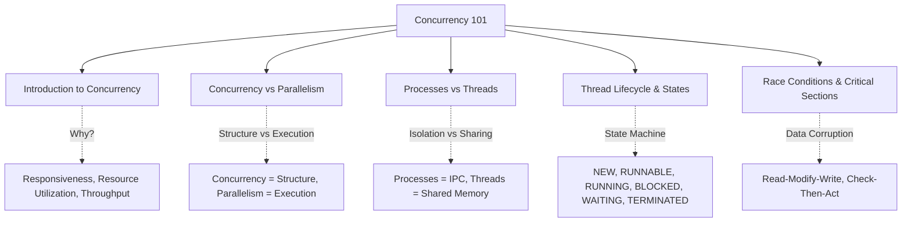
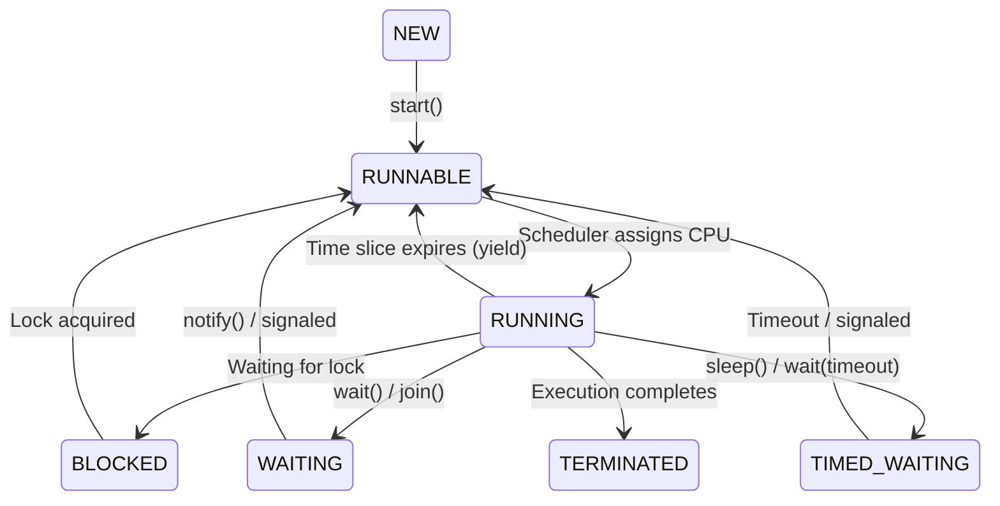

# Concurrency 101 - Theory Super

## Global Mind Map: Concurrency 101



---

# 1. Introduction to Concurrency

## The Problem - Wasted Resources and Frozen UIs
If a program does one thing at a time, and that thing involves waiting (downloading a file, querying a database), the CPU sits completely idle while the user is locked out. A web server handling one request at a time would waste 90% of its CPU capacity waiting on network I/O, meaning it could only handle a tiny fraction of traffic.

## The Core Idea
**Concurrency** is the ability of a system to handle multiple tasks during *overlapping time periods*. It doesn't mean doing them at the exact same instant-it means making progress on multiple things by interleaved execution.

## How It Works
Concurrency increases throughput by overlapping waiting times (I/O bound) or spreading computation (CPU bound).
- **Responsiveness**: A GUI handles UI events on the main thread while doing heavy work in the background.
- **Resource Utilization**: A web server processes request B while request A is blocked waiting for a database response.

## When It Fails: The Challenges
1. **Non-Determinism**: Execution order is controlled by the OS scheduler, making bugs incredibly hard to reproduce.
2. **Race Conditions**: Two threads race to access shared data, causing lost updates.
3. **Deadlocks**: Thread A holds Lock 1 and wants Lock 2; Thread B holds Lock 2 and wants Lock 1. Both hang forever.
4. **Heisenbugs**: Bugs that disappear when you try to observe them (e.g., adding print statements changes the timing, hiding the race condition).

---

# 2. Concurrency vs Parallelism

## The Problem - Confusing Structure with Hardware
People often use "concurrency" and "parallelism" interchangeably. But if you throw 100 threads at a 4-core machine to do heavy CPU math, you'll actually *slow down* your program due to context switching. If you don't know the difference, you can't optimize effectively.

## The Core Idea
**Concurrency is about structure (dealing with lots of things at once). Parallelism is about execution (doing lots of things at the exact same instant).**

## How It Works
- **Concurrency without Parallelism**: One chef chopping vegetables while soup simmers. (Single-core CPU quickly time-slicing between tasks).
- **Parallelism**: Three chefs actively chopping vegetables at the exact same time. (Multi-core CPU executing threads simultaneously).

You can write a concurrent program that never runs in parallel (single-core). You *cannot* write a parallel program that isn't concurrent (because you need multiple independent tasks to parallelize).

### Workload Strategies
| Workload | Strategy |
| :--- | :--- |
| **I/O-bound** | Concurrency matters most; async overlaps the waiting. |
| **CPU-bound** | Parallelism matters most; scale up to the core count. |

---

# 3. Processes vs Threads

## The Problem - Isolation vs. Overhead
If you spawn a new process for every web request, your server will quickly run out of memory because processes are heavy. If you put everything in a single process using threads, a single segmentation fault will crash the entire server.

## The Core Idea
A **Process** is an isolated instance of a running program (its own house). A **Thread** is a unit of execution *within* a process (roommates sharing a house and its memory).

## How It Works

### Process
- **Memory**: Private address space (Code, Data, Heap, Stack). Process A cannot read Process B's memory.
- **Creation Cost**: Heavy (1-10 ms). OS must copy page tables, file descriptors, etc.
- **Communication (IPC)**: Requires kernel involvement (Pipes, Sockets, Message Queues, Shared Memory). Slow but safe.
- **Fault Isolation**: Strong. If Process A crashes, Process B keeps running (e.g., Chrome tabs).

### Thread
- **Memory**: Shares the same Address Space (Code, Data, Heap) as the parent process. Each thread only gets its own Stack and Registers.
- **Creation Cost**: Lightweight (10-100 μs).
- **Communication**: Direct memory access. Extremely fast, but completely unsafe without synchronization (Locks, Mutexes).
- **Fault Isolation**: Weak. If one thread triggers a fatal error, the entire process and all other threads die.

### Context Switching
- **Process Switch**: Expensive (~1–10 μs). Must flush the TLB and swap memory maps.
- **Thread Switch**: Cheap (~0.1–1 μs). Memory maps stay the same; only registers/stack pointers change.

> **When to use which?** Use processes for fault isolation, security, or to bypass runtime limits (e.g., Python's GIL). Use threads for massive scale, fast in-memory data sharing, and resource efficiency. (Many architectures use both: a pool of isolated Worker Processes, each running many Threads).

---

# 4. Thread Lifecycle and States

## The Problem - Why is my thread stuck?
When a multi-threaded app freezes, you need to know *why*. Is it actively crunching numbers? Waiting for a network response? Deadlocked waiting for a mutex? If you don't understand the thread lifecycle, you can't debug it.

## The Core Idea
A thread moves through a strict state machine dictated by the OS scheduler: New, Runnable, Running, Blocked, Waiting, and Terminated.

## How It Works



1. **NEW**: Thread object exists in memory, but OS thread hasn't been created yet.
2. **RUNNABLE**: `start()` was called. The thread is ready to run, sitting in the scheduler's queue.
3. **RUNNING**: Actively executing instructions on a CPU core.
4. **BLOCKED**: Waiting exclusively to acquire a lock (monitor) held by another thread.
5. **WAITING**: Explicitly parked (indefinitely) waiting for a signal (e.g., `wait()`, `join()`, channel receive).
6. **TIMED_WAITING**: Parked with a timeout (e.g., `sleep(1000)`).
7. **TERMINATED**: Dead. `run()` completed or threw an exception. Cannot be restarted.

*(Note: Most high-level languages like Java/C# combine `RUNNABLE` and `RUNNING` since the OS scheduler moves threads between them thousands of times per second).*

---

# 5. Race Conditions and Critical Sections

## The Problem - Silent Data Corruption
If Thread A and Thread B both run `counter++` at the same time, the counter might only increment by 1. The program doesn't crash. No exceptions are thrown. Your data is just wrong, and it will be wrong in different, non-deterministic ways every time you run it.

## The Core Idea
A **Race Condition** happens when multiple threads access shared, mutable state concurrently without synchronization. A **Critical Section** is the code block that accesses that shared state, which must be protected to ensure only one thread executes it at a time (Mutual Exclusion).

## How It Works

### Why `count++` is not atomic (Read-Modify-Write)
At the CPU level, `count++` is three separate instructions:
1. **Read**: Load value from memory into register (Thread A reads 0).
2. **Modify**: Add 1 to register (Thread A calculates 1).
3. **Write**: Store new value to memory (Thread A writes 1).

If Thread B interrupts between steps 1 and 3, it might also read `0`, calculate `1`, and write `1`. The second increment is lost completely.

### The "Check-Then-Act" Problem
```java
if (instance == null) {
    instance = new Singleton(); 
}
```
Two threads can evaluate `instance == null` simultaneously. Both see `true`. Both create a new object. The singleton is broken.

### Solutions
1. **Mutex / Locks**: Wrap the critical section in a lock. Thread 2 hits the lock and goes to the `BLOCKED` state until Thread 1 releases it.
   ```java
   lock.lock();
   try { counter++; } finally { lock.unlock(); }
   ```
2. **Atomic Operations**: Hardware-level instructions (like Compare-And-Swap) that execute without interruption.
   ```java
   AtomicInteger counter = new AtomicInteger(0);
   counter.incrementAndGet();
   ```
3. **Immutability**: Eliminate the "Mutable" requirement. If data cannot be changed after creation, it is inherently thread-safe and requires no locks.
