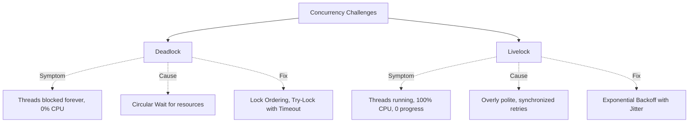

# Concurrency Challenges - Theory Super

## Global Mind Map: Concurrency Challenges



---

# 1. Deadlock

## The Problem - The Silent Killer
Deadlock is one of the most dangerous bugs because it fails silently. The system doesn't crash, and no exceptions are thrown. Threads simply stop making progress forever, often only occurring in production under heavy load.

## The Core Idea
**Deadlock** is a state where two or more threads are permanently blocked, each waiting for a resource that is currently held by another thread in the cycle. 

## How It Works
Think of a narrow one-lane bridge. Car A enters from the left. Car B enters from the right. They meet in the middle. Neither can move forward, and neither will reverse. The bridge is permanently stuck.

In software, Thread 1 holds `Lock A` and waits for `Lock B`. Thread 2 holds `Lock B` and waits for `Lock A`.

### Coffman's Four Conditions
For a deadlock to occur, **ALL FOUR** of these conditions must be met simultaneously. Breaking just one prevents deadlock.

| Condition | Meaning | How to Break It |
| :--- | :--- | :--- |
| **Mutual Exclusion** | Resources are held exclusively by one thread. | Use shareable resources, read-write locks, or immutable data. |
| **Hold and Wait** | A thread holds one resource while waiting for another. | Acquire all locks atomically at once, or none at all. |
| **No Preemption** | Resources can't be forcibly taken away. | Use `tryLock()` with a timeout. If it fails, back off and release current locks. |
| **Circular Wait** | A cycle exists in the wait-for graph (A waits for B, B waits for A). | Impose a global lock ordering. Always acquire locks in the exact same sequence. |

## What Happens When It Fails (Detection)
You detect deadlocks via **Thread Dumps**. 
The JVM or OS will show threads in a `BLOCKED` state, explicitly stating which lock they are waiting to acquire and which thread holds it.

## The Solution: Global Lock Ordering
The most common fix is assigning a strict order to locks. 
If transferring money between bank accounts, always lock the account with the lower ID first, then the higher ID. No matter which accounts are involved, a circular wait can never form because the acquisition direction is always identical.

---

# 2. Livelock

## The Problem - The Illusion of Progress
In a deadlock, CPU usage drops to zero because threads are sleeping. In a **livelock**, CPU usage spikes to 100%, logs fill up with retry messages, and network requests fire endlessly-yet zero actual work is completed.

## The Core Idea
**Livelock** occurs when threads are actively running (not blocked) but are trapped in a synchronized, unproductive loop of reacting to each other, like two people in a hallway repeatedly stepping to the same side to let the other pass.

## How It Works
Livelock is almost always caused by code designed to be "helpful" or "polite":
1. **Overly Polite Algorithms**: Thread A and Thread B both detect a collision, so *both* back off.
2. **Synchronized Retries**: Thread A and Thread B both wait exactly 100ms and retry. They collide again. They wait 100ms. They collide again forever.
3. **Thundering Herd**: A resource frees up, 100 threads wake up instantly, 99 fail to acquire it, all 99 go back to sleep, repeat.

## The Solution: Exponential Backoff with Jitter
To fix a livelock, you must break the symmetry between the competing threads. The most effective way is adding **Randomized Jitter** to retry delays.

If two threads collide:
- Thread A backs off for `random(0, 100ms)`
- Thread B backs off for `random(0, 100ms)`

Because the wait times are randomized, Thread A might wait 12ms while Thread B waits 87ms. Thread A will wake up first, acquire the resource, and finish its work before Thread B even attempts to retry.

```java
// Exponential Backoff with Jitter
int maxRetries = 5;
int baseWaitMs = 100;

for (int attempt = 0; attempt < maxRetries; attempt++) {
    if (tryAcquireLock()) {
        return doWork();
    }
    
    // Calculate exponential backoff
    int exponentialWait = baseWaitMs * (1 << attempt);
    // Add random jitter to break synchronization
    int jitter = random.nextInt(exponentialWait);
    
    Thread.sleep(jitter);
}
throw new TimeoutException("Failed to acquire lock");
```

---

*Note: The original source material contained an empty placeholder for Starvation (03 Starvation.md). Following Rule 8 (Do not invent new concepts), it has been omitted from this synthesis.*
