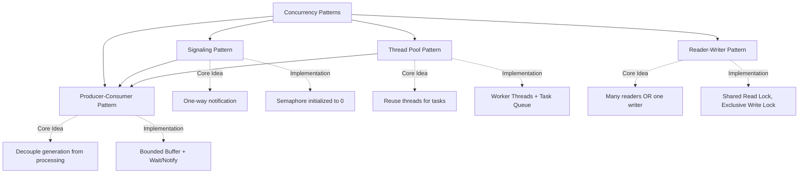

# Concurrency Patterns — Theory Super

## Global Mind Map: Concurrency Patterns

---

# 1. Signaling Pattern

## The Problem — Unreliable Notifications
If Thread A needs to tell Thread B "I'm done initializing the database", Thread B could sit in a `while(!ready)` loop. This burns 100% of the CPU doing nothing. Alternatively, Thread A could signal Thread B using a condition variable, but if Thread A sends the signal *before* Thread B starts waiting, the signal is lost forever in the void, and Thread B will sleep infinitely.

## The Core Idea
**Signaling** is a one-way notification where the "signal" is stored persistently, so even if the waiter arrives late, it still gets the message.

## How It Works
The most robust way to implement signaling is using a **Semaphore initialized to `0`**.
1. **The Gate starts closed (0 permits)**: `Semaphore(0)`.
2. **The Waiter arrives**: Calls `acquire()`. Since permits = 0, the waiter blocks efficiently.
3. **The Signaler finishes work**: Calls `release()`. Permits go 0 -> 1.
4. **The Waiter wakes up**: Consumes the permit (1 -> 0) and proceeds.

> **Why Semaphore over Condition Variable?** Persistence. If the Signaler calls `release()` *before* the Waiter arrives, the permit sits at `1`. When the Waiter eventually calls `acquire()`, it sees the `1`, takes it, and proceeds immediately without blocking. A condition variable would have lost this signal.

### Common Use Cases
- **Initialization Gate**: Main thread prepares resources, releases $N$ permits. $N$ worker threads wait on `acquire()`.
- **Ping-Pong**: Thread A and Thread B alternate. SemA starts at `1`, SemB starts at `0`. Thread A acquires SemA, prints, releases SemB. Thread B acquires SemB, prints, releases SemA.

---

# 2. Thread Pool Pattern

## The Problem — The Cost of Thread Creation
Spawning a thread takes ~10-30 microseconds and allocates 1-8 MB of stack space. If a server receives 10,000 requests per second and spawns a thread for each, it dies from Memory OutOfBounds and Context Switching overload (the "Thundering Herd" problem). 

## The Core Idea
A **Thread Pool** keeps a fixed team of worker threads alive permanently and feeds them tasks from a shared queue, decoupling task *submission* from task *execution*.

## How It Works
1. **Clients**: Call `submit(Task)`. The task goes into the **Task Queue**.
2. **Task Queue**: A thread-safe bounded buffer holding pending tasks. 
3. **Worker Threads**: A fixed number of threads running an infinite loop: `take()` from queue -> execute `run()` -> loop back.
4. **Rejection Handler**: If the queue is full, what happens? 

### Rejection Policies (When Queue is Full)
| Policy | Behavior | Use Case |
| :--- | :--- | :--- |
| **Abort** | Throws Exception | Fail fast. |
| **Discard / Discard Oldest** | Drops task silently | Fire-and-forget logging. |
| **Caller Runs** | Submitting thread executes the task | Natural backpressure. Slows down the producer immediately. |

---

# 3. Producer-Consumer Pattern

## The Problem — Speed Mismatches
If a fast web scraper (Producer) sends data directly to a slow database writer (Consumer), the scraper has to block and wait, wasting its speed. If it doesn't block, data gets dropped.

## The Core Idea
The **Producer-Consumer Pattern** introduces a middleman (a Bounded Buffer) that absorbs temporary speed mismatches, allowing producers and consumers to run at their own natural speeds.

## How It Works
1. **Producer**: Generates an item, calls `buffer.put()`. If the buffer is full, the producer blocks. 
2. **Buffer**: A thread-safe queue with a fixed capacity. (e.g., Kafka partitions, Go channels, Java `BlockingQueue`).
3. **Consumer**: Calls `buffer.take()`. If the buffer is empty, the consumer blocks.

### Synchronization Under the Hood (Wait/Notify)
Using basic Condition Variables:
- `put()`: While buffer full -> `wait()`. Insert item. `notifyAll()` (wakes consumers).
- `take()`: While buffer empty -> `wait()`. Remove item. `notifyAll()` (wakes producers).
*(Note: Always wait inside a `while` loop to prevent spurious wakeups).*

### Buffer Sizing Strategy
| Buffer Size | Pros | Cons |
| :--- | :--- | :--- |
| **Small (10-100)** | Low memory, instant backpressure | Blocks frequently on bursts |
| **Large (10000+)** | Handles huge bursts perfectly | High memory overhead, masks deeper system overloads |

---

# 4. Reader-Writer Pattern

## The Problem — Unnecessary Read Serialization
A normal Mutex allows only one thread inside a critical section. If you have 100 threads trying to *read* a config file, and 1 thread trying to *write* to it, the 100 reads are executed one-by-one. This is a massive waste of concurrency, because reading is non-destructive.

## The Core Idea
The **Reader-Writer Pattern** allows infinite concurrent readers OR exactly one exclusive writer. 

## How It Works
- **Read Lock (Shared)**: Multiple threads can acquire it simultaneously. Blocks if a writer holds the lock or is in the queue.
- **Write Lock (Exclusive)**: Only one thread can acquire it. Blocks until the Reader count hits exactly `0`.

### The Fairness Problem (Starvation)
Who gets priority if both a reader and writer are waiting?
| Policy | Behavior | Trade-off |
| :--- | :--- | :--- |
| **Reader Preference** | New readers can jump the line even if a writer is waiting. | **Writer Starvation**: A steady stream of readers means the writer waits forever. |
| **Writer Preference** | If a writer is waiting, new readers are blocked. | **Reader Starvation**: If writes are frequent, readers get stuck. |
| **Fair (FIFO)** | Requests are processed strictly in arrival order. | Lower throughput (can't batch readers), but guarantees no starvation. |

> **Real-world anchor**: Database MVCC (Multi-Version Concurrency Control) in PostgreSQL is an evolution of this. Instead of readers waiting for a writer, readers just read the *previous snapshot* of the data while the writer prepares a new one.
