# The Grand Unified Theory of Low-Level Design: A First-Principles Connected Summary

---

## The Connected Summary — From Objects to Orchestration

Every piece of software, no matter how massive the distributed system it runs inside, ultimately reduces to one atomic unit of organization: the **Object**. An object is a bundle of **state** (the data it holds) and **behavior** (the operations it can perform on that data). But an object does not spring into existence from nothing — it is stamped from a **Class**, a blueprint that defines what fields every instance will carry and what methods it will expose. A **Constructor** is the special method that fires at the moment of creation, initializing the object's state and — critically — enforcing validity constraints (rejecting a null email, capping a negative balance) so that no object ever enters the world in a broken state. When a field should only accept a small, fixed set of values — `PENDING`, `SHIPPED`, `DELIVERED`, `CANCELLED` — an **Enum** replaces fragile strings with compiler-checked constants, making typos impossible and intent explicit. These are the atoms of object-oriented programming: classes define structure, constructors enforce valid birth, enums constrain domains, and objects are the living instances that carry data through the system.

But raw objects with all their fields exposed to the world are dangerous. If any part of the application can reach in and set `account.balance = -1000`, the object has no ability to protect itself, and the system will inevitably end up in an invalid state with no clear origin for the corruption. **Encapsulation** — the first pillar of OOP — solves this by bundling data and the methods that operate on it inside the class, then using **Access Modifiers** (`private`, `protected`, `public`) to control which parts of the class are visible from outside. The `balance` field becomes `private`; the only way to change it is through `deposit()` and `withdraw()` methods that validate the amount, check for overdraft, and log the transaction — all in one place. Encapsulation does not just hide data; it creates a single, authoritative location for the rules governing that data, which is precisely the **DRY (Don't Repeat Yourself)** principle applied at the class level: every piece of knowledge should have one unambiguous representation. If the overdraft rule lives only inside `BankAccount.withdraw()`, changing the rule means changing one method, not hunting through fifty files.

Encapsulation controls *who* can touch the internals. **Abstraction** — the second pillar — controls *what the caller needs to see*. When you call `videoPlayer.play("movie.mp4")`, you don't need to understand networking, buffering, codec negotiation, or frame rendering — the complexity is hidden behind a simple public API. **Interfaces** and **Abstract Classes** are the primary mechanisms for creating abstractions. An **Interface** defines a pure contract — *what* a class must do — without specifying *how*: `FileStorage` declares `save(fileName, data)`, and whether the implementation writes to local disk, Amazon S3, or a mock test store is irrelevant to the caller. An **Abstract Class** goes further by providing shared code and state alongside abstract methods that subclasses must implement — like a `ReportGenerator` that has a concrete `save()` method and a `generate()` workflow but leaves the `format()` method abstract, because CSV and JSON format differently but save identically. The rule of thumb: use an interface when unrelated classes share a capability (a `Bird` and an `Airplane` can both `Flyable`); use an abstract class when closely related classes share both behavior and state (all `ReportGenerator` subclasses share the generate-then-save workflow).

**Inheritance** — the third pillar — allows one class to build upon another, inheriting its fields and methods. An `EmailNotification` *is-a* `Notification`: it inherits the `recipient` field and the `log()` method, but **overrides** the `send()` method with email-specific logic. Method overriding — signaled by `@Override` in Java — is the mechanism that enables **Polymorphism**, the fourth and most powerful pillar. Polymorphism means that the *same method call* can produce *different behavior* depending on the actual object type at runtime. A `List<Notification>` can contain `EmailNotification`, `SmsNotification`, and `PushNotification` objects, and iterating with `notification.send(message)` dispatches to the correct implementation without a single `if` or `instanceof` check. This is **runtime polymorphism** (dynamic dispatch), and it is the engine that makes the entire design pattern ecosystem possible: the Strategy pattern, the Observer pattern, the State pattern, the Factory Method — all depend on the ability to write code against an abstraction and have the runtime choose the correct concrete behavior.

However, inheritance must be used with extreme care. Extending a class solely to reuse code — `OrderService extends EmailSender` — creates a false `is-a` relationship that is semantically absurd (an order service is *not* an email sender) and structurally fragile (changes to `EmailSender` ripple unpredictably into `OrderService`). The antidote is **Composition**: instead of inheriting behavior, `OrderService` *contains* an `EmailSender` object and delegates to it. Composition produces looser coupling because the dependency can be replaced without touching the class hierarchy, which directly embodies the **Dependency Inversion Principle (DIP)**: high-level modules should not depend on low-level modules; both should depend on abstractions. `OrderService` depends on the `EmailClient` *interface*, not on `GmailClient` or `OutlookClient` directly. This inversion — where the abstraction is owned by the high-level module and the low-level detail implements it — is the architectural keystone that makes large systems testable, extensible, and swappable.

These objects do not exist in isolation — they form relationships. **Association** is the most general: one object *knows about* another (an `Order` stores a reference to a `Customer`). Associations come in multiplicities (one-to-one, one-to-many, many-to-many). When the relationship implies grouping with weak ownership, it becomes **Aggregation**: an `EngineeringTeam` *has* `Developer` objects, but those developers are created externally, passed in, and survive if the team is dissolved. When ownership is strict and the child's lifecycle is tied to the parent, it becomes **Composition** (the class-relationship kind, distinct from "composition over inheritance"): an `Order` creates and owns its `OrderItem` objects internally, and if the order is deleted, the items have no independent meaning. The weakest relationship is **Dependency**: a class temporarily *uses* another to perform work (an `InvoiceService` receives a `TaxCalculator` as a method parameter, uses it, and forgets it). The progression from dependency → association → aggregation → composition represents increasing coupling, and good design prefers the weakest relationship that meets the need — a principle explicitly visualized in **UML Class Diagrams**, where dependency is a dashed arrow, association is a solid arrow, aggregation is a hollow diamond, composition is a filled diamond, inheritance is a hollow triangle, and interface realization is a dashed triangle.

With the building blocks and relationships established, we need guiding principles to prevent the code from decaying into an unmaintainable mess. Beyond DRY, the **YAGNI (You Aren't Gonna Need It)** principle combats speculative engineering — don't build a `MediaProcessingEngine` with plugin architecture when all you need today is a simple `ImageUploader` that resizes and saves. Build for *today's* requirement; refactor when *tomorrow's* requirement actually arrives. The **KISS (Keep It Simple, Stupid)** principle combats gratuitous complexity — don't use four classes and a factory to build a four-function calculator when a `switch` statement is perfectly clear. These three heuristics — DRY, YAGNI, KISS — form the philosophical foundation atop which the **SOLID** principles provide structural rigor.

**SRP (Single Responsibility Principle)** states that a class should have one, and only one, reason to change. If `UserManager` handles authentication, profile updates, *and* email sending, a change to the email provider might accidentally break authentication. Split it into `UserAuthenticator`, `UserProfileManager`, and `EmailNotifier` — each with a single axis of change. SRP is the microscopic expression of microservices at the code level: just as distributed systems decompose by business capability, well-designed classes decompose by responsibility. **OCP (Open/Closed Principle)** states that software entities should be open for extension but closed for modification. Instead of modifying a `ShapeCalculator` with `instanceof` checks every time a new shape is added, define a `Shape` interface with a `getArea()` method — new shapes extend the system by adding a class, not by modifying existing tested code. OCP is the reason the Strategy, Observer, Decorator, and Composite patterns exist: they all allow behavior to be extended without touching the original class. **LSP (Liskov Substitution Principle)** states that a subclass must be substitutable for its parent without breaking the program. If `Bicycle extends Vehicle` but throws `UnsupportedOperationException` from `startEngine()`, any code that treats a `Bicycle` as a `Vehicle` will crash — the abstraction hierarchy is wrong. Fix it by making `Vehicle.move()` the contract, with `Car.move()` starting an engine and `Bicycle.move()` pedaling. LSP is the guardian of polymorphism: if substitutability breaks, every `List<Vehicle>` loop becomes a minefield. **ISP (Interface Segregation Principle)** states that clients should not be forced to depend on interfaces they don't use. A fat `MediaPlayer` interface with `playAudio()` and `playVideo()` forces an `AudioPlayer` to implement (and throw errors for) video methods it can't support. Split it into `AudioPlayer` and `VideoPlayer` interfaces so each client depends only on what it actually needs. And **DIP (Dependency Inversion Principle)**, as discussed, ensures that high-level business logic depends on abstractions, not on concrete implementations — making the entire system replaceable, testable, and loosely coupled.

These principles find their fullest expression in the **23 Gang of Four Design Patterns**, organized into three families based on what aspect of the object lifecycle they address: **Creational** (how objects are born), **Structural** (how objects are composed), and **Behavioral** (how objects communicate).

**Creational Patterns** control instantiation. The **Singleton** ensures exactly one instance of a class exists (a configuration manager, a logger, a thread pool) and provides global access to it — but because global access hides dependencies and makes testing painful, the modern preference is to create the object once and inject it via constructors (Dependency Injection). The **Builder** solves the "telescoping constructor" problem for complex objects with many optional fields: instead of `new UserProfile("Alice", "alice@example.com", 29, "Berlin", null, true)` — where no reader can tell what `29` or `true` means — the Builder provides chainable, clearly named methods: `new UserProfile.Builder("Alice", "alice@example.com").age(29).city("Berlin").build()`. The **Factory Method** moves object creation behind a dedicated method, allowing subclasses to decide which concrete class to instantiate without changing the client's workflow — an `EmailNotificationFactory` returns configured `EmailNotification` objects; an `SMSNotificationFactory` returns `SMSNotification` objects; the client works only with the base `NotificationFactory` and never touches `new` directly. This is OCP in action: adding a `PushNotificationFactory` requires zero changes to existing code. The **Abstract Factory** scales this to *families* of related objects — a `WindowsFactory` produces `WindowsButton` and `WindowsCheckbox`; a `MacOSFactory` produces `MacOSButton` and `MacOSCheckbox` — guaranteeing that components from different families are never mixed. The client receives a factory through its constructor (DIP) and works exclusively with abstract product interfaces (polymorphism). The **Prototype** pattern creates new objects by *cloning* pre-configured existing ones rather than constructing from scratch — a game registry stores configured `Enemy` prototypes and returns deep copies on demand, avoiding repeated setup and decoupling the game loop from concrete enemy classes.

**Structural Patterns** organize how objects are connected and composed. The **Adapter** translates one interface into another — like a physical travel adapter, an `ExternalPaymentAdapter` implements the `PaymentProcessor` interface our system expects but internally delegates to an `ExternalPaymentGateway` that speaks in dollars and different method names. The **Facade** hides the complexity of an entire subsystem behind a single, simple method — `videoPublishingFacade.publish("clip.mp4")` internally coordinates compression, thumbnail generation, storage, repository saving, and notification, but the client sees only one call. The Facade is abstraction applied at the subsystem level. The **Proxy** places a lightweight substitute in front of a heavy or sensitive object to control access — an `ImageProxy` implements the same `Image` interface as `HighResolutionImage` but delays loading from disk until `display()` is actually called (lazy loading / virtual proxy), saving massive memory when most images are never viewed. The **Decorator** adds behavior dynamically at runtime by wrapping objects in layers that share the same interface — a `PlainTextView` wrapped in a `BoldDecorator` wrapped in an `ItalicDecorator` renders `<i><b>Design Patterns</b></i>` without subclass explosion; each decorator adds one responsibility and delegates the rest downward. The **Composite** lets individual objects and groups of objects be treated uniformly through the same interface — in a file system, both `FileItem` and `Folder` implement `FileSystemItem.getSize()`, and the folder recursively sums its children's sizes, so the client code `item.getSize()` works identically whether `item` is a single file or a nested directory tree of thousands. The **Bridge** separates an abstraction (Shapes) from its implementation (Renderers) into two independent hierarchies connected by composition, preventing the Shapes × Renderers subclass explosion. And the **Flyweight** minimizes memory by sharing immutable intrinsic state across thousands of identical objects — 500,000 characters in "Arial 12pt Black" all point to the exact same `CharacterGlyph` instance, with unique extrinsic state (x/y position) passed in at render time.

**Behavioral Patterns** govern how objects communicate and divide responsibilities. The **Strategy** pattern encapsulates interchangeable algorithms behind a common interface — a `RoutePlanner` delegates to a `RouteStrategy` (Driving, Walking, Cycling, Transit), and the strategy can be swapped at runtime without touching the planner's code. Strategy is the OCP incarnate: adding a new routing algorithm means adding a class, not modifying existing ones. The **Observer** pattern (Publish-Subscribe) decouples event producers from event consumers — when `OrderService.shipOrder()` fires, it doesn't call `EmailService`, `InventoryService`, and `AnalyticsService` directly; instead, it notifies a list of `OrderObserver` subscribers, and each reacts independently. Adding a new reaction (loyalty points) requires zero changes to the publisher. This is the in-process analog of the Message Queue and Pub/Sub patterns from distributed systems. The **State** pattern represents each state of a state machine as a separate object — an `Order` delegates `pay()`, `ship()`, and `deliver()` to its current `OrderState` object (`NewOrderState`, `PaidOrderState`, `ShippedOrderState`), and each state handles valid transitions while rejecting invalid ones (you can't ship a `NEW` order), eliminating massive `if-else` chains and making state transitions explicit and testable. The **Command** pattern encapsulates an action as an object with `execute()` and `undo()` methods, enabling action queuing, history tracking, and reversibility — a text editor's `CommandManager` pushes each `AddTextCommand` onto a history stack, and `undo()` pops and reverses them. The **Template Method** defines the skeleton of an algorithm in a base class, letting subclasses override specific steps without changing the overall structure — a `DataImporter` defines the fixed workflow `readFile → parse → validate → save → generateReport`, but the `parse` step is abstract, overridden differently by `CSVDataImporter` and `JSONDataImporter`. Template Method is the inverse of Strategy: Strategy delegates the *entire* algorithm; Template Method keeps the skeleton fixed and delegates only the *varying steps*. The **Iterator** provides a way to traverse a collection without exposing its underlying structure — a `Playlist` returns a `PlaylistIterator` that exposes `hasNext()` and `next()`, so the client's `for` loop works identically whether the playlist internally uses a `List`, a `Tree`, or a `LinkedList`. The **Chain of Responsibility** passes a request along a pipeline of independent handlers — `AuthenticationHandler → AuthorizationHandler → RateLimitHandler → ValidationHandler` — where each handler either processes the request or passes it to the next, allowing the pipeline to be reconfigured, reordered, or extended without modifying any individual handler. This is the in-process version of the API Gateway middleware pipeline from distributed systems. The **Mediator** centralizes communication between tightly coupled UI components — instead of a `TextField`, `Button`, and `Label` all holding references to each other (spaghetti), they communicate only through a `FormMediator` that orchestrates the logic (enable the button when both fields are non-empty). And the **Memento** captures an object's internal state as an opaque snapshot so it can be restored later without violating encapsulation — a `TextEditor` creates a `TextEditorMemento` containing its content, the `UndoManager` stores these as black boxes, and if the editor later adds `cursorPosition`, only the editor and memento change; the undo manager requires zero modifications.

All of these patterns and principles operate on the assumption that code runs sequentially — one statement after another, one method call at a time. But modern applications must handle thousands of simultaneous users, and a single-threaded server that blocks on a database query wastes 90% of its CPU waiting on I/O. **Concurrency** is the ability of a system to handle multiple tasks during overlapping time periods — not necessarily at the same instant, but by interleaving execution so that the CPU is never idle when there's work to be done. Concurrency is about *structure* (decomposing a program into independent tasks). **Parallelism** is about *execution* (running those tasks simultaneously on multiple CPU cores). You can have concurrency without parallelism (a single-core CPU time-slicing between tasks) but you cannot have parallelism without concurrency (you need independent tasks to parallelize). I/O-bound workloads (web servers waiting on network) benefit most from concurrency; CPU-bound workloads (video rendering, ML training) benefit most from parallelism.

The units of concurrent execution are **Processes** and **Threads**. A **Process** is an isolated instance of a running program with its own private memory space (code, data, heap, stack), created at high cost (~1-10 ms), communicating with other processes only through heavyweight IPC mechanisms (pipes, sockets, shared memory), but offering strong fault isolation (one crashed process doesn't kill others — this is how Chrome tabs work). A **Thread** is a lightweight unit of execution *within* a process, sharing the parent's code, data, and heap (each thread gets only its own stack and registers), created cheaply (~10-100 μs), communicating via direct shared memory access (fast but unsafe without synchronization), but offering weak fault isolation (one thread's fatal error kills all sibling threads). Context switching between processes is expensive (~1-10 μs, requiring TLB flushes and memory map swaps); between threads, it's cheap (~0.1-1 μs, swapping only registers and stack pointers). The practical architecture often combines both: a pool of isolated worker processes, each running many threads.

A thread moves through a strict **lifecycle state machine**: `NEW` (exists in memory, OS thread not created) → `RUNNABLE` (after `start()`, queued for the scheduler) → `RUNNING` (actively executing on a CPU core) → and from there, it can be preempted back to `RUNNABLE` (time slice expired), enter `BLOCKED` (waiting to acquire a lock held by another thread), enter `WAITING` (parked indefinitely via `wait()` or `join()`), enter `TIMED_WAITING` (parked with a timeout via `sleep()`), or transition to `TERMINATED` (execution complete or exception thrown — cannot be restarted). Understanding this state machine is essential for debugging: a frozen application with threads in `BLOCKED` state pointing at each other's locks is a **Deadlock**; threads in `RUNNING` at 100% CPU making zero progress is a **Livelock**.

The moment two threads share mutable state, the fundamental danger of concurrency emerges: the **Race Condition**. When Thread A and Thread B both execute `counter++`, the seemingly atomic operation is actually three CPU instructions — Read (load value), Modify (add 1), Write (store result) — and if Thread B reads the value between Thread A's Read and Write, Thread B's increment is silently lost. No exception, no crash — just *wrong data*. The code region that accesses shared mutable state is called a **Critical Section**, and it must be protected to ensure **Mutual Exclusion**: only one thread executes it at a time. This is where **Synchronization Primitives** enter.

The most fundamental primitive is the **Mutex (Mutual Exclusion Lock)**: a thread acquires the mutex (blocking if it's held), executes the critical section, and releases it, waking one waiting thread. Mutexes are safe and simple but serialize concurrent access — if 100 threads contend on one mutex, 99 sleep, and your multi-core system degrades to single-core performance. When more than one thread should be allowed concurrent access — like a database connection pool of 20 connections — a **Semaphore** maintains a counter of available permits: `acquire()` decrements (blocking at zero), `release()` increments. A binary semaphore (permits = 1) resembles a mutex but crucially lacks ownership (Thread A can acquire, Thread B can release), making it ideal for inter-thread signaling. When a thread needs to wait not just for a lock but for a *specific condition* to become true (buffer not empty, data available), **Condition Variables** let the thread atomically release its mutex and go to sleep, consuming zero CPU, until another thread signals that the condition has changed — always checked inside a `while` loop to guard against spurious wakeups.

The granularity of locking dramatically affects performance. **Coarse-grained locking** (one lock for an entire hash table) is simple and deadlock-free but serializes all access. **Fine-grained locking** (one lock per hash bucket) maximizes parallelism but risks deadlocks if multiple locks are acquired out of order and consumes significant memory. The sweet spot is **Lock Striping** (a moderate number of locks, each covering a segment of the data structure — 16 locks for 1000 buckets — as in Java's original `ConcurrentHashMap`). **Reentrant Locks** solve self-deadlock: if a thread already holding a lock calls a function that tries to acquire the same lock, a reentrant lock recognizes the owning thread, increments an internal counter, and allows re-entry rather than blocking forever. **Try-Lock and Timed Locking** provide escape hatches from deadlocks: `tryLock()` returns `false` immediately instead of blocking, allowing the thread to release its current locks, back off with random delay, and retry — breaking the "hold and wait" condition of deadlocks. At the hardware level, **Compare-and-Swap (CAS)** is a CPU instruction that updates a memory location atomically *without any lock*: read the current value, calculate the new value, attempt the swap (succeeding only if the value hasn't changed), and retry on failure. CAS is the foundation of lock-free programming (`AtomicInteger.incrementAndGet()` in Java), avoiding the overhead of OS context switches entirely — but it must guard against the **ABA problem** (value changed and changed back, detected via version tags).

Improperly used locks create the two most dangerous concurrency bugs. **Deadlock** occurs when threads form a circular wait for each other's locks — Thread 1 holds Lock A and waits for Lock B; Thread 2 holds Lock B and waits for Lock A — and the system hangs silently at 0% CPU with no exceptions. Deadlocks require all four **Coffman Conditions** (Mutual Exclusion, Hold and Wait, No Preemption, Circular Wait) to be met simultaneously; breaking any one prevents deadlock. The most practical fix is **Global Lock Ordering** (always acquire locks in the same deterministic sequence, e.g., by account ID) which prevents circular waits. **Livelock** is the mirror image: threads are *running* at 100% CPU but making *zero progress* because they're trapped in synchronized retry loops — like two people in a hallway repeatedly stepping to the same side. The fix is **Exponential Backoff with Random Jitter** — randomizing retry delays so competing threads desynchronize and one gets through.

These primitives combine into higher-level **Concurrency Patterns**. The **Signaling Pattern** uses a semaphore initialized to zero as a persistent one-way notification gate: the waiter calls `acquire()` and blocks; the signaler calls `release()` when ready; even if the signaler fires *before* the waiter arrives, the permit persists (unlike condition variables, where the signal is lost). The **Thread Pool Pattern** solves the catastrophic cost of spawning a new thread per request (~10-30 μs each, 1-8 MB stack each): a fixed pool of worker threads pulls tasks from a thread-safe bounded queue, reusing threads indefinitely. When the queue fills, **rejection policies** determine behavior: Abort (throw exception), Discard (drop silently), or Caller-Runs (the submitting thread executes the task itself, creating natural backpressure). The **Producer-Consumer Pattern** introduces a bounded buffer between a fast producer (web scraper) and a slow consumer (database writer), absorbing temporary speed mismatches — the producer calls `put()` (blocking when full), the consumer calls `take()` (blocking when empty), synchronized via condition variables with `wait()`/`notifyAll()` inside `while` loops. The **Reader-Writer Pattern** recognizes that reading is non-destructive: it allows unlimited concurrent readers *or* exactly one exclusive writer, dramatically improving throughput on read-heavy workloads. The fairness policy (reader-preference, writer-preference, or FIFO) determines which side starves under contention — the FIFO policy guarantees no starvation but can't batch readers. This pattern is the in-process ancestor of database MVCC (PostgreSQL's multi-version concurrency control), where readers access a previous snapshot while a writer prepares a new one.

All of these structures — objects, relationships, principles, patterns, concurrency — are **visualized and communicated** through **UML (Unified Modeling Language)**. **Class Diagrams** show the static architecture: classes as three-compartment rectangles (name, attributes, methods), connected by relationships in order of increasing coupling (dependency → association → aggregation → composition → inheritance → realization), with visibility markers (`+` public, `-` private, `#` protected, `~` package) and multiplicity annotations. Class diagrams are where design patterns become visible: you can *see* the Decorator wrapping the Component through the same interface, the Strategy injected via composition, the Observer list inside the Subject. **Use Case Diagrams** model the system from the *user's* perspective: actors (stick figures), use cases (ovals), and the system boundary (rectangle), connected by associations, `<<include>>` (mandatory dependency), `<<extend>>` (optional enhancement), and generalization (actor inheritance) — answering *who can do what* before a single line of code is written. **Sequence Diagrams** model interactions over *time*: participants exchange synchronous messages (solid arrow, caller blocks), asynchronous messages (open arrow, fire-and-forget), return messages (dashed arrow), and self-messages (looped arrow), with combined fragments for `alt` (if/else), `loop` (iteration), `opt` (optional), and `par` (parallel execution) — revealing exactly which service calls which, in what order, and where the bottlenecks hide. **Activity Diagrams** model step-by-step workflows with decision diamonds (exclusive branching), fork/join bars (parallel execution), and swimlanes (responsibility partitioning) — the UML version of a flowchart, ideal for business process documentation. And **State Machine Diagrams** model how a specific object changes state over time in response to events — states as rounded rectangles, transitions as arrows labeled with `event [guard] / action`, initial/final pseudo-states, composite (nested) states, and self-transitions — acting as a strict whitelist of valid transitions that maps directly to code (states → enums, transitions → methods, guards → `if` statements), preventing lifecycle bugs like canceling a delivered order.

What makes low-level design beautiful is that these concepts are not isolated categories — they are deeply, recursively interconnected. **Encapsulation** uses **Access Modifiers** to hide fields, which enables the **DRY** principle by centralizing rules. **Abstraction** via **Interfaces** enables **Polymorphism**, which is the engine powering the **Strategy**, **Observer**, **State**, **Factory Method**, and **Template Method** patterns. **Inheritance** enables polymorphism and method overriding, but must be guarded by **LSP** (Liskov Substitution) and supplemented by **Composition** (the design principle "favor composition over inheritance"), which is itself the mechanism behind the **Decorator**, **Bridge**, **Proxy**, and **Adapter** patterns. **SRP** decomposes monolithic classes the same way microservices decompose monolithic applications. **OCP** is directly implemented by **Strategy** (extend behavior by adding a strategy class), **Decorator** (extend behavior by adding a decorator layer), **Observer** (extend reactions by adding a subscriber), and **Composite** (extend trees by adding new leaf or composite types). **DIP** is the reason the **Factory Method**, **Abstract Factory**, and **Builder** patterns exist — they all decouple object creation from object usage via abstractions. **ISP** prevents the "fat interface" problem that violates both **LSP** and **KISS**.

The **State** pattern implements the finite state machines that **State Machine Diagrams** visualize. The **Observer** pattern is the in-process version of **Pub/Sub** from distributed systems. The **Chain of Responsibility** pattern is the in-process version of the **API Gateway** middleware pipeline. The **Command** pattern, combined with the **Memento** pattern, provides full undo/redo capability: Command captures *what was done*, Memento captures *what the state was before*. The **Flyweight** pattern applies **Caching** principles (sharing immutable data) at the object level. The **Composite** pattern's recursive tree structure is what makes **Activity Diagram** fork/join and **Class Diagram** nested packages possible.

And threading through everything, **Concurrency** adds a layer of complexity to every pattern: a **Singleton** must use double-checked locking or an enum to be thread-safe; the **Observer** pattern's subscriber list must be synchronized or use a concurrent data structure; the **Producer-Consumer** pattern *is* a concurrency pattern built from **Condition Variables** and **Mutexes**; the **Thread Pool** *is* a concurrency-aware **Factory** that creates and reuses worker threads; the **Flyweight** factory's cache must be protected by a **Mutex** or use a **ConcurrentHashMap**; and the **Builder** pattern often produces immutable objects specifically *because* immutability eliminates the need for synchronization entirely, making the object inherently thread-safe. **Race Conditions** are prevented by **Mutexes** and **Atomic CAS operations**; **Deadlocks** are prevented by **Global Lock Ordering** and **Try-Lock**; **Livelocks** are prevented by **Exponential Backoff with Jitter**; and all of this complexity is managed through higher-level patterns — **Signaling**, **Thread Pool**, **Producer-Consumer**, **Reader-Writer** — that encapsulate (there's that first pillar again) the low-level synchronization details behind clean, well-defined interfaces.

The ultimate insight of low-level design is this: every pattern, every principle, every concurrency primitive exists because a specific, concrete problem forced its invention. Encapsulation exists because unprotected fields lead to invalid state. Abstraction exists because developers can't hold entire subsystems in their heads. Polymorphism exists because `if-else` chains don't scale. DRY exists because duplicated logic diverges. SRP exists because coupled responsibilities cause collateral damage. The Factory Method exists because `new ConcreteClass()` is a hardcoded dependency. The Observer exists because direct coupling to reactions doesn't scale. Mutexes exist because CPUs interleave instructions. Condition Variables exist because busy-waiting wastes cycles. Understanding the *problem* each concept solves — not just its definition — is the key to internalizing the entire discipline and knowing, instinctively, which tool to reach for when designing any system.

---

## Grand Unified Mind Map — How Every LLD Concept Connects

```mermaid
graph TB
    %% ============================================================
    %% LAYER 0: THE ATOM — Objects and Classes
    %% ============================================================

    CLASS["📐 Class<br/>(Blueprint: Fields + Methods)"]
    OBJECT["📦 Object<br/>(Living Instance)"]
    CONSTRUCTOR["Constructor<br/>(Birth + Validation)"]
    ENUM["Enum<br/>(Fixed Set of Constants)"]

    CLASS -->|"Instantiates"| OBJECT
    CLASS -->|"Initializes via"| CONSTRUCTOR
    CLASS -.->|"Constrains fields with"| ENUM

    %% ============================================================
    %% LAYER 1: THE FOUR PILLARS — OOP Foundations
    %% ============================================================

    ENCAPSULATION["🔒 Encapsulation<br/>(Hide Data, Expose Methods)"]
    ABSTRACTION["🎭 Abstraction<br/>(Hide Complexity, Show API)"]
    INHERITANCE["🧬 Inheritance<br/>(Is-A, Extend + Override)"]
    POLYMORPHISM["🔀 Polymorphism<br/>(Same Call, Different Behavior)"]

    ACCESS_MOD["Access Modifiers<br/>(private, protected, public)"]
    INTERFACE["Interface<br/>(Pure Contract)"]
    ABSTRACT_CLASS["Abstract Class<br/>(Contract + Shared Code)"]
    METHOD_OVERRIDE["Method Overriding<br/>(@Override, Dynamic Dispatch)"]

    CLASS -->|"Pillar 1"| ENCAPSULATION
    CLASS -->|"Pillar 2"| ABSTRACTION
    CLASS -->|"Pillar 3"| INHERITANCE
    CLASS -->|"Pillar 4"| POLYMORPHISM

    ENCAPSULATION -->|"Implemented via"| ACCESS_MOD
    ABSTRACTION -->|"Mechanisms"| INTERFACE
    ABSTRACTION -->|"Mechanisms"| ABSTRACT_CLASS
    INHERITANCE -->|"Enables"| METHOD_OVERRIDE
    METHOD_OVERRIDE -->|"Powers"| POLYMORPHISM
    INTERFACE -->|"Enables"| POLYMORPHISM

    %% ============================================================
    %% LAYER 2: CLASS RELATIONSHIPS
    %% ============================================================

    ASSOCIATION["Association<br/>(Knows-About, Stores Reference)"]
    AGGREGATION["Aggregation<br/>(Has-A, Weak Ownership)"]
    COMPOSITION_REL["Composition<br/>(Owns, Tied Lifecycle)"]
    DEPENDENCY["Dependency<br/>(Uses Temporarily)"]
    COMP_OVER_INH["Composition over Inheritance<br/>(Contains + Delegates)"]

    CLASS -->|"Relationships"| ASSOCIATION
    ASSOCIATION -->|"Weak ownership"| AGGREGATION
    ASSOCIATION -->|"Strong ownership"| COMPOSITION_REL
    CLASS -.->|"Weakest coupling"| DEPENDENCY
    INHERITANCE -.->|"Prefer instead"| COMP_OVER_INH
    COMP_OVER_INH -.->|"Uses"| ASSOCIATION

    %% ============================================================
    %% LAYER 3: DESIGN PRINCIPLES
    %% ============================================================

    DRY["DRY<br/>(Don't Repeat Yourself)"]
    YAGNI["YAGNI<br/>(You Aren't Gonna Need It)"]
    KISS["KISS<br/>(Keep It Simple, Stupid)"]
    SOLID["S.O.L.I.D Principles"]

    SRP["SRP<br/>(Single Responsibility)"]
    OCP["OCP<br/>(Open/Closed)"]
    LSP["LSP<br/>(Liskov Substitution)"]
    ISP["ISP<br/>(Interface Segregation)"]
    DIP["DIP<br/>(Dependency Inversion)"]

    ENCAPSULATION -.->|"Enables"| DRY
    SOLID --> SRP
    SOLID --> OCP
    SOLID --> LSP
    SOLID --> ISP
    SOLID --> DIP

    SRP -.->|"Decomposes"| CLASS
    OCP -.->|"Extend via"| POLYMORPHISM
    LSP -.->|"Guards"| INHERITANCE
    ISP -.->|"Splits fat"| INTERFACE
    DIP -.->|"Depends on"| INTERFACE
    DIP -.->|"Enables"| COMP_OVER_INH

    %% ============================================================
    %% LAYER 4: CREATIONAL PATTERNS
    %% ============================================================

    CREATIONAL["Creational Patterns<br/>(How Objects Are Born)"]
    SINGLETON["Singleton<br/>(Exactly One Instance)"]
    BUILDER["Builder<br/>(Step-by-Step Assembly)"]
    FACTORY_METHOD["Factory Method<br/>(Delegates Creation to Subclasses)"]
    ABSTRACT_FACTORY["Abstract Factory<br/>(Families of Related Objects)"]
    PROTOTYPE["Prototype<br/>(Clone Pre-Configured Objects)"]

    CREATIONAL --> SINGLETON
    CREATIONAL --> BUILDER
    CREATIONAL --> FACTORY_METHOD
    CREATIONAL --> ABSTRACT_FACTORY
    CREATIONAL --> PROTOTYPE

    FACTORY_METHOD -.->|"Implements"| OCP
    FACTORY_METHOD -.->|"Uses"| POLYMORPHISM
    ABSTRACT_FACTORY -.->|"Implements"| DIP
    BUILDER -.->|"Produces immutable objects for"| THREAD_SAFETY
    SINGLETON -.->|"Thread-safe via"| MUTEX

    %% ============================================================
    %% LAYER 5: STRUCTURAL PATTERNS
    %% ============================================================

    STRUCTURAL["Structural Patterns<br/>(How Objects Are Composed)"]
    ADAPTER["Adapter<br/>(Translate Interfaces)"]
    FACADE["Facade<br/>(Simplify Subsystem)"]
    PROXY["Proxy<br/>(Control Access)"]
    DECORATOR["Decorator<br/>(Add Behavior Dynamically)"]
    COMPOSITE["Composite<br/>(Treat Parts/Wholes Uniformly)"]
    BRIDGE["Bridge<br/>(Decouple Abstraction + Impl)"]
    FLYWEIGHT["Flyweight<br/>(Share Intrinsic State)"]

    STRUCTURAL --> ADAPTER
    STRUCTURAL --> FACADE
    STRUCTURAL --> PROXY
    STRUCTURAL --> DECORATOR
    STRUCTURAL --> COMPOSITE
    STRUCTURAL --> BRIDGE
    STRUCTURAL --> FLYWEIGHT

    ADAPTER -.->|"Implements"| INTERFACE
    FACADE -.->|"Applies"| ABSTRACTION
    PROXY -.->|"Same interface as"| INTERFACE
    DECORATOR -.->|"Implements"| OCP
    DECORATOR -.->|"Uses"| COMP_OVER_INH
    COMPOSITE -.->|"Recursive"| POLYMORPHISM
    BRIDGE -.->|"Uses"| COMP_OVER_INH
    FLYWEIGHT -.->|"Cache needs"| MUTEX

    %% ============================================================
    %% LAYER 6: BEHAVIORAL PATTERNS
    %% ============================================================

    BEHAVIORAL["Behavioral Patterns<br/>(How Objects Communicate)"]
    STRATEGY["Strategy<br/>(Interchangeable Algorithms)"]
    OBSERVER["Observer<br/>(Publish-Subscribe)"]
    STATE["State<br/>(Behavior Per State Object)"]
    COMMAND["Command<br/>(Action as Object + Undo)"]
    TEMPLATE_METHOD["Template Method<br/>(Fixed Skeleton, Vary Steps)"]
    ITERATOR["Iterator<br/>(Traverse Without Exposing)"]
    CHAIN_OF_RESP["Chain of Responsibility<br/>(Pipeline of Handlers)"]
    MEDIATOR["Mediator<br/>(Centralized Communication)"]
    MEMENTO["Memento<br/>(Snapshot Without Breaking Encap.)"]

    BEHAVIORAL --> STRATEGY
    BEHAVIORAL --> OBSERVER
    BEHAVIORAL --> STATE
    BEHAVIORAL --> COMMAND
    BEHAVIORAL --> TEMPLATE_METHOD
    BEHAVIORAL --> ITERATOR
    BEHAVIORAL --> CHAIN_OF_RESP
    BEHAVIORAL --> MEDIATOR
    BEHAVIORAL --> MEMENTO

    STRATEGY -.->|"Implements"| OCP
    STRATEGY -.->|"Injected via"| DIP
    OBSERVER -.->|"Decouples via"| INTERFACE
    OBSERVER -.->|"List needs"| THREAD_SAFETY
    STATE -.->|"Visualized by"| STATE_DIAGRAM
    COMMAND -.->|"Enables Undo with"| MEMENTO
    TEMPLATE_METHOD -.->|"Uses"| INHERITANCE
    TEMPLATE_METHOD -.->|"Inverse of"| STRATEGY
    ITERATOR -.->|"Hides structure via"| ABSTRACTION
    CHAIN_OF_RESP -.->|"In-process version of"| API_GW["API Gateway Pipeline"]
    MEDIATOR -.->|"Reduces"| DEPENDENCY

    %% ============================================================
    %% LAYER 7: UML VISUALIZATION
    %% ============================================================

    UML["UML<br/>(Unified Modeling Language)"]
    CLASS_DIAGRAM["Class Diagram<br/>(Static Architecture)"]
    USE_CASE["Use Case Diagram<br/>(Who Does What)"]
    SEQUENCE["Sequence Diagram<br/>(Who Talks to Whom, When)"]
    ACTIVITY["Activity Diagram<br/>(Step-by-Step Workflow)"]
    STATE_DIAGRAM["State Machine Diagram<br/>(Lifecycle Transitions)"]

    UML --> CLASS_DIAGRAM
    UML --> USE_CASE
    UML --> SEQUENCE
    UML --> ACTIVITY
    UML --> STATE_DIAGRAM

    CLASS_DIAGRAM -.->|"Visualizes"| ASSOCIATION
    CLASS_DIAGRAM -.->|"Visualizes"| INHERITANCE
    CLASS_DIAGRAM -.->|"Visualizes"| INTERFACE
    CLASS_DIAGRAM -.->|"Shows patterns"| STRUCTURAL
    USE_CASE -.->|"Defines before"| CLASS
    SEQUENCE -.->|"Models runtime"| POLYMORPHISM
    STATE_DIAGRAM -.->|"Implemented by"| STATE
    ACTIVITY -.->|"Parallel paths via"| CONCURRENCY

    %% ============================================================
    %% LAYER 8: CONCURRENCY FOUNDATIONS
    %% ============================================================

    CONCURRENCY["⚡ Concurrency<br/>(Handle Multiple Tasks)"]
    PARALLELISM["Parallelism<br/>(Execute Simultaneously)"]
    PROCESS["Process<br/>(Isolated, Own Memory)"]
    THREAD["Thread<br/>(Lightweight, Shared Memory)"]
    THREAD_LIFECYCLE["Thread Lifecycle<br/>(NEW → RUNNABLE → RUNNING<br/>→ BLOCKED/WAITING → TERMINATED)"]
    RACE_CONDITION["Race Condition<br/>(Silent Data Corruption)"]
    CRITICAL_SECTION["Critical Section<br/>(Code Accessing Shared State)"]
    THREAD_SAFETY["Thread Safety<br/>(Correctness Under Concurrency)"]

    CONCURRENCY -.->|"Structure"| PARALLELISM
    CONCURRENCY -->|"Units of execution"| PROCESS
    CONCURRENCY -->|"Units of execution"| THREAD
    THREAD -->|"State machine"| THREAD_LIFECYCLE
    THREAD -->|"Shared memory risk"| RACE_CONDITION
    RACE_CONDITION -->|"Protected by"| CRITICAL_SECTION
    CRITICAL_SECTION -.->|"Achieves"| THREAD_SAFETY

    %% ============================================================
    %% LAYER 9: SYNCHRONIZATION PRIMITIVES
    %% ============================================================

    MUTEX["🔐 Mutex<br/>(One Thread at a Time)"]
    SEMAPHORE["Semaphore<br/>(N Threads at a Time)"]
    COND_VAR["Condition Variable<br/>(Wait for Predicate)"]
    LOCK_GRAN["Lock Granularity<br/>(Coarse → Striped → Fine)"]
    REENTRANT["Reentrant Lock<br/>(Same Thread Re-Acquires)"]
    TRY_LOCK["Try-Lock / Timed Lock<br/>(Non-Blocking Acquire)"]
    CAS["Compare-and-Swap<br/>(Lock-Free Hardware Atomic)"]
    IMMUTABILITY["Immutability<br/>(No Mutation = No Lock Needed)"]

    CRITICAL_SECTION -->|"Protected by"| MUTEX
    CRITICAL_SECTION -->|"Protected by"| SEMAPHORE
    MUTEX -.->|"Wait for condition"| COND_VAR
    MUTEX -.->|"Granularity spectrum"| LOCK_GRAN
    MUTEX -.->|"Recursive safe"| REENTRANT
    MUTEX -.->|"Deadlock escape"| TRY_LOCK
    RACE_CONDITION -.->|"Lock-free fix"| CAS
    RACE_CONDITION -.->|"Eliminated by"| IMMUTABILITY
    BUILDER -.->|"Produces"| IMMUTABILITY

    %% ============================================================
    %% LAYER 10: CONCURRENCY CHALLENGES
    %% ============================================================

    DEADLOCK["💀 Deadlock<br/>(Circular Wait, 0% CPU)"]
    LIVELOCK["🔄 Livelock<br/>(100% CPU, 0 Progress)"]
    COFFMAN["Coffman's 4 Conditions<br/>(All Must Hold)"]
    LOCK_ORDER["Global Lock Ordering<br/>(Always Same Sequence)"]
    BACKOFF["Exponential Backoff<br/>(+ Random Jitter)"]

    MUTEX -.->|"Risk"| DEADLOCK
    DEADLOCK -->|"Requires"| COFFMAN
    DEADLOCK -.->|"Fixed by"| LOCK_ORDER
    DEADLOCK -.->|"Fixed by"| TRY_LOCK
    LIVELOCK -.->|"Fixed by"| BACKOFF

    %% ============================================================
    %% LAYER 11: CONCURRENCY PATTERNS
    %% ============================================================

    SIGNALING["Signaling Pattern<br/>(Semaphore at 0, Persistent Gate)"]
    THREAD_POOL["Thread Pool<br/>(Reuse Workers + Task Queue)"]
    PROD_CONS["Producer-Consumer<br/>(Bounded Buffer)"]
    READER_WRITER["Reader-Writer<br/>(Many Readers OR One Writer)"]

    SEMAPHORE -->|"Pattern"| SIGNALING
    THREAD_POOL -.->|"Uses"| PROD_CONS
    PROD_CONS -.->|"Sync via"| COND_VAR
    PROD_CONS -.->|"Sync via"| MUTEX
    READER_WRITER -.->|"Optimizes"| LOCK_GRAN
    THREAD_POOL -.->|"Rejection: Caller-Runs"| BACKOFF
    OBSERVER -.->|"In-process analog of"| PROD_CONS

    %% ============================================================
    %% CROSS-CUTTING CONNECTIONS
    %% ============================================================

    SINGLETON -.->|"Thread-safe birth"| CAS
    FLYWEIGHT -.->|"Factory cache"| THREAD_SAFETY
    ENCAPSULATION -.->|"First principle of"| MEMENTO
    POLYMORPHISM -.->|"Engine of all"| BEHAVIORAL
    DRY -.->|"Extract shared"| TEMPLATE_METHOD
    SRP -.->|"Micro version of"| API_GW
```

---

## How to Read the Mind Map

The diagram above traces the **complete anatomy of low-level design**, from atoms to orchestration:

1. **The Atom** (Layer 0): Class → Object → Constructor → Enum — the building blocks
2. **The Four Pillars** (Layer 1): Encapsulation → Abstraction → Inheritance → Polymorphism — the OOP foundations
3. **Relationships** (Layer 2): Dependency → Association → Aggregation → Composition — how objects connect
4. **Guiding Principles** (Layer 3): DRY, YAGNI, KISS, SOLID — the rules that prevent decay
5. **Creational Patterns** (Layer 4): Singleton, Builder, Factory Method, Abstract Factory, Prototype — how objects are born
6. **Structural Patterns** (Layer 5): Adapter, Facade, Proxy, Decorator, Composite, Bridge, Flyweight — how objects are composed
7. **Behavioral Patterns** (Layer 6): Strategy, Observer, State, Command, Template Method, Iterator, Chain of Responsibility, Mediator, Memento — how objects communicate
8. **UML Visualization** (Layer 7): Class, Use Case, Sequence, Activity, State Machine Diagrams — how we see and communicate the design
9. **Concurrency Foundations** (Layer 8): Concurrency vs Parallelism, Process vs Thread, Thread Lifecycle, Race Conditions — the multi-threaded world
10. **Synchronization Primitives** (Layer 9): Mutex, Semaphore, Condition Variable, CAS, Lock Granularity, Reentrant Lock, Try-Lock, Immutability — the tools for thread safety
11. **Concurrency Challenges** (Layer 10): Deadlock (Coffman's Conditions + Lock Ordering), Livelock (Exponential Backoff + Jitter) — what goes wrong
12. **Concurrency Patterns** (Layer 11): Signaling, Thread Pool, Producer-Consumer, Reader-Writer — proven solutions for concurrent systems

> [!TIP]
> Every concept exists because a **specific problem** at a lower layer forced its invention. Encapsulation exists because unprotected fields lead to invalid states. Polymorphism exists because `if-else` chains don't scale. The Factory Method exists because `new ConcreteClass()` is a hardcoded dependency. Mutexes exist because CPUs interleave instructions. Understanding the *problem* each concept solves is the key to internalizing the entire discipline.
